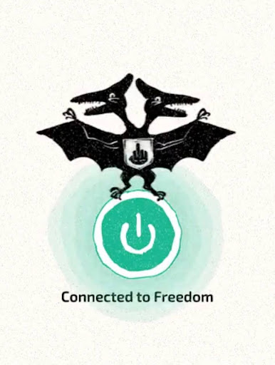

# Кира 2pizza бросил работу и теперь делает бесплатный vpn FuckRKN1. А еще много, очень много шитпостит — зачем это все?

За последние полтора года Кира 2Pizza стал одним из самых скандальных людей в снгшном айти сообществе — во многом за счет иногда дерзкого, иногда вдохновляющего, иногда очень полезного, иногда наоборот — абсурдно непонятного твиттера. 

*В феврале-марте 2022 года Кира был в первой волне уехавших в Тбилиси айтишников. С тех пор его жизнь и дела сильно изменились. Кира бросил все свои работы, бросил полезные инициативы для новичков индустрии, довел медийный образ до пиков абсурда. А еще начал один из самых любопытных протестных айти-проектов последних месяцев — VPN-сервис FuckRKN1, бесплатный и опенсорсный.*

*Мы поболтали с Кирой и рассказали его историю — про эмиграцию, увольнение, жизнь без дома, работы, но полную энтузиасткой надежды на то, что разрабы могут сделать что-то полезное, социально значимое и некоммерческое. И если Кира по твиттеру кажется вам противоречивым и резким человеком — почитайте его рассказ, и возможно, вы приятно удивитесь.*

## Переезд в Грузию и «ночевки на улице»

После начала войны я принял тяжёлое решение уехать из России, но выбор куда ехать в таком срочном порядке не такой уж и большой. Как сейчас помню — стою с одной сумкой на 10 кг в Пулково, в кармане билет в одну сторону до Стамбула, а в голове не укладывается, что это вообще реально. Уже в Стамбуле я принял решение лететь в Грузию. Как оказалось я не ошибся — Грузия прекрасна. Я ждал увидеть типичную страну бывшего СССР, постсоветский город, примерно как это высмеивали в фильме Евротур — грязный, с панельками. Но Тбилиси для меня оказался ближе к Лиссабону и Европе, чем к Самаре. 

Улетая в чужую страну и город я даже не забронировал себе отель. Было ощущение какого-то фатализма. А потом забронировал, но ошибся с датой бронирования — вот и шутил, что «ночую на улице». Всё конечно благополучно разрешилось, но у меня до сих пор постоянно ощущение, что я бездомный. И это именно про внутреннее ощущение, а не про наличие крыши над головой. 

## Увольнение со всех работ

Переехав в Грузию, я уволился с работы. Сидел на ступеньке, грелся на солнышке и мне пришла мысль — а почему у взрослых нет летних каникул? Пытался вспомнить время, когда у меня не было работы, и не смог. Даже отпуск — всё равно не то. Ты по прежнему думаешь, беспокоишься о проекте, работе или команде. 

С одной стороны теперь я себя чувствую свободным как никогда. Сижу и понимаю, что в любой момент я могу сорваться куда угодно (ну если не учитывать пиздец с визами) И очень классное ощущение, что ты никому ничего не должен. Нет этой типичной для айти потогонки. Я начал получать удовольствие от жизни. Никакая зарплата не делает меня таким счастливым, как чувство этой свободы, которое ощущаю сейчас. Странно конечно что я так говорю про работу в айти, ведь вроде бы там тоже этой свободы навалом, живи где хочешь, работай когда хочешь, тебя никто не принуждает, никто не следит. Двигай кнопки, получай свои доллары на счёт и радуйся жизни. 

Но как вспоминаю — вообще не хочется возвращаться. Дейлики — заебали. Когда уволился, у меня ещё неделю были от них фантомные боли. Продолжал думать, а что мне сказать на дейлике сегодня. Я чувствовал себя бесполезным, когда нужно бежать изо всех сил чтоб стоять на месте. Это очень утомляло — не физически, а морально. Раньше я себя заставлял, проснуться, открыть ноутбук, делать таски — минимально, чтобы не уволили. И от этого чувствовал отвращение к себе. И это тоже причина, почему я не очень хочу релокейт за счёт работодателя. Теряется это эфемерное ощущение свободы. Конечно, даже если уволят и кончится виза — мир огромный, и ты можешь поехать куда угодно, но ощущение поводка на шее душит.

Сейчас я просто счастлив, что не слышу ни от кого вопросов в стиле — «Ну что как там? Есть прогресс по задаче?» Я стал просыпаться сам в 8 утра, без будильника и без ощущения ненависти к жизни. 

У меня нет ни одной работы, в классическом её понимании. Живу на «подушку», и иногда пугают мысли, что она кончится. Я частенько ищу идеи, как зарабатывать, но не устраиваться на классический фуллтайм с фиксированной зарплатой. Думаю и про консультации, и может про какие-то конечные проекты — не вот эти, где бесконечно улучшаешь, а из серии пришел-увидел-победил, забрал свой камаз денег и пошёл дальше.

24 февраля 2022 года все равно показало нам всем, что стабильности в мире в принципе не бывает, только иллюзорная. И даже работа в крупной компании, типа Сбербанка, или в технологичной-прогрессивной как Тиньков, не дают тебе гарантии, что через месяц это не кончится. Да и вообще я никогда не гнался за стабильностью, хотя жить в этом ощущении безусловно приятно. Я проработал в прошлой компании 4 года, и сейчас у меня только одна мысль — нужно было увольняться два года назад.

Теперь занимаюсь своим небольшим проектиком, считаю его социально значимым и надеюсь что когда-нибудь он начнёт мне приносить достаточно денег, чтобы я больше никогда не продавал свою жизнь по часовой ставке. 
 

## Проект Nezavisimost’, где разрабы набираются рабочего опыта без корпоративной шелухи

У меня была очень простая идея, но как оказалось — реализация космически сложна. Для многих главная проблема на начальных этапах — это найти работу. И раньше я много писал про это, как искать, как составлять резюме. 

Людям просто нечего показать потенциальным работодателям. Курсы учат обычно какой-то базе и дают стандартные проекты — написать клон фейсбука-твитора-чего-угодно. Но в индустрии критически важно для каждого принять участие в разработке чего-то настоящего, чем пользуются, поработать в реальной команде. И тут замкнутый круг — на работу не берут без опыта, а чтобы получить опыт, нужно попасть на работу. 

Так вот идея «независимости» как раз порвать этот порочный круг. Она должна была объединить людей со схожими интересами, дать возможность создать что-то настоящее и получить рабочий опыт.  

Первую попытку я с треском провалил, задепрессовал и забросил всю эту идею. Оказалось, что сказать людям «программируйте, я создал» недостаточно. Нужно было и идеи придумывать и людей объединять. Плюс нужны те, кто сможет все на себе тащить. Таких не оказалось, и одного меня на это не хватило. 

Сейчас я смахнул пыль с этой идеи, потому что теперь у меня есть флагманский проект. Идея та же, принципы те же, даже название старое, но теперь мы не просто собрались с мыслями «надо что-то покодить, а что кодить — хз». Мы делаем VPN-сервис, и вокруг этого растёт сообщество, появляются приложения, дизайны и прочее. Этот проект я буду делать даже если никто не придёт помогать. В этом главная разница. Люди тянутся за тобой, потому что ты веришь в идею и сам её тащишь. 

Меня кстати очень огорчает что в странах бывшего ссср куча талантливых и умных ребят, но идеи опенсорса особо не приживаются. Для меня они кажутся очень правильными, и я хочу чтоб nezavisimost стала для людей воротами в этот мир. 

И мне нравится мысль, что этот проект может дать людям то, чего им не хватает — не только условным джунам или вайтишникам. Вот простой пример: тимлид целыми днями на звонках, проводит всякие код-ревью, и у него даже задач нет код пописать. А в «независимости» он может получить именно это — от него никто ничего не будет требовать. Или условный сеньор хочет в тимлиды, а где взять опыт тимлидства? Вот, пожалуйста — приходи, бери, объединяй, лидируй, делай. Ну и ошибайся конечно, для роста ошибаться очень важно. Во многих компаниях такую возможность получить очень сложно. 

Думаю, через год это будет не просто проект, а именно сообщество. Не как привычное в российском интернете по типу хабра, где в комментарии приходят подушнить и повыебываться — а сообщество создателей и сообщество людей готовых помогать друг другу. Думаю, это главная цель и идея.

## Бесплатный VPN FuckRKN1 как социальный проект во имя опенсорса и свободы

Я не особо горел желанием делать именно VPN. Сейчас прямо бум, использование сервисов увеличилось в 50 вроде раз, если помню правильно. И ко мне пришёл знакомый который занимался этой темой. Он попросил найти кому передать свой проект, потому что он по жизненным обстоятельствам собирался ехать в Россию и боялся что это может быть опасным. Я подумал — и забрал себе. 

Сделал небольшой ребрнединг, [раструбил везде](https://boosty.to/the2pizza/posts/7e0b00eb-6cb3-4cf6-9d8f-c5490649ab75?share=post_link). Теперь это практически единственная моя занятость.

Я практически всю жизнь занимаюсь инфраструктурными вещами. И самое смешное что на первом курсе в общаге я делал примерно то же самое, только масштабом поменьше. Такая вот ирония судьбы, просто теперь у меня больше опыта и понимания как вообще это нужно делать. 

Но это в первую очередь социальный проект. Я очень хочу помочь людям, кто находится в России или на оккупированных территориях сохранить доступ к информации.

Еще хочу, чтобы вокруг проекта выросло здоровое сообщество неравнодушных людей. Про заработок тоже много разных мыслей. Невозможно что-то делать хорошо и серьезно, если это не приносит денег. Это может быть игрушкой, хобби, но разработка такого проекта — это очень дорого. У меня есть небольшая медийность, и люди приходят помогать — только это сейчас и выручает. Если ты делаешь что-то полезное для людей, заработать можно всегда. Главное не выбирать людоедские способы и не предавать свои принципы. 

Возможно, FuckRKN сможет существовать как благотворительный проект на пожертвования, как например ядро линукс. Но пожертвования должны быть не просто от сообщества, а от компаний которые заинтересованы в таком проекте. Я пробую подаваться на разные гранты от разных организаций, которые заинтересованы в свободе в интернете, но пока глухо — и я всё более скептически отношусь к такому варианту. 

Другой вариант — когда-то меня очень воодушевил Pieter Hintjens, основатель zeroMQ (это такая опенсорсная библиотечка). В его гайде по этой библиотечке есть [целая глава](https://zguide.zeromq.org/docs/chapter6/) по построению сообщества, и это меня когда-то очень сильно впечатлило. 

Когда я прочитал эту главу, выяснил, что он серьезно заболел раком и сделал эвтаназию. Но вокруг зероэмкью он успел построить сообщество и компанию, а его опенсорсный продукт до сих пор живёт и им можно пользоваться. И вот к такому варианту событий я всё более склоняюсь. Я не собираюсь внедрять рекламу или продавать доступ за деньги. Я считаю, что информация для всех должна быть доступна. А ещё я придерживаюсь понятия сетевого нейтралитета, не собираюсь никаким образом вмешиваться в трафик, что-то ускорять или кого-то замедлять. У меня же даже нет регистрации никакой. Скачал, настроил и пользуйся. 

Я ничего не знаю о пользователях, об их политических взглядах, религии или сексуальной ориентации, я даю доступ к информации, а им уже самим решать, к какой именно, и что с ней делать. 

## Разработка в команде энтузиастов, где никто ничего не должен

В общей сложности у нас сейчас около 15 активных ребят. Желающих было сильно больше, но кто-то пока присматривается, у кого-то нет времени. Они уже сделали лендинг на реакте по своей инициативе — им не понравился мой сверстанный на коленке. Скоро мы его зарелизим на основу. Еще есть ребята кто пилит айос приложение и приложение на винду, команда девопсов —т и даже суппорт. Получается пять активных команд. В планах ещё андроид-клиент, и если не найдется желающих, то начну его делать сам. Мне нравится, что проект начинает превращаться во что-то реальное, хотя еще месяц назад мне говорили — а где код? 

Работать с людьми в принципе всегда сложно, неважно платишь ты им или нет. Но если не платишь зарплату, то и требовать ничего не можешь. Человек захочет —  сделает, не захочет — не будет. Никаких рычагов силы как в обычных компаниях — уволить или лишить премии — нет. Здесь все держится скорее на репутации. Если сегодня ты не сделал, завтра тебя опередит кто-то другой. И людей это мотивирует. Многие мне говорили, что давно не получали такого кайфа от разработки.

## Птеродактиль

------

Этот птеродактиль появился совершенно случайно. У меня был какой-то депрессивный период, утром я просыпался и просто твитил всё, что мне приходило в голову. Ради шутки я предложил ребятам игру — вы мне слово а я с ним твит. Там накидали забавных слов и кто-то написал про птеродактиля. Мне так понравилось слово, что я начал его усиленно форсить. А потом мне ради шутки (Юля, Никита привет) нарисовали логотип, который и сейчас там — двухголовый птеродактиль. Это такая хулиганская аллюзия на герб России, да. Как по мне, получилось очень здорово и отображает всю суть и меня, и проекта.

------

Обычно я даже не спрашиваю у ребят, откуда они и чем занимаются, если хотят помогать. Как по мне, культура опенсорса так и должна работать. Но теперь есть моральная дилемма — а что если человек поддерживает войну? Мне его патчи не принимать? 

## Эмигрантская жизнь, угроза преследований и тоска по дому

Такое ощущение, что весь русскоязычный твиттер внезапно переехал в Грузию. В Питере у меня за год не было чтобы подходили с фразой — «о это ты тупица»? Много ребят из Москвы, Питера, Минска и кучи других городов. Недавно со мной в кафе познакомился чел, с которым мы жили в одном ЖК в Питере, у нас были соседние балконы и мы ни разу там не встретились — а в Тбилиси вот познакомились. Местных ребят теперь тоже знаю много, разговариваем с ними на английском. Молодёжь здесь редко знает русский, но мне вообще без разницы, а вот грузинский никак не заставлю себя учить. Знаю разные ходовые фразы, но ленюсь. 

Днём я работаю над проектом, вечером заскакиваю в бар, на выходных куда-нибудь на рейв. На удивление в Грузии культура техно — просто топ. Часто привозят диджеев из Берлина и вообще оно тут очень популярно прям, это было неожиданно и приятно. 

Я очень скучаю по Питеру, он давно мне стал родным. Я часто хочу вернуться, но смогу ли уехать снова — уже не уверен. Официально меня никто не объявлял в розыск. Но если бы вдруг завели дело, думаю, мне стало бы даже легче. Уже точно знаешь, что не вернешься и не думаешь об этом в духе — «а вдруг получится». Я долго думал об этом и решил, что лучше я никогда не вернусь, чем буду считать, что смалодушничал и промолчал или не сделал чего-то важного только ради возможности вернуться.  

Но вообще пока я не сделал ничего противозаконного, vpn делать законно, писать в твиттере тоже не запрещено. Понятно, что в России когда ты становишься неугоден или неудобен — дело появится и даже не одно. Но пока мне даже штрафов за дискредитацию ВС РФ не прилетало.

Хотя эшники, как оказалось, в Тбилиси отрабатывают нормально. Но на самом деле меня пугают не они — ну что они мне сделают? Мешок на голову и в багажнике вывезут через границу? Меня больше печалят русские туристы. Не те люди, которые уехали в Грузию, спасаясь от преследований или из-за нежелания иметь с режимом ничего общего — а люди, которые приехали сюда в отпуск, и теперь им все должны. И по-русски говорить, и сервис нормальный предоставить. Вот такие люди, которые даже не стараются хоть немного уважать чужую культуру — из-за них очень часто ко всем русским отношение как к оккупантам. 

Тут была громкая история: один бар сделал анкету для русских — подпиши, что не голосовал за Путина и заходи. А не хочешь подписывать, ну что ж, извини, мы не обслужим. Такой вой начался! Мол русских дискриминируют! А я сижу и думаю, так вас поэтому и дискриминируют, что вы свои порядки тащите. У меня ни разу нигде не было проблем из-за цвета паспорта. Может я неправильный русский раз меня нигде не дискриминируют?

## Шитпост, много шитпоста в твиттере

Когда я только начинал вести твиттер, каждое утро просыпался и первым делом писал тред. Каждый день искал, о чем еще написать, чтобы людям зашло, подписки, лайки, все дела. А потом я подумал —- а зачем? Денег я с этого не имею, никакой выгоды нет. Когда люди приходили с негативом, я очень сильно переживал. Настолько сильно, что посещали самые разные мысли — от удаления твиттера чуть ли не до суицида. 

Но я научился с этим жить. И вот я сидел и думал — твиттер стал работой, неблагодарной и неоплачиваемой. Тогда и перестал писать ради того, чтобы на меня подписывались. Перестал писать «полезное» и начал писать, что хочу, ради фана. Жить стало проще. Но, конечно, очень интересные ощущения, когда к тебе в тред приходит с реплаем Чичваркин, или лайкает Ройзман. Ты вроде вот ещё вчера сидел в общаге на кровати, а сегодня тебя узнают. А ты ничего не делал для этого, ты просто пишешь свои мысли в твиттер. 

После того, как мне стало прилетать много хейта, я очень сильно переосмыслил и свое поведение. Я раньше ведь и сам не стеснялся похейтить людей и вообще думал — «о чем тут переживать, это всего лишь слова в интернете». А потом понял. И даже очень хорошо понял людей которые из-за хейта в интернете совершили суицид. Это тяжело переживается. Появляется ощущение, что все против тебя. 

Но вот парадокс — хорошего ведь тоже пишут немало, но хейт цепляет сильнее. Даже один негативный комментарий затмевает десять хороших. Думаешь только о негативном, а когда негатива много, это сводит с ума. Очень тяжело не плюнуть на всё это и продолжать делать. Я знаю что у меня есть поддержка.

Когда-то для меня набор подписчиков был неким азартом. Сейчас это просто цифра. Сегодня одна, завтра другая. Конечно, мне льстит, что меня читают и поддерживают. Но моменты, когда меня узнают на улице или в баре, мне непривычны. Это тоже что-то вроде синдрома самозванца — ну типа, ребят вы чего, я же обычный. Иногда бывает что от этого устаёшь, приходишь в бар попить пива и выдохнуть, а тебе вопросы задают, и я ещё не научился вежливо с такого сливаться. 

Я много много пишу всякого в твиттере, но вот личная жизнь это тот аспект, который я стараюсь не выносить в публичное пространство. У меня была девушка, мы провстречались три года и расстались — и меня немного накрыло. Честно, иногда и сейчас поднакрывает, но я стараюсь жить дальше. И вот здесь тоже интересный момент, жить для себя оказалось тоже надо уметь. Сейчас я учусь ставить себя на первое место, и отношения пока в это вообще никак не вписываются.

Очень часто в твиттере «залетают» вообще не те вещи которые хотелось бы. Но это не проконтролируешь. Я не привык удалять такие твиты — я их написал, кто-то возможно не так интерпретировал, или я наступил на больное место. Когда в реплаях начинается совсем содомия — отключаю комментарии или мьючу.

Однажды мы там разгоняли тему про «тысячники» против «десятитысячников», и один твиттерский просто насыпал мне ботов, чтобы у меня стало 10к. Я и не скрывал, но многие — кто не особо следит — удивлялись. Но недавно (как я понял из-за потенциальной продажи твиттера) ботов начали чистить, и у меня вместо 10,5к стало 8к подписчиков. Поэтому со стороны кажется, что я и набираю космически быстро, и теряю так же. 

Иногда рефлексирую — а зачем мне всё это. Вот недавно, например, была громкая история: меня порекомендовал знакомый в одну компанию, мы поболтали с рекрутеркой, и я ждал приглашения на технический собес. Но лид увидел мой твиттер и решил, что я им не подойду. Просто слил меня не знакомясь, просто увидев мой твиттер. Ощущения были так себе. Единственное что меня успокаивает — вряд ли я буду искать работу в русскоязычной компании. Но тоже далеко не факт, что и там не откажут, почитав меня. 

А вообще твиттер и вот эта самая «медийность» мне дали самое главное — людей. Почти весь мой круг общения в последний год — это люди из твиттера. Ты с ними общаешься, ходишь по барам, обсуждаешь разные штуки, создаешь штуки. Иногда до смешного доходит, ты знакомишься с человеком и спрашиваешь его твиттер, а он тебе — у меня нет твиттера. И ты понимаешь, что даже не задумывался о том, что у человека не может быть твиттера. 

И вот с одной стороны в моей жизни появились крутые люди, благодаря твиттеру мне проще продвигать свои идеи и проекты. А с другой стороны появились и хейтеры, некоторые возможности из-за твиттера пропали. 

Как говорила Пифия из Матрицы — «Как проверить сделал ли ты правильный выбор? Он правильный если ты делаешь его опять, зная о цене которую заплатишь». Так вот я скорее зная о том что меня ждет повторил бы этот опыт. Потому что крутого и веселого тут намного больше, а для хейтеров место в ЧС всегда хватит.

