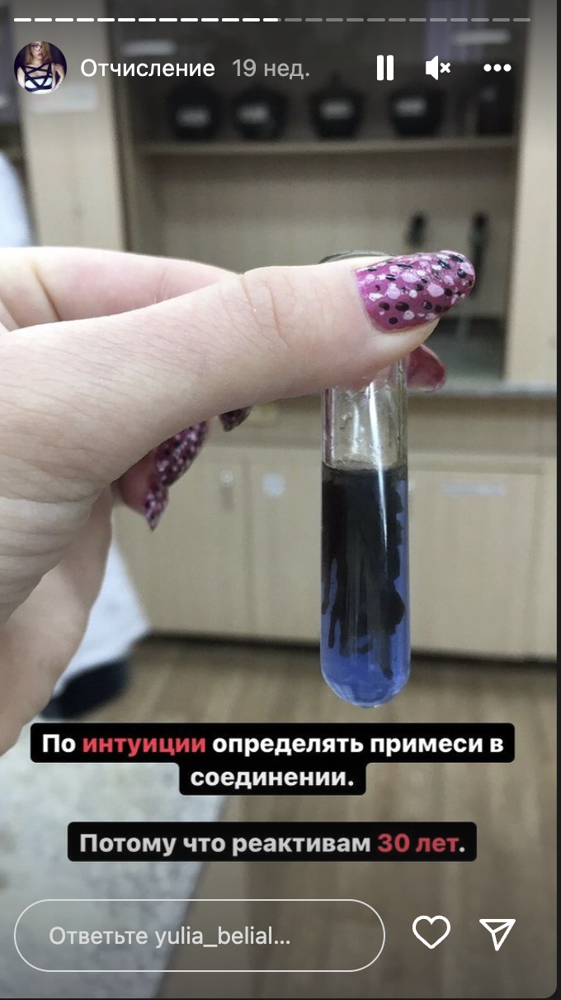
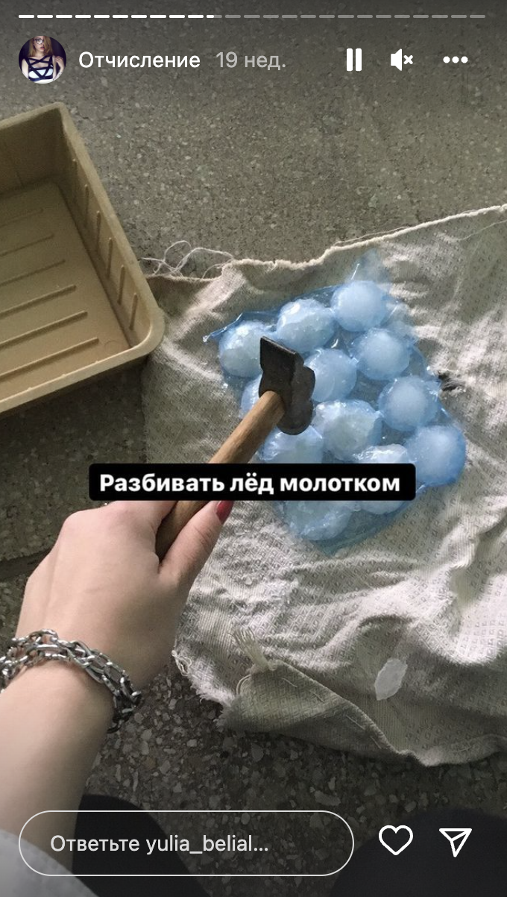
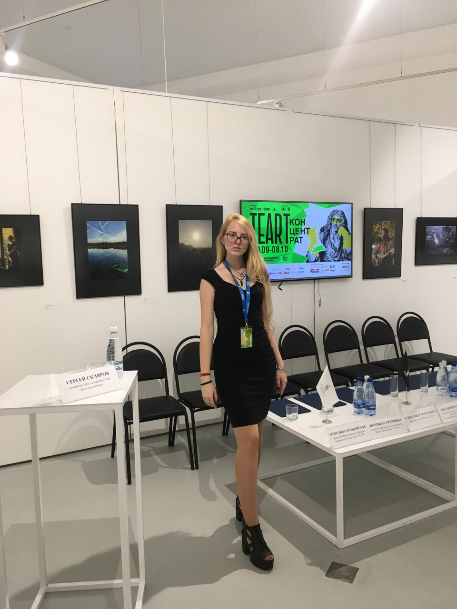
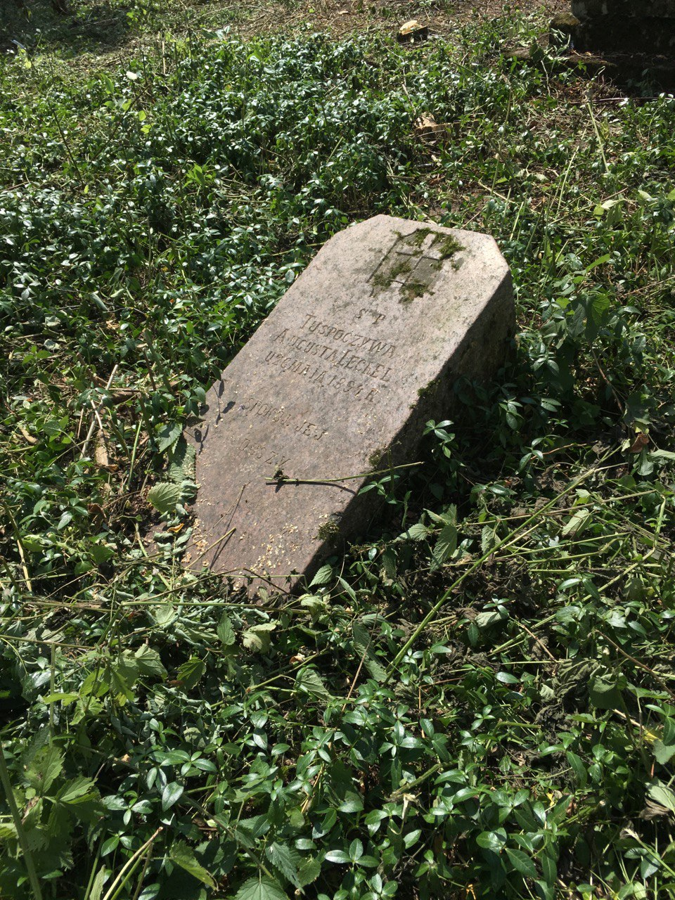
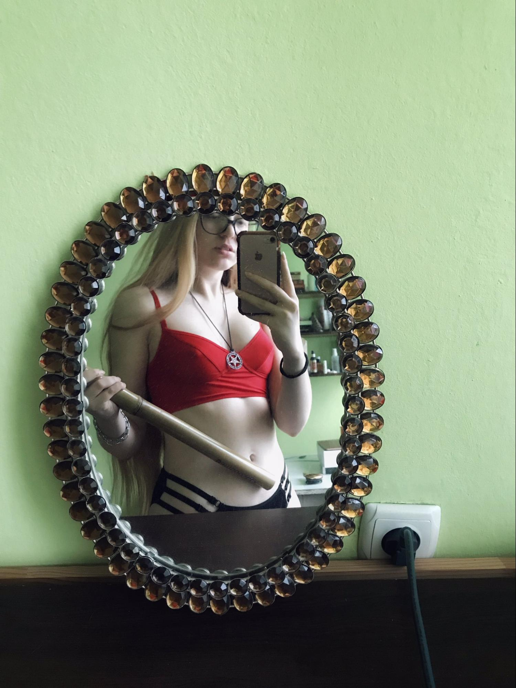
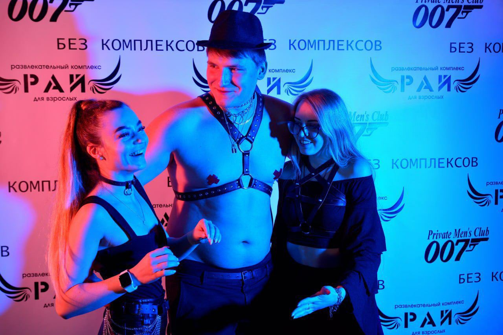

# Через тернии в проджекты: химфак, БДСМ-вечеринки и детские травмы

История о том, как 21-летняя Юля Белиал искала своё призвание на кладбищах и в фармацевтике, а в итоге стала проджект-менеджером

> Я пробовала разные занятия: работала на кладбище, была помощником организатора БДСМ-тусовок, волонтером чуть ли не на всех мероприятиях Минска, администратором телеграм-каналов, SMM-специалистом, училась на дизайнера и журналиста. Но в итоге пришла в IT и стала проджект-менеджером. Вот моя история.

## Училась на фармацевта

Я из Беларуси, после школы хотела идти в медицину или биологию. Школу окончила с золотой медалью и средним баллом 10.0 — у меня десятка по всем предметам, это максимальный балл. Я сдала Централизованное Тестирование почти на 100 баллов по каждому предмету. 

> Последний звонок и выпускной, фото из личного архива авторки 

> Юля в 17 лет, фото из личного архива авторки 

Нужно было решать, куда поступать. Были мысли стать патологоанатомом. Но на медицинском нужно было резать лягушек, а мне жалко животных и я вегетарианка. Этот вариант отпал, и я выбрала химфак. Почти четыре года проучилась на химика-фармацевта, писала научную работу и даже успела на первых курсах поработать в американской фармацевтической компании. Мне казалось, что химия — это моё, но быстро пришло разочарование. Я поняла, что меня ждет распределение на завод, и что не хочу так. 

> Учёба в вузе, скриншоты из Instagram авторки

> Размышляя, куда поступать в семнадцать лет, вы знаете мир ограниченно и часто не можете сделать правильный выбор. Выбираете сферы в рамках своего маленького города и узкого круга знакомств. Но, переехав в большой город, начинаешь видеть мир и понимаешь, что он более многогранный, чем казалось в детстве. 

Я разочаровалась и сказала маме, что хочу отчислиться. Мама ответила на это, что я уже сделала выбор и менять что-то поздно. Я осталась и параллельно пробовала найти себя. Завидовала всем знакомым, которые могли выбрать, кем хотят быть. Пришла к тому, что хочу быть независимой от родителей и сама зарабатывать деньги.

## Работала на кладбище

Когда я училась на первом курсе, администрировала минский телеграм-канал [«Твои возможности»](https://t.me/volunteer_minsk). В хорошие времена, до 2020 года, там было много проектов — исторические, волонтерские, феминистические. Ко мне приходили заявки, и я публиковала их на канале.

> Работа в пресс-центре международного фестиваля ТЕАРТ, фото из личного архива авторки

На первом курсе уехала работать в детский лагерь и за это время сильно устала от детей. В какой-то момент в телеграм-канал поступило предложение поработать на кладбище. Я хотела отдохнуть от детей и не хотела ехать к родителям, поэтому решила попробовать. Там был жесткий отбор, выбирали студентов исторического факультета. Я с химфака, но меня взяли, поскольку я публиковала заявки.

Это был исторический проект по восстановлению старого лютеранского кладбища 17-18 веков. Хороня родственников, лютеране сооружали качественные и красивые памятники из дорогого камня. Современные родственники лютеран из Беларуси исчезли, и кладбище оказалось заброшенным. Бизнесмены воровали памятники, распиливали их на плитку и торговали ей. Чтобы такого больше не происходило, был организован проект по восстановлению кладбища.

> Я думала, что это будет старинное кладбище, но приехали мы в лес, а могилы находились прямо в нём. Нам сказали, что сначала нужно вырубить лес, а потом разбираться с кладбищем. Две недели мы вырубали деревья. Как девушке, мне поручили работать с секатором. У моих родителей есть виноградники, и я думала, что секатор — это маленькие садовые ножнички. А мне дали метровый секатор, который я даже держать не могла.

> То самое кладбище, фото из личного архива авторки

Было весело: жили в маленькой деревне в 1000 человек, вставали в шесть утра, шли на кладбище и вырубали деревья, зачищали могилы, поднимали памятники. После этого шли в гости к ксёндзу и он кормил нас простой едой, а потом мы шли восстанавливать синагогу 18 века, в которой в советские времена был бар. По возвращении в усадьбу, где мы жили, историки читали нам лекции о том, как различаются могилы разных времен и направлений. Мы работали в исторической группе, и поэтому нас даже пустили в усадьбу, где однажды останавливался Наполеон. 

> На восстановлении усадьбы в Подороске, фото из личного архива авторки

## Организовывала БДСМ-вечеринки

При поступлении в универ старшекурсники обычно пугают тебя каким-то предметом в будущем. На нашем факультете это была квантовая химия, которую вел страшный восьмидесятилетний глухой дед. Его боялся весь университет. 

> Преподаватель придумал несколько книг по квантовой химии, но они не существуют на бумаге или на компьютере, а только у него в голове, поэтому его не могут уволить. Раньше он отчислял минимум полфакультета. Ходили истории о том, что отчисленные студенты как-то его поймали и сломали ему ноги, приносили венки из ритуальных услуг, ставили под дверь кабинета с надписью: «Вечная память от отчисленной 62-й группы». 

Я как раз готовилась к этому экзамену, но тут пришел запрос о поиске помощников для проведения БДСМ-тусовок. Экзамен должен быть 20-го числа, а тусовка 21-го. Я решила, что пойду туда после — было любопытно. Меня заметил организатор и предложил быть его личной помощницей. Я встречала VIP-гостей, показывала активность БДСМ-тусовки, раздавала браслеты. Белый означал, что человека трогать нельзя. Розовый — готовность к ЛГБТ знакомствам, а зеленый — готовность к гетерознакомствам. 

> Фото из личного архива авторки

Когда проходите в зал, вам заклеивают все камеры телефона. Там есть мастера со своими моделями. Например, мастера по waxplay поливают обнаженную девушку воском. Смотришь, уточняешь у мастера как проходит эта практика, можешь попробовать. Если мастер кого-то связывает, можно попробовать эту практику под наблюдением мастера. Ведь шибари — целая наука. 

> Фото из личного архива авторки

> Я успела побывать моделью в некоторых активностях, и меня стали звать помогать в организации тусовок. У меня сильные организаторские способности, и мне удается улаживать конфликты, решать проблемы и общаться с людьми. Так меня заприметили шибаристы, стали звать на квартирники, где людей связывали и подвешивали на веревках. Даже предложили стать моделью для снятия учебного курса по шибари, который запускается на канале «Эзотерика».

> Одна из вечеринок для взрослых, фото из личного архива авторки

## Случайно угодила в IT

У меня есть детская травма: родители были обеспеченными, но любовь пытались заменить деньгами. Я просила маму поговорить со мной, а она давала мне денег и предлагала сходить к психологу или покупала новую игрушку. 

> Я почему-то решила, что если буду работать, заработаю много денег, то родители меня полюбят. Подавала резюме на различные вакансии, заканчивая третий курс. Но там видели, что я студентка химфака и подаюсь в SMM, продажи, менеджеры, и отказывали мне.

Тогда мне попалась интересная вакансия со странным описанием в сервис удаленных помощников. В описании говорилось, что чем больше у вас необычных хобби, тем больше шансов получить работу. Меня взяли после слов о том, что я с тринадцати лет метаю ножи и стреляю из пневматики.

Принцип сервиса был следующий. Есть сто компаний, которые пишут задачи в чат-бот. Задачи разные: от банальных — забронировать столик в кафе, заказать билет на самолет, до более сложных — например, помочь с запуском курса по искусственному интеллекту или организовать мероприятие на миллион рублей. Задачи решались удаленной командой, это такой личный помощник — только командный и удаленный.

Я спокойно работала, у меня всё получалось. А через месяц поняла, что много задач связанны с SMM: ведение соцсетей, запуск проектов, продюсирование. У
меня на тот момент был трёхлетний опыт в журналистике, SMM и копирайтинге — в школе я была главным редактором школьной газеты «Школяр», а когда училась в вузе, пошла на обучение в школу журналистики при издании. У меня был даже собственный медиапроект. Я издала серию статей с активистами — экологическими, феминистическими. Писала о том, как активизм изменил их жизнь, верстала собственный сайт. Проект был крутой, но школа журналистики имеет на него права. Без их согласия не могу его публиковать.  

Из-за наличия опыта я предложила взять на себя эти задачи. Так у нас образовался свой отдел с таргетологом, дизайнером, SMM-специалистами и копирайтерами. Я спокойно работала руководителем SMM-отдела, и мне всё нравилось, в том числе доход.

> Фото из личного архива авторки

Однажды к нам обратился руководитель IT-компании и сказал, что хочет, чтобы ему выделили помощника, который бы работал у него на полставки. Подписка стоила пять тысяч рублей в месяц, а он предложил пятьдесят тысяч рублей за этот формат. Сервис понял, что это выгодно и прибыльно. Это был первый такой клиент, и к нему решили отправить самого активного и позитивного сотрудника — меня.
Я люблю овертаймы, работать по 70 часов в неделю без выходных — для меня норма. Хотя меня отправили работать на полставки в IT-компанию, я осталась руководителем SMM-отдела и продолжила работать там на полную ставку. 

> В первую неделю работы личным помощником я заказывала кондиционеры в офис и выполняла базовые задачи. Потом руководитель сказал, что у него не хватает времени проводить встречи и спросил, смогу ли я провести их вместо него. Добавил меня в рабочий чат и представил как Юлю. Я начала читать о том, как проводятся встречи, что это такое, пыталась выяснить, чем я занимаюсь. Мне сказали, что я sсrum-мастер, а я даже не знала, кто это такой. Проработала так две недели, проводила встречи, писала итоги, напоминала разработчикам о сроках. 

Руководитель сказал, что я хорошо работаю и у меня есть потенциал, предложил перейти к ним на бОльшую зарплату. Когда об этом узнал сервис, они вошли с ним в конфликт, который продлился месяц: ругались, звонили мне и шантажировали, манипулировали, угрожали. Такая острая реакция возникла, потому что я за день приносила сервису больше денег, чем остальные за месяц.

Например, одна клиентка пришла с запросом на ведение Instagram (относится к компании Meta, признанной в России экстремистской организацией) за 20 тысяч рублей, а я предложила ей дополнительные опции на 100 тысяч.

Решиться уйти из компании мне было нелегко: на тот момент мой рекламный пост стоил 60 долларов, а мне предложили перейти в IT — сферу, где я ничего не понимала. В первый рабочий день на новом месте я спросила, где сидят программисты, а у меня уточнили, кто именно мне нужен — фронтенд или бэкэнд разработчики. Тогда я даже не знала, что они бывают разными.

Решающим фактором стала токсичность прошлой компании: если сотрудник совершал малейшую ошибку, его кидали в специальный чат, тэгали руководителей и натравливали на него всю команду. В результате я все-таки ушла, мой новый руководитель выплатил большую сумму за мой хантинг. С сервисом мы очень сильно поругались: через год после моего увольнения они даже негативно упомянули меня в годовом отчете, правда, не называя имени.

Так начался мой путь в проджект-менеджеры.

## Из scrum-мастера в проджект-менеджеры

На новом месте мне поручили проведение встреч и их фасилитацию. Нужно было записывать итоги, отслеживать выполнение задач и наводить порядок в документации. Было очень сложно, потому что я ничего не знала про IT. 

> Чтобы развиваться, мне приходилось работать от 12 до 16 часов в сутки. Часть времени я работала, а несколько часов пыталась нарабатывать базу знаний. Во время созвона записывала айтишные термины, а после созвона гуглила их. Например, когда кто-то упоминал JSON, я думала, что это имя. Мне объясняли, что это запрос. 

Спустя месяц я наработала айтишную базу терминов. А управленческий опыт и умение организовать работу других людей у меня были всегда. Кроме того, раньше я руководила SMM-отделом, училась в академии лидерства, руководила студенческой организацией и волонтерскими движениями.
Я поняла, что мой управленческий опыт сходится с навыками, необходимыми для управления IT-проектами. Мне предложили больше обязанностей и позицию проджект-менеджера. В тот момент я даже не знала, что это такое, но согласилась. Все развивалось органично: я брала больше обязанностей, много училась. Ушла в личное менторство к своему руководителю, чтобы полноценно прорабатывать управленческую базу. 

> Провожу ретро в первой IT-компании, фото из личного архива авторки

Там я проработала полтора года. Было много разных и классных проектов, классная команда. Но после февральских событий руководитель уехал из страны. Часть команды была из Украины, и они просто не смогли продолжать работать, а московская часть команды разбежалась, и в компании никого не осталось. Так я поняла, что пора искать новое место.

За месяц до этого я как раз начала из интереса ходить на собеседования. У меня не было ни одного отказа, все компании слали мне офферы, было много классных предложений. Мне написал один подписчик из твиттера, что к ним в студию нужен PM, и предложил подать свою кандидатуру, потому что у них очень круто.

> Я зашла на их сайт: он был очень красивым, компания писала про свою любовь к людям и команде. Это мои главные ценности в работе, и поэтому я решила, что хочу к ним. Отправила резюме, и меня позвали на пару собеседований, по итогам которых прислали оффер. Я сказал им, что у меня есть офферы с большей зарплатой, и попросила больше денег. Они согласились, и я стала у них работать. 

Повторилась история с первой работой. У меня уже есть айтишная база, управленческий опыт, но сфера была новой — геймдев, а значит, снова новые термины, новые процессы. В принципе Scrum в чистом виде невозможен нигде и никогда, это зло. То, что я учила по Scrum, в моей новой команде вообще не работает, только Waterfall. Ведь, пока 2D специалист не нарисует концепт, 3D специалист не может его моделировать. А не смоделировав, его нельзя вставить в игру. Здесь параллельные процессы просто невозможны. Я никогда не исхожу из того, что, если методология работает у всех, она должна заработать и у нас. Обсуждаю с командой и предлагаю попробовать.

Проекту два с половиной года. За это время у них ни разу не было ретроспективы. Я рассказала о том, что существует ретроспектива и для чего она нужна. Предложила попробовать, задала вопросы, уточнила, всё ли понятно. Новые решения мы внедряем, только если команда согласится. Если инструмент заходит — оставляем. Если нет — выкидываем. 

## Родители меня никогда не поддерживали

Я решилась бросить  вуз только на четвёртом курсе. Училась только чтобы сдать сессию, так как поняла всю бессмысленность этого. Вместо учёбы много работала. 

> Скриншот из Instagram авторки

После отчисления родители спросили: «Кто ты без диплома?» У папы два высших образования, у мамы — три. В течение полугода они со мной практически не общались. Звонили раз в месяц, чтобы узнать, не умерла ли я от голода на улице. 

> Заметка из Instagram авторки

> Родители меня никогда не поддерживали. Даже сейчас, когда я уехала из страны, перешла в IT и зарабатываю больше, чем они вдвоём. Они считают, что я недостаточно страдала для успеха, говорят: «Мы всё ещё тобой не гордимся». 

Из-за таких отношений с родителями всегда пыталась больше заработать, чтобы меня любили, пыталась быть молодцом. Но потом поняла, что нужно жить для себя, а не для родителей.

С декабря я занимаюсь с психологом. Считаю, что терапия дала мне толчок в жизни, в карьере и в деньгах. Понимая себя и свои поведенческие паттерны, начинаешь лучше понимать других людей. Терапия помогает мне разобраться в себе и понять, почему я веду себя определенным образом в некоторых ситуациях. 

> Мне помогло, что я уехала от родителей и живу в другой стране, занимаюсь терапией и не завишу от них. В последнее время в родителях пробудилась любовь. Они постоянно звонят и пишут, что скучают. Я отвечаю, что понимаю, но в расписании нет свободного времени, и предлагаю запланировать созвон на следующую неделю. Стараемся общаться нейтрально, но я постоянно вспоминаю детские травмы. Мой брат всегда был молодец, а я нет. Не хочу возвращаться в прошлое — слишком много денег отдала психологу. 

Все мы люди из постсоветского пространства, у всех есть травмы. Я вижу это в людях и понимаю, почему они так поступают и как на это реагировать. У меня растет уровень эмпатии, понимания людей и желания работать с ними.

У нас есть схема работы one-to-one — это когда мы вдвоём с коллегой обсуждаем возможности развития. Есть кардинальная разница в моих one-to-one год назад и сейчас. Раньше я беседовала по списку: как дела, чем занимаешься, всё ли хорошо. Сейчас мои one-to-one очень глубокие, а люди получают больше удовлетворения. Говорят, будто сходили на психотерапию. Эти встречи помогают мне лучше понять команду и то, что её волнует.

Однажды ко мне пришла девушка и оказалось, что она все время мечтала рисовать для игры другой вид графики. Я предложила сменить ей пул задач, ей стало интереснее, появилось больше мотивации. Скорость работы выросла, а проект смогли выпустить быстрее. 

## Почему PM для меня — идеальная работа

Суть проджект-менеджмента — оптимизация и настройка процессов для работы команды. Все будет супер, если каждый будет заниматься своей работой: разработчик будет писать код, а художник — рисовать. Обычно в команде накапливается много рутины, из-за которой люди тратят много сил и внимания в никуда. Проджект-менеджер берет на себя рутину и организовывает полноценную работу всех отделов. Например, в прошлой компании разработчики пытались решить проблему. Как PM я организовала для них созвон, и проблему решили за пять минут. На вопрос, почему они сами не могли устроить созвон, они ответили, что не додумались.

Проджект-менеджер несёт ответственность за итог проекта, за то, чтобы команда сделала всё в срок и в нужном объёме. Его задача — давать людям мотивацию и энергию работать.

Мой психолог говорит, что люди со специфическими психологическим травмами всегда становятся PM. Всю жизнь мне очень нравилась структура и система. У меня всегда идеальный календарь, в котором всё спланировано: когда я ем, когда сплю, куда хожу. Все мои дела записаны идеальным списком, а в университете мои конспекты продавались за большие деньги. Была легенда, что я — человек, у которого лучшие конспекты на весь  вуз.

Я всегда считала, что я просто системный человек, а в работе PM это очень важно. Ведь его задача — выстроить систему из хаоса. У вас всегда 300 задач, нужно определить приоритеты и выбрать самое важное. У меня это всегда хорошо получалось. Даже мои планы на дополнительное обучение расписаны в JIRA. После нескольких лет работы в разных местах небольшим руководителем я поняла, что у меня получается делегировать задачи, мотивировать людей и работать с ними. Это очень сильно меня драйвит: после работы у меня больше сил, чем в начале рабочего дня.

Если я выстрою комфортную работу и объём задач для моей команды, уберу лишние встречи и давление, они будут классно работать. Безумно люблю мою команду. Очень творческие ребята, в прошлом художники. Рисунки 2D или 3D специалистов вызывают у меня слёзы — насколько это красиво и круто.

Есть люди, копающие в глубину, а есть те, что копают в разные сферы. Я из второй категории. В детстве и в подростковом возрасте меня ругали за постоянную смену сфер. Начала журналистику — через полгода бросила, потом дизайн — через три месяца бросила. Мне нравилось брать новые вершины, немного углубляться, изучать и идти дальше. Проджект-менеджер — человек, аккумулирующий различный жизненный опыт. Немного айтишных знаний — и ты понимаешь, что ты классный проджект-менеджер. 

> Мне кажется, что после годового опыта  работы в IT деньги драйвят всё меньше. В этой компании тебе дадут 200, в этой — 210, в этой — 220. В результате выбираешь компанию не по зарплате, а по команде, продуктам и процессам. Моя команда очень классная. При желании они найдут работу за день. Я стараюсь делать свою работу так, чтобы людям было супер комфортно и супер интересно именно у нас. 

Придя в компанию, первым делом я узнала о личной мотивации и интересах. Например, 2D-художница  рисует картинку, а хотела бы заниматься режиссурой. Я договорилась с нарративным дизайнером и режиссёром, чтобы она принимала участие в обсуждении поведения персонажей в игре. В итоге дала ей дополнительную активность. Так она получила то, что хотела.

Мне нравится давать людям мотивацию работать в команде, поддерживать дружественную атмосферу. Люди для меня — огромная ценность. Готова жертвовать своим временем ради команды. Недавно разговаривала с человеком из команды до 11 ночи, потому что у него были проблемы. Он хотел поговорить и успокоиться. На первой работе помогала тимлиду сдавать сессию в универе, чтобы тот мог спокойно работать. Пришлось разбираться в том, что такое искусственный интеллект. 

## Как выглядит моя рабочая неделя

В моей команде понедельник, среда и пятница — день созвонов. Вторник, четверг — тихие дни, когда все работают в концентрации.

У меня достаточно большая команда. Готовлюсь ко всем встречам очень осознанно. За полчаса до встречи открываю трекер и прохожусь по задачам каждого человека и отдела. Смотрю сроки — что надо сделать, что в приоритете. На митингах подсвечиваю потерянные задачи в трекере. После этого у меня чаще всего созвон с двумя отделами, чтобы разобраться со смежными задачами. Я записываю все встречи, подвожу итоги.

Потом у меня обычно либо созвон с продактом по новым фичам, либо просто one-to-one, иногда бывают встречи по оценке и планированию задач. Подготовив задачи для команды по разработке, мы собираемся для обсуждения сроков выполнения и приоритетности. Также я занимаюсь планированием и работой с документацией — описанием новых процессов, регламентов встреч. Я постоянно в TaskTrack двигаю задачи, навожу порядок, оптимизирую командную нагрузку и даю фидбэк. Например, художники сделали картинку — бегу писать, какие они молодцы. 

## Соцсети помогают увидеть в менеджере человека

В команде мне было поначалу сложно, потому что я моложе всех коллег как минимум на десять лет. Им по тридцать-сорок лет, а тут к ним приходит двадцатилетний менеджер. Естественная реакция: какая она молоденькая, да ещё и без образования. Мне двадцать один год, но я работаю с тринадцати лет — у меня восемь лет опыта. 

> Мне нравится, что коллеги умеют разделять меня как работника и меня как человека. На мой твиттер подписано моё руководство, они нормально относятся к публикуемым мной откровенным фотографиям. Если на работу я хожу одетая, то какие могут быть претензии? 

> Фото из личного архива авторки

Я считаю, что соцсети — важная вещь. Благодаря соцсетям у меня появилась текущая работа. Благодаря соцсетям ко мне приходят люди. Менеджер — это человек, и, когда он проявляется в соцсетях как человек, показывая свои ценности, с ним возникает гораздо больше точек соприкосновения и доверия. 

> Общение с командой в твиттере — мотивация :)

Чем больше я пишу о своих ценностях, о том, как работаю, тем больше единомышленников нахожу, которые хотят прийти ко мне на менторство. Когда я так проявляюсь, ко мне приходят люди. Пишу про принципы работы — в комментариях пишут, что я классный менеджер, и спрашивают, как со мной работать.

У меня в компании есть вакансии, и я предлагаю откликаться. Был случай, когда я предложила актуальную вакансию парню, он написал HR, его позвали на собеседование. Моё проявление влияет на проявление моей компании. Поэтому  я хочу ещё больше заниматься соцсетями. Если бы у меня было сто подписчиков и я писала бы о десяти годах работы PM — ко мне никто бы не пришёл. А так ко мне тянутся люди, ведь хотят покупать у человека.

## В свободное время — танцую

Раньше я считала, что моё хобби — чтение книг и просмотр видео о менеджменте. Но сейчас в свободное время занимаюсь танцами — реггетоном. Оказалось, что лучший способ не выгорать — иметь хобби, не связанное с работой.

Работа айтишника вредит спине, а спорт помогает добавить активности и чувствовать себя лучше. Недавно я снималась в профессиональном танцевальном видео, но поняла, что это не моё. Входить в творческую группу и сниматься в роликах — полноценная работа, требующая тренировок по четыре часа в день. Начинается конкуренция, кто будет на первой, а кто на второй линии. Чем лучше танцуешь, тем ближе к началу стоишь.

Если я уйду в это направление, танцы превратятся во вторую работу и я перестану испытывать кайф от этого занятия. Поэтому так моя профессиональная карьера танцора завершилась, едва начавшись.

Я люблю историю. Когда-нибудь мне надоест работать, у меня будет много денег, я всё брошу и поеду по всем замкам Европы. 

## Менторство

Я ещё ментор и консультант для начинающих и действующих PM. С начинающими мы проходим блок по составлению резюме, прохождению собеседования и отклику на вакансии.  Одной девочкой я очень горжусь. Она искала работу два месяца, у нее было ноль откликов. Но пришла ко мне на консультацию — и через два дня её позвали на собеседование в американскую компанию, а ещё одна компания прислала тестовое задание.

Я вкладываю мой опыт в работу с людьми. Ко мне приходят действующие PM, которые не знают как решать рабочие ситуации. Многие хотят развиваться или выучить методологию. Разбираем с ними кейсы, оптимизацию их работы или теоретические блоки. 

> В ближайшем будущем хочу выпустить свой проект по обучению. У меня есть коллега — технический менеджер, и у нас есть идея мини-менторства в группах по 3-5 человек. Я буду давать обучение в блоке менеджмента — софт скилов, а он будет давать обучение в техническом блоке. Хотим обучать людей становиться классными менеджерами и давать рекомендации в помощи поиска работы. 

Дальнейшее развитие для меня — очень грустный вопрос. Месяц назад я звонила психологу и плакала. Говорила, что не знаю, что делать. У меня уже есть деньги, что делать дальше. Но менеджер — это человек у которого нет потолка в развитии. Я постоянно могу совершенствовать свои методологии, свои рабочие навыки. Хочу выпустить свой проект. Вокруг много отвратительных менеджеров. Состою в чате PM, и для меня это самое токсичное из всех встречавшихся мне сообществ. Хочу, чтобы в мире стало хотя бы на пару человек больше добрых менеджеров, с такими же ценностями как у меня. В будущем я хотела бы дойти до CEO или главного PM. Мне очень нравится управление, мне нравятся люди, и я хочу развиваться в этом направлении. 

> Слушаю митап по ошибкам в управлении проектами, фото из личного архива авторки

Тем, кто хочет тоже стать проджект-менеджером, я рекомендую читать мой твиттер. Задайте себе вопрос, для чего хотите идти в проджекты. Во время консультаций первый созвон я провожу бесплатно и спрашиваю о личной цели. Если вы не были связаны с управлением и хотите быть PM, то почему думаете, что вам это понравится? PM — это бесконечная ответственность, поток задач и вечно горящая жопа. Люди, у которых есть управленческий опыт, обычно говорят: «Осознаю, что это, и хочу этого». Это окей.

Важно быть более осознанным в любых ситуациях взаимодействия с людьми. В магазине вам грубит продавец. Анализируйте, почему люди так делают и как этого можно избежать, учитесь понимать людей и договариваться с ними.

Став PM, я научилась договариваться в любой сфере жизни. Подавалась на ВНЖ — мне пригодились мои навыки. Собираюсь тусить с друзьями — предлагаю пошерить календари, чтобы выбрать свободный слот и добавить всех во встречу, поставить напоминание и добавить адрес, чтобы все знали, куда приехать. 

> PM — человек с максимальным количеством опыта и ужасных ситуаций, из которых он сделал выводы и пошел дальше. Можно прочесть миллион книжек о руководстве командой, но, увидев бардак в компании, что вы будете делать, если то, чему вас учили  на курсах Scrum, тут не работает? 

Когда вы проходите собеседование на должность PM, нужно спрашивать о том, как работодатель реагирует на ошибки. Были компании, которые говорили, что ошибаться с моим опытом странно. Я отвечала, что люблю косячить. «Всем спасибо за собес, всем пока».

В моей компании на этот вопрос ответили так: «Ошибаться это правильно, это зона роста. Мы поможем вам исправить ошибку и будем надеяться, что в будущем в этом месте ошибки не будет. Но вы будете ошибаться в чём-то другом». 

