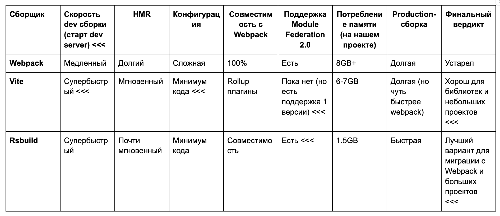

## Мы избавились от Webpack и ускорили CI в 5 раз с Rsbuild


Webpack — это как старый дизельный двигатель: громоздкий, медленный и требовательный к ресурсам. Пока другие переходят на электрички (Vite), Михаил Перцев нашёл компромисс — Rsbuild. Теперь его CI работает в 5 раз быстрее, а билды не падают из-за нехватки памяти. В статье он расскажет, как прошла миграция и как это изменило его взгляд на сборку фронтенда.


Немного деталей о моём проекте, для которого всё это и затевалось. Вполне стандартные React, SASS, TypeScript, и сборка через Webpack + babel. Нужна была поддержка легаси браузеров, например, Internet Explorer 11.

Основными причинами мигрировать с Webpack стали:
- **Большое потребление памяти в CI.** Процесс сборки нашего проекта (а проект был немаленький) съедал больше 8GB оперативки в Gitlab runner. Параметр `--max-old-space-size=8182` в NodeJS. Сборка иногда падала с ошибкой heap out of memory. Команда DevOps настоятельно рекомендовала не увеличивать память для сборки проекта так как runner был общим с бекендом.
- **Сборка в CI была долгой** — 8 минут в среднем на нашем проекте. А так как у нас проект был монорепой, собиралось большое количество приложений за раз. Часть из них были React-приложениями с Webpack конфигурацией. Общий пайплайн составлял порядка 35 минут. И не только я с этим сталкивался, вот например [issue](https://gitlab.com/gitlab-org/quality/quality-engineering/team-tasks/-/issues/1346) от команды gitlab, в котором потребление памяти значительно выросло после апгрейда на webpack 5. У нас на проекте тоже стоял webpack5.
- **Сложность конфигурации.** Webpack требует тонкой настройки, много плагинов, длинный конфиг.
- **Скорость локальной разработки.** Даже с кешированием Webpack уступает в скорости пересборки.

Мы проанализировали ситуацию и в рамках оптимизации нашего CI решили уделить время исследованию альтернатив Webpack. Webpack — это как старый грузовик: везёт, но слишком медленно и дорого. Мы страдали от его громоздкости, долгих билдов, ошибок из-за памяти. Нам нужен был инструмент, который не только ускорит CI/CD, но и облегчит жизнь разработчикам. Эта задача выпала мне.

### Выбор решения


Первым кандидатом стал Vite, так как часть внутренних пакетов-библиотек уже его использовала. Но Vite оказался не панацеей: большого прироста по скорости сборки по сравнению с Webpack я не получил. Разница составила около полутора минут — около шести с половиной минут вместо восьми. Да и памяти он потреблял не намного меньше — около 6-7 GB. Быстро стало понятно, что с ростом проекта мы снова упрёмся в лимит 8GB  — поменяем «шило на мыло». Также процесс перехода затрудняло то, что часть плагинов, присутствовавших в нашем проекте, отсутствуют в Vite. Конечно, были аналоги, но миграция на них требовала правок в самой сборке. Не было у Vite и поддержки Module Federation 2.0, которая важна для некоторых проектов.

А ещё в процессе разработки и сборки фронтенд-приложений с использованием Webpack и Vite в GitLab CI/CD нередко возникают ошибки, связанные с превышением объёма памяти кучи JavaScript. Такие проблемы регулярно обсуждаются разработчиками:

**Webpack.** Пользователи сообщают о сбоях сборки в GitLab CI/CD из-за недостатка памяти при использовании Webpack. В одном из обсуждений на GitLab описывается ситуация, когда процесс сборки React-приложения с помощью Webpack завершался с ошибкой «JavaScript heap out of memory».
[Источник](https://gitlab.com/gitlab-org/quality/quality-engineering/team-tasks/-/issues/1346)

**Vite.** Схожие проблемы наблюдаются и при использовании Vite. В обсуждении на GitHub упоминается, что при длительной работе Vite может возникать ошибка «Heap out of memory» — [источник](https://github.com/vitejs/vite/issues/2433)

Для решения подобных проблем рекомендуется увеличить лимит памяти для Node.js, используя флаг `--max-old-space-size.` Например, запуск команды с параметром `--max-old-space-size=8192` увеличит доступную память до 8 ГБ. Однако следует учитывать, что увеличение лимита памяти не всегда решает проблему, особенно в средах с ограниченными ресурсами, таких как CI/CD. В таких случаях может потребоваться оптимизация конфигурации сборщика или использование альтернативных инструментов.

И тут я наткнулся на Rsbuild, который обещал совместимость с Webpack по API.
Преимущества Rsbuild по сравнению с Webpack:

- Намного быстрее из-за того, что под капотом Rust вместо JavaScript. Это заметно как при HMR, так и при build на продакшене.

- Проще конфигурация, много готовых плагинов для популярных сетапов фронтенд-фреймворков. Например, отдельные плагины для SASS/LESS и для React/Vue/Svelte. 

[SASS](https://rsbuild.dev/plugins/list/plugin-sass)

[LESS](https://rsbuild.dev/plugins/list/plugin-less)

[Svelt](https://rsbuild.dev/plugins/list/plugin-svelte)

[React](https://rsbuild.dev/plugins/list/plugin-react)

[Vue](https://rsbuild.dev/plugins/list/plugin-vue)

Преимущества Rsbuild по сравнению с Vite:

- Поддержка API плагинов Webpack. Часть плагинов Webpack будет работать из коробки, тогда как в случае с Vite придется искать альтернативы для rollup. А для другой части есть встроенные альтернативы — например для [extract CSS](https://rspack.dev/plugins/rspack/css-extract-rspack-plugin)
- Поддержка Module Federation 2.0. В данный момент в Vite она пока [отсутствует](https://github.com/vitejs/vite/issues/16635). Нам она была не нужна, но тем не менее это весомый плюс для многих проектов.
- Быстрее production сборка, так как Vite всё ещё под капотом использует Rollup, написанный на JS. Он, понятное дело, уступает в этом Rust, однако этот пункт может утратить актуальность после [выпуска Rolldown](https://github.com/rolldown/rolldown/discussions/153).




### Как происходит миграция с Webpack на Rsbuild

Изначальный конфиг Webpack был примерно таким:

```js
const config = {
    mode: process.env.NODE_ENV || 'development',
    devServer: {
        static: [
            path.join(__dirname, 'public'),
            path.join(__dirname, 'src'),
            path.join(__dirname, '..', '..', 'node_modules', '@my-monorepo', 'static-package', 'assets'),
        ],
    },
    name: 'main',
    devtool: shouldUseSourceMaps ? 'source-map' : false,
    entry: {
        // That one of for material-ui + ie11, current polyfilling seems to be breaking that combination
        // https://github.com/mui-org/material-ui/issues/17789
        polyfill: 'core-js/es/object',
        main: ENTRY_POINT,
        other: '@my-monorepo-component/main.js',
        branding: glob.sync('./src/styles/branding/**/*.scss'),
    },
    output: {
        path: __dirname + '/build',
    },
    optimization: {
        mergeDuplicateChunks: false,
        splitChunks: {
            chunks: 'async',
        },
        minimizer: [
            new TerserPlugin({
                minify: TerserPlugin.swcMinify,
                parallel: !process.env.CI,
                terserOptions: {
                    mangle: {
                        keep_fnames: true,
                    },
                },
            }),
        ],
    },
    module: {
        strictExportPresence: true,
        rules: [
            {
                test: /\.(js|cjs|mjs|jsx|ts|tsx)$/,
                include: [
                    path.resolve('./src'),
                    ...(!IS_DEV
                        ? [
                            // Some of the dependencies are not ie-friendly, so we need to transpile them
                            path.resolve(require.resolve('@svgdotjs/svg.js'), '..'),
                            path.resolve(require.resolve('@tanstack/match-sorter-utils'), '..'),
                            path.resolve(require.resolve('reselect'), '..'),
                            // ... тут было весьма много зависимостей
                        ]
                        : []),
                ],
                use: [
                    {
                        loader: 'babel-loader',
                        options: {
                            cacheDirectory: true,
                            configFile: path.resolve('babel.config.js'),
                        },
                    },
                ],
            },
            {
                test: /\.(js|cjs|mjs|jsx|ts|tsx)$/,
                include: [
                    ...(!IS_DEV
                        ? [
                            path.resolve(require.resolve('@tanstack/match-sorter-utils'), '..'),
                            path.resolve(require.resolve('@tanstack/react-table'), '..'),
                            // ... тут было весьма много зависимостей
                        ]
                        : []),
                ],
                use: [
                    {
                        loader: 'babel-loader',
                        options: {
                            cacheDirectory: true,
                            plugins: ['@babel/plugin-transform-modules-commonjs'],
                        },
                    },
                ],
            },
            ...extractCSSRules,
            {
                test: /\.(png?|svg)$/,
                use: [
                    {
                        loader: 'file-loader',
                        options: {
                            name: 'images/[name].[ext]',
                        },
                    },
                ],
            },
        ],
        unknownContextCritical: false,
    },
    plugins: [
        new MiniCssExtractPlugin({
            filename: (chunkData) =>
                chunkData.chunk.name === 'branding'
                    ? cssStaticFilenameTemplate
                    : cssFilenameTemplate,
        }),
        new webpack.DefinePlugin({
            'process.env': Object.assign({}, getDotEnv(), {
                // ... Тут было полно env
            }),
        }),
        new HtmlWebpackPlugin({
            baseHref: getBaseHref(env === 'production'),
            scriptLoading: 'blocking',
            template: path.join(__dirname, 'public/index.html'),
            chunks: ['polyfill', 'main'],
            IS_DEV,
        }),
        new webpack.LoaderOptionsPlugin({
            minimize: true,
        }),
        getSentryWebpackPlugin(), // Тут просто была конфигурация для sentry
    ],
};

module.exports = config;

```
**Этап 1. Минимальная установка Rsbuild**

Попробую воссоздать то, как я переходил к финальному конфигу на Rsbuild. Начал с простого template для React:

```ts
//rsbuild.config.ts

import { defineConfig } from '@rsbuild/core';
import { pluginReact } from '@rsbuild/plugin-react';

export default defineConfig({
  plugins: [pluginReact()],
});

```
В конце проверил, что сборка работает.

**Этап 2. Добавление нескольких entry points.**

Нам была необходима поддержка множества entry, добавляем их:

```ts
//rsbuild.config.ts

export default defineConfig({
  source: {
    entry: {
      polyfill: 'core-js/es/object',
      main: ENTRY_POINT,
    },
  },
  plugins: [
    pluginReact(),
    pluginSass()
  ],
});
```
Теперь билд собирает несколько точек входа, как в Webpack.

**Этап 3. Добавление поддержки SASS**

Добавляем поддержку SASS:
```ts
import { pluginSass } from '@rsbuild/plugin-sass';
//... Другие импорты скрыты

export default defineConfig({
  source: {
    entry: {
      polyfill: 'core-js/es/object',
      main: ENTRY_POINT,
    },
  },
  plugins: [
    pluginReact(),
    pluginSass()
  ],
});
```
Стиль проекта не ломается.

**Этап 4. Исправление алиасов для монорепы**

Проблему с alias пришлось решать вручную, потому что документация не давала нужных примеров. На текущем этапе проект, разумеется, не запускался локально и не собирался через Rsbuild, так как необходимо было прописать некоторые alias в .sass файлах для внутренних пакетов. 

То есть иногда был вот такой импорт:
```sass
// main.sass
// вот этот импорт не разолвился нормально
@use '@monorepo/ui/dist/my-ui'; 

...
```
Для этого в Rsbuild есть удобный API для alias, добавляем:
```ts
export default defineConfig({
  source: {
    entry: {
      polyfill: 'core-js/es/object',
      main: ENTRY_POINT,
    },
    alias: {
      '@my-monorepo/ui/dist/main': path.resolve(
        __dirname,
        '../../node_modules/@my-monorepo/ui/dist/main.scss',
        //... другие импорты которые нужно корректно зарезолвить в монорепозитории
    ),
    }
  },
  plugins: [pluginReact(), pluginSass()],
});
```
Далее необходимо сделать аналог process.env на клиенте, который задавался через DefinePlugin в Webpack. Теперь внутренние импорты работают корректно.

Тут следует сделать отступление и рассказать, что сам Rsbuild — это не сборщик, а, по сути, обёртка и куча плагинов над [Rspack](https://github.com/web-infra-dev/rspack). Именно Rspack под капотом и делает всю работу сборщика, а также у него есть API лоадеры и плагины, совместимые с Webpack. 

Дело в том, что Rspack стремится к максимальной совместимости с экосистемой Webpack. Это позволяет использовать многие существующие плагины Webpack непосредственно в Rspack. Для некоторых плагинов Rspack предоставляет встроенные альтернативы. Вот несколько примеров:

- **copy-webpack-plugin:** Вместо этого плагина используйте встроенный в Rspack CopyRspackPlugin. А в rsbuild это делается путем настройки конфига output.copy.
- **mini-css-extract-plugin:** Замените на CssExtractRspackPlugin, который интегрирован в Rspack. Мне даже не потребовалось его настраивать в Rsbuild, так как решение из коробки устраивало и так.
- **tsconfig-paths-webpack-plugin:** Вместо этого плагина можно использовать опцию resolve.tsConfig в Rspack.
- **@sentry/webpack-plugin:** Совместим с Rspack начиная с версии v1.20.1.
- **@vanilla-extract/webpack-plugin:** Полностью совместим с Rspack.
- [**fork-ts-checker-webpack-plugin:**](https://github.com/TypeStrong/fork-ts-checker-webpack-plugin) Альтернатива Rspack -> [https://github.com/rspack-contrib/ts-checker-rspack-plugin](https://github.com/rspack-contrib/ts-checker-rspack-plugin)
- **css-minimizer-webpack-plugin:** Альтернатива Rspack  -> [https://rspack.dev/plugins/rspack/lightning-css-minimizer-rspack-plugin](https://rspack.dev/plugins/rspack/lightning-css-minimizer-rspack-plugin)

Для получения более подробной информации о совместимости плагинов с Rspack рекомендую ознакомиться с [официальной документацией](https://rspack.dev/guide/compatibility/plugin?utm_source=chatgpt.com).

**Этап 5. Добавляем плагины**

Таким образом, при миграции с Webpack на Rspack можно сохранить большую часть существующей функциональности, минимизируя необходимость искать альтернативные решения. Rsbuild реально сэкономил часы работы, но пришлось попотеть, чтобы настроить плагины

Собственно, нужный нам плагин DefinePlugin как раз и находится в Rspack, добавляем его.

```ts
export default defineConfig({
  source: {
    entry: {
      polyfill: 'core-js/es/object',
      main: ENTRY_POINT,
    },
    alias: {
      '@my-monorepo/ui/dist/main': path.resolve(
        __dirname,
        '../../node_modules/@my-monorepo/ui/dist/main.scss',
        //... другие импорты которые нужно корректно зарезолвить в монорепе
    ),
    }
  },
tools: {
        rspack(config, { appendPlugins, isDev, rspack }) {
            appendPlugins([
                new rspack.DefinePlugin({
                    'process.env': Object.assign({}, getDotEnv(), {
                        //... тут куча env
                    }),
                }),
            ]);

            return config;
        },
  // Так же добавляем вот это, так как по умолчанию 
  // rsbuild генерирует под каждый entry html файл, 
  // а нам он нужен не для всех entry
        htmlPlugin: false, 
    },
  plugins: [pluginReact(), pluginSass()],
});
```
Далее добавляем `HtmlRspackPlugin` чтобы сматчить html, который нам выдавал Webpack, и добавляем плагин для [sentry](https://www.npmjs.com/package/@sentry/webpack-plugin).
```ts
export default defineConfig({
  source: {
    entry: {
      polyfill: 'core-js/es/object',
      main: ENTRY_POINT,
    },
    alias: {
      '@my-monorepo/ui/dist/main': path.resolve(
        __dirname,
        '../../node_modules/@my-monorepo/ui/dist/main.scss',
        //... другие импорты которые нужно корректно зарезолвить в монорепе
    ),
    }
  },
tools: {
        rspack(config, { appendPlugins, isDev, rspack }) {
            appendPlugins([
                new rspack.DefinePlugin({
                    'process.env': Object.assign({}, getDotEnv(), {
                        //... тут куча env
                    }),
                }),
               new rspack.HtmlRspackPlugin({
                    template: path.join(__dirname, 'public', 'index.html'),
                    scriptLoading: 'blocking',
                    chunks: ['polyfill', 'main'],
                }),
              // К моему удивлению sentry-webpack-plugin
              //Встал как надо с первого раза
              getSentryWebpackPlugin(), 
            ]);

            return config;
        },
        htmlPlugin: false, 
    },
  plugins: [pluginReact(), pluginSass()],
});
```
На этом этапе я уже получил рабочую версию, но всё ещё оставались проблемы со стилями. Дело в том, что UI автотесты от QA отдела опирались на определённые названия css классов, сгенерированные css-loader в старом конфиге Webpack. А после переезда rsbuild было расхождение в генерации. Например, в старом варианте было `mySassFile__moduleName__a7a87304cd`, а в новом — `mySassFile__a7a87304cd`, и необходимо было ещё добавить в это в поле output.
```ts
export default defineConfig({
  source: {
    entry: {
      polyfill: 'core-js/es/object',
      main: ENTRY_POINT,
    },
    alias: {
      '@my-monorepo/ui/dist/main': path.resolve(
        __dirname,
        '../../node_modules/@my-monorepo/ui/dist/main.scss',
        //... другие импорты которые нужно корректно зарезолвить в монорепе
    ),
    }
  },
   output: {
    cssModules: {
      localIdentName: '[1]__[local]___[hash:base64:5]',
      // `localIdentRegExp` is a css-loader option which is not documented by rsbuild but is actually used
      //@ts-ignore
      localIdentRegExp: /([^\/\\]+)\.module\.(css|scss)$/i,
    },
  },
  tools: {
        rspack(config, { appendPlugins, isDev, rspack }) {
            appendPlugins([
                new rspack.DefinePlugin({
                    'process.env': Object.assign({}, getDotEnv(), {
                        //... тут куча env
                    }),
                }),
               new rspack.HtmlRspackPlugin({
                    template: path.join(__dirname, 'public', 'index.html'),
                    scriptLoading: 'blocking',
                    chunks: ['polyfill', 'main'],
                }),
              // К моему удивлению sentry-webpack-plugin
              //Встал как надо с первого раза
              getSentryWebpackPlugin(), 
            ]);

            return config;
        },
        htmlPlugin: false, 
    },
  plugins: [pluginReact(), pluginSass()],
});
```
При этом localIdentRegExp нигде не был задокументирован, но использовался в самом rsbuild — пришлось идти смотреть исходники, чтобы это найти. Примерно с такими финальным вариантом и получилось переехать на rsbuild.

### Выводы
Как итог, сборка нашего проекта в CI стала занимать порядка полутора минут, а расход памяти не превышал 1.5GB. Так что рекомендую именно этот сборщик в кейсах, когда нужно переехать с Webpack на что-то более быстрое, но не хочется возиться с конфигом и искать альтернативы плагинам Webpack.
Подведу итог, переезд с Webpack → в Rsbuild и сборка в CI
- Время сборки: 8 мин → 1.5 мин 
- Потребление памяти: 8GB → 1.5GB 
- HMR (обновление модулей в dev-среде на MacBook M1 Pro Max): webpack (7 секунд) vs rsbuild (1.2 секунды)
- Production build: 5 минут → 1.2 минуты
- Кол-во строк в конфиге:  456 строк → 135 строк 🧹

Теперь наша команда тратит в 5 раз меньше времени на CI/CD и разрабатывает быстрее благодаря мгновенному HMR. Если ваш CI страдает от долгих билдов на Webpack, Rsbuild — ваш билет в будущее сборки фронтенда.
