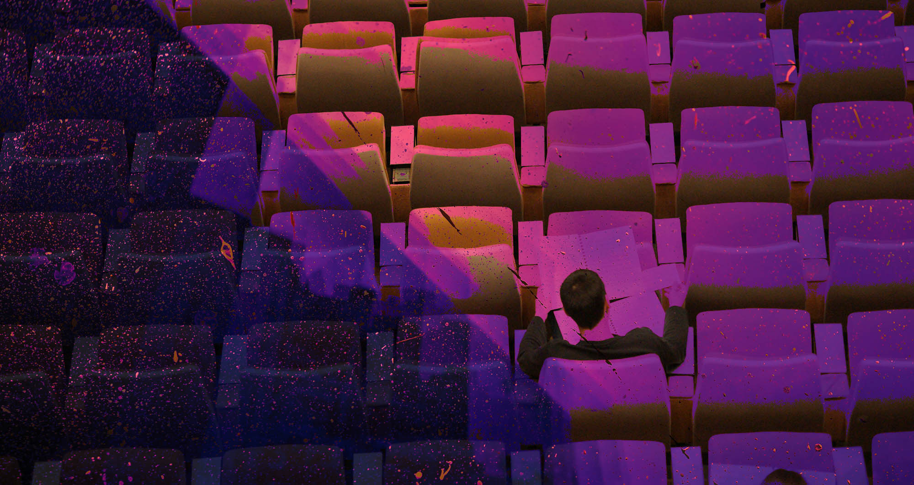

# Конференции пытаются быть аполитичными в наши страшные времена, чтобы сохранить айти сообщество. Получится ли? И что думает само сообщество

Конференции, митапы и прочие ивенты всегда были индикатором настроений айти сообщества. Как оно реагирует на вызовы и изменения, технические и этические, куда двигается — все можно было прочувствовать, когда сообщество собиралось в одном месте. Но за последние два года конференциям пришлось переживать удары за ударами — сначала ковид, теперь война. Мы постарались нащупать, каковы настроения в кругах организаторов и участников иментов, что происходит и куда движется эта сфера.

Раньше айти конференции казались мне сердцем индустрии. Маленькие сообщества и сходки поддерживали нетворкинг, помогали людям обрастать связями, делиться опытом и помощью локально. Большие конференции — были некими важными майлстоунами, которые определяли направление. Попасть на конфу было круто, это воспринималось как событие, приключение, которого ждешь месяцами. Узнать что-то интересное, увидеться с людьми, про которых только где-то слышал.

Выступить на конфе — было престижно и круто. Классные доклады разлетелась по сети, собирали просмотры, цитировались. На них ориентировались и ссылались в работе. Частых спикеров уважали в индустрии, к их экспертизе прислушивались.

На конференциях ощущалась, как в индустрии бьется пульс. О чем думают люди, куда идет сообщество, что происходит с технологиями. 

Но с 2020 года на конфы посыпались испытания, одно за другим.

## Только пандемия закончилась

В начале пандемии ковида было совершенно непонятно, что будет с индустрией. Как всегда замер найм, было страшно за жизни людей, за экономику. Все заперлись по домам, и только и делали что спорили — а не убьет ли повсеместная удаленка и запертость в квартирах слаженные офисные коллективы. Возможно ли вот так разом взять — и перестроить все процессы.

Оказалось, еще как возможно. Локдауны и самоизоляции только подстегнули цифровой бум и рост всяких сервисов, он в свою очередь подстегнул спрос на разрабов, который тут же подстегнул рост зарплат, а необходимость работать из любого места и брать людей откуда угодно подстегнула и объемы найма. Оказалось, пандемия не просто не повредила айти индустрии — она ее только усилила.

Но только не старые добрые айти конференции. Им пришлось пройти через ад. Организация конференции — огромное сложное дело, которое длится месяцами. И их почти невозможно организовать, когда в любой момент придется все сворачивать. В ноябре 2020 года мы [разговаривали](https://youtu.be/wtc3GFFK-WI) с Олегом Буниным, основателем Онтико, и наш вопрос стоял тогда максимально тревожно — а выживут ли вообще конференции старого формата? 
«Я был удивительно не прозорлив, если честно», — говорил Олег, — «Все произошло довольно внезапно: в конце февраля мы с командой строили планы, а уже через месяц наши планы можно было выбросить. Все вокруг закрывалось. Мы стали искать платформу для онлайн-конференций, но ничего не было! Как будто в формате онлайн толком не проводилось ни одной конференции. Мы не нашли подходящую платформу для проведения, и в результате написали свою! “Велосипед” должен быть у каждого программиста, да?»

Это был странный период, когда сообщество стало искать способы собираться в онлайне, но придумывать способы вернуть себе атмосферу личных встреч. Самое забавное, что мне запомнилось из тех времен — сервисы, которые имитировали тусовку в пространстве, вроде Spatial Chat. Вот у тебя кружочек с твоим фото, вот пространство, которые вы с друзьями сами украсили и обвешали картинками, и ты можешь ходить по нему туда-сюда, сбиваться в компашки и выбирать с кем поговорить. 

Примерно на этой же волне стартовала Podlodka Crew. Команда популярного айти подкаста Podlodka стала собирать людей на тематические недели в Слаке и устраивать там самые разные дела — от обычных докладов до всяких хитрых интерактивных и игровых механик. 

«В первый год COVID-19 казалось, что вся наша жизнь закончилась и всё теперь будет по-другому», — рассказывает [Евгений Кателла](https://twitter.com/katellaevgenii?lang=en), один из организаторов, — «Пандемия меня деморализовала: привычные вещи стали работать по-другому, но это не было тектоническим сдвигом. Да, раньше я мог спокойно планировать любое путешествие, а из-за пандемии они отменились. Но больше в моей жизни глобально ничего не поменялось. К ограничениям легко можно привыкнуть: носить маску, перчатки. С этими можно жить. В первый год казалось, что вся наша жизнь закончилась и все будет по-другому, а потом мы подумали: “Да и фиг с ним! Ничего страшного”».

И в целом — все получилось. Сообщество прошло через изоляцию и не развалилось. И когда стало можно собираться вновь — люди взяли и собрались. Большие конференции вернулись сначала в гибридных форматах, а затем, как и в допандемийные времена — в полностью офлайновых.

Но только это испытание оказалось позади — как началось новое.

## Еще один ад для организаторов

Любая конференция на территории СНГ ощущалась совместным общим предприятием России, Украины, Беларуси, Казахстана и других стран. Это даже не проговаривалось как что-то особенное. Просто норма вещей — разрабы собирались везде и были отовсюду.

В феврале 2022 все резко поменялось. По сообществу прошли глубочайшие трещины — и поскольку пульс индустрии всегда был виден на конференциях, они снова почувствовали разлом ярче всех остальных сфер в индустрии.

«Мы с командой Подлодки никак не общались первые три дня после 24 февраля, почти ничего не делали, приходили в себя» — говорит Евгений Кателла, — «Потом списались, нужно было что-то решать. Было абсолютно очевидным, что продолжать конференции пока невозможно. Это было неуместно, ни при каких условиях».

За шоком пришла разобщенность, сообщество стало разваливаться. Моральные, этические и политические споры вышли на первый план и заслонили технологии. Какая позиция у организаторов? Какая позиция у программного комитета? Могут ли спикеры допускать политические высказывания во время выступлений? Смогут ли участники из разных стран делить одну сцену? В какой стране платят налоги организаторы? Какие компании поддерживают конференцию, этично ли теперь выходить на сцену под их баннерами? Эти вопросы стали источником неразрешимых раздоров, которые снова поставили конференции под угрозу выживания.

Самые жесткие моральные дилеммы встали перед организаторами крупных конференций — Онтико и JUG Ru Group. Они не высказывают позиций, потому что находятся между всех огней сразу, и пытаются сохранить на конференциях аполитичную атмосферу, как раньше. И это очень-очень непростая задача. 

JUG Ru Group остановила всю рекламу конференций в интернете и перевела все соцсети в «режим тишины». Но Алексей Федоров — директор JUG — написал у себя в [телеграме](https://t.me/channel_23derevo/314) несколько постов, где осудил происходящее и попытался выразить свою позицию:
> «Поверьте, нам тоже очень больно. Мы тоже не хотим, чтобы людей убивали, чтобы люди теряли родных и близких, покидали свои дома и становились беженцами. Это настоящий кошмар. 
> 
> ​То, что происходит сейчас на территории Украины, идёт вразрез с ценностями мирного и взаимовыгодного сотрудничества. Но больше всего нам больно от того, что гибнут люди и растёт ненависть.
> 
> Почему же мы приняли решение продолжать делать наши конференции? Это очень просто. Мы искренне верим, что конференции — это хорошее нужное дело, и что мы приносим пользу людям. В этом смысле наша установка никак не изменилась. Но сами конференции изменятся и будут другими — это факт. Если вы считаете, что мы этого не осознаём — вы глубоко заблуждаетесь. 
> 
> То, что мы строили последние десять лет, во многом разрушено. Спикеры из Украины и всё украинское коммьюнити мы потеряли на долгие годы, если не навсегда. Европейское и американское коммьюнити — тоже. Иностранным спикерам сейчас понадобится много сил и отваги, чтобы выступить у нас. Да и на российских будут оказывать давление, ставя их перед очень сложным выбором. Значимую часть участников и спонсоров мы тоже потеряем. Готовы ли мы к этому? Нет, нас никто и никогда к такому не готовил. Опустим ли мы руки? Нет, мы продолжим трудиться».

«Мне кажется, что конференции делятся сейчас на четыре группы по двум осям», — говорит [Евгений Кот](https://twitter.com/bunopus?s=21&t=DFm8E4EFGABjkbG_T8oASg), частый участник многих конференций и член нескольких программных комитетов — «В России или не в России; коммерческая или коммьюнити. Те, что не в России — им проще. Есть общемировая повестка: всё хорошее — хорошее; всё плохое — плохое. И высказывать его не опасно, всё нормально. В России всё, мягко скажем, сложнее и говорить “всё хорошее — хорошее; всё плохое — плохое” — опасно. Поэтому, находясь в России, коммьюнити-конференции почти не представлены, потому что (я передаю слова организаторов) коммьюнити, для которого мы делаем конференции, сейчас уже не осталось, коммьюнити не до этого, поэтому делать такие конференции как-то странно, хотя они делаются по-прежнему, но не в том разрезе. Коммерческие конференции, конечно же, хранят нейтралитет, потому что взять их за жопу очень просто. Там есть генеральный директор, подпись, протокол, СанПин, пожарная охрана, это всё быстро делается. К тому же к ним гораздо больше внимания». 

Ребята из Podlodka Crew правда меньше и моложе ветеранов сферы. Возможно, из-за этого им проще: «Хочется держать пальцы крестиком, но пока нас все напряжённые вопросы обходят стороной. Я не понимаю, почему. У меня были опасения, что придёт спикер и повесит слайды, за которые нас всех могут посадить в тюрьму. И если мы эти слайды оставим — мы молодцы, но отъезжаем на нары. А если мы их убираем — мы правительственные подстилки и нас всех нужно закенселить. Но пока такого не было. Мы обсуждали, что будем делать в этой ситуации, но ничего не придумали. Когда случится — тогда решим», рассказывает Евгений Кателла. 

## Приходит ли в себя комьюнити

Тем не менее, продолжать ходить на конференции, выступать, разговаривать только о технологиях и карьере, для кого-то может быть не просто. Для других наоборот — это отдушина от постоянного стресса, способ привести свое состояние в порядок.

Podlodka Crew вновь стала проводить конференции только в мае. По их наблюдениям, жизнь в комьюнити постепенно начала возрождаться. Компании снова начали нанимать, а разработчики — снова интересоваться разработкой. «В мае запрос на конференции у людей уже возник, а сколько ещё будет тянуться вся эта напряженная ситуация — было неясно. Мы решили провести мероприятие, ведь, возможно, для кого-то это станет отдушиной. Подумали, что, если нарвемся на негатив — то и хрен с ним, если это хоть кому-то принесет пользу, например, поможет найти работу». 

Евгений говорит, что негативной реакции на возвращение конференций особо не было, но объясняет это тем, что их ивенты не слишком масштабны и привлекают не так много внимания, как другие организаторы. Плюс, в конце февраля, когда все началось, они одними из первых организаторов высказались против у себя в соцсетях.

Проблема в том, что даже когда у разработчиков появился запрос и желание собираться снова и говорить о технологиях — все не стало как прежде. Сообщество изменилось, настроения изменились, и это ощущается.

«В современных реалиях конференции всё больше стали походить на пузырь, локальную тусовку», — говорит [Андрей Смирнов](https://twitter.com/sandark7?s=21&t=DFm8E4EFGABjkbG_T8oASg), частый спикер на главных конференциях — «Индустрия с этим долгое время боролась, приглашала выступать зарубежных спикеров, показывала им наше айти и демонстрировала местным, что это не какие-то небожители. Теперь после февральских событий мы вновь оторваны от мирового айти-сообщества и отбросили себя в этом плане на несколько лет назад.

В плане взаимодействия с ребятами из украинского айти-сообщества всё очевидно потеряно на долгие годы – грустно читать пожелания смерти себе как русскому от людей, с которыми ты буквально недавно общался в подкасте и выступал на одной конференции. Но я вполне понимаю их чувства и не собираюсь осуждать и конфликтовать – мы просто не можем поставить себя на место друг друга, чтобы смотреть на происходящее под одним углом».

«Выступая на таких конференциях, чувствуешь некую двоякость», — говорит Евгений Кот, — «В мире происходит несправедливость, хочется привлекать к этому внимание, говорить об этом. Молчание публичных лиц сейчас почти всегда приравнивается к поддержке злого и плохого. Но призывать людей прыгать на баррикады или в огонь, когда я сам не готов этого делать, я не очень хочу. Понимая правила игры, принимаешь некий (до определённого периода) нейтралитет, скрепя сердце выступаешь — потому что, во-первых, как мне кажется, нужно отвлекаться от тем войны. 

Это звучит стрёмно и некрасиво, но если ты будешь думать об этом 24/7, начнется невроз и расстройство психики. Во-вторых, здесь, в России, остаётся много людей: и профессионалов, и непрофессионалов. Есть много новичков, которые пока не могут никуда уехать. И для них образование — важная вещь. Конференции для них способ получить опыт. В-третьих — если не давать людям надежду, говорить, что не будет ни выступлений, ни конференций, люди опустят руки. Никто не знает, что будет дальше. Наверное, и Java останется, и JavaScript. А вот что будет с карьерой или что будет с рынком, с технологиями — непонятно».

«Атмосфера на конференциях осталась очень профессиональной и понимающей – никто не скатывается в обсуждение политики, хотя все всё понимают», — говорит Андрей Смирнов, — «Мне было особенно удивительно, что посетители конференций видимо довольно быстро устали от темы того, как выживать нашему IT после случившегося, и подобные доклады на конференциях стали собирать трагически малое количество людей. В такой ситуации быть спикером на конференциях стало даже проще – много крутых экспертов уехали из страны, а докладчики в большинстве случаев нужны очно, следовательно конкуренция снизилась. А темы развития софт скиллов и карьерного роста в нынешней ситуации не потеряли актуальность»

«С февраля по апрель желающих выступать было очень мало. Доклады подавали единицы», — рассказывает [Ваня Ботанов](https://t.me/dev_yttg), член программного комитета одной из конференций — «Но начиная с мая люди стали очень активно подаваться на конференции, и мы отметили стандартный конкурс докладов на место. Неприятная или воодушевляющая это история — зависит от взглядов каждого человека. Я считаю, что политике не место на конференциях. Конференции всегда были про развитие, про сообщество и культуру. Это место концентрации опыта, людей, сложных задач и их решений. В этом магия конференций и хочется не терять эту магию. У нас есть много площадок в IT, где можно обсуждать политику. Есть блогеры, которые намеренно делают подобный контент. В твиттере много дискуссий на эту тему. Кажется, в IT сфере площадок более чем достаточно для разговоров на политические темы».

## Что будет дальше

Когда бушевала пандемия, казалось локдаун убьет конференции. Большие компании не справятся с убытками, маленькие онлайн инициативы в итоге не зайдут, потому что «не та атмосфера», а учиться можно и просто по курсам-видосам-урокам. Но упаднические прогнозы не сбылись — кончилась пандемия, вернулись офлайн конфы, плюс и к онлайну все привыкли.

Теперь же ситуация до ироничного обратная. Упаднические прогнозы как будто не вызывают отклика, звучат как нагнетание, людям изо всех сил хочется верить, что все это можно перетерпеть, ничего не меняя. Закрыться от страшного мира в пузырь, и тогда конфы выживут, а сообщество сохранится. Мне же кажется, что эта ситуация ранила сообщество в самое сердце и душу, и от такой раны долго не выйдет оправиться.

У меня не получается винить конфы за их аполитичную эскапистскую позицию. Публичные политические высказывания фактически запрещены, и кто я такой, чтобы требовать от организаторов героического самоубийства. Мне тоже хочется, чтобы сообщество не разосралось окончательно — просто я не верю, что молчание от этого спасет, а другого способа все исправить я тоже не знаю.

Возможно — крепкие горизонтальные связи и тихая взаимопомощь всем, кому можно помочь.

«Я вижу, как некие митапы продолжаются. Есть ребята, которые продолжают делать какие-то коммьюнити-ивенты, и я им очень благодарен», — рассказывает Евгений Кот, — «Это дает людям надежду, что в мире есть не только зло, разруха, ужас и смерть. Сообщество нужно, чтобы были продолжать двигаться дальше. У меня есть парочка воодушевляющих историй: я веду сообщества по Flutter и Dart, там сейчас шесть тысяч человек, и в самую горячую пору я ввел правила, все модерировал. Я знаю, что там есть ребята из самых разных стран — и из Украины, и из России — и они продолжают общаться. Конечно, сложно, но, тем не менее, общий язык можно найти, и дай бог, чтобы это был общий язык программирования, а не пуль». 
