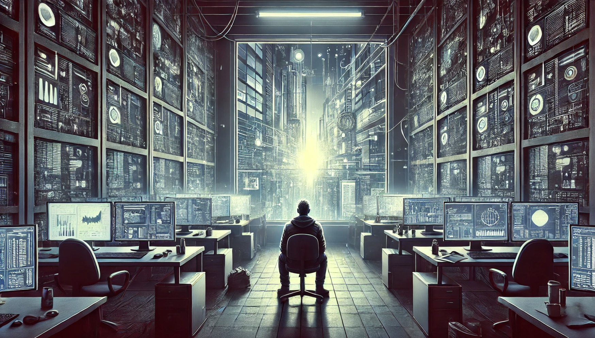
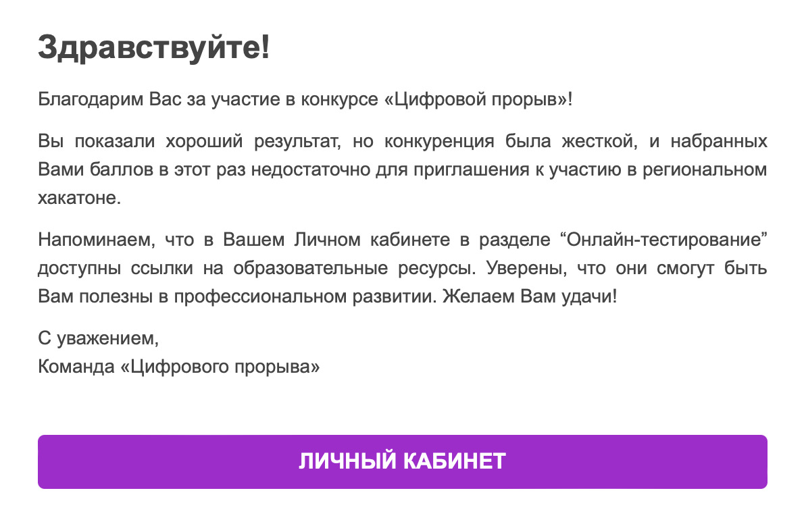

## К Техно-Магии через пот и слёзы: путешествие в Страну Чудес Data Science

Представьте, что Data Science — это магия, доступ к которой закрыт для простых смертных. Вход туда требует преодоления преград и испытаний.
Привет! Меня зовут Евгений и я нахожусь по другую сторону пропасти, которую так долго не мог преодолеть. Я обрел свое призвание в data science. Расскажу, как мне удалось без изнурительной подготовки и профильного образования перейти в сферу, к которой стремился всю жизнь.

Многие из нас хотят перейти на новый уровень, изменить работу и вместе с этим свою жизнь, но не могут решиться на этот шаг. Словно маленькие шарики мы катимся по извилистой поверхности жизни, набираем скорость, минуем препятствия, но рано или поздно попадаем в лунку, из которой не можем вырваться. Эта лунка становится зоной комфорта, а кратковременная передышка, чтобы набраться сил, — привычным состоянием.
Расскажу про свой путь, возможно, он вдохновит вас всё изменить и всё-таки попасть туда, куда требует душа. Ведь когда-то я тоже оказался в такой «лунке» — не на своём месте, но смог выбраться!

### Кроличья нора

Вау, гляньте на эту техномагию!

[Augmented Physics: Creating Interactive and Embedded Physics Simulations from Static Textbook Dia...](https://www.youtube.com/watch?v=GqZnQJpfFSg&t=6s)

Каждый, кто хочет войти в мир технологий, получает свой стартовый набор навыков. Кто-то начинает сразу с продвинутого уровня, а кому-то приходится проходить все этапы с нуля. Если бы во времена моей учебы в физико-математическом лицее были доступны технологии как в ролике выше, возможно, мой путь сложился бы иначе. Я стал бы намного любознательнее и быстрее нашёл своё призвание. Такие инструменты не только делают скучный процесс обучения живым, превращая его в игру, но и разжигают интерес к самим технологиям, которые стоят за этими инструментами.

Но вместо этого из нас, учеников, делали роботов, запрограммированных решать однотипные задачи, доводя этот навык до автоматизма. Благодаря зубрежке мы достигали отличных результатов на олимпиадах и выпускных экзаменах, принося лицею престиж и внушительное дополнительное финансирование в виде грантов. Эти средства шли на закупку разного рода учебной атрибутики: интерактивных досок, личных ноутбуков и программного обеспечения. По идее, это всё должно было обогащать наш образовательный процесс. Но реальность рушила эту идею: доски покрывались пылью, так как никто из учителей не хотел с ними разбираться, а ноутбуки прятались под замок в кладовке. Они становились символами упущенных возможностей, декорациями для визита проверяющих комиссий. В день приезда местной администрации я первый и единственный раз видел эти ноутбуки. Всё остальное время компьютеры, словно музейные экспонаты, хранились в кладовке в сейфе под замком.

Из-за такого отношения к концу обучения вся моя естественная любознательность и энтузиазм куда-то испарились.
Но то, что вы видите на видео — возможно, в том числе, благодаря технологиям машинного обучения. В мире технологий, как и в Стране Чудес, есть место для безумных шляпников-инженеров, которые создают настоящую магию. Кто они? Как они делают это? Ответ на эти вопросы ждал меня по другую сторону кроличьей норы.

С концом учебы подошло время самого важного выбора: чем ты будешь заниматься в ближайшем будущем, а, возможно, и всю жизнь. Зачастую в этот решающий момент тебе совершенно некому помочь: твои родители уже не ориентируются в актуальных сферах, а одноклассники сами не знают, как строить свой жизненный путь. Как итог, выбор университета после изнуряющего марафона экзаменов и олимпиад, оказывается не более чем формальностью. Хотелось лишь быстрее закрыть эту главу и вырваться на столь желанный отдых.

Первое время в универе я все еще двигался по инерции, стараясь прилежно учиться, но почувствовав первые признаки свободы, быстро сбавил обороты. Именно тогда я, кажется, и упустил из виду настоящую революцию в индустрии. На сцену выходил новый термин — Data Science, и мир цифровых технологий переживал невероятный взлет. Крупные компании открыли для себя ценность данных, научившись превращать их в полезные инсайты и сервисы, которые меняли их бизнес.

Увы, к моменту начала поиска работы в силу потери интереса к учебе я упустил достаточно много фундаментальных вещей и уже не мог рассчитывать на место под солнцем в центре этой цифровой революции. Мои перспективы ограничивались узкими нишами на периферии мира анализа данных. 

Первую серьезную, как я тогда считал, работу инженером-программистом в государственной структуре я нашёл на третьем курсе института. Эта позиция рисовала отнюдь не радужные перспективы: подъем в 6 утра, поездка в какую-то глушь в битком набитом автобусе как на первую пару — стоило ли это 11 лет школы и ещё нескольких в универе? 
Эта работа съедала меня по частям. Один день, однако, стал переломным. Я не мог заставить себя доехать до работы, а просто вышел из автобуса на одной из остановок, нашёл ближайшее кафе, где и провёл там весь день. Половину времени я занимался рабочими задачами, хотя уже тогда понимал, что в ближайшее время напишу заявление по собственному желанию. Оставшееся время посвятил написанию резюме и изучению вакансий. Фрустрация переполняла меня, и в этом состоянии я собрался с духом и откликнулся на вакансию в Mail.ru. Я ни на что не рассчитывал, но, к моему удивлению, меня пригласили на собеседование.

Несмотря на внутренние диалоги и аргументы против я смог набраться смелости и отправился на интервью. HR проводила меня в переговорку, где я кодил на листочке под пристальным взглядом надменного, и как будто вставшего не с той ноги руководителя, который через несколько минут увидев, как я ковыряюсь в листке, забрал его у меня, продекларировал: «собеседование окончено» и вышел из переговорки. Это было буквально "Прощай, голова!" в стиле Королевы Червей. До сих пор помню этот унизительный момент и как сильно он подорвал мою самооценку. 

Я принял решения сменить обстановку на 180 градусов и хотя бы сменить картинку на более жизнеутверждающую. Не без труда переместился из унылых кабинетов в модный open-space онлайн-кинотеатра, где получил позицию веб-аналитика и много творческой свободы. Креативные люди вокруг заряжали меня своей энергией, я обрел уверенность в себе. Здесь у меня впервые появилось ощущение, что мои усилия имеют значение: я мог экспериментировать, мог реально влиять на продукт, к моему мнению прислушивались. Но был ли это Data Science? Конечно, нет.

Меня закручивало в спираль неудовлетворенности, мне не хотелось прыгать с одной работы на другую, не добившись каких-то значимых результатов, но и оставаться я не мог, понимая,  что занимаюсь не тем и никак не развиваюсь. Набравшись смелости, всё-таки решил идти дальше, но на этот раз угодил в ловушку и на время прочно застрял в зоне комфорта, запрещая себе мечтать о большем. Так началась моя карьера: аналитиком в Сбербанке. Работа была стабильной и престижной, но вряд ли можно было назвать её пределом мечтаний.

### Ещё глубже, ещё темнее

Как и Алиса, я оказался в месте, которое не совсем понимал. Моя работа аналитиком в Сбербанке была похожа на чаепитие с Болванщиком — куча разговоров, бесконечные таблицы, но никакой настоящей магии. Меня затягивала рутина, и я чувствовал себя, как если бы застрял на одном месте, без шанса двигаться дальше.

Data Science манил меня, как Чеширский Кот, загадочно улыбаясь в темноте, но я боялся сделать шаг вперёд. Голос внутри шептал: «Ты недостаточно умен», «Ты не справишься», «Ты провалишься», «Ты уже пробовал, и что из этого вышло?». К такому квантовому скачку нужно сначала подготовиться на все 100%. Ведь нет такого понятия «перепрыгнуть пропасть наполовину», это всё равно не успех, а падение. Я словно очутился перед гигантской шахматной доской, не зная, какой ход сделать.

Появились мысли даже снова поступить в ВУЗ. Но было непонятно, где найти для него время. Увольняться с работы?

### За шаг до провала

В этот беспросветный период мне написал приятель и позвал на хакатон. Хакатон? Что это? Я впервые слышал это слово. Но приятель быстро ввёл меня в курс дела: это такое соревнование для айтишников, выбираем тему и делаем свой продукт. Я чувствовал себя, как если бы Безумный Шляпник пригласил меня за свой стол. Всё происходящее было странным, хаотичным, и у меня не было уверенности, что я смогу что-то сделать, что смогу оказаться полезным. Но любопытство взяло верх и я решил попробовать.

Первым испытанием стал отборочный тест. Я зарегистрировался на платформе и выбрал несколько тем, в которых лучше всего ориентировался и был более-менее уверен — Python, SQL и Теория машинного обучения. В каждом тесте — 20 вопросов. На поверку вопросы оказались не такими уж и простыми, я набрал по SQL — 15 из 20 баллов, по Python — 13 из 20 и по теории ML — тоже 13 из 20. Результат ужасен, особенно если сравнивать с друзьями, которые набрали от 16 до 19 по каждому из этих тестов и прошли сразу, а мне пришла формальная отписка с пожеланием удачи в следующем году.

Но, внезапно, через несколько дней мне пришло другое письмо с приглашением участвовать в региональном этапе: необходимо было создать команду или присоединиться к существующей. Я не мог поверить своему счастью. Решил, что скорее всего у организаторов недобор участников. Но какая разница, мне выпал шанс!

И вот после нескольких дней уныния и сожалений об упущенных возможностях я снова воссоединился с друзьями. Ядром нашей команды было три человека из Сбера: я, мой друг фронтенд-разработчик Лёша и его более опытный коллега фулстек Миша. С Лёшей мы знакомы с самого детства, он пришёл в IT даже позже меня и также прорывался через госуху. Миша же вообще уникум — человек работал фельдъегерем и внезапно решил стать программистом. Путь от инженера-разработчика до архитектора преодолел буквально за полтора года, кодил днём и ночью. И хакатон для него тоже был одним из способов вырасти.

На хакатоне у каждого участника своя роль: бэкенд и фронтенд разработчики — основа инженерной группы. Они создают код прототипа. Докладчики (их еще называют “хастлеры”) делают «питчинг» — защищают проект перед судьями. Их цель — представить проект в лучшем свете, доказать, что все поставленные перед командой задачи успешно выполнены, все критерии учтены, а выбранные методы и технологии — оптимальны. Я же сочетал в себе роль аналитика с уклоном в Data Science. Такие специалисты — тоже часть инженерной команды, они сосредоточены на работе с данными: анализ, разработка моделей машинного обучения и сервисов на их основе, а также архитектура хранения данных. Команде также нужен лид или проджект, который будет курировать работу всей команды, синхронизируя работу участников и заставляя их двигаться в общем темпе и направлении. Дизайнер помогает докрутить визуал и подготовить хорошую презентацию.

Согласно правилам соревнования, команду можно было набирать от 3 до 5 человек и мы точно не планировали останавливаться на текущем составе. Но нужно было понять, где мы хотим усилиться. До самого хакатона оставалось всего полторы недели и нам срочно нужно было найти остальных участников. Стало ясно: придётся выбирать из тех людей, что остались без команды. Но кого не хватает?

Мы составили описание команды, целей и ролей, которые ищем. Точно хотели  привлечь дизайнера и ещё одного участника, способного усилить команду. В течении следующих нескольких дней мы в перерывах между работой встречались на кофе-брейках и вели переписку с желающими присоединиться к нашей команде. И вот к нам присоединился эксцентричный дизайнер Паша и ещё один Миша, который совмещал несколько ролей в силу знаний и опыта: и питчера, и менеджера, а ещё разбирался в бэкенде.

Мы назвали команду Sigma: когда работаешь в Сбере, греческий алфавит сам приходит на ум.  Вспомнили IT-ландшафт Сбера: окружение «Альфа» защищено и предназначено для работы с данными в закрытом контуре, «Сигма» же — для доступа в интернет. Тогда еще термин «Сигма» не был таким заезженным и не ассоциировался с персонажем Райана Гослинга из фильма «Драйв».

### Квантовый скачок

Хакатоны — это в первую очередь командное соревнование. То, как вы наладите процессы внутри команды, насколько сработаетесь и грамотно распределите задачи, решает почти всё. Если один из участников не справится с важной частью, это может подставить всю команду и пустить проект под откос.

Наш хакатон был непрерывным 36-часовым марафоном разработки. Между началом и концом соревнования — три небольшие встречи с постановщиками задачи (чекпоинты), на которых эксперты координируют наши действия, оценивают промежуточные результаты, дают советы и, что немаловажно, мотивируют дойти до конца, какими бы ни были текущие успехи. Согласно регламенту, каждой команде вне зависимости от трека надо посетить хотя бы один чекпоинт в полном составе и минимум два в любом, иначе команду дисквалифицируют.
Площадка была расположена в одном из тусовочных мест Москвы в лофтах на Красном Октябре. Специфика хакатона в том, что все участники находятся на одной площадке, а зачастую и в одном общем пространстве. Из-за сжатых сроков многие принимают решение не покидать площадку и спят прямо там, сменяя друг друга на посту.

По совету Миши как наиболее опытного участника, ни раз до этого принимавшего участие в хакатонах, мы договорились собраться за час до начала мероприятия, чтобы занять хорошее место — не в проходе или центре помещения, где вечно снуют люди, постоянный шум и хаос, а у стены, окна или поближе к еде.

Мы сделали минимальную подготовку для комфортного начала работы: завели репозиторий кода, куда ребята закинули каркас будущего веб-приложения. Также создали доску для задач, по которой удобно было сверять прогресс.

Мы заранее знали тему нашей задачи — реализовать административную панель оператора поддержки Единого Диспетчерского Центра ЖКХ. Но все участники на площадке находились в ожидании деталей задачи: чёткой постановки, данных, критериев оценки. Эти материалы все команды получали одновременно и в момент получения этих материалов хакатон официально стартовал. 

И вот хакатон стартовал! Какое-то время мы работали изолированно и самостоятельно: что-то гуглили, пересылали друг другу ссылки. Так через некоторое время вырисовался примерный план. Мы распределили задачи и снова изолировались друг от друга, время от времени синхронизируясь в промежуточных точках. Так легче работать. Времени оказалось намного меньше, чем я думал, оно утекало сквозь пальцы: чек-поинты, консультации, мастер-классы, а ещё не забыть поесть и перекурить.

Мы придумали сервисы, описали их логику, создали базу данных. Паша звонил в службу поддержки, чтобы получить реальный сценарий диалога (хитрый ход).
Миша (наш лид) время от времени спрашивал «как дела? есть что посмотреть?» — в общем, типичный продакт. Посмотрев очередную версию макета, правил его прямо в графическом редакторе. Паша перерисовывал, а фронтендеры в шоке паниковали «не надо переделывать макет! нам бы это успеть сверстать». 

Миша с Лёшей зашивались, верстая в четыре руки как на фортепьяно любое изменение в макете, которое наш дизайнер Паша мог добавить в любой момент. И добавлял. Это отодвигало нас от результата на несколько часов. Точкой кипения стал момент, когда Паша сказал «да что тут делать, работы на две минуты». Это вызвало недопонимание и негодование у фронтов, потому что обесценивало их труд. Так случился наш первый конфликт.

Моей вотчиной стало всё, что касается обработки данных: я реализовал схему их хранения, принцип добавления новых записей в базу и логику запросов. Мне было проще, чем ребятам, потому что не надо был так жёстко с ними стыковаться. Это позволяло эффективно тратить время, тестировать гипотезы и пробовать разные идеи. Мне достаточно было обсудить с ними образ результата, а затем можно было работать независимо и синхронизироваться в определённые моменты, когда на одной из сторон готов новый инкремент.

День сменялся вечером, а вечер ночью. Расставались мы с разным настроением. В голове стоял шум после тяжелого дня, кто-то даже бросил «ничего не успеваем, походу пролетим». Миша отвечал, что мы готовы на 70%, этого достаточно. Но все были вымотаны и приняли решения уехать поспать. Оказалось, что Лёша забыл ключи дома, а дома все спят, поэтому остался на хакатоне до утра. Все диваны на площадке заняты, спальных мест нет. Он пытался спать на стульях — не получилось.

Все разъехались, а Лёша остался на площадке один из нашей команды. Ночь хакатона напоминала странные сны Алисы. Люди, работающие без сна, сломанные скрипты, которые внезапно начинали работать, разговоры, полные абсурдных идей. Ночная жизнь в центре столицы кипела. Лёша рассказывал, как он смотрел в окно, а там парни и девушки в бикини на крыше соседнего клуба плескались в джакузи и курили кальян. Тогда в голову ему пришла мысль «а что я вообще здесь делаю?».

Чтобы не сойти с ума в перерывах между работой Лёша смотрел сериал. Но благодаря бессоннице у него открылось второе дыхание и он доделал кучу задач по вёрстке. И когда с утра на площадку наконец-то приехал наш продакт Миша, он будто поверил в чудо. После этого Лёша героически поехал спать до вечера.

### Решающий поединок

В презентации к задаче постановщик всегда указывает критерии оценки, в которые всегда входит качество презентации, обоснованность выбранного решения, его прозрачность и адаптируемость. Нельзя забывать про критерии оценки решения, это единственное, что важно, ведь ты можешь сделать сколь угодно крутое решение, которое будет очень тебе нравится, но если ты забыл про критерии — этого никто из членов жюри не оценит.
Паша сделал суперский ролик-презентацию нашей работы с музыкой: да, там элементы интерфейса появляются по очереди и логика работы не соответствует реальности, зато это представляет нашу работу более цельно.
И вот после 36 часов хакатона объявили «стопкод» и мы начали готовиться к защите. Все нервничали: наш продакт Михаил ни с кем не разговаривал, а ходил взад-вперед с листком бумаги и репетировал текст.  И тут «тёмная лошадка» Михаил впервые продемонстрировал всей команде и членам жюри, как важна роль хорошей вербальной презентации в финале. На защите мы впервые увидели выступление Миши. Мы не знали, насколько он крутой питчер, и были приятно удивлены. Он блестяще ответил на все вопросы жюри, посчитал стоимость внедрения и экономический эффект, отбился от всех возражений. Этого никто из нас не ожидал.

Никто не вмешивался в его работу над текстом, хотя саму презентацию делал наш дизайнер Паша. Презентация также была лучшей, как ни крути.
В конце хакатона я почувствовал, как постепенно уходит мой ментальный блок: я понял, что важна не только техническая часть, но и то, как мы подходим к трудностям. Сдаёмся ли, когда слышим про трудности или не сгибаемся под внешними обстоятельствами и до последнего гнём свою линию. Если за несколько часов я могу создать что-то ценное из ничего, то почему меня так пугает то, как мои ответы на вполне конкретные вопросы оценивает экзаменатор.

Посмотрите видео о том, как страх использует наш интеллект и постоянно подбрасывает сомнения в своих силах, и мешает двигаться вперёд.

[5 Blindspots fear uses to hold back the most capable people.](https://youtu.be/yZOdLt_1Rnk)

### Финал: мой путь в Зазеркалье
В процессе ожидания объявления результатов соревнования мы наконец смогли немного расслабиться и отпустить ситуацию. Мы уже не обсуждали потенциальные ошибки и сомнения, а просто делились эмоциями, говорили о планах на ближайшее будущее и оценивали потенциальные возможности снова собраться вместе на площадке очередного конкурса. В отличие от Миши, который ни на секунду не отвлекался от работы с текстом презентации до своего выступления, мы слушали защиты других команд, и это несколько повлияло на наши ожидания: мы понимали, что если мы не лучшие, то явно одни из лучших. Так что когда объявляли победителей и наша команда заняла первое место, мы не были так уж сильно удивлены. Мы испытывали чувство благодарности друг к другу за ответственность и качественно проделанную работу, смазанное из-за невероятной усталости.

Разобрав сертификаты победителей и подарки от партнеров мы успели перекинуться парой слов касательно следующего этапа - после регионального этапа следовал финал. Но это уже совсем другая история. Полностью осмыслить произошедшее мне удалось лишь через несколько дней, а затем вернувшись в офис я наконец почувствовал, что пора двигаться дальше.

Зима. Собеседование на ML-инженера. Снова передо мной листок бумаги, снова пристальный взгляд потенциального руководителя и пустая переговорка. Только откуда-то во мне эта внутренняя уверенность в своих силах, которая кажется транслируется и собеседующему. Да, я всё ещё не могу идеально ответить на все вопросы, но внезапно открывается какой-то внутренний ресурс. Я даю понять, что я со всем справлюсь, стараюсь продемонстрировать свои лучшие качества, словно переместившись на несколько месяцев назад на защиту нашего проекта. Теперь я верю в свои силы. Это главное, и даже если я выйду из этого здания без оффера, это больше не нарушит моей внутренней гармонии. Однако должность я получил, и более того, очень быстро перерос ту ступень, на которую годами не мог взойти. 

Я понял главное: не нужно ждать идеального момента, чтобы сделать шаг. Даже если ты чувствуешь себя на 60%, даже если мир вокруг кажется хаотичным и непредсказуемым, как Страна Чудес — двигайся вперёд.

Теперь я работаю в Data Science. Это не чудо и не волшебство, а результат смелости идти в неизвестность, даже если на пути встречаются Королевы Червей, Безумные Шляпники и кроличьи норы, ведущие в самые неожиданные места.

