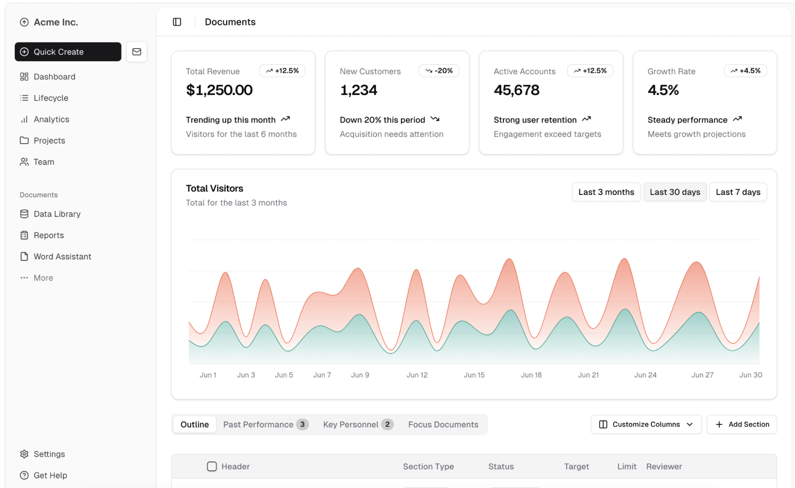
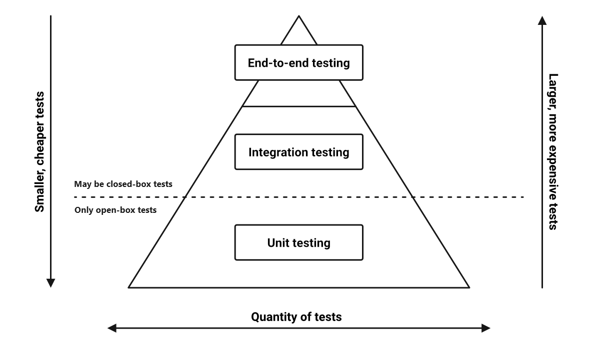
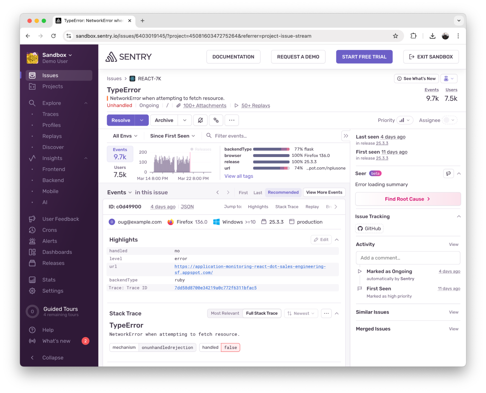
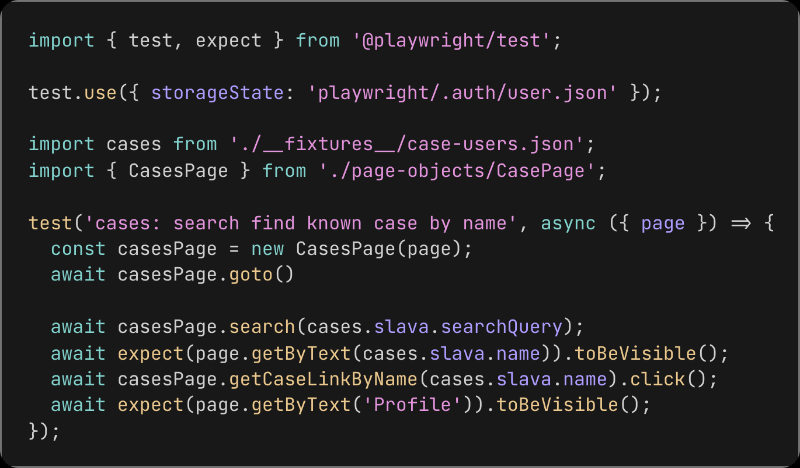
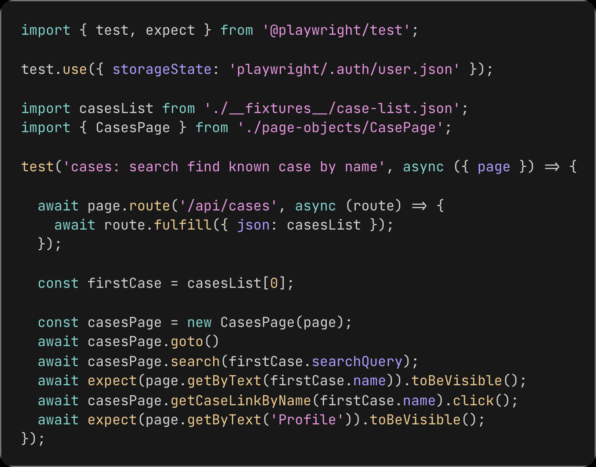

## Как эффективно тестировать фронтенд, если некогда писать тесты

Фронтенд-разработчики часто сталкиваются с ситуацией, когда тестов в проекте нет совсем или их так мало, что польза от них практически не видна.

Ярослав Соболев работает инженером в стартапе, разрабатывающем продукты, которые помогают родителям учить детей на дому.

В этой статье он рассказал, как минимальными средствами добиться максимального результата, почему классическая пирамида тестирования не всегда применима к фронтенду, и какие практики можно использовать, чтобы тестировать приложение эффективно и без лишних усилий.

### Что на самом деле нужно тестировать во фронтенде?
Чтобы понять, какие тесты действительно нужны, сначала взглянем на типичное фронтенд-приложение (на примере React):

- **Разметка и компоненты: HTML-код**, JSX-разметка, CSS-стили – всё, что отвечает за структуру и внешний вид интерфейса.

- **Фетчинг данных:** взаимодействие с бэкэндом (REST API, GraphQL), часто с помощью библиотек вроде React Query, useSWR.

- **Управление состоянием:** хранение и изменение данных на клиенте – будь то глобальное состояние приложения (например, через Redux, Context API или другое хранилище) или локальное состояние отдельных компонентов.

- **Бизнес-логика на клиенте:** часть логики продукта, реализованная на фронтенде. Это могут быть проверки и валидация введенных данных, вычисления, применение правил отображения интерфейса в зависимости от состояний и т.д.

Возникает вопрос: что же именно тестировать? Нужно ли проверять, что вёрстка правильно отображается в разных случаях? Или сконцентрироваться на логике работы компонентов? Стоит ли писать тесты на вызовы API и обработку ответов? Как быть с состоянием – проверять ли изменение стейта приложения при разных действиях пользователя?

Давайте рассмотрим основные виды тестирования и попытаемся понять, на что делать упор.

### Классический подход к тестам: какие они бывают и зачем нужны

Традиционная модель, которую используют при автоматическом тестировании, называется **пирамида тестирования.** Она состоит из нескольких уровней:

- **Юнит-тесты** – проверяют отдельные функции и компоненты, их обычно больше всего.
- **Интеграционные тесты** – тестируют взаимодействие нескольких модулей между собой.
- **E2E-тесты (end-to-end)** – тестирование приложения, имитирующее действия пользователя в браузере.

Идея пирамиды в том, что тесты, расположенные ближе к основанию пирамиды (юнит) писать и запускать проще всего, поэтому их обычно больше всего. Тесты наверху пирамиды (E2E) сложнее и медленнее, их пишут меньше.

На практике оказывается, что строго следовать этой модели не всегда эффективно, в особенности применительно к фронтенд-разработке.

### Можно ли обойтись совсем без тестов?

Некоторые команды в определённых случаях сознательно не пишут автоматические тесты на фронтенд. Подобное встречается в реальных проектах, и причин может быть несколько. Например, в стартапах на самой ранней стадии главное как можно быстрее выпустить продукт. В legacy-проектах может сложиться культура обходиться без тестов: кодовая база разрослась без тестового покрытия с самого начала, и внедрять новые тесты сложно и затратно, поэтому поддерживается статус-кво.

В таких случаях мы можем позаботиться о качестве продукта и удобстве разработки настроив в проекте минимальный набор инструментов:

- **Статический анализ.** Самый простой шаг — настроить строгие правила линтера, типизации (например, TypeScript) и другие инструменты, отлавливающие ошибки ещё на этапе сборки. Стоит позаботиться о том, чтобы такие проверки срабатывали перед каждым коммитом (husky, lint-staged) и во время сборки на CI.
- **Мониторинг ошибок.** Например, популярные Sentry, Datalog или Logrocket. Тогда мы сможем узнавать об ошибках сразу, как только они возникли у пользователя.

Такой подход не избавит нас от багов, но повысит удобство разработки, а также позволит команде оперативнее реагировать на проблемы, возникающие в продукте.

Рано или поздно сложность приложения вырастет настолько, что ручное регрессионное тестирование перед каждым релизом будет отнимать слишком много времени. В этот момент мы вернёмся к идее автоматического тестирования и нам придётся выбрать, на каком виде тестов сосредоточить внимание в первую очередь.

### Простые E2E-тесты: как их писать

Если говорить о практическом тестировании фронтенда, то самым ценным и эффективным видом оказывается **E2E-тестирование.**

- Именно E2E-тесты позволяют увидеть, работает ли приложение на самом деле так, как задумано с точки зрения конечного пользователя.
- Такой вид тестов проверяет корректность работы приложения по всему стеку: от нажатой на фронте кнопки до запроса к БД.
- Они снимают часть нагрузки с ручных тестировщиков. Например, могут проверять любой сценарий сразу в нескольких браузерах.

Для написания E2E-тестов существует несколько популярных инструментов: **Playwright, Cypress**, а так же чуть более устаревшие Selenium и Puppeteer. Они позволяют легко автоматизировать базовые сценарии:

- Открыть страницу, нажать на кнопку, проверить, что появилось нужное содержимое.
- Выполнить базовые действия пользователя (например, авторизацию или заполнение форм) и убедиться, что они проходят успешно.

Хорошая практика — использовать паттерн **Page Object**, который позволяет вынести общие действия со страницами в отдельные свойства и методы. Если изменится структура интерфейса, достаточно будет исправить в одном месте, а не во всех тестах.

Какие части приложения стоит покрывать E2E тестами в первую очередь?

- Первые тесты могут быть простыми «smoke-тестами»: лишь проверять, что нужные страницы приложения открываются после деплоя и отображают все необходимые элементы. Благодаря тому, что такой вид тестов не меняет состояние на бэкенде, их можно безопасно запускать на продакшене.
- Дальше можно сконцентрироваться на critical path – самые важные бизнес-функции приложения. Это могут быть, например, авторизация, оформление заказа и т.д.
- По мере возможности увеличивайте покрытие вашего приложения тестами, добавляйте тесты на все новые фичи.

### Подводные камни E2E

Несмотря на огромные преимущества E2E, при их использовании возникает ряд сложностей:

- **Стабильность тестов (flaky-tests):** иногда они могут падать непредсказуемо (проблемы сети, анимации и загрузки, race-conditions). Современные инструменты вроде playwright почти лишены подобных проблем, но тем не менее иногда они будут возникать. Здесь трудно посоветовать что-то одно, скорее всего, вам придётся каждый раз решать проблемы по мере их возникновения.
- **Скорость выполнения:** Комплексный E2E-тест обычно выполняется на порядок дольше, чем юнит-тест. Если тестов становится много, общий прогон может занять значительное время. В этом случае помогает параллельный запуск тестов и оптимизация окружения. Кроме того, тесты можно разбить на несколько комплектов (test-suits), и запускать их по мере необходимости.
- **Управление тестовыми данными.** E2E-тесты требуют определённого состояния системы при каждом прогоне. Нужно заранее знать, какие данные присутствуют в базе, под каким пользователем выполняется сценарий, какие ответы вернёт API. Это добавляет сложности: чтобы вернуть приложение в исходное состояние необходимо восстанавливать БД из снапшотов/бэкапов. Бэкендерам и админам придётся следить за актуальностью этих снапшотов.

Иногда полноценное E2E-тестирование затруднено. Например, мы пока не умеем восстанавливать данные из снапшотов (бэкендеры и админы обещают завтра всё исправить) или приложение использует 3rd-party API, с которым мы не можем выполнять тестовые запросы. В таком случае простым и действенным выходом будет превратить E2E-тест в интеграционный, где сетевые вызовы **замоканы.**

### Когда E2E недостаточно: интеграционные тесты

Давайте возьмём наш E2E тест и перепишем его так, чтобы он обращался к моковому API вместо реального бэкенда.

По сути, для фронтенда этот тест почти не отличается от полноценного E2E, за тем исключением, что источник данных полностью контролируется нами.

Давайте посмотрим, какие характеристики нашего теста поменялись, а какие нет. Мы по-прежнему тестируем наше приложение глазами пользователя в настоящем браузере. 

Тесты используют тот же набор инструментов: playwright/cypress. Но теперь мы тестируем фронтенд в изоляции от бэкенда:

- У нас отпала необходимость в сложном сетапе данных перед каждым прогоном тестов.
- Для запуска тестов нам достаточно задеплоить только фронтенд.
- Такие тесты выполняются быстрее, чем полноценные E2E.

Однако, теперь нам необходимо следить за тем, чтобы моковое API совпадало по контракту с реальным бэкендом.

Стоит помнить, что гарантии надёжности работы приложения у интеграционных тестов ниже, чем у E2E-тестов, так как они тестирует только фронтенд, а не приложение целиком.

### Когда нужны юнит-тесты и как их писать меньше?

После всего сказанного может показаться, что юнит-тесты на фронтенде не играют большой роли. Однако есть ситуации, когда без них не обойтись.

- **Сложная логика:** например, нетривиальная функция расчёта стоимости, модуль построения маршрута, продвинутая валидация форм с множеством правил – всё это лучше покрыть отдельными юнит-тестами.
- **Библиотечный код и переиспользуемые утилиты:** то, что может использоваться в разных частях проекта, возможно, разными командами. Например, функции для работы с датами, или решение для нормализации данных из API и тому подобное.
- **Рефакторинг и поддержка legacy-кода.** Перед рефакторингом можно написать набор тестов, фиксирующих текущие поведение кода, а затем смело переписывать реализацию. Если после изменений все тесты проходят, значит удалось сохранить исходную функциональность.

Чтобы минимизировать количество юнит-тестов, не жертвуя качеством продукта, есть правило  – тестировать только то, что действительно представляет ценность и не покрывается другими видами тестов.

- Не стоит писать юнит-тесты на тривиальную функциональность. Например, тест который проверяет, что компонент-кнопка рендерит дочерние элементы.
- Если для решения типовой задачи существует хорошо-поддерживаемая библиотека, стоит выбрать её, а не писать решение самому.
- Также не стоит гнаться за метриками code-coverage. На практике высокие значения этой метрики не гарантируют высокое качество продукта.

### Выводы: оптимальная стратегия тестирования для фронтенда

Эффективное тестирование фронтенда вовсе не означает, что вы должны писать огромное количество тестов, стремясь к абстрактным метрикам покрытия. Наоборот, ключевый момент — осознанный подход и умение выделять критически важные сценарии и участки приложения.

- **Используйте инструменты статического анализа и мониторинга ошибок:** Иногда, когда на тесты совсем нет времени, лучшим решением будет сделать ставку на строгую типизацию, линтеры и инструменты мониторинга. Они помогают отлавливать ошибки ещё до того, как те попадут на продакшн.
- **Ставьте приоритеты:** начинайте с E2E-тестов, которые проверяют ключевые пользовательские сценарии. Такой подход обеспечит уверенность в работе основных бизнес-функций по всему стеку в вашем приложении.
- **Используйте интеграционные тесты для ускорения:** Если E2E-тесты по каким-то причинам трудно поддерживать (проблемы с бэкендом, внешние API), не бойтесь заменять их интеграционными тестами с моками.
- **Минимизируйте юнит-тесты:** Пишите их только для действительно сложных или критически важных участков логики. Откажитесь от написания тестов на простые компоненты или функции. Пользуйтесь проверенными решениями типовых задач.

Помните, что эффективное тестирование – это не про количество, а про осмысленность и фокус на главном.

