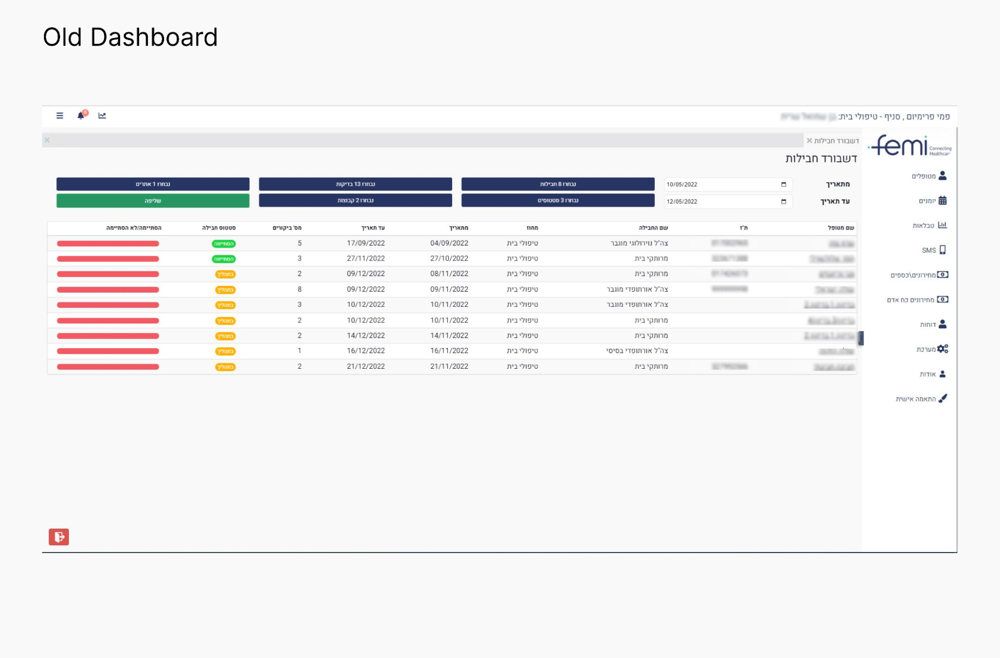
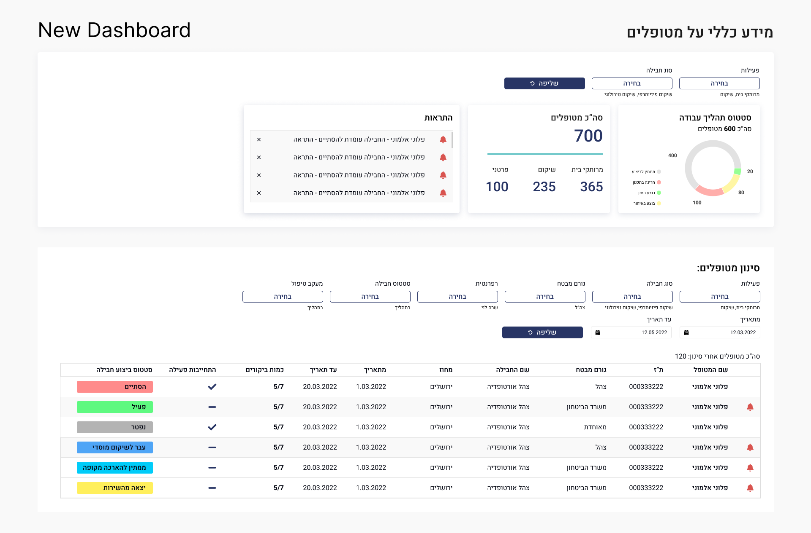

## Я работала с медицинским IT в Израиле и это было больно


Израиль – страна хай-тека, биотеха и стартапов. Инновации здесь рождаются каждый день.Татьяна Павлова, фронтенд-разработчик (Angular) и UX/UI-дизайнер, уже 20 лет живет в Израиле. Она работала в найме, но последние три года трудится на фрилансе. Ей довелось разбираться с израильскими медицинскими IT-системами... и они ее удивили не в хорошем смысле.


### Израильская медицина vs локальный IT-рынок

Хотя медицинская сфера в Израиле очень развита, медицинские IT-системы не всегда идут в ногу со временем. Так получилось, что в моей семье есть медики, работающие в израильской системе здравоохранения. Кроме того, вся моя профессиональная практика так или иначе была связана с разработкой и UX/UI-дизайном медицинских систем.

Израильские IT-компании разрабатывают технологии для мирового рынка, создают сложные медицинские решения для США, Европы, Азии. А что получают местные клиники? Интерфейсы на уровне начала 2010-х, убитый UX и код, который больно смотреть.

Когда я впервые заглянула в код проекта, меня чуть не хватил удар. ASP.NET, Bootstrap 4.0 и Font Awesome 4? В 2023 году? 😳 Это как найти кнопочный телефон среди айфонов. Без SCSS, без нормальной адаптивности… Просто боль.

Без переменных, вложенности и других возможностей препроцессора приходилось прописывать стили вручную, что усложняло поддержку кода и делало любые правки трудоёмкими.

Почему так происходит?

- Маленький рынок → мало инвестиций, технологии обновляются медленно.
- Жёсткие регуляции → разработка сложная и дорогая, а конкурентов почти нет.
- Политическая ситуация → некоторые международные сервисы просто не заходят на рынок..

Из-за всех этих факторов многие ниши в израильских IT-решениях остаются незанятыми. В любой из них можно быстро стать монополистом – если создать продукт, который закроет ключевую потребность рынка. Но монополия – это и плюс, и минус. Когда конкурентов нет, у компаний нет мотивации развивать технологии и улучшать продукт. Зачем вкладываться в UX, если система и так монополист?

Опишу подробнее типичную медицинскую ИТ систему в Израиле. Её ядро — это, как правило, хорошо написанный бэкенд: надёжный, безопасный, продуманный. Он отвечает за учёт пациентов, отпуск рецептов, назначение очередей, ведение журналов и бухгалтерию. Последняя особенно важна, так как израильская медицина хоть и частная, но значительная часть расходов субсидируется государством, из-за этого имеем сложную систему отчётности.

Но когда дело доходит до визуализации данных для врачей и администрации, ситуация резко меняется. Фронтенд → ужасный. Визуализация данных на уровне «сделано программистами». UX/UI? Да кто о нём вообще думает? Здесь используются популярные библиотеки вроде Bootstrap или других фреймворков, причём дизайн чаще всего разрабатывается самими программистами. В итоге интерфейсы получаются функциональными, но устаревшими, неудобными и малоадаптированными под реальные рабочие процессы администрации и медиков.

Так было и с фирмой, в которой я работала. Это небольшая компания, но один из монополистов на рынке медицинских IT-систем. Их программное обеспечение используют клиники и медицинские учреждения для назначения очередей, ведения журналов пациентов, обработки платежей и административного управления клиниками.

Но из-за отсутствия конкуренции у компании не было мотивации активно внедрять современные технологии. Это проявилось во всём – от старого стека (ASP.NET) до устаревших подходов к UI и адаптивности:

- **Отсутствие полноценной мобильной версии** – были попытки адаптации, но они выглядели скорее как «заплатки», сделанные на скорую руку. Вместо использования библиотек с полноценной поддержкой адаптивной верстки применяли простые переменные, измеряющие ширину экрана, в связке с media queries. В результате интерфейс на мобильных устройствах выглядел неудобно.
- **Использование устаревших технологий для иконок** – в системе не применялись современные SVG-иконки, которые являются стандартом индустрии. Вместо этого использовались текстовые версии иконок, что ухудшало масштабируемость и гибкость интерфейса.
- **Устаревшие компоненты UI** – многие элементы интерфейса (кнопки, формы, таблицы) были сделаны на Bootstrap 4.0, хотя на момент разработки уже существовали более удобные и современные решения. Визуально это делало систему похожей на продукты из начала 2010-х.
- **Минимальная проработка UX** – так как дизайн создавался программистами, интерфейсы выглядели перегруженными, с плохо продуманной навигацией. Например, длинные формы без логической группировки или кнопки разного размера и стиля, расположенные хаотично.

### Взрыв из прошлого: печатная вёрстка
В проект меня наняли как верстальщика. Я работала над Bootstrap-формами, но одной из задач стало оформление печатных форм. Да, печатная вёрстка. В 2024 году. В медицинской системе. Я подозревала, что её ещё где-то используют, но не думала, что это критически важный элемент системы! В эпоху цифровизации… они по-прежнему распечатывают медицинские документы. 

Почему печатная вёрстка = боль:
- Фиксированные размеры → адаптивности нет.
- Учитывать принтеры → тестировать можно только на бумаге.
- Отладка → ждёшь печати, только чтобы увидеть ошибку.
Печатные формы требуют принципиально иного подхода, чем веб-интерфейсы. Если в вебе можно адаптировать контент под разные экраны, то в печатной вёрстке необходимо жёстко фиксировать размеры и учитывать особенности вывода на принтере.

#### 1. Использование единиц измерения: сантиметры и миллиметры
В отличие от веб-вёрстки, где используются пиксели (px), em, rem и %, для печатных документов применяются физические единицы измерения:
- **cm (сантиметры) и mm (миллиметры)** используются для точного определения размеров полей, таблиц и блоков.
- **pt (пункты)** применяются для шрифтов, так как принтеры работают с типографскими размерами.
- **@page { size: A4; }** — задаёт размер страницы, что особенно важно для корректного вывода при печати.

Пример CSS для печатной страницы:

```css @media print {
    body {
        width: 21cm;
        height: 29.7cm;
        margin: 1cm;
    }

    table {
        width: 100%;
        border-collapse: collapse;
    }

    th, td {
        padding: 2mm;
    }
}
```

#### 2. CSS-стили, специфичные для печати

Чтобы печатные документы выглядели корректно, используются специальные CSS-правила:
- **@media print** — определяет стили, которые применяются только при печати.
- **page-break-before, page-break-after и page-break-inside** — управляют переносами элементов между страницами.
- **overflow: hidden;*** — предотвращает обрезание текста при разрыве страниц.
- **Скрытие ненужных элементов (display: none; )** — убирает кнопки, меню и другие интерактивные элементы, которые не нужны в печатной версии.
Пример кода для разрыва страницы:
```css
css
.page-break {
    page-break-before: always;
}

<div class="page-break"></div>
```
### 3. Вёрстка в таблицах: возвращение в 2000-е

Одна из особенностей печатной верстки — широкое использование HTML-таблиц. Причины:
- Таблицы гарантируют точное позиционирование данных (например, в отчётах).
- В отличие от флексбоксов или гридов, таблицы корректно разбиваются на страницы при печати.
- Медицинские системы часто требуют жёсткого форматирования строк и столбцов.
Пример HTML-печатной формы:
```css

<table>
    <thead>
        <tr>
            <th>Дата</th>
            <th>Код пациента</th>
            <th>Диагноз</th>
        </tr>
    </thead>
    <tbody>
        <tr>
            <td>10.02.2025</td>
            <td>12345</td>
            <td>ОРВИ</td>
        </tr>
    </tbody>
</table>

```
Несмотря на заявления о полной цифровизации, многие клиники до сих пор требуют бумажные документы. Поэтому интерфейс должен был корректно адаптироваться под печатный формат. Процесс адаптации работал так, что печатные формы в системе не создавались вручную, а генерировались на основе данных из веб-формы. Механизм был таким:

1. **Пользователь заполнял веб-форму** – это могла быть регистрация пациента, назначение обследования или выписка рецепта.
2. **Система получала значения переменных** – данные из веб-формы использовались для заполнения динамических полей в печатном шаблоне.
3. **Генерация печатной формы** – собранные данные подставлялись в заранее подготовленный шаблон, который затем можно было распечатать.

Какие были сложности:
- **Отсутствие предзаполненных данных** – для каждой проверки приходилось заново вводить данные, чтобы увидеть, как они отобразятся в печатной версии.
- **Сложность дебага** – нельзя было просто открыть HTML-файл и сразу увидеть результат, нужно было пройти весь процесс заново.
- **Зависимость от динамических переменных** – если данные из формы обрабатывались неправильно, то в печатной версии появлялись пустые поля или некорректные значения.

В итоге, несмотря на кажущуюся простоту, работа с печатными формами требовала много ручных действий и терпения, а отладка занимала значительно больше времени, чем в стандартной веб-разработке.

### Разработка дашборда для FEMI: аналитика и white-label
Когда FEMI пришли с запросом, стало ясно — этой системе срочно нужна перезагрузка. Клиенты просили white-label, но система даже не была готова к такому.

**Проблема**: интерфейс был жестко зашит, цвет, лого, стили — все приходилось менять вручную.

**Решение:** мы переработали архитектуру, вынесли брендированные элементы в настройки, адаптировали дизайн. Теперь компания могла продавать продукт разным клиентам, подстраивая его под любой бренд.

Раньше такого запроса не было, потому что клиенты компании в основном представляли крупные больницы и частные медицинские учреждения, которые не видели необходимости в кастомизации брендинга. Для них важнее было функциональное покрытие, а не визуальная составляющая.

Но на этот раз заказчиком стала небольшая частная фирма, специализирующаяся на услугах телемедицины. В этой сфере удобный интерфейс и визуальная составляющая критичны, так как взаимодействие с пациентами происходит через цифровые платформы. Для них было важно, чтобы система выглядела современно, узнаваемо и соответствовала фирменному стилю.


Проект занял несколько месяцев, так как требовалось не только адаптировать дизайн, но и перестроить архитектуру системы, чтобы она поддерживала гибкие настройки брендинга.

Основные вызовы:

**Гибкость интерфейса** – система изначально не была рассчитана на смену цветов, логотипов и стилей, поэтому пришлось переработать CSS, добавить переменные и настроить динамическую подстановку элементов.

**Разделение брендированных элементов** – многие элементы (например, логотипы, фирменные цвета, стили кнопок) были жёстко зашиты в код, и их нужно было вынести в конфигурационные файлы или параметры базы данных.

**Документация и тестирование** – чтобы гарантировать, что система корректно отображается во всех возможных вариациях, пришлось детально тестировать каждую тему оформления.

С кем я взаимодействовала:

**Тим-лид проекта** – помогал разобраться в функциональных возможностях системы, что можно адаптировать, а что требовало более серьёзных изменений.

**Проектный менеджер** со стороны заказчика – давала детальные требования к новому дизайну, координировала процесс, вносила правки. Она также собирала обратную связь от конечных пользователей: администрации, менеджмента и нанятого медицинского персонала.

Что я улучшила в дашборде:

- **Добавила инфографику (PyChart),** показывающую распределение пациентов по направлениям (ортопедия, терапия и т. д.).
- **Оптимизировала фильтрацию** – добавила дропдауны, кнопку "Clear" и улучшила логику поиска, переделала весь лэйаут – раньше фильтры были разбросаны и выглядели неинтуитивно. Теперь они выстроены логично и структурированы.
- **Добавила лейблы для каждого поля ввода** – раньше пользователи не всегда понимали, что означают поля, теперь все стало чётким и понятным.
- **Отображение выбранных значений** – теперь пользователь сразу видит, какие фильтры он применил, что упрощает анализ данных и исключает лишние клики.
- **Переработала систему уведомлений** – важные события теперь выведены в отдельную секцию наверху экрана, чтобы пользователь не пропустил ничего важного.

Раньше, до усовершенствования, главным элементом дашборда была таблица пациентов с основными данными:
- Статус
- Наличие страховки
- Поставщик услуг
- Количество посещений + другие важные данные
- И колонка "Важное" – в ней появлялся красный колокольчик, если появлялась критичная новая информация. Но проблема была в том, что пользователь мог просто не заметить этот значок среди остальных данных.

Выглядело это так:



Как я это исправила:
- **Вывела уведомления в отдельную секцию наверху экрана** – теперь критичная информация сразу бросается в глаза.
- **Запросила у тим-лида текст уведомлений** – теперь вместе с иконкой показывается развернутое сообщение, а не просто значок.
- **Добавила визуальное выделение** – теперь уведомления заметнее, что минимизирует вероятность их пропустить. Теперь пользователи сразу видят все ключевые события и могут оперативно на них реагировать.
- **Добавила цветные лейблы в таблицу пациентов**, чтобы статус был виден мгновенно.
- **Увеличила пэддинги и улучшила типографику**, чтобы интерфейс стал более удобным.

Теперь дашборд выглядит вот так:



### Мобильная версия: неожиданная необходимость
Когда компания FEMI обратилась с запросом на разработку мобильной версии, оказалось, что на тот момент её вообще не существовало. Дело в том, что в Израиле мобильная адаптация B2B-систем часто отодвигается на второй план, и на это есть несколько причин:
1. **Отсутствие хороших верстальщиков.** В Израиле вёрстка никогда не была выделена в отдельную профессию, как, например, во многих других странах. Её всегда рассматривали как часть работы full-stack или frontend-разработчиков. В результате адаптивной верстке часто не уделяют должного внимания, а разработчики предпочитают сосредотачиваться на логике и функционале, а не на UI.
2. **Маленькое количество конкурентов.** Как я уже писала ранее, внутренние медицинские системы разрабатываются для B2B, где конкуренция невысока. Если десктоп-версия уже работает и все к ней привыкли, никто не видит смысла инвестировать в мобильную адаптацию.
3. **Фокус на B2C-сегмент.** По-настоящему хорошо адаптируют только продукты, связанные с покупками и коммерцией – маркетплейсы, банкинг, сервисы доставки. В B2B-сегменте (особенно в медицине) долгое время сохранялась ориентация на десктоп, так как врачи, администраторы и персонал привыкли работать с ПК.

RR не закладывали мобильную адаптацию изначально – система была разработана исключительно для десктопа, и перенос её на мобильные устройства требовал значительных изменений в логике интерфейса.

Конечные пользователи мобильной версии – медсёстры, медбратья и социальные работники, которые используют систему в полевых условиях при выездных визитах к пациентам. Функционал мобильной версии отличался от десктопной – мобильная версия должна была предоставить легкий и быстрый доступ только к самым важным данным.

### Создание мобильной версии
Перед началом работы менеджер проекта передала мне критически важные данные, которые должны были быть максимально доступными для пользователей. Это были имя пациента, телефон и адрес.

Эти данные стали основой интерфейса – они всегда отображались в карточке пациента. Остальные данные, такие как рецепты, история болезни, ссылки на документы и количество посещений, можно было развернуть по нажатию.

Я исследовала тему адаптации массивных таблиц для мобильных. Табличный формат не работал на небольших экранах, и самым логичным решением стало разбить данные на карточки – по аналогии с бумажными медицинскими картами.

Этот проект показал, насколько сложно адаптировать устаревшие системы для мобильного использования, если изначально это не было заложено в архитектуру. Технологии как на фронте, так и на бэке не обновлялись. В команде не закладывалось время на улучшения и модернизацию, так как приоритетом оставалась поддержка текущих клиентов. 

Дополнительные причины:
- **Загруженность команды** – разработчики постоянно заняты обслуживанием уже работающей системы, и внедрение изменений требовало значительных ресурсов.
- **Технический долг** – отсутствие планомерных обновлений привело к тому, что система устарела, а мобильную адаптацию приходилось внедрять поверх старого кода.
- **Архитектурные ограничения** – изначально не было предусмотрено гибких UI-компонентов, которые можно было бы легко адаптировать под мобильные экраны.

### Выводы
1. Локальный рынок Израиля технологически отстаёт от международного – медицинские IT-решения в Израиле устарели и не развиваются из-за монополии.
2. Печатная верстка всё ещё жива – даже в цифровую эпоху некоторые клиники требуют бумажные формы.
3. UX/UI в медицинских системах критически важен – без нормальной аналитики и фильтрации работа пользователей превращается в хаос.
4. White-label – важный шаг к масштабируемости – теперь продукт можно гибко кастомизировать для разных клиентов.

Этот проект научил меня главному:
- Даже самые старые системы можно улучшить.
- Даже в монополии можно найти точки роста.
- Даже в консервативных нишах можно делать крутые решения.

Пусть это был мир Bootstrap 4.0 и печатных форм, но мы нашли, как сделать его удобнее. И, возможно, это только начало.
