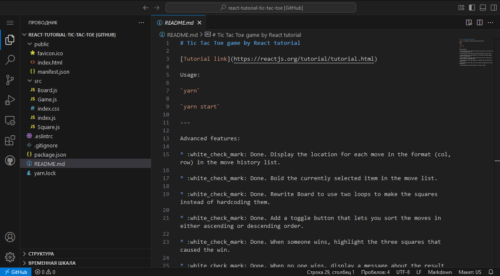
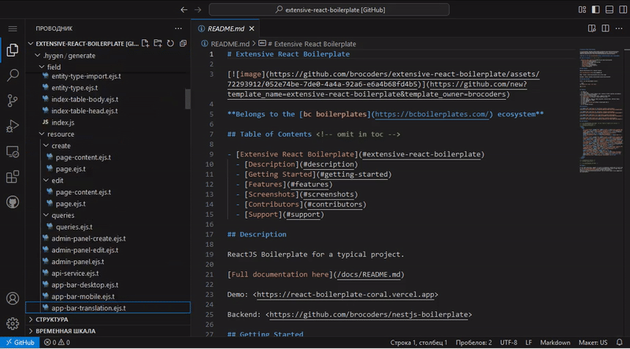
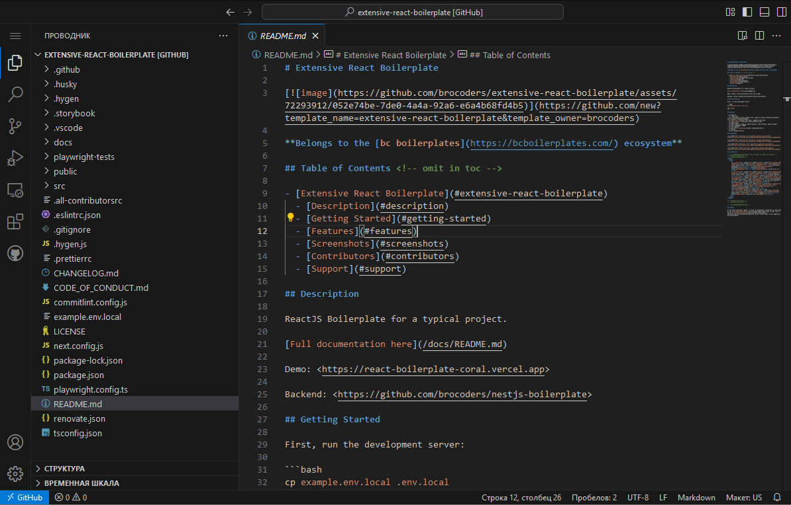

### Зачем фронту подкапотные игры и умение пилотировать боинг

Раньше разбираться с технологиями под капотом требовалось в основном бекендерам, а фронтендерам достаточно было уметь верстать и писать скрипты. Но сегодня сложность фронтенда не уступает сложности бека, а значит и требования к фронтендерам теперь предъявляют как к полноценным инженерам. Но можно ли побороть установку «я фронтендер и меня это не касается»? И нужно ли это делать?

В этой статье Максим Зырянов рассуждает, зачем фронту разбираться в линтерах, деплое и конфигах и можно ли победить ситуацию постоянного перекладывания ответственности.

### Полёт на боинге
Представьте себя в кабине боинга, полётом которого вам предстоит управлять. 
Опытный пилот только что выполнил взлёт, а теперь, глядя на вас, говорит: «ну я пошёл, дальше сам разберешься, вот тебе доки, приходи, если будут вопросы» 

В руках оказывается кипа бумаг с множеством закладок и пара папок: «инструкция к самолёту боинг» и «план полёта»

Вы смотрите на приборную панель, на которой подписан каждый элемент, часть надписей понятна — например, «Запуск двигателя», другая — не очень, например, «Выпустить закрылки»

Кажется, что даже с опытом управления легкомоторной Cessna, управлять боингом у вас скорее всего не получится, несмотря на общность основных механик.

Не удивительно, что ваш самолет начинает крениться. Завидев это, опытный пилот   появляется в кабине, быстро ставит самолет на курс, бурчит «можно ведь было про крен погуглить» и вновь исчезает за дверью, оставляя вас в ещё большем недоумении от происходящего.

***

В реальности сложно себе представить, что управление боингом доверят пилоту кукурузника, но сегодня во фронтенде происходит именно так.

На бекенде ситуация лучше, поскольку порог входа выше. Джуны здесь — вынужденно более опытные пилоты – их пересаживают с условного аэробуса. Но во фронтенде «летает много кукурузников» — то есть, существует множество мелких проектов вроде сайтов-визиток и прочих, где знать, как управлять «боингом» вообще не требуется.

Тем не менее, опытные разработчики, подобно опытному пилоту в истории, ожидают видеть джунов во фронтенде абсолютно готовыми «к управлению боингом» после «полётов на кукурузнике». А заодно считают, что всем непременно нужно уметь управлять именно боингами.

На мой взгляд, это и порождает сопротивление: «я — фронтендер, это меня не касается». Ну и связанное с этим перекладывание ответственности в придачу: нужно настроить деплой, так пусть этим займется DevOps-инженер; тесты пусть пишут тестировщики; валидация пользовательского ввода?  — На бекенде всё равно провалидируют; и т.д. Это, безусловно, вредная позиция, но виноваты в ней мы сами – опытные разработчики. Виноваты не в самом существовании явления, ведь так сложилось исторически. Виноваты в том, что не противоборствуем этому через банальные объяснения своих действий и донесение важности этих навыков и знаний.

***

Наша индустрия полна лжи, она всё больше завлекает новичков проектами уровня “Hello, World!” на новомодных технологиях, чтобы затем закинуть их в океан костыльного легаси кода на старых технологиях в монструозных enterprise проектах. 

К примеру, взгляните на React. Как популярная библиотека, он предлагает понятную документацию с показательно простым туториалом, где каждый шаг комментируется, а на выходе получаем «завершённый» проект, вот такой:

А теперь представьте себя на месте того джуна, которого научили кодить, показали основные механики вроде компонентов и функций, обучили собирать из них интерфейсы, а затем закинули в мир бигтеха, где даже [пустой проект](https://github.com/brocoders/extensive-react-boilerplate) выглядит вот так:

ИЛИ

Множество непонятных конфигов, неизвестных технологий и неписаных правил к коду и структуре. 

Получается, что как только вы освоились с вождением боинга, вдруг выясняется, что существуют другие самолеты, наземные службы, борт персонал, и со всем этим вам как пилоту предстоит работать. 

Знать всё это входит в обязанности пилота, но в отличии от абстрактного джуна он это изучал и практиковал. Во фронтенде же им имеем слишком большой гэп между «кукурузником» и «боингом» – то есть, между знаниями и требованиями. 

***

Опытные разработчики предпочитают игнорировать проблему, а джуны её не осознают, но «спасение утопающих — дело рук самих утопающих». Поэтому давайте разбираться, что должны знать фронтендеры и зачем им это нужно. 

И для начала позаимствую список «Инструменты, о которых нужно иметь представление» из полезной [статьи](https://ifedyukin.ru/blog/all/frontops-trouble/) в тему:

Вебпак, бабел, бандлеры, таск-раннеры (Webpack, Babel, npm-scripts, Gulp) — изучите принцип работы сборщиков и компиляторов JavaScript, TypeScript, CSS, поймите разницу между Rollup и Webpack, изучите возможности npm-scripts и Gulp (хоть его и мало кто использует сейчас).

Форматтеры, линтеры, статические анализаторы (ESlint, Prettier, stylelint, SonarQube) — хватит спорить на ревью о том, где должна стоять запятая, хватит мутировать иммутабельные значения, автоматизируйте проверку этого.

Git и хуки (Husky, lint-staged, Learn Git) — изучите Git, для вас не должны быть проблемой ребейзы, которые заканчиваются конфликтами, используйте хуки для автоматического запуска проверок.

Тестирование (Jest, Mocha, Jasmine, Cypress) — изучите инструменты тестирования, способы их использования, виды тестов.

Дополнительные инструменты для проверок проекта (size-limit, Lighthouse CI) — проверяйте перформанс-метрики вашего проекта прямо на этапе непрерывных интеграций.

CDN, файлы, сервера и прокси (nginx, S3, CloudFront, Cloudinary) — изучите, как файлы могут храниться и раздаваться.

Мониторинг (Amplify, Sentry) — настройте мониторинги, отслеживайте, что происходит с кодом при использовании.

Деплой, сервера, докер (Ansible, Docker, SSH) — изучите подходы к деплою, варианты запуска приложений, научитесь работать с SSH и консолью — это действительно нужный навык.

CI/CD (GitLab CI) — изучите принципы и подходы к организации CI/CD, сделайте полезный пайплайн для своего проекта или оптимизируйте существующий.

При желании список можно продолжить, добавить в него таск-трекеры (Jira, TFS и т.д.), инструменты документирования (Swagger,  jsdocs, Confluence, TechRadar) и много всего другого. Но все эти инструменты в конечном счете решают одну единственную задачу.
Борьба за метрики
Веб-разработчики знают о существовании Lighthouse в Chrome – эта система позволяет оценить производительность приложения, доступность, соответствие лучшим практикам и SEO.

И хотя разработчики не так часто запускают аудит веб-приложений для расчёта этих метрик, они их реально волнуют. Причём настолько, что без их упоминания не обходится, как кажется, ни одна конференция по фронтенду.

Среди наиболее значимых метрик отметим [Speed Index](https://developer.chrome.com/docs/lighthouse/performance/speed-index?hl=ru), т.е. скорость загрузки страницы, которая имеет такие критерии в секундах: 

Если вам не приходилось о них задумываться, то либо ваш проект настолько уникален и популярен, что пользователи готовы мириться с проблемами, либо он наоборот только на пути привлечения первых пользователей. Ведь в остальных случаях вы находитесь в высококонкурентной среде с непрекращающейся борьбой за избалованных клиентов и вынуждены с ними считаться. 

Математика проста: пользователи часто уходят с сайта, если он долго грузится. Вы наверняка и сами так делаете, я — так точно. И если ваш проект приносит условные $100 в год, и растет на 10% каждый месяц, то уход со страницы пары процентов пользователей можно и не заметить. Но если вы контролируете значительный объем рынка, прироста новых пользователей почти не наблюдаете, а зарабатываете миллионы долларов, то уход пары процентов нетерпеливых, не смирившихся с увеличением времени загрузки страницы на одну секунду, становится большой проблемой. 

Поэтому задача каждого в команде разработки состоит не в закрытии очередной таски и не в работе по восемь часов, а в решении глобальной проблемы «как мотивировать пользователя потратить у нас больше денег и оставить его довольным».

Если хотите, то эту же задачу решает и пилот, когда ведёт самолет. Просто так получилось, что с разделением труда мы работаем эффективнее. Однако это не меняет главную задачу, которая часто требует системного подхода. Разработчику важно знать свой продукт, чтобы делать крутые приложения и лучше всего это можно прочувствовать создав приложение с нуля.

### Пример

Мысленно создадим простое веб-приложение для поиска авиабилетов. Данные запрашиваем из стороннего API — никакого бэкенда – никаких разработчиков, на которых можно спихнуть проблемы. Посмотрим, как простое по сути приложение попутно обрастает множеством инструментов.

Приложение вполне можно реализовать на ванильных технологиях, используя чистый HTML и CSS, однако мы быстро огребём от пользователей, которые захотят видеть «ошибки заполнения формы» немедленно, а не после очередной перезагрузки страницы.

Можно прикрутить JS, использовать AJAX для асинхронных запросов к API и бессмертный JQuery для упрощения вывода этого всего в DOM. Но это усложнит разработку нам и даст фору конкурентам.

Решить эту проблему позволяют фреймворки за счет разделения кода на части, но поскольку браузер не поддерживает работу с подобным кодом, нам потребуется собрать части воедино за счёт сборщиков, вроде медленного webpack, или более быстрого vite вместе с технологией HMR.

К тому же, разрастание кода может вновь привести нас к проблеме медленной загрузки страницы, ведь пользователи теперь грузят больше кода. Решим проблему, поручив сборщику разбивать код на части — чанки.

Пользователи могут столкнуться с долгим рендерингом на слабых компьютерах, а пока заставить их купить машину мощнее мы не в силах. Остаётся решать проблему на нашей стороне, например, отдавать пользователю отрендеренную страницу за счет технологий SSR и SSG.

Другие пользователи столкнуться с долгой загрузкой из-за местоположения или сети. И вновь решать проблему предстоит разработчику, но теперь за счет кэширования, сервис-воркеров, CDN и прочих методов.

Впрочем, куда коварнее ситуация, когда пользователи испытывают проблемы с самим сервисом и уходят «без причины» – возникает потребность выявлять отказы и другие сложности. Так внедряются системы логирования, баг-трекеры, а также предпринимаются превентивные меры: тестирование, преднастройка линтеров, ревью и архитектурные решения, вроде разделения данных и использования state-менеджеров, вроде Redux.

Приходится думать и о безопасности: настраивать сервер фронта, использовать валидацию и разграничение доступа. И если поначалу это можно делать вручную, то по мере роста числа пользователей один сервер может не справляться, придётся прибегнуть к виртуализации, контейнеризации с Docker, использованию Kubernetes с полноценной настройкой CI/CD для всего этого. И вновь перед нами встанет задача сбора ошибок, но уже во всём этом зоопарке технологий. Отсюда возникает потребность в телеметрии, платформах observability, дашбордах и прочих системах мониторинга.

И если в заказной разработке ещё можно представить, что после окончания работы о проекте можно забыть, то продуктовые команды вынуждены не только разрабатывать, но и поддерживать системы на протяжении десятилетий. В результате, внедряются многочисленные средства для совместной работы и документирования.

А теперь напомню, что на протяжении всего этого примера вы были единственным «пилотом» этой системы. Так посудите сами, кто ответственный за решение этих проблем?

Прошла эпоха read-only интернета с сайтами вроде Википедии. Разработчики набили шишек с RIA – прообразом современных веб-приложений, смогли договориться о каких-никаких стандартах, научились работать с состояниями, асинхронными запросами и DOM и таки пришли к фреймворкам, которые порешали наши простейшие проблемы и базовые боли. Но разработчики решают куда больше проблем, для которых не существует готового решения – нет автопилота, есть только приборная панель для доступа к множеству механизмов.

### Выводы

Сегодня даже простые веб-приложения нуждаются в обилии инфраструктуры, отчего корень проекта со множеством файлов конфигураций больше напоминает приборную панель того самого боинга. 

При этом наши решения далеки от автопилота, поэтому разработчику необходимо знать как устроена система в целом, уметь решать все эти многочисленные проблемы. Ведь истинная цель разработчика — не в написании кода, а в удовлетворении пользователей.

Поэтому если хотите развиваться в бигтехе, то придётся вставать на инженерный путь и избавляться от взгляда «я фронтендер, меня это не касается». Разработчика на проекте касается всё. 

***
Полезная [статья](https://ifedyukin.ru/blog/all/frontops-trouble/) в продолжение 

