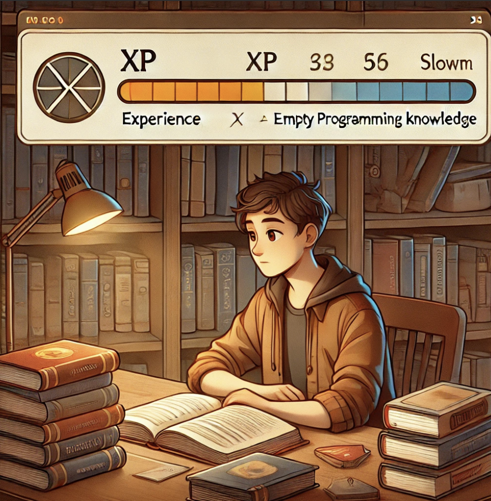
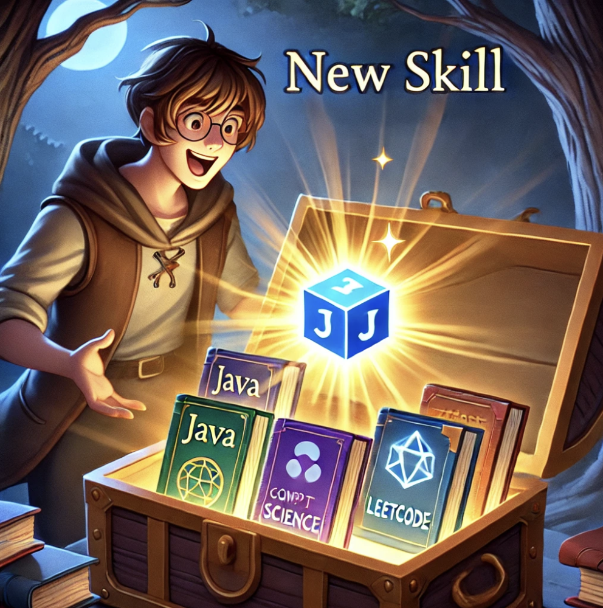
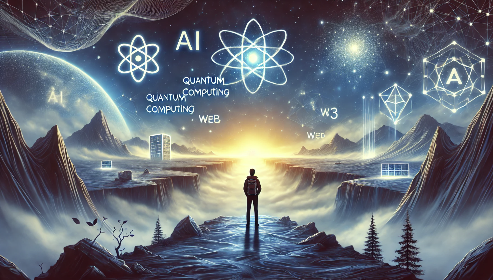

## Игра на высоком уровне: может ли западный вуз стать трамплином к успеху, или зачем оставаться вечным студентом

Какой главный фактор мешает многим из нас стать действительно успешными разработчиками и по-настоящему преуспеть в своей области? Что помогает быстро адаптироваться к новой профессиональной или культурной среде, даже в другой стране?
Игорь Переверзев последние несколько лет работал в IT в европейских компаниях на старших ролях, много учился, преодолевал и кайфовал. Он расскажет про свой опыт и выводы на примере прохождения компьютерной игры,  где каждый новый этап – это уровень, требующий прокачки скиллов.

### Уровень 1. Базовый туториал — Авиационный вуз

Как и в любой RPG, первое, что ты получаешь, – стартовый набор навыков. В моем случае это были дисциплины вроде математики, физики и электроники. Они давали фундамент для более сложных задач. Я поступил в Московский Авиационный институт по общему конкурсу. На выбор повлияли знание физики и увлечение электроникой. На первых курсах мне дали крепкий фундамент по таким дисциплинам, как математика, физика и электроника.

Но специальность, на которой я учился, имела очень отдалённое отношение к Computer Science и Computer Engineering. В идеальном мире это должна была быть комбинация и навыков программирования, и проектирования плат, и программирования микроконтроллеров. Но в итоге нам не смогли дать нормальных знаний ни по компьютерным, ни по инженерным наукам. Предметы хоть и были частично связаны с программированием, сетями, компьютерной безопасностью и алгоритмами, но давали знания поверхностно, без погружения в детали. А ведь это касалось практики инженерной науки, где навыки напрямую влияют на профессиональный рост.

Как в игре, где твой персонаж получает бесполезные начальные умения, мне пришлось искать дополнительные способы прокачки. Я понял: классическое образование само по себе не ведет к успеху – нужен личный интерес и самостоятельная практика.

Где-то на третьем курсе я осознал, что одних учебных лекций и курсов для профессионального успеха – явно недостаточно. Тогда понял, что классическое образование должно идти рука об руку с самообразованием. А фундамент знаний формируется через личный интерес и самостоятельную практику. Но к концу учёбы я всё ещё не понимал, что именно делать дальше и как применить приобретённые знания в реальности.

### Уровень 2. Первые квесты — бессмысленные задачи

На первых порах я работал в одном из исследовательских институтов специалистом по информационным технологиям. Но работа сводилась к выполнению административных задач, и казалось, что вся накопленная теоретическая база не находит применения. Мне не хватало навыков глубже разобраться в основе технологий, с которыми сталкивался. Я не понимал, как выйти за рамки привычных задач, связанных с отчётами и документацией.

Но вот настал мой звёздный час: мне выдали первый серьёзный квест — проанализировать целесообразность использования Java и виртуальной машины для создания сервиса обработки данных с микропроцессоров. Для этого посоветовали обсудить вопрос с коллегами из компании-контрагента и подготовить аргументированный вывод.

Тогда я впервые встретился с высокоуровневыми разработчиками. Они говорили о «прогреве JVM», «фиксе багов в классах». Я понимал слова, но не суть. Это было как слышать диалоги NPC на незнакомом языке – интуитивно догадываешься, но без перевода не разберёшься.
Техлида звали Антон,  очень грамотный и отзывчивый, он всегда глубоко вникал в проблемы и оценивал их влияние на общую картину. Его постоянно приглашали на консультации по техническим вопросам.

Меня поражало, что работа команды включала не только теорию, но настоящее «волшебство» создания — не просто выполнение задач, а создание системы и решение реальных проблем. Это пробудило во мне жаркий интерес. Мне хотелось понять, как устроены программы и алгоритмы, как данные преобразуются в решения, которые работают в реальных условиях. Но допустить меня до этой работы отказывались — не хватало навыков и знаний.

### Уровень 3 и 4. Покупка улучшенного снаряжения — курсы и самообразование

Я решил вложить первые деньги в прокачку: курсы по Java и Computer Science, книги Кормена про алгоритмы и Шилдта о Java. Это было похоже на покупку лучшей экипировки в игре: сразу ощутил разницу в возможностях. Именно в этот период,  я считаю, и началось моё настоящее образование.

Да, университет дал мне фундаментальные знания на первых курсах, но после второго можно было смело переходить на самостоятельное обучение. 

Тогда я сформировал личное правило – The Daily Knowledge Investment Rule. Как в RPG, где ежедневный фарм ресурсов приносит бонусы, я стал ежедневно выделять время на изучение новых технологий. Начав с одного часа в день, дошел до 3-4 часов. Это и стало моим реальным переходом на следующий уровень.

Примерно год я проходил курсы и учился. И, наконец, увидел, как моя настойчивость и труд начали окупаться. Заниматься поздними вечерами после работы было сложно, но самодисциплина дала свои плоды.

На работе я начал осознанно просить код-ревью, задавать вопросы техлиду. Постепенно мне начали доверять больше задач. Это напоминало битву с боссом: ты набираешься опыта, пробуешь разные стратегии, а потом внезапно понимаешь, что стал сильнее.
Особенно повлияло менторство моего старшего брата-программиста. Его ревью моих pet-проектов напоминали разбор матчей в киберспорте – от мельчайших ошибок до общей стратегии. С его помощью я понял: программирование – это не просто код, а архитектура решений.

Так начался мой путь от теоретических знаний к практическому опыту. В конце концов, мне доверили полноценные проекты. К тому времени я заканчивал университет и попросил у коллег задачу для исследования, которую мог бы развить в дипломной работе. Это стало для меня первым шагом в профессиональный мир, где учился создавать что-то ценное, имеющее практическую значимость.

### Уровень 5. Челленджи — первые реальные проекты
В это время я начал серьёзно работать над собой: ранние утренние часы уходили на курсы и чтение книг по специальности. Позже — рабочий день, где мог практиковать свои навыки. Постепенно пришло понимание, что я перерос возможности текущей работы. Я почувствовал, что моя стоимость как специалиста выше той, что готов предложить текущий работодатель. Тогда передо мной встал выбор: либо договариваться о повышении зарплаты, либо искать новые возможности. Мой первый опыт переговоров об условиях труда был непростым, но важным. В конце концов, я решил, что если роста не будет, то мне нужно двигаться дальше. 
Следующие два места работы не только дали мне ценный опыт, но и подтвердили, что мои знания и навыки превосходят ожидания. И что я могу претендовать на более высокую зарплату.

### Уровень 6. Расширение карты — выход за рубеж
Следующим логичным шагом стало искать новые перспективы за границей, чтобы выйти на международный уровень, получить опыт и повысить квалификацию.

Главным препятствием на этом пути стал английский язык. Я понимал, что без хорошего владения английским невозможно работать на глобальном рынке. Поэтому решил вкладывать значительную часть заработка в этот навык. Пошёл на курсы английского. Но не забросил обучение программированию. Теперь осваивал более сложные технические навыки Java по книге [Шилдта](https://github.com/aykononov/java-book-Schildt), разбирал Spring по докладам Евгения Борисова, изучал Java Persistence with Hibernate, вникал в SQL по работам [Alan Beaulieu](https://www.google.pl/search?hl=pl&tbo=p&tbm=bks&q=inauthor:%22Alan+Beaulieu%22). А ещё слушал лекции ребят из российского Oracle и их выступления на Jpoint и Joker. Были даже были первые попытки прочитать про Java Memory Model and Thread Specification. Скиллы по кодированию улучшал в HackerRank и Codility — Leetcode тогда ещё не был популярным. А ещё делал pet-проекты — много. Это всё длилось в течение трёх после университета.

И эти инвестиции в развитие окупились, стали генератором последующих изменений — помогли мне не только поднять стоимость на рынке труда, но и дали уверенность, что я смогу адаптироваться и успешно работать в другой стране. Так у меня появилась амбиции. Голова стала работать лучше. Поверьте, я не был выдающимся олимпиадником по программированию или математике, и встречал намного более талантливых программистов, чем я. Брал другим: постоянно учился.

### Уровень 7. Дополнительный уровень — глубже в Computer Science

Самообразование стало неотъемлемой частью жизни, но у этого есть и обратная сторона — синдром вечного студента. Постоянное стремление к новым знаниям и навыкам рано или поздно приводит к необходимости выбрать определённое направление, на котором можно сфокусироваться. В тот период я работал в американском стартапе. Столкнулся с интересной задачей: оптимизация стоимости трафика между различными облачными провайдерами. Решение, которое я предложил, было основано на графах, и в этот момент я действительно осознал, насколько полезны мои навыки в Computer Science.

Я стал изучать, как другие специалисты решают похожие задачи. Так наткнулся на проекты студентов лаборатории Стэнфорда, где они использовали методы обучения с подкреплением — Reinforcement Learning (RL) для оптимизации распределения ресурсов. RL — это подход, при котором система «учится» принимать решения, получая награды за успешные действия. Это делает подход особенно полезным для сложных задач, требующих оптимальных решений. RL строится на отложенном во времени вознаграждении: агент действует в среде, получает обратную связь и накапливает опыт, чтобы с каждым шагом приближаться к лучшему решению.

Интересно что и наше самообразование — это своего рода процесс обучения с подкреплением. Мы тратим время, силы, ресурсы на изучение новых технологий, не сразу видя результат. Наше вознаграждение приходит спустя месяцы или даже годы в виде профессионального роста, улучшения навыков или долгожданного карьерного скачка. Этот процесс учит нас терпению, дисциплине и способности видеть долгосрочную перспективу, даже когда текущие усилия кажутся изматывающими.

**Первые боссы: личные пределы и отложенный результат**

Самообразование важно для развития, но у всего есть пределы. Как бы вы ни старались изучать новое самостоятельно, всегда существует точка, где нужен внешний стимул или структурированная поддержка, чтобы выйти на следующий уровень. Именно поэтому классическое образование, с наставниками,  коммуникациями, методологией и обменом знаний с другими, до сих пор сохраняет актуальность.

Рассмотрим, один из популярных методов RL — Deep Q-Networks (DQN). Этот подход позволяет машине учиться через накопление опыта: анализируя ошибки, она корректирует свои действия, чтобы в будущем достигать максимального результата. Аналогично, мы, занимаясь самообразованием, постоянно корректируем свой путь: выбираем подходящие курсы, изучаем более сложные темы, чтобы в итоге достичь уровня, где наши знания становятся востребованными. 

Меня настолько вдохновил этот метод и его применение в Стэнфорде, что я начал с просмотра бесплатных лекций на YouTube, чтобы понять основы. Они дали мне базовое понимание некоторых концепций, но вскоре я понял, что такой формат не даёт возможности в полной мере погрузиться в материал, задать вопросы преподавателям и обсудить идеи с другими студентами. Я почувствовал, что мне не хватает общения с единомышленниками, которые также заинтересованы в глубоких исследованиях. А возможность выполнять домашние задания, основанные на актуальных исследованиях, сделала бы процесс обучения продуктивнее.

Самообразование давало результат, но узнав про DL и DRL, пришло осознание, что я обучался по алгоритму, как машина. И если для машин такой способ — норма, то для человека… имеет массу подводных камней.

### Уровень 8. Качаем скиллы — подготовка к Стэнфорду

И вот во мне крепнет мысль: почему бы не стать студентом снова? 
Это казалось немного авантюрным решением, но мысль об официальном обучении в Стэнфорде, где каждый день предоставляется доступ к исследованиям мирового уровня и лабораторным проектам, а коллеги и преподаватели — ведущие специалисты в области Reinforcement Learning и Graph Neural Networks, манила меня.

Во мне созрело и пустило корни решение поступить в Стэнфорд и получить graduate-сертификат по специализации AI. Стоимость обучения на программах варьируется от $25 000 до $45 000 в год. Студенты могут рассчитывать на финансовую помощь, включая стипендии и гранты, предоставляемые как самим университетом, так и внешними организациями.
Я начал готовиться: окончил на Coursera специализации по ML/DL от DeepLearning.ai + Math от Imperial College London + Python от Stepik + прослушал лекции ШАД (Воронцова).

**Рейд-босс. Вечный студент**

Постоянное самообразование затягивает: хочется изучить ещё и ещё, но в какой-то момент понимаешь – главное не знать, а уметь применять. Это как в игре, где ты прокачал все возможные навыки, но так и не пошёл на финальную битву. Учёба ради учёбы, без постановки чёткой цели, может создать иллюзию прогресса, в то время как вы стоите на месте.

### Уровень 9. Развязка игры — Стэнфорд

В Стэнфорде нашёл подходящие курсы на post graduate программе по RL и GNN, которые удовлетворяли моим потребностям и интересам.

Для глубокого понимания Reinforcement Learning (RL), Deep Reinforcement Learning и Graph Neural Networks (GNN) в университете рекомендуется предварительно пройти курсы CS221([Artificial Intelligence: Principles and Techniques](https://stanford-cs221.github.io/spring2024/)) или CS229([Machine Learning](https://cs229.stanford.edu/)). Каждый из них готовит к освоению ML/DL дисциплин, но с разным уклоном: CS221 делает акцент на программировании и практическом применении, тогда как CS229 фокусируется на математических основах и теоретическом анализе. Выбор между курсами зависит от предпочтений студента, но курсы — обязательные.

Я выбрал CS221, где упор был на общий ML, RL, графы и CSP. Мы изучали концепции на базовом уровне, разбирали, что такое агенты и среда. 

Вот несколько ключевых и широко используемых алгоритмов RL, которые мы изучали:

**Q-Learning** — один из самых известных и простых алгоритмов обучения с подкреплением. Работает на основе табличного представления, где агент постепенно изучает значение каждого действия в каждом состоянии (так называемые Q-значения) накапливая опыт. Идея Q-Learning в том, чтобы обновлять оценки ценности действий, основываясь на разнице между ожидаемой и фактически полученной наградами. Этот алгоритм — основа для многих более сложных алгоритмов, но сам по себе эффективен только для небольших и дискретных пространств состояний.

**Deep Q-Networks (DQN)** — улучшенный Q-Learning с использованием нейронных сетей для приближения Q-функции в ситуациях, где пространства состояний слишком велики для хранения всех значений в таблице. DQN создали исследователи из DeepMind и успешно применили в задачах, связанных с играми. Например, Atari, где агент учится на опыте, анализируя изображение экрана. DQN также использует два ключевых улучшения: Replay Buffer (буфер повторного воспроизведения), чтобы агент мог обучаться на прошедшем опыте, и Target Network (целевая сеть) для стабилизации обучения.

**Policy Gradient Methods** — это класс алгоритмов, которые напрямую оптимизируют политику, то есть функцию, определяющую вероятность выбора действий в каждом состоянии. Вместо обучения Q-функции, как в Q-Learning, агент учится корректировать свою стратегию, чтобы максимизировать ожидаемую награду.

**Actor-Critic Methods** — алгоритмы, которые совмещают преимущества Q-функций и градиентных методов. Они используют две компоненты: Actor (политика, которая выбирает действия) и Critic (функция ценности, оценивающая выбранные действия). Actor-Critic методы позволяют более эффективно обучать агента, корректируя его действия с помощью Critic, который прогнозирует долгосрочную награду. Популярный вариант этого подхода — Advantage Actor-Critic (A2C), где Critic оценивает преимущество (advantage) действия над средним уровнем.

**Proximal Policy Optimization (PPO)** — алгоритм, разработанный OpenAI, считается одним из самых эффективных и устойчивых методов для обучения сложных моделей. Он улучшает Policy Gradient Methods за счёт ограничения размера шага, который может быть сделан при обновлении параметров политики, чтобы избежать слишком резких изменений. Это делает PPO стабильнее и более эффективным для задач с большим количеством состояний и действий, а также позволяет обучать агентов в сложных симуляциях.

**Финальный босс: экзамен CS221**

Моя первая попытка сдачи экзамена CS221 провалилась. Это было как встретить босса без прокачки – больно, обидно, но полезно. Многие задачи на экзамене требовали не только теоретических знаний, но и практического применения, которое на тот момент оставляло желать лучшего. Ошибка была в том, что я пытался просто выучить материал, не вкладывая достаточно времени в решение практических задач. Этот провал стал для меня сигналом, что обучение требует не только времени и усилий, но и осознанного подхода.

Чтобы пересдать, я, изменил подход: больше практики, работа с командой, активное участие в обсуждениях на курсах.

В Стэнфорде cтуденты активно используют платформы вроде Discord и форумы курса, где оживлённо обсуждают задания, идеи, обмениваются опытом по проектам. Эти онлайн-платформы становятся виртуальными классными комнатами, где студенты могут задавать вопросы, делиться полезными материалами и получать помощь от преподавателей и ассистентов.
Стэнфорд научил меня ключевой вещи – сила в коммуникации. Как в MMO, где соло-прокачка ограничена, а в пати ты быстрее проходишь сложные рейды, в реальном мире команда и связи значат не меньше, чем знания.

Именно в построении профессиональных и академических связей заключается одна из главных ценностей университетского обучения. Университет создаёт уникальные условия: здесь можно вживую обсуждать идеи с коллегами, проводить мозговые штурмы и вместе решать сложные задачи, которые было бы крайне сложно проработать в одиночку. 
Понимая важность очного взаимодействия и практических занятий, я решил отправиться в Калифорнию, чтобы продолжить обучение в кампусе Стэнфорда.

### Игра продолжается

С появлением мощных языковых моделей и технологий возникает вопрос: нужно ли углубленно заниматься образованием или достаточно знать всё поверхностно,  при условии, что ИИ уже решает многие задачи?

Как человек с богатым опытом в IT, я до сих пор размышляю: какие знания будут востребованы завтра? Стоит ли инвестировать время и деньги в курсы и сертификаты, или это формальность?

Моё твёрдое убеждение, что образование — это база. У него нет срока давности. Оно может служить гарантом стабильности, хорошей работы и роста. 

Среди множества привычек и стратегий, которые я выработал и внедрил в свою жизнь за последние годы, ключевую роль сыграл The Daily Knowledge Investment Rule. Каждый день, первые 3–4 часа рабочего времени, я посвящаю самообразованию в тех областях, которые считаю перспективными. 

**Босс 4. Спад мотивации**

Самообразование — это, как ни парадоксально, не только приобретение знаний, но и своего рода испытание. Каждый день находить в себе мотивацию к изучению чего-то нового — задача не из лёгких. Наш мозг склонен избегать долгосрочных целей, ведь результат — это не тот плод, который можно увидеть через день или неделю; это годы упорной работы. Бывают моменты, когда бытовые задачи или даже эмоциональное выгорание мешают на пути, и в такие периоды особенно важно помнить: это «игра вдолгую». Чтобы поддерживать энергию и дисциплину, мне пришлось разработать для себя чёткий план.

Чрезмерное увлечение самообразованием может привести и к выгоранию. Когда каждый день наполнен только обучением и работой, без времени на отдых и восстановление, теряется мотивация и радость от самого процесса. Баланс между учёбой, практикой и отдыхом необходим, чтобы поддерживать продуктивность в долгосрочной перспективе. Учиться без плана, без осознания, зачем это нужно, и без реальных точек проверки знаний — это путь к потере времени и ресурсов.

**Босс 5. Повелитель хаоса**

Распространённая ошибка — это хаотичное обучение. Многие пытаются изучить сразу всё, что кажется актуальным: от новых языков программирования до методик управления проектами. В результате вместо глубоких знаний в одной области они получают поверхностное понимание множества тем, что мешает стать экспертом. Важно осознавать свои цели и приоритеты, чтобы не тратить время и усилия впустую. Например, если ваша цель — разработка сложных программных систем, возможно, стоит отложить изучение курсов по финансовому менеджменту или дизайну интерфейсов.

Чтобы избежать этих подводных камней, важно помнить: самообразование должно быть средством, а не самоцелью. Оно должно дополнять вашу практическую деятельность, быть направленным на решение реальных задач. Учитесь не только для того, чтобы знать больше, но чтобы применять знания в карьере. 

Для достижения больших целей недостаточно лишь знаний и навыков, полученных в одиночку. Ключевым аспектом становится умение коммуницировать и развивать в себе soft skills. Сегодня я убежден, что эти навыки не менее важны, а в некоторых случаях и более значимы. Эффективное общение, навыки сотрудничества и умение строить отношения — качества, которые позволяют соблюсти баланс и стать по-настоящему успешным.

### Наставление путникам

**Мой совет тем, кто решит последовать моим путём:** ищите возможности делиться тем, что вы узнали. Один из лучших способов закрепить и углубить свои знания — стать ментором, передавая опыт другим, или участвовать в совместных проектах, особенно в open-source. Работая с коллегами, вы не только помогаете команде, но и открываете для себя новые перспективы и точки роста.

Также не забывайте о силе общения и сети профессиональных контактов. Выступления на конференциях, создание собственных проектов, проведение обучающих сессий для коллег — всё это помогает укрепить репутацию и расширить профессиональные связи. 

Мой ответ на вопрос в начале статьи «Какие знания будут востребованы в ближайшие годы?» — гибкость. Не стоит страшиться изменений! Хуже, если вы перестанете обучаться навыкам и расти как специалист.

