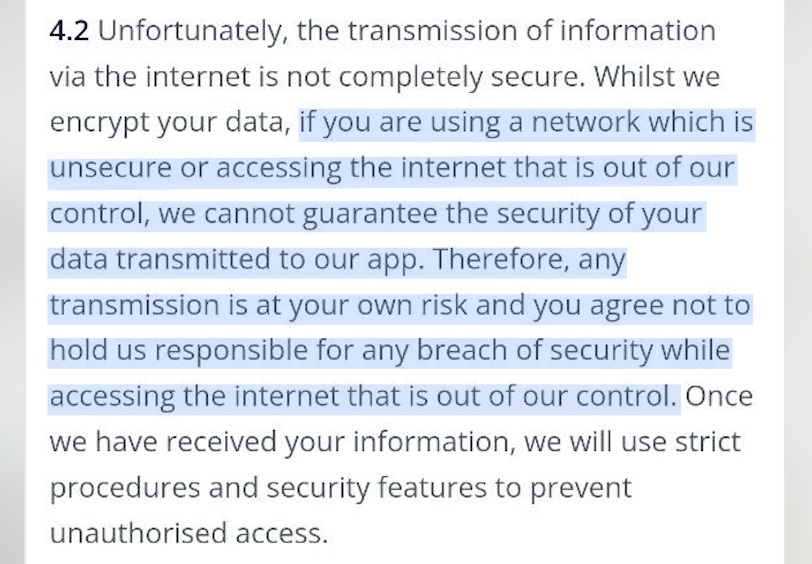
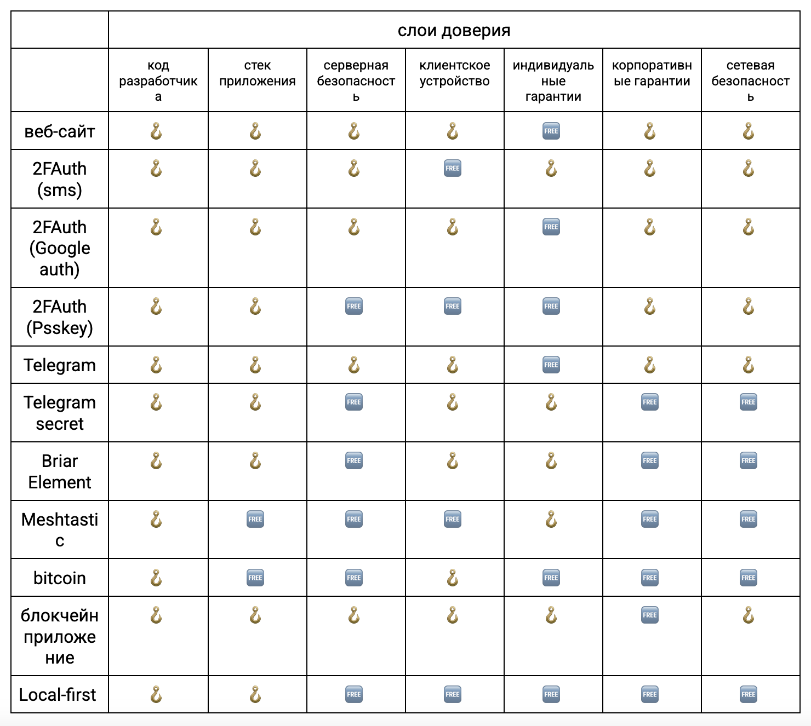
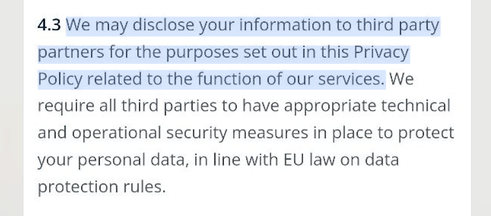
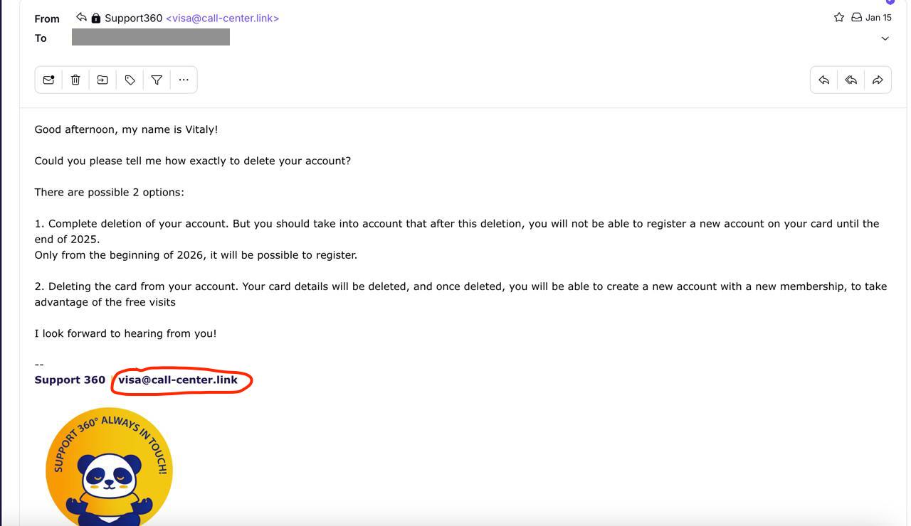
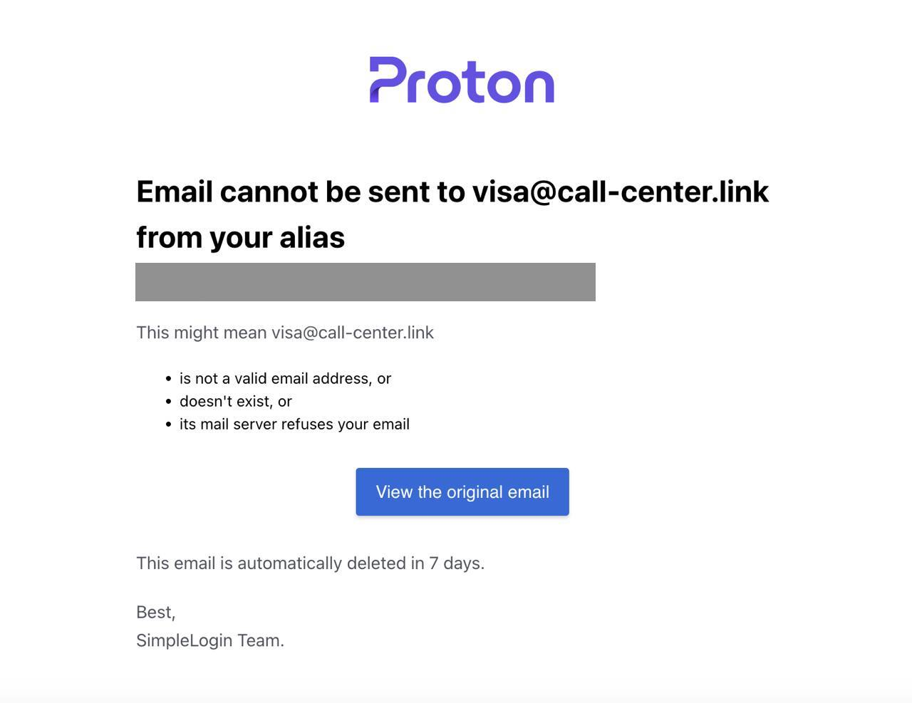
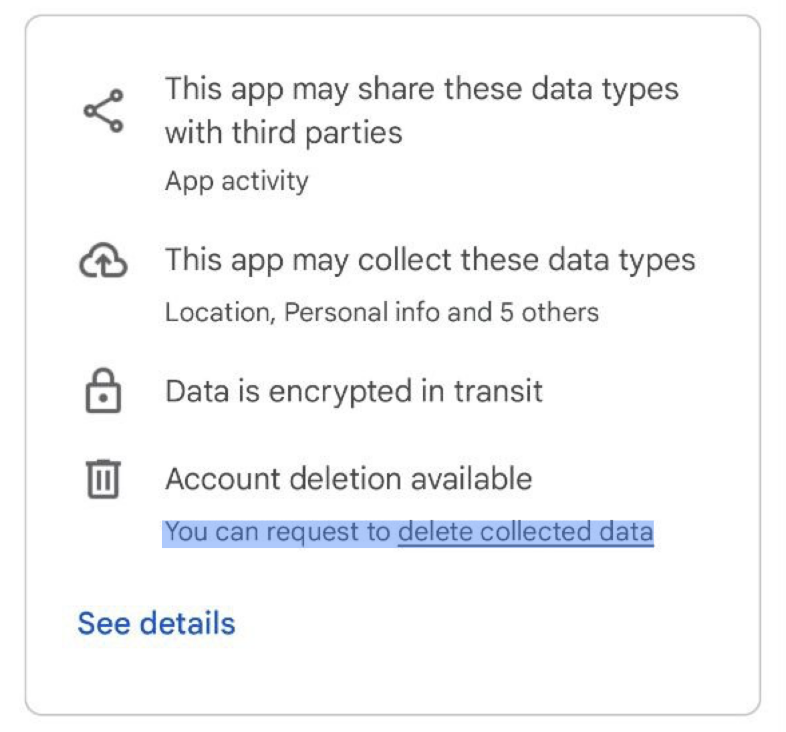
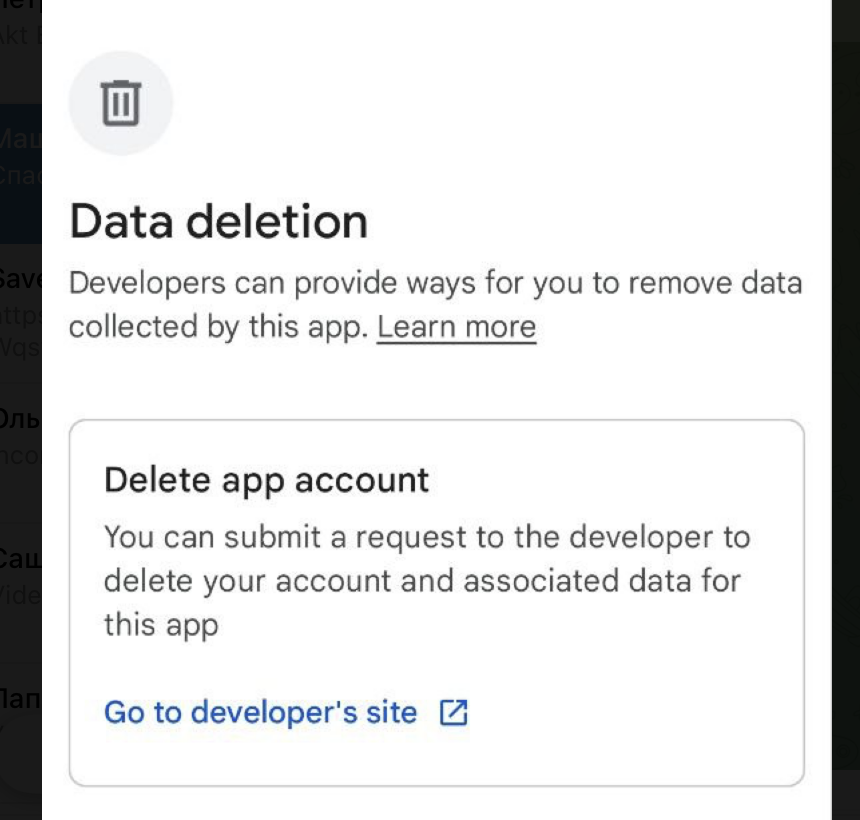

## Безопасность глазами продакта. Или почему мы говорим с пользователями на разных языках

Аркадий Кац работает продактом в латвийском стартапе BuckitUp, который занимается Local First data management и делает edge-девайс платформу и программное обеспечение для работы с данными, без опоры на централизованную инфраструктуру. 

Аркадий расскажет, как описывать безопасность продукта в мире пользователя. Часто ценность продукта и то, что доносит до аудитории описания и рекламные кампании — совершенно разные вещи. Эта статья для тех, кто тоже разрабатывает приложения, пытается их позиционировать и хочет понять, как нам всем между собой договариваться, чтобы не создавать ложных ожиданий.

### Проблема: пользователи VS инженеры

Безопасность — это сквозная тема моего проекта. В ходе обсуждений с командой у меня возникла идея задать стандарт, как обсуждать безопасность для пользователя с позиции продакта. Ведь моя цель — донести информацию об особенностях продукта понятно и при этом корректно.

В проекте у нас достаточно строгая терминология, которая описывает инженерные решения, но она настолько специфическая, что пользователь на уровне приложения не может следить за тем, что она значит. Мне важно донести ценность нашего продукта с точки зрения безопасности. Значит, нужна терминология, которая используется при описании продукта в маркетинге.

Но часто транслируемый маркетологами месседж совершенно не соответствует тому, что под капотом. Причём порой транслируются даже совершенно противоположные вещи, что очень странно. То есть не получается связки между тем, что в маркетинге сообщается о безопасности и тем, что в конечном итоге получает пользователь. Пользователь может получить и хороший продукт, например end-to-end зашифрованный канал коммуникации, но описание будет  плохо согласовано с тем, что происходит в реальности. В результате, пользователь может, например, постоянно терять ключи от своего канала, что быстро его скомпрометирует. Я подумал, что хорошо было бы хотя бы попробовать задать стандарт того, как описывать безопасность для пользователей в документах. 

### Базовые понятия безопасности и проблемы вокруг них
**Шифрование.** Когда говорят о зашифрованных коммуникациях, нужно конкретнее описывать, что именно зашифровано, чем и как, где хранятся ключи шифрования. Это известная проблема: в Телеграм есть секретные чаты и не секретные чаты, архитектура того, как они устроены, отличается. Ключевые различия именно в этом. Где хранятся ключи? Почему в телеграмме секретный чат может быть только на одном девайсе, а на втором его не будет? Всё это непонятно пользователю. Хорошо было бы, чтобы человек не уповал на симметричное или асимметричное шифрование, не понимая разницы между ними. Нужно описывать, где конкретно клиентское приложение хранит ключи, и где ещё, кроме клиента, они могут храниться, если у них есть несколько копий, бэкап и так далее.

**Восстановление доступа.** Вторая проблема с ключами совершенно фундаментальная: что будет, если ключи потеряются? В зависимости от того, где они хранятся, ещё нужно обезопасить доступ к ним, (тоже зашифровать, а где хранить эти ключи?), обеспечить восстановление и так далее. Значит, нужно всю эту цепочку ключей тоже как-то представить и описать. 

**Аутентичность сервисов.** Ещё один вопрос, который важно раскрыть: что обеспечивает аутентичность сервисов, к которым обращается пользователь. Например, сертификат на сайте, связанный с доменным именем, —почему он важен? Ведь когда мы передаём какие-то данные через интерфейс, то доверяем тому, что интерфейс обещает нам делать

**Подтверждение.** Человек может получать сообщение от того, кого считает своим контактом. Но люди могут представляться чужими именами, подменять аккаунты. Откуда вообще берётся информация о том, кто мой контакт? По номеру, фото, имени. Какая может быть в этом направлении выполнена атака? Есть address poisoning, можно просто представиться в мессенджере  чужим именем, загрузить чужую аватарку.  Например, секретный чат в телеграмме. Если я начал секретный чат с вами, то он хранится только на наших девайсах, что классно. Но если контакт осуществляется посредством интернета, то нет никакой уверенности, что я именно с вами начал этот чат, и что между нами не затесался кто-то третий. Это снова довольно непонятная для пользователя проблема.

#### Man in the middle

Канал между собеседниками может быть end-to-end зашифрован. Но предположим, что собеседников не двое а трое, и один из них (Ева) находится между Алисой и Бобом. Она автоматически получает, расшифровывает и пересылает сообщения от каждого из них, т.е. сообщения от Алисы Бобу приходят Еве, а она уже пересылает их Бобу. Такая ситуация с точки зрения Алисы и Боба не отличима от обычного диалога, где никакой Евы нет. 

Единственный способ исключить существование Евы, которая подслушивает, а, может быть, и редактирует сообщения — это обменяться хотя бы одним сообщением по другому каналу связи, который гарантированно не скомпрометирован, например, при встрече. Телеграм решает эту задачу косвенно — во время звонка он показывает на экране четыре пиктограммы, соответствующие хешу секретного ключа, которым зашифрованы сообщения. Если выполняется атака man in the middle то ключи шифрования которые получают собеседники на двух сторонах канала будут разными, их хеши не совпадут и пиктограммы будут отличаться. Этот метод надёжен при условии что:
1. Собеседники проверят, что видят одинаковые иконки;
2. Ева не обладает технологией, способной на лету генерировать голосовые сообщения, идентичные речи реальных собеседников, и подменять ими участки разговора об этих пиктограммах.

### Зачем пользователям понимать безопасность и как о ней говорить 
Важно отдавать себе отчёт, чему мы доверяем и сообщать об этом пользователю. То есть, сообщая, что наше приложение надёжно защищено, мы даём важную информацию для пользователей. Но что, если какая-то библиотека из стека нашего приложения или сервера, от которого оно зависит, окажется скомпрометирована ([пример 1](https://www.truesec.com/hub/blog/uaparser-js-npm-package-supply-chain-attack-impact-and-response),  [пример 2](https://ru.tradingview.com/news/forklog:a75cbe43a67b8:0/))  Или что если кого-то из команды, имеющего доступ к администрированию инфраструктуры, атакуют злоумышленники? Тогда приложение перестанет быть безопасным — на такие кейсы наши гарантии не распространяются и распространяться не могут.

Важно понимать, что вслед за нами и пользователю приходится доверять провайдерам  всей нижележащей инфраструктуры — всем-всем, кто участвует в цепочке продакшна вплоть до корневых сертификатов НУЦ. Об этом классно было бы сообщать «на берегу» а не только в пользовательских соглашениях. 

#### Двухфакторная аутентификация
У кода, который исполняет любое приложение, есть источник. Это место, в котором этот код записан и откуда он загружается в операционную систему устройства. Задачи, выполняемые кодом, обычно описаны в интерфейсе приложения. При этом только доверие к разработчику системы гарантирует, что описание соответствует реальному поведению программы. Например, отправляя фотографию в запрещённую соцсеть вы видите её у себя в ленте, и делаете вывод, что она там появилась. Но этого никто не гарантирует — вполне возможно, что ваши публикации в социальной сети видите только вы, а в действительности они не добавлялись в ленту подписчиков и попали в теневой бан. В этом случае вас обманывает разработчик приложения.

Ситуация может быть ещё хуже — вы видите интерфейс одного приложения, а выполняется у него под капотом совершенно другое. Например, кто-то проник в ваш телефон и установил на него шпионскую программу, копирующую поведение Телеграма. Настоящий Телеграм удалён, а на его месте появился «Антиграм» с такой же иконкой. Теперь все отправляемые сообщения попадут злоумышленникам, которые, в свою очередь, могут пересылать их от вашего имени  вашим контактам — это снова атака man in the middle. 

Гарантировать защиту от таких атак позволяют альтернативные методы коммуникации — **двухфакторная авторизация и уведомления о доступе в учётную запись.** Если у вас работают эти методы защиты, расскажите о них доступно.

#### Атака на сертификат
Ещё одним способом подтверждения аутентичности приложения являются сертификаты. Самый популярный пример сертификатов — SSL. Для вэб-приложений описанная выше атака наиболее актуальна — любой сайт выполняет в браузере код, который сам же туда и загружает. Например, Google выполняет программу поиска в интернете по ключевым словам, но в любой момент он может изменить свой код. Изменить так, чтобы вместо поиска в интернете в ответ на ключевые слова выдавать контекстную рекламу. Спойлер: Google долгое время менял свой код, чтобы бороться с эксплуатацией алгоритмов, принуждающих его показывать именно рекламу вместо релевантного контента. Боролся до тех пор, пока не смирился с этим и не начал показывать рекламу сам.

У пользователя нет никакой возможности убедиться, что хозяин сайта загружает ему в браузер именно ту программу, которую обещает на сайте. Тут всё снова строится на доверии. Но благодаря сертификатам мы можем гарантировать, что доверяем кому-то конкретному а не всем подряд. Мошенники наверняка попытались бы выдать себя за хозяев того самого сайта, скопировав оригинальное внешнее содержание страницы. Мошенники могут использовать программу, которая вместо покупок в знакомом интернет-магазине или чтения социальной сети, украдёт ваши деньги, данные или учётные записи. 

SSL-сертификат — уникальная информация, известная только владельцу сайта. Сертификат может доказать это, не раскрывая самой информации. При этом клиент должен уметь идентифицировать и проверять такой сертификат, поэтому все браузеры хранят списки известных сертификатов. Эти списки публичны. Но если у владельца сайта украден сам секретный ключ от SSL сертификата, то сайт легко может оказаться не тем, за кого себя выдаёт. 

Кажется, что иметь мобильное приложение надёжнее, потому что его код хранится непосредственно на устройстве. Но мобильное приложение тоже может и чаще всего должно регулярно обновляться. Аутентичность кода для обновлений гарантируется Play Market или AppStore. 

Может показаться, что безопаснее не обновлять приложения, которые нормально работают и это могло бы быть верно, если бы не обновлялись все остальные программы в операционной системе.  Под капотом нашего приложения или другого компонента операционной системы часто обнаруживаются уязвимости нулевого дня — возможности для взлома, о которых ранее не было ничего известно. В любой момент такая уязвимость может стать известна разработчикам и те обычно сразу выкатывают обновление, устраняющее её. Без этого обновления приложение по умолчанию не безопасно. Поэтому обновляться нужно, а загружать приложения стоит из проверенных источников. Разработчикам важно доносить, что именно в вопросах безопасности это обновление даст.

### Объекты доверия и щепотка философии

Ключевой аспект обеспечения безопасности — определить, кто или что является объектом доверия. Для этого нужно разделить знания, которым мы доверяем, на две категории: **объективные и субъективные.**

**Объективные знания** — это то, как вещи работают на самом деле. Например, устройство технологии или законы физики. Они существуют независимо от нашего мнения, но чтобы узнать их, мы должны изучать их сами.

**Субъективные знания** связаны с личным восприятием. Это зависит не от фактов, а от того, как человек или группа людей относятся к этим фактам. Однако здесь есть нюанс: даже объективные знания не существуют сами по себе — их всегда передаёт человек, который их открыл или объяснил.

Объективные знания можно получить только через собственное исследование (do your own research). Например, вы лично изучаете, как работает хеш-функция.
Субъективные знания можно передавать и обсуждать. Например, инженер рассказывает вам о своей работе, и вы ему доверяете.

Но нельзя получить объективные сразу, без априорных, предварительных субъективных знаний. Вы учитесь на опыте других людей, поэтому изначально любое знание приходит через субъективное и, чаще всего, чужое мнение. Это приводит к ошибке: если знания всегда передаются через чью-то точку зрения, значит, все они субъективны. Это неверно.
Некоторые люди из-за такого подхода начинают думать, что объективные знания невозможны, а истина относительна. Это приводит к нигилизму: например, они считают, что защищать данные бессмысленно, потому что «все уже давно известно» или «никому они не нужны». Но такой взгляд вреден.

Чтобы понять истину, нужно разделить объективное и субъективное. Например:
Объективное знание: хеш-функция работает в одну сторону. Это факт, который можно проверить. Или код системы, опубликованный в открытом доступе.
Субъективное знание: обещания администратора, что данные не хранятся, или объяснения инженера, которые мы принимаем на веру.

Как работать со знаниями
1. Определяйте субъекта. Если знание субъективно, информируйте пользователя о том, кто или что является объектом доверия в вашей системе, проследите, на что именно распространяется это доверие. Если источник — конкретный человек, компания или организация, например, администратор сервиса, то какова его репутация, чему он сам доверяет.
2. Проверяйте доверие. Прослеживайте репутацию источников, чтобы выстроить цепочку доверия и абстрагировать их в характерные классы. Например, «server side security”, “communication protocol» или «consensus security».
3. Систематизируйте знания. Сравнивайте субъективные утверждения с объективными фактами. Например, если сервис говорит, что использует определенную архитектуру, демонстрируйте это на примере известной аналогии с другими сервисами, показывайте что у вас общего, а что отличается в контексте других популярных продуктов.

Объединяя объективные и субъективные знания, мы можем лучше понимать технологии и выстраивать доверие. Это помогает объективно оценивать безопасность. Наша задача — создать систему, где каждый элемент цепочки доверия прозрачен, а субъекты имеют чёткую репутацию.

Эта табличка не претендует на строгость. В зависимости от того, как мы формулируем для себя модель безопасности для каждого из пунктов, значения в ней могут варьироваться. Но концептуализировать различия в архитектуре разных приложений помогает сопоставление между ними.

### Права пользователей
А что же с правами пользователей? Представление о правах на сегодняшний день гарантируется только предельно бюрократизированными инструментами вроде GDPR и других аналогичных законов. Эти законы непрерывно видоизменяются и усложняются, делая знание о правах и обязанностях участников цифровых отношений даже не привилегией, а проклятьем узкой категории профессионалов. Впрочем, положение было бы ещё плачевнее без регулирования. Ведь, в конце концов, такие принципы, как понятность, прозрачность и доходчивость формулировок в пользовательских соглашения продиктованы рынку именно законодательными документами. Благодаря этому мы в состоянии прочесть и понять регулярные письма от сервисов с обновлениями пользовательских соглашений. При этом каждый сервис волен формулировать принципы пользовательских соглашений с предельной субъективностью.

Например, нам предлагают одним кликом согласиться на использование какого-нибудь приложения, обещающего бесплатный доступ в VIP-зоны аэропорта. Для этого требуются всего лишь данные вашей кредитной карты. Тут же нам обещают, что никакой оплаты не взимается, нужно только подтвердить наличие карты, номер телефона, email, поставить пару галочек и бесплатная выпивка с сосисками — у вас в кармане. Никакого обмана или мошенничества в этом приложении нет, но есть пара нюансов.

1. Скорее всего, мы ошибочно представляем, кто именно оказывает нам услуги. Можно решить, что приложение принадлежит аэропорту, сети VIP-зон или кредитной компании. В реальности же мы имеем дело с отдельной компанией, которая имеет запутанную систему договорённостей с аэропортами, эмитентами кредитных карт, возможно и с банком, обслуживающим вашу карту, а, главное, с маркетинговыми агентствами и брокерами данных. О чём эти договорённости?

2. Можно подумать, что функция приложения — мониторинг посетителей или сбор статистики о посещаемости аэропортов, но это не верно. Под капотом главная задача приложения — получить ваше разрешение на сбор и использование данных. То есть вы предоставляете возможность мониторинга вашей финансовой активности всего за пару сосисок и глоток виски. 

3. Законодательно вы имеете право удалить свою учётную запись и данные из системы, и, может быть, даже знаете об этом из популярных статей на Хабре или из ремарки в Play Store. Но вы не узнаете об этом из самого приложения. Более того, если вы найдёте в нём тщательно завуалированную возможность связаться с поддержкой для удаления учётной записи, то скоро выяснится, что обращение направлено вовсе не в ту инстанцию, которая несёт ответственность за ваши персональные данные, а совершенно в другую компанию. 

4. После отправки обращения вы получите вежливый ответ с уточняющими вопросами. Вам предложат выбрать из разных вариантов того, как именно можно удалить персональные данные. Но письмо это придёт с адреса, на который нельзя ответить, — вот такая ещё одна нестыковка. 

5. И, наконец, самое досадное: обычный пользователь, столкнувшись со всем вышеперечисленным без остервенелой рефлексии и скрупулёзной внимательности, легко убедит себя, что это именно он запутался и наделал ошибок, был невнимателен, устанавливая приложение. А, следовательно, он беспомощен, последствия использования приложения как стихия захлестнут его, они неподконтрольны человеческой воле и в то же самое время настолько массовые, что беспокоиться о них следует не ему самому, а департаментам и министерствам. Ведь маленькому человеку такое попросту не под силу.

Ещё раз отмечу, что ни одно из описанных событий не является мошенническим или даже откровенно враждебным по отношению к пользователю. Ведь всегда можно найти интерпретацию, в которой выбранный путь понимается авторами как забота о человеке и попытка упростить ему жизнь, принять за него трудные решения и нести за это ответственность. В общем, чуть ли не подвиг, а никакая не эксплуатация — скажут нам на другом конце провода,, если только мы когда нибудь доберёмся до другого конца..

Зато с точки зрения знаний о защите прав, в этом кейсе границы личной свободы пользователя объективно передвинуты глубоко внутрь его территории. Принятие такого положения дел не исчерпывается обязательной галочкой в чекбоксе «с условиями согласен».
Посмотрим ещё раз на перечисленные пять категорий заблуждений (список едва ли можно считать исчерпывающим), с которыми типичный пользователь сталкивается в процессе эволюционной борьбы за субъектность. Пользователя следует вооружить конкретизированными понятиями о фундаментальных цифровых правах, на которые он может претендовать. В случае, если он соглашается уступить какие-то из них обслуживающим предприятиям, это должно быть очевидно и задекларировано наглядно не только для провайдера, но и для самого пользователя.

Пользователь имеет право:
1. Знать, кто именно его контрагент. На этапе принятия любых решений пользователь должен быть явно проинформирован, какая компания или организация является ответной стороной в соглашении или участником транзакции.
2. Знать, какую функцию выполняет приложение или сервис. Иметь исчерпывающее представление о целях, ценностях и стратегических намерениях компании, предоставляющей услугу. С другой стороны, ответственность за достижение этих целей может быть разделена с самим пользователем. Например, пользователь помогает приложению отыскивать пожарные гидранты на фотографиях, а эти данные используются системой для обучения дронов убийц.  Такая информация должна быть доступна пользователю. С другой стороны, в случае последующего неконвенционального использования этих дронов, ответственность за военные преступления может быть распространена и на него.
3. Для осуществления своих цифровых прав пользователь имеет право не подстраиваться под уникальный протокол коммуникации, навязанных цифровым контрагентом, если сам того не желает. Это значит, что сервис не может принуждать пользователя обращаться исключительно по телефону через иностранный колл центр с многоэтажным автоответчиком, и не должен ограничиваться обработкой обращения через саппорт на аутсорсе.

4. Интерфейсы для прямой коммуникации должны быть стандартизированным. Это актуальное требование GDPR не бывает отражено в интерфейсе или описании самого приложения, но это так. В примере выше я смог обратиться по рабочему e-mail в саппорт после того, как покопался в описании приложения через Google Play.
5. Пользователь имеет право отталкиваться от собственного опыта использования приложения как от объективного, и не должен соотносить свою интерпретацию UX со стандартной или подразумеваемой провайдером. Для этого пользовательский опыт должен быть верифицируемо документированным. На сегодняшний день для этого служат только скриншоты и запись экрана. При том, что далеко не всегда события конкретного пользовательского опыта можно зарепродьюсить под запись. Это сможет служить наглядным подтверждением обоснованности пользовательских ожиданий от поведения системы, наравне с terms and conditions.

### Выводы
Чтобы говорить о безопасности вашего сервиса на одном языке с пользователем, нужно:
1. Отдавать себе отчёт, чему мы сами доверяем и сообщать об этом пользователю.
2. Рассказывать пользователю понятным языком о методах защиты доступа к учётной записи и его данных.
3. Следить за каждым элементом в цепочке знания о безопасности, классифицировать, обобщать и выводить эти элементы в заголовки описаний, отслеживать репутацию ключевых trust assumptions в публичном реестре. 
4. Вооружить пользователя конкретизированными понятиями о фундаментальных цифровых правах, на которые он может претендовать. В случае, если он соглашается уступить какие-то из них обслуживающим предприятиям, это должно быть очевидно и задекларировано наглядно не только для провайдера, но и для самого пользователя.
5. Быть открытыми и прямыми — рассказывать пользователю, какую функцию выполняет приложение или сайт, кто выступает контрагентом и каким способом он может с ними связаться.
6. Добавлять в приложения track record того, что происходит в процессе пользовательского опыта с симметричным доступом к логу UX событий с обеих сторон, как от провайдера приложения, так и от пользователя.
