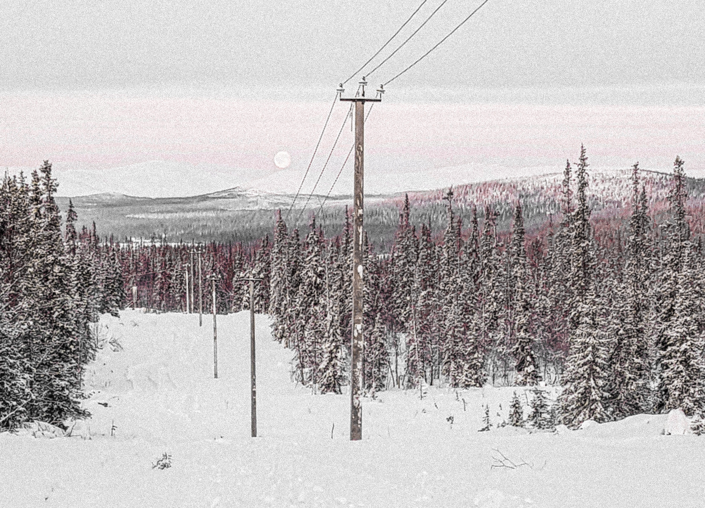
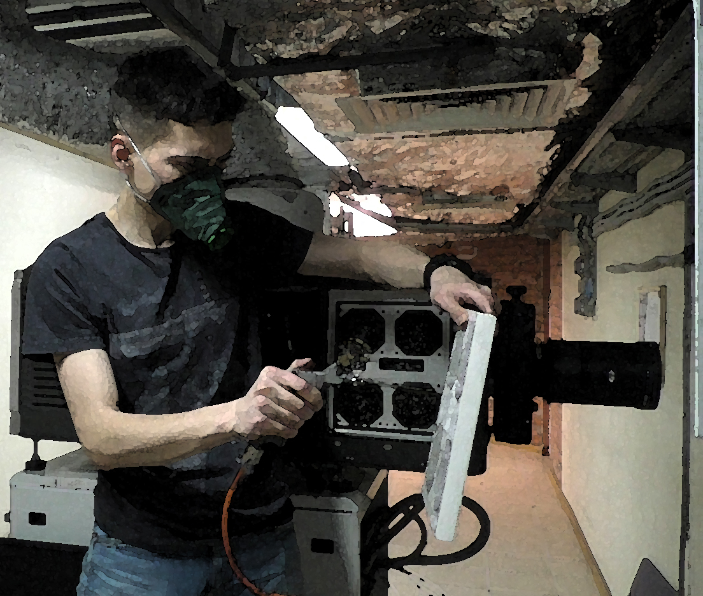
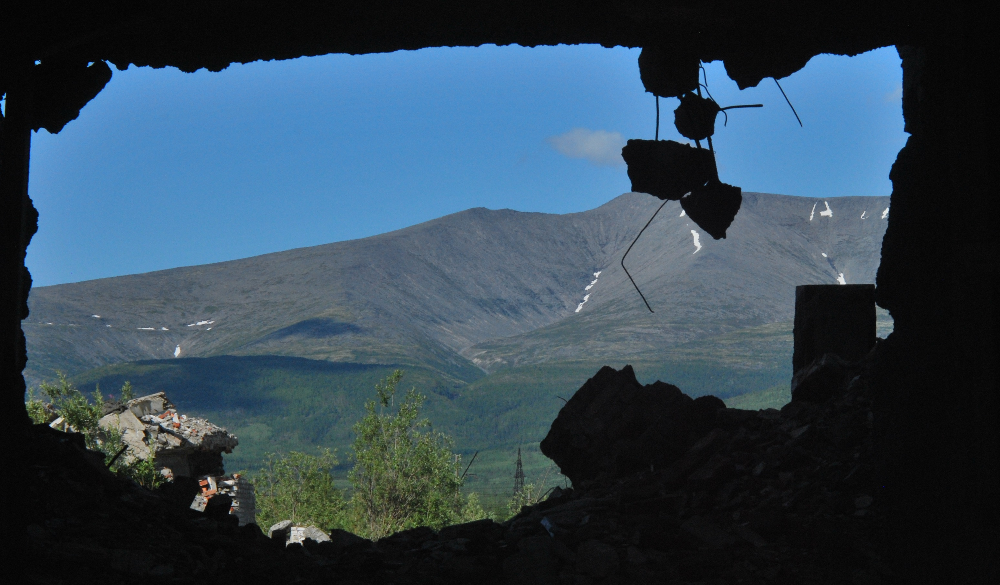
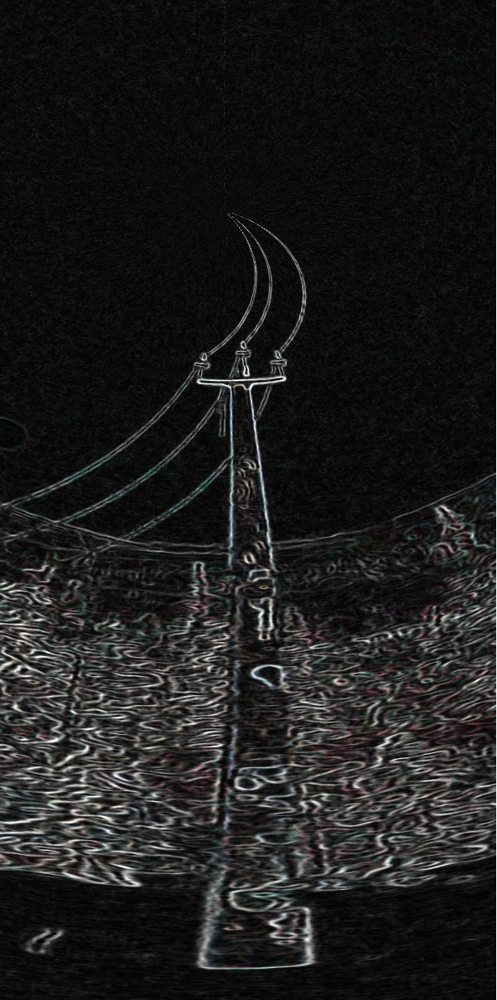

# SQL- но не язык структурированных запросов

Небольшая история о сожжённых мостах и вдохновении.

До сентября прошлого года я работал электриком, но с началом мобилизации мне пришлось перечеркнуть свою жизнь и многое переосмыслить.

## Бэкграунд:
По образованию я специалист по театральной и аудиовизуальной технике, говоря проще, киномеханик, и работал в кинотеатре, прям как Тайлер Дерден, правда в современных кинотеатрах пленка отсутствует и пошалить нельзя. Все, что остается, протирать пыль с цифровых проекторов, менять лампы, скачивать фильмы с сервера по ключам и вести документацию. Я очень закрытый человек, и работа, на которой мне не нужно было отсвечивать и натужно улыбаться, мне нравилась, не нравилась зарплата в 15 тыс. рублей.

## Электрик:
Я из маленького города из Мурманской области. Заканчивал школу и колледж в Питере, но попробовав работу по специальности и не по специальности, решил вернуться в родной город и переучиться на электрика по совету родителей. Почти сразу я нашел работу, платили очень хорошо, но нужно было безвылазно ездить по командировкам и строить линии электропередач в деревнях и частном секторе. Мне нравился адреналин, который я получал от того, что ошибка могла приводить к серьезным травмам или даже смерти. Не нравилось лечиться от стресса водкой.

Сжигание мостов:
Проработав так почти 2 года, меня стала посещать мысль, что лазить по столбам это не совсем то, что я хочу делать до конца жизни. Я уволился и перешел в компанию с меньшей зарплатой, но с возможностью вырасти в диспетчера, но тут вмешалась мобилизация.

## Мобилизация:
Так вышло, что я служил в армии, причем меньше 5 лет назад. Все лето 22 года мне названивали из военкомата с предложениями поехать на войну. В сентябре стало понятно, что спрашивать хочу я или нет, больше не будут. Спасло чудо и редкая военная специальность. Я сорвался, написал заявление на работе и поехал в Москву, по пути выкинул сим-карту в озеро. Чувствовал себя как настоящий преступник в бегах. Я должен был улететь в Ереван в последних числах сентября, но на границе меня остановил пограничник ФСБшник, отвел меня и несколько других бедолаг в каморку у пункта прохода границы и вручил нам бумажки, на которых было написано, что военкомат запретил нам выезд из страны. Через несколько дней я нашел человека, который отвез меня в Беларусь мимо пограничных блокпостов, и на следующий день я улетел в Астану.

## Точка входа в IT:
Поскольку с прошлой жизнью было покончено, я решил попробовать вкатиться в IT.

Среди всех курсов от Скиллбокса и т.д. я долго не знал, что и как выбрать, читал отзывы, но не понимал, что мне нужно. Из всех моих знакомых был один единственный человек, он Java Senior, долгое время работает и живет в Германии. Я связался с ним и попросил его помочь разобраться. Он посоветовал мне Python и познакомил с такими площадками самообразования, как Coursera и Udemy. Я начал учиться и ждал заграничный паспорт.

## Новая страна
Новый язык
Новые возможности???

После получения заграничного паспорта в Казахстане, я думал, куда двинуть дальше, выбор пал на Сербию. Так совпало, что одновременно в моей жизни появились курсы CS50 от Гарварда и Сербский язык. Моим капстоун проектом по курсу "Введение в программирование с питоном" стала игра в сербские слова, по сути усложнённая версия игры "Угадай число".

Потом я решил пройти курс "Введение в веб-программирование с веб-фреймворком Django", так появился мой собственный SQL- Serbian Quiz List.

## Serbian Quiz List
Мне очень нравилось приложение Duolingo, но сербского языка в нем не было. И я решил создать свое приложение для изучения языка, конечно, я понимал, что один начинающий программист не сделает то, над чем работают команды разработчиков. Получилось, что получилось Serbian Quiz List, созданный с помощью Django и JavaScript.

Получилось ли?
И да и нет, с одной стороны, я очень рад, что сделал цельный проект, и мне бы хотелось, чтобы больше людей увидели его, указали на ошибки. С другой стороны, я понимаю, что продукт не коммерческий, по сути, не имеющий верстки, и многим не зайдет.

Что в итоге?
Займусь немного саморекламой, вот мой проект https://leonid3.pythonanywhere.com/. Пишите, что нравится/не нравится. 
Буду благодарен за любой фидбек.

Всех благ!
