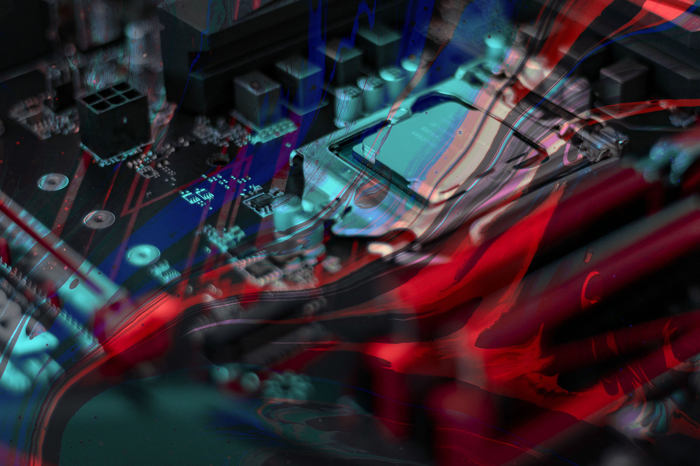

# Что еще за «Разрабы»

«Разрабы» — это новое медиа для людей из IT-индустрии и всех, кто хочет ее понять. Давайте я расскажу вам, как и для чего мы запускаем этот проект, и почему вам здесь понравится.

### Кто мы такие 

У истоков проекта — создатели подкастов «Мы обречены», «Разрабы», «Доктор кот» и других шоу для айтишников. До подкастов нашей страстью были тексты и разработка, и создавая это медиа, мы возвращаемся к своим корням. Мы собрали вокруг себя крутую команду разрабов, дизайнеров, редакторов и готовили проект больше года.

В нашей команде сложилось уникальное, как нам кажется, сочетание технарей и рассказчиков. Мы собираемся переосмыслить и перевернуть представление о том, что такое айтишные тексты.

### В чем суть

Мы делаем новое айти-медиа с поправкой на современность. Если раньше разрабовские тексты редко выходили за рамки обучения, мастер классов, инструкций, полезной полезности и успешной успешности — то новое время требует ответов на вопросы этики, политики, культуры, стиля жизни, осознанности, философии, поиска смыслов.

Здесь нет такого понятия как «айтишникам это неинтересно». Мы верим, что разрабы в наше время — это больше, чем техногики в старых свитерах, уткнувшиеся в комп. И верим, что разрабам интересен весь мир, а не только зубреж новых фреймворков, подготовка к собесам и решение задачек.

### Зачем это все

Мы хотим сохранить сообщество, которое растет, меняется, трещит под давлением государств, войн и всякого злого дерьма. Страшно, когда людям технологий приходится думать о выживании, безопасности и сохранении свободы. И странно, когда люди, мечтающие двигать прогресс и делать мир лучше, закрываются в башне из слоновой кости — большого комфорта, задач ради задач, кода ради кода и денег ради денег. 

Мы хотим дать индустрии место для рефлексии, найти ответы на жестокие вызовы современности и отыскать путь, пойдя по которому айти не превратится в инструмент уничтожения мира.

### Кто и как его разрабатывает

История разработки этого медиа — сама по себе захватывающий триллер, и однажды мы ее расскажем в подробностях. Сейчас у нас команда из нескольких разрабов с огромным опытом в индустрии и маленькая редакция из пары человек. Мы старались сделать проект более хулиганским, чем это принято в индустрии. Это, наверное, первое опенсорсное медиа. На старте мы открываем его фронт, а когда все допричешем — выложим и бэк тоже.

Дизайн вдохновлен нашими IDE, плюс мы дали дизайнеру полную творческую свободу и пообещали смотреть на его работу как на искусство, а не как на решение бизнес задач. Не знаем, удобно ли вам будет пользоваться сайтом, но выглядит, согласитесь, охеренно. Утилитарность и прагматизм всем надоели.

Плюс, мы решили, что раз уж тут всем заправляют разрабы — то грузиться медиа должно со скоростью света. Пока это, честно говоря, не совсем так — но мы работаем над этим.

### Что здесь будет

Тексты, цель которых — осмысление места ИТ-индустрии в современном мире и поиск больших смыслов.

Колонки с мнениями, много колонок с мнениями. Супер искренние, противоречивые, разжигающие споры, жесткие, глубокие, раскалывающие привычные представления и копающие глубоко-глубоко в суть волнующих индустрию проблем.

Материалы с контекстом вокруг главных событий и инфоповодов индустрии. Если в айти что-то обсуждают — здесь будет собрано все, что важно знать о предмете обсуждения и реакции сообщества.

Большие материалы, которые сами становятся инфоповодами. Индустрия полна важных историй, которые скрываются за всякими эндиэями, завесами и коммерческими тайнами. Мы будем их раскапывать, доставать инсайды и подавать в увлекательной захватывающей нарративной форме.

Технические материалы нового толка. Никаких пересказов спек своими словами и повторений всем известных вещей. Мы будем рассказывать, какие инструменты и проекты изобретает наше сообщество, и гарантируем обсуждение свободное от токсичности, циничных набросов и критики ради критики. 

Интервью с интереснейшими людьми из индустрии. Сперва они будут классическими редакционными — но в будущем примут более необычную интерактивную форму и позволят сообществу в реальном времени участвовать в разговоре. Следите за обновлениями.

Жалобная книга. Разрабы — в том числе существуют для того, чтобы специалисты из IT могли рассказывать о своих проблемах. О том, что не даёт им жить, чувствовать себя свободно и безопасно. Рассказать, и получить в ответ поддержку, советы, и даже прямую помощь.

Если с вами плохо поступили работодатели, ваши права нарушили, не выплатили деньги, нахамили, подставили или ещё что в таком духе — приходите сюда и жалуйтесь. Мы выслушаем, и поддержим. Недобросовестные работодатели ничего так не боятся, как огласки, и мы будем одним из инструментов борьбы с ними, потому что верим — взаимоотношения работника и работодателя в IT могут и должны быть исключительно взаимовыгодной историей.

### Как написать сюда статью

Мы решили не делать встроенный редактор — вместо этого мы бахнули интеграцию с гитхабом, и перенесли процесс работы над текстами туда. Работает примерно так: клонируешь [репозиторий](https://github.com/razrabs-media/editorial), делаешь бранч с названием статьи латиницей, добавляешь директорию (назови её так же), внутрь кладешь .md файл, и картинки для статьи — внутри .md делаешь на них относительные ссылки, затем коммитишь, потом вешаешь пуллреквест.

Формат .md можно посмотреть в том же репозитории, в пуллреквест можно добавить гитхабные лейблы — они превращаются в теги внутри медиа. Мы посмотрим ПР, и если всё ок — вмёрживаем. Тогда ваша статья появляется в ленте “Всё подряд”, и, в зависимости от тегов, в других лентах.

Те статьи, которые показались редакции важными, будут также появляться на главной — это будет работать в ручном режиме. Думаю, первое время так будет со всеми статьями.
