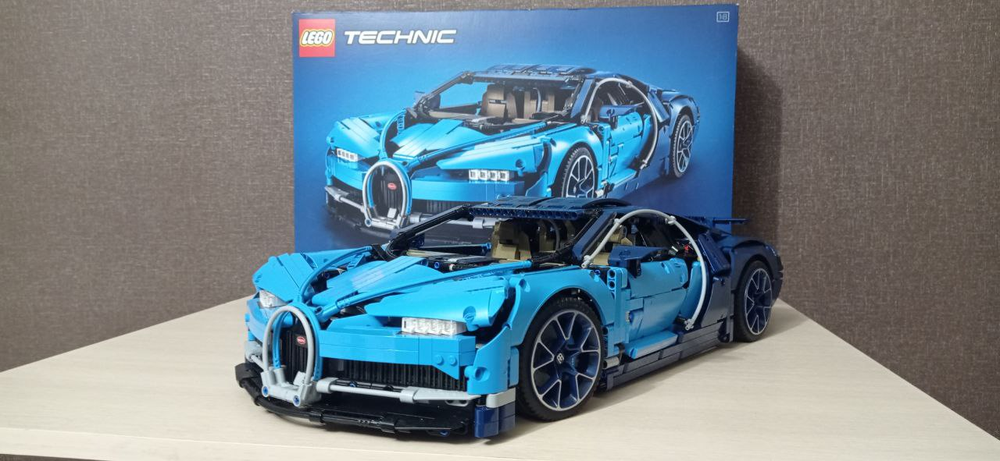

#Как я полюбил ежедневные созвоны

Я тимлид в небольшой компании. У нас несколько проектов и ежедневные созвоны по этим проектом занимают час рабочего времени. Обычно после этих созвонов я эмоционально вымотан, но в начале этого года обстоятельства сложились так, что я начал с нетерпением ждать начала этих созвонов и грустить после их окончания.

Я работаю в небольшой компании. Тимлидом, как и многие, стал по принципу “Кто более опытный разраб в команде, тому и тимлидить”. 
В самом начале, когда я был рядовым разрабом, а вся команда сидела в офисе, мы на митинги собирались в переговорке, было очень лампово, весело и продуктивно. Помню, когда мы всей толпой шли по коридору до переговорки, мы больше походили на шайку, чем на IT-команду. Поэтому раньше никогда не испытывал негатива к данным мероприятиям, а даже наоборот. Но со временем команда разрослась, стала распределенной, разделилась на проекты и вот у нас уже 4 онлайн-митинга на целый час. В них нет прежней ламповости и кажется прежней пользы тоже нет, но и отказаться от них нет возможности, по понятным причинам. 

Я из тех людей, для кого работа и хобби - это одно и то же. До сих пор так  и не понял, хорошо это или плохо, но в свободное время я либо читаю книги, связанные с программированием, либо потребляю контент, связанный с профессией, либо что-то прогаю. При чем прогаю рабочие проекты, потому что делать что-то бесполезное не люблю. С одной стороны я всегда кайфую от своей работы, с другой чувствую себя “неполноценным” и периодически начинаю искать себе “человеческие” хобби. Младший брат моей жены с детства увлекается конструкторами LEGO. Дома у их родителей стоят множество машин, тракторов, комбайнов, собранных им еще в детстве. В конце прошлого года я поделился мыслями вслух со своей женой:  “Хочу тоже попробовать собрать, что-то похожее”. Сказал тогда и забыл, а жена не забыла, и мне на новый год Дед Мороз под елку положил огромный LEGO Technic BUGATTI из 3 599 деталей! Вначале я посмотрел на него с детским восторгом и страхом одновременно. Открыл, покрутил, полистал инструкции и отодвинул до конца новогодних праздников. 

Первую неделю после праздников я остался работать из дома (у нас свободное посещение офиса). Когда в первый рабочий день подошло время созвонов, я понял, что у меня есть целый час “свободного” времени, и я могу посвятить его подарку. Я настолько увлекся, что даже не заметил, как пролетел этот час, а на следующий день я поймал себя на том, что посматриваю на часы в ожидании начала созвонов, чтобы можно было пособирать конструктор. А когда созвоны заканчивались, я с грустью откладывал конструктор и шел дальше работать. Так прошла вся первая неделя - я собирал конструктор, а голоса коллег на фоне воспринимались, как подкаст, но в отличии от обычного подкаста, в эту беседу можно было ворваться и подискутировать, когда сильно хочется…