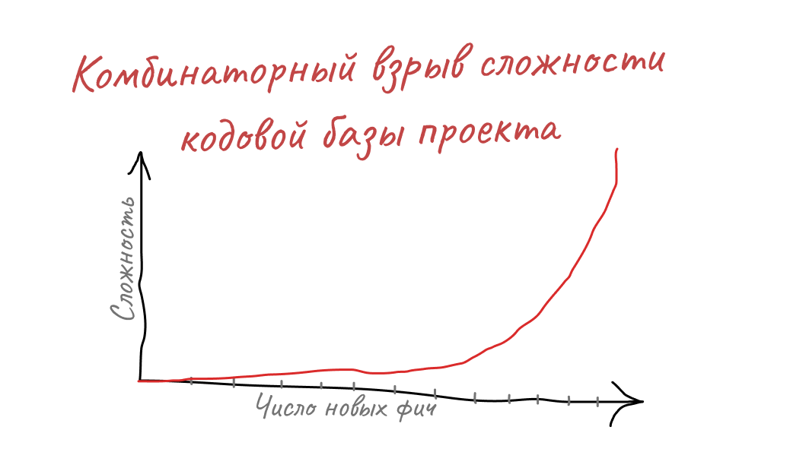
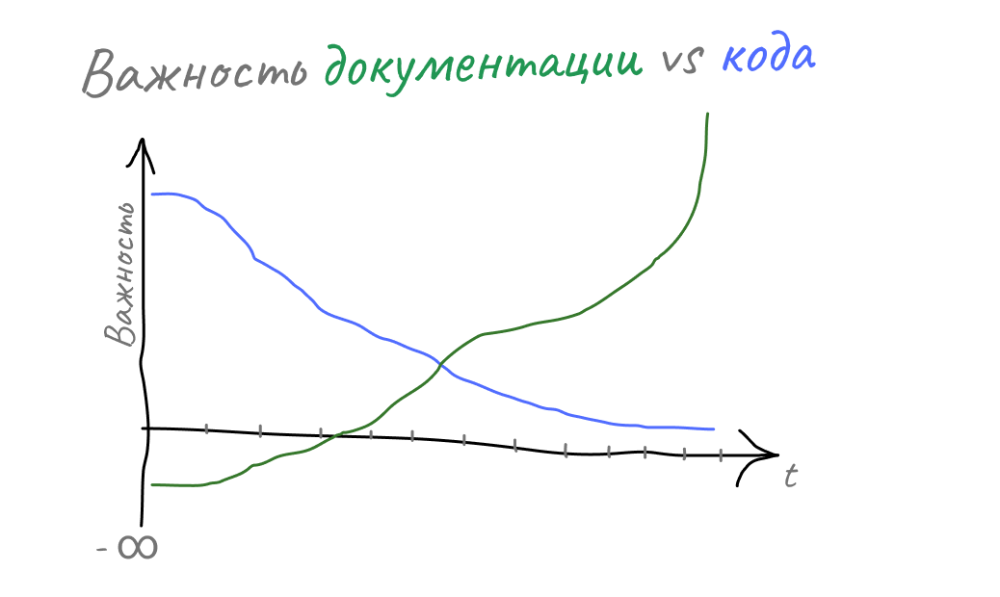
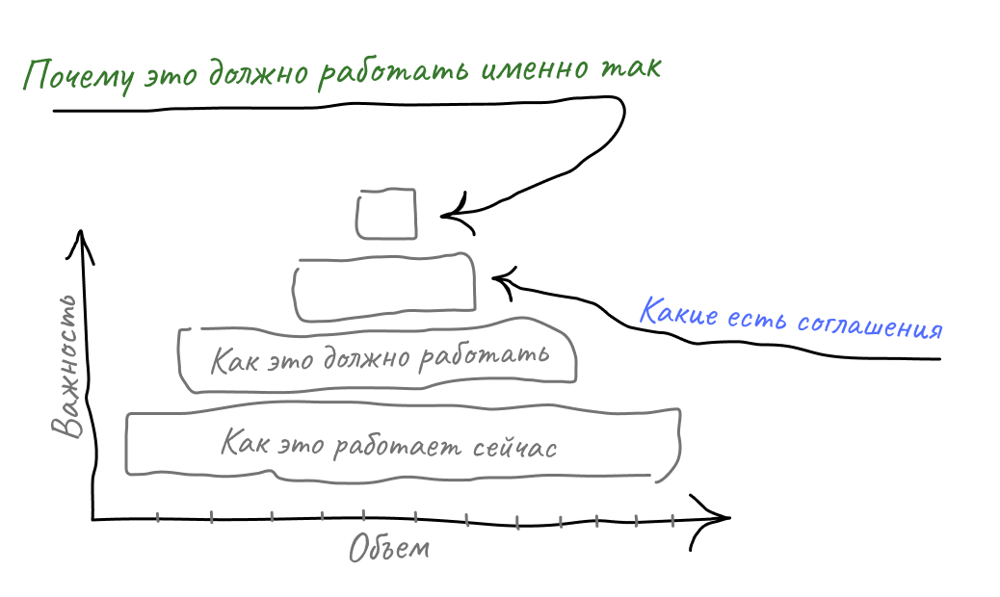
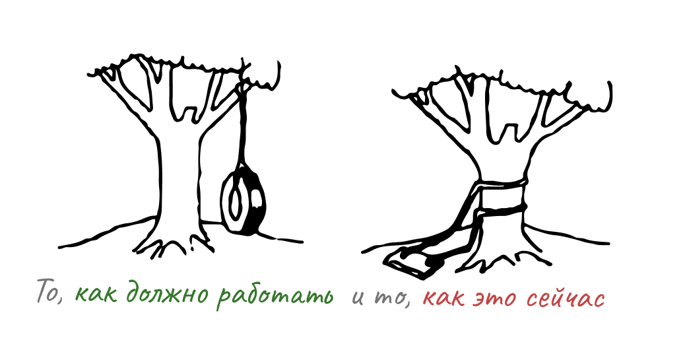

# Как начать фиксировать требования, когда у вас ничего нет

Приветствую! Меня зовут Андреев Сергей, и я уже более десяти лет погружен в мир разработки, последние пять из которых уделяю особое внимание синергии между IT и бизнесом. Моя специализация — создание среды, в которой бизнес достигает своих целей, а разработчики с удовольствием воплощают свои лучшие идеи в жизнь.

За это время я успел поработать в компаниях всех видов: от стартапов до энтерпрайза, включая продуктовую и аутсорс-разработку. И я совру, если скажу, что где-то не экономят на разработке, при этом это делают как бизнес, так и сами разработчики — и последнее, к моему удивлению, чаще.

В какой-то определенный момент после старта нового проекта, когда «временный» MVP почти готов, весь интересный код уже написан, пакеты еще свежие и обновляются, команды начинают замедляться в Time to Market.

Для разработчиков обычно это выражается в переходе от «нам бы перестать добавлять технический долг» к пониманию того, что он нам уже реально мешает. Бизнес начинает все больше подгонять вперед, а разработчикам все сложнее держать код проекта в голове и безопасно его переписывать. Но уже поздно: проект прошел точку невозврата, и по опыту с таким подходом дальше будет только хуже.

Проект становится поддерживать все сложнее, свежий проект перестает быть таковым, а желания и возможности вносить в него крутые технические решения становятся все труднее реализовать.

И вот мы здесь, с молодым, но уже «легаси» проектом, никто не понимает, как он работает, и нет места, где можно почитать требования, чтобы не отвлекать коллег.

Предлагаю сегодня вместе разобраться, что конкретно вы можете с этим сделать. Ситуация хоть и знакомая и запущенная, но не безвыходная.

## А в чем, собственно, проблема?

Когда проект маленький и помещается в голове одного разработчика, плюс у нас часто на этом этапе мало людей в команде, мы начинаем пренебрегать документацией. Нам кажется простым понять, что делает этот модуль, и переписать его за один подход.

Чем больше делает код, тем больше в нем связей, и происходит комбинаторный взрыв, так как сложность растет нелинейно. Очень легко пропустить тот момент, когда одной головы недостаточно. Мы уже не можем за одну программную сессию охватить часть проекта, понять, как повлияют наши изменения. Логично, мы отказываемся от стратегии «все переделать», переходя к стратегии «лучше ничего не трогать», а делать лишь косметические правки.

И вот мы не успеваем оглянуться, как хорошая команда, и даже, возможно, хороший бизнес, создали нечто не поддерживаемое. В этот момент многие команды выбирают ничего не делать, только усугубляя ситуацию.

Требования в проекте и документация — это такая же часть проекта, как и код, а может быть даже важнее, с учетом роста сложности. Но вспоминаем мы об этом, когда уже поздно: проект есть, проект работает, а требований как не было, так и нет. И вообще непонятно, с чего начать.

## С чего начать разгребать это?

К счастью, все не так плохо и не все потеряно. Как показывает опыт, эту проблему нужно решать системно, да, это потребует времени, но через пару месяцев, пользуясь следующими правилами, вы не узнаете команду в хорошем смысле, time to marker начнет приходить в норму, а легаси, на первый взгляд неустранимый, начнет поддаваться.

Первое, с чего стоит начать — это разобраться, а какая вообще бывает информация в требованиях, и на какой именно нужно сфокусироваться в первую очередь, как по закону Парето, что принесет 80% результата.

Можно выделить 4 уровня знаний о проекте, которые утеряны и мешают его развитию:

- Как это работает сейчас
- Как это должно работать
- Какие есть соглашения
- Почему это должно работать именно так

Давайте по каждому пробежимся подробнее:

### **Как это работает сейчас**

Примерно так же, как разработчики считают писать комментарии к коду бесполезной затеей, ведь код должен быть понятен без них (спойлер: это не всегда так, зависит от уровня проекта). Так и писать требования с того, как система работает прямо сейчас — довольно бесполезная работа, хотя именно с этого обычно начинают попытки, но исходники проекта у вас есть, программисты вообще могут прочитать их, а QA, менеджеры проектов — всегда могут спросить разработчиков.

Это самый обширный уровень, алгоритмы в коде, структуры баз данных, стейт-машина, и у нас вся эта информация в том или ином виде есть в системе, но к ней иногда просто бывает неудобно обращаться.

Главное тут неудобно, а не невозможно. Это самое последнее, что стоит фиксировать. Иногда достаточно просто дать ссылки на исходник.

Документация — это такой же модуль проекта, как и код, и нет ничего хуже, чем неактуальная документация, уж лучше ее отсутствие.

К этому еще нужно будет вернуться рано или поздно, так как код по определению несовершенный способ фиксации требований к тому, как система должна работать — но главное, он есть, он как-то работает, и мы можем при желании и должных усилиях в этом разобраться самостоятельно, или почти самостоятельно.

И наверное единственное, на что здесь стоит обработать внимание перед тем, как мы пойдем дальше: то, как должно работать и то, как это работает сейчас — это не одно и то же!

Так бывает, что мы реализовали не до конца из-за каких-либо ограничений, или код позволяет создать невозможное состояние с точки зрения бизнеса, и это уже полгода работает так, вот на это стоит обратить свое внимание.

### **Какие есть соглашения**

Помимо всем известного слова «требования», есть слово, которое мы куда реже произносим в командной работе — «соглашения», а зря!

Есть такой замечательный подход Convention over configuration, или же «соглашения превыше конфигураций». В чем суть? Лучше один раз составить общее правило, которое позволит нам в любой ситуации принять решение по проектированию кода, нежели каждый раз обсуждать это, например, на ревью *(последний пример — холивар про табы и пробелы. Хороший пример такого соглашения, один раз приняли и больше не обсуждаем).*

Вам может показаться с первого взгляда, что их у вас нет, но это не так. Вы как-то договорились писать код в проекте, что-то делать, а что-то не делать, использовать где-то какую-то библиотеку.

Соглашения важны по двум причинам. Во-первых, гомогенность: для развития проекта и простоты его документирования, все и везде должно быть плюс-минус похоже. Их фиксация вам сильно поможет в будущем, сэкономив время на документации, которую вам просто не придется писать. Во-вторых, расползание плохих практик: как разработчики создают новый модуль? Правильно, копируют старый со всеми кривыми вещами.

Поэтому куда как важнее обратить свое внимание именно на них, их меньше, а их контроль дает больше профита в предсказуемости развития системы даже без документации.

Соглашения куда как сложнее выявить, обычно их знают меньше людей и их сложнее найти. Также часто эти соглашения не исполняются, а данные неактуальны.

Поэтому важно зафиксировать: **какие есть соглашения** и **что с ними происходит сейчас.**

Ну и нужно быть честным перед собой, соглашений, как и документации много бывает. Возможно, от той части документов, которые для вас важны, но не соблюдаются, придется на время отказаться.

### **Почему это должно работать так**

Ну и последний уровень информации, по порядку, но ни в коем случае не по важности. А почему это работает именно так? Обычно об этом знают единицы, их имена передают из уст в уста, и даже, возможно, тех, кто это знал, с нами уже больше нет.

Почему в коде есть задержка, почему версия библиотеки запинена, почему для создания транзакции надо 5 вызовов методов, хотя по коду можно и один, почему в проекте своя функция расчета флоата, хотя вроде и не нужна? Чувствуете всю боль?

И вот именно невозможность быстро и просто получить ответы на эти вопросы сковывает нас по рукам и ногам, вселяет страх и не дает развивать приложение.

Ведь чтобы менять систему, мы должны понимать, почему она работает сейчас так, как работает.

Как только мы докопались до правды, а иногда продукты умеют давить на разработчиков, повышая желание копаться в таких модулях, это повод сохранить это понимание для наших коллег.

## От теории к практике: как интегрировать процесс восстановления требований в ежедневную рутину

С теорией уровней информации мы разобрались, у вас уже есть понимание, что важно, а что пока нет, и при встрече, я уверен, вы сможете верно оценить ситуацию. Теперь давайте собственно переходить к практике: а как мы можем интегрировать в повседневную работу процесс восстановления критически важных требований, соглашений и документации, которые нас замедляют?

Если мы попытаемся разом описать все, что знаем — мы утонем в работе, так как каждый момент будет тянуть за собой еще один, к тому же мы не знаем, как это все верно описать и увязать в логичное повествование. Как говорится, большая документация сама защищает себя от прочтения, не так ли?

У нас нет задачи описать все, да все и никому не нужно, ценная информация сама подскажет, что ее нужно сохранить. Если отвечать кратко — то по запросу:

### Через разбор багов/инцидентов/проблем

Если у нас на встрече или при обсуждении появилась проблема, то после ее устранения стоит зафиксировать, что мы узнали.

Ведь чтобы исправить проблему, нам все равно придется узнать:

- как это работает;
- почему так;
- что случилось;
- зачем надо.

Так почему бы это не зафиксировать.

Если у вас есть QA на проекте, вы можете ему поручить важную миссию, быть хранителем соглашения по разбору инцидентов/багов/проблем, почему бы просто не добавить еще один маленький этап, работа сделана, а еще 15 минут вам могут сохранить часы. А пока разработчики будут объяснять понятным языком причины для QA, вот по факту готовая информация для документации.

Если у вас нет QA, менеджер у вас точно есть, или тимлид, и мы должны их привлекать. Нам важно именно переопыление и налаживание коммуникации.

### Через проектную деятельность

Второе место, которое нам может подсказать и помочь восстановить баланс документации – это проектная деятельность.

80% любой системы стабильно работает и не требует вмешательства, продукт — это динамическая система, которая развивается и меняется. При этом меняются именно те места, в которых либо сильно болит, либо они очень важные.

Пока мы делаем новую фичу, мы гарантированно знаем:

- зачем мы это делаем;
- какую проблему решаем;
- как это будет работать;
- какие есть нюансы.

Мы уже проделали львиную долю необходимых действий для создания документации, сейчас мы понимаем, почему система работает именно так, а не иначе. Так почему бы нам после исполнения фичи не обновить для потомков информацию о продукте?

## Как и с чего лучше начать именно вам

Итак, мы уже с вами разобрались, что лучше фиксировать, а что нет, и в какой момент работы это лучше всего делать. И у вас, наверное, остался главный вопрос: а как это делать, так как даже понимая, какую информацию стоит зафиксировать, мы не лишены риска получить большую неактуальную доку, давайте разбираться.

Тут важно понимать: в попытке бороться с отсутствием актуальной документации вы всегда обречены на провал, это как вычерпывать воду из судна, которое тонет. Вам нужно действовать на опережение и слаженно!

Во-первых, соберитесь с командой и проговорите вслух, что да, это боль, что да, это вам мешает, и что да, вы все понимаете это и согласны действовать по-другому, так как ваша старая стратегия не работает и не будет работать. Можете скинуть ссылку на эту статью до встречи с членам команды. Обсудите рамки: с чего именно вы готовы начать, какие есть сейчас топ 5-10 критических мест, где больше всего болит, обсудите и договоритесь, на что вы согласны, по каким типам багов вы будете делать разборы, по каким фичам и где.

Это и есть первое соглашение, с которого вам, как команде, нужно начать – соглашение об уровне документирования. Обязательно зафиксируйте его.

Поздравляю у вас есть самое первое и самое важное соглашение!

Скорее всего, когда вы будете обсуждать требования и документацию, у вас непременно возникнет вопрос, а где лучше хранить требования (ноушен, конфлюенс, git) и даже обсуждение на тему как, в каком формате. Здесь нужно остановиться и выдохнуть, это пока все не важно, такие обсуждения на раннем этапе могут привести вас на опасный путь — решать решение, а не решать проблему.

Во-вторых, самое важное, о чем вам нужно договориться на этом этапе: о точке входа. Каждый член команды должен понимать *(так же ясно, как он знает, по какому адресу находится прод),* где именно лежит актуальная документация и смочь в нее попасть в пару кликов. Примите это решение совместно, участие в таком решении помогает членам команды нести ответственность за результат.

Может быть так, что у вас уже есть такая папка, но, скорее всего, она не актуальная, и вы ей не доверяете. В 90% случаев лучшим решением для вас будет утвердить пустую папку и положить туда уже принятые соглашение о документировании. Важно, чтобы единая точка входа в информацию о проекте была еще и достоверной.

Основная причина, почему у команд протухает документация — ей перестают доверять, если пару раз не обновили, а потом перестают заходить. Учитывая, что у вас нет цели иметь сейчас требования на все, но по чуть-чуть, а скорее на что-то одно, но полные. Вам критически необходимо в команде договориться об этой папке, как о едином источнике истины, если там написано так-то, значит, так и есть, без вопросов и сомнений.

Если вы сделаете это, то вы сделаете больше чем 80% команд, которых я видел, но этого недостаточно, нужно решить проблему устаревания. Требования устаревают потому, что их не обновили, а систему изменили. Вам как команде это не нужно, вы с таким трудом собрали критически важную информацию, и вы явно не захотите, чтобы ваш труд пропал из-за того, что вы не продумали, как их поддерживать или просто забыли.

На данный момент самым простым решением будет интегрироваться в уже существующее процессы разработки, обычно это ревью или тестирование.

Вы можете изменить соглашение о ревью, добавив в него еще один шаг, без которого апрув на новый код получить нельзя. Ревьюер должен проверить, а не меняет ли код модуль, который находится в вашей базе актуальных требований, и, если в задаче нет готовых правок по требованиям, отклонить ревью и помочь коллеге восстановить это, пока все еще свежо.

Точно так же с этапом тестирования, QA прекрасно могут проверять на наличие изменений в core-функциональности.

А главное, члены команды в этом случае заинтересованы, как уже было сказано выше. По этому напоминаю еще раз, зафиксируйте в соглашении причины: почему вы как команда договорились и взяли на себя ответственность, у каждой команды они будут свои. Это вообще ключевое не только в требованиях, но и в целом в работе: если мы не понимаем, зачем мы что-то делаем и какую пользу принесет задача лично вам, пусть и в будущем, пусть и опосредованно, но принесет, данные соглашения либо не будут выполнены, либо все же под давлением будут сделанны как-то так, что лучше бы вообще не делали.

При наличии всех этих пунктов теоретически все будет работать, но как мы знаем, на практике это не так, всегда есть нюансы и детали, что-то неудобно или не хватает именно вашей команде. Соглашения о документации — это свод правил, которые вам помогают работать, принимать более оптимальные решения, их можно и даже нужно развивать.

Если у вас в команде есть процесс ретроспективы, отдельно обсуждайте ход проекта по требованиям, что вам помогает достигать целей (ах да, зафиксируйте цель, ради чего вы это делаете), а что, напротив, мешает. Либо же временно на первые месяцы каждую неделю, или раз в две по этому проекту ведите отдельную ретроспективу. Обратная связь – это двигатель прогресса.

Подытожим:

- Не надо бороться с неактуальными требованиями – действуйте на опережение!
- Обсудите, договоритесь и зафиксируйте, почему это боль, какая ваша цель и то, что вы утвердили.
- Определите скоуп: топ 5-10 критических мест, где больше всего болит.
- Обновите регламенты: ревью, тестирования, устранения багов и реализации фичей.
- Сделайте новую документацию точкой входа и единственным источником истины.
- Проводите ретроспективу и меняйте процесс, убирайте то что вам мешает.

## В заключении

Фиксация требований — это такой же командный навык, как умение писать понятный код, здесь побеждает не объем, а системный подход. Теперь, когда вы понимаете, что фиксировать, а что нет, и главное, когда это делать и как, это можно интегрировать в ваш рабочий процесс, дальше дело за малым, нужно действовать — интегрировать в ежедневную работу, это такая же привычка, как писать хорошие сообщения к коммитам, оформлять ревью или делать описание к задачам. Это вопрос культуры, а ее развивает повторение.

И помните, бизнес, it-команда и it-продукт неотделимы друг от друга, они развиваются только через сотрудничество.

Через пару месяцев при применении такого подхода ситуация в вашем проекте изменится. Не нужно торопиться, все прочитанное нужно еще научиться самим применять на практике. Я уверен у вас все получится.

Если вы считаете, что для вашего продукта проблема управления требованиями критическая и вам нужна консультация сейчас, [обращайтесь за консультацией](https://t.me/DragorWW).

Если вы просто хотите больше читать на тему организации бизнес-процессов it-разработки – меня можно найти в [твиттере](https://twitter.com/DragorWW) и  [tg-канале](https://t.me/AndreevSergey_IT).

*Если вы хотите рассказать свою историю на «Разрабах» — добавляйтесь в [чатик](https://t.me/content_razrabs) и читайте закреп.*