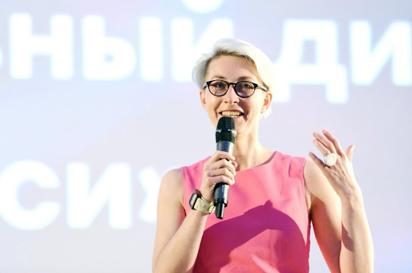
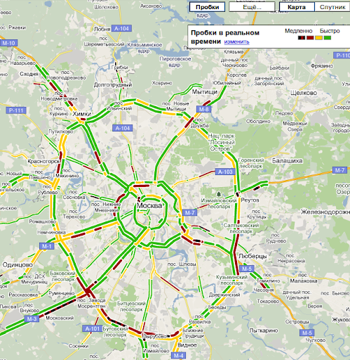
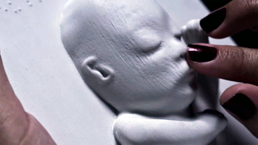

# Людям с ограниченными возможностями трудно пользоваться айти сервисами, и это большая проблема. Но ее можно и нужно исправить

Мы поговорили с экспертами по доступности в IT и людьми с ограниченными возможностями, чтобы разобраться — насколько недоступность масштабная и важная проблема, и как разрабатывать продукты так, чтобы ими могли пользоваться вообще все.

О доступности в последнее время очень много говорят, это своего рода новый тренд в индустрии. Но многие думают о ней лишь в контексте пандусов, безбарьерных пространств и подписанных для скринридера кнопок. 

На самом деле, доступность затрагивает каждый наш шаг — заказ такси, покупка продуктов, заполнение анкеты для поиска работы, прогулка в парке. Проблемы недоступности окружающего мира может коснуться любого из нас, даже если юридический статус человека с инвалидностью отсутствует. Близорукость, дальнозоркость, перелом руки или ноги, дальтонизм, дислексия — уже преграды для привычной ежедневной деятельности. Что уж говорить о других особенностях или заболеваниях. 

Мы попросили экспертов рассказать, как они понимают доступность, почему она так важна для каждого из нас и как внедрить её в свои продукты.

## Сделать интернет доступным легче, чем город — безбарьерным

*Дмитрий Волжский, слабовидящий (нейропатия Лебера), 1 гр. инвалидности, учится программированию, рассказывает другим людям о доступности*

В России людей на колясках можно встретить в основном среди тех, кто просит деньги на улице. В то время как в Европе я просто постоянно встречаю их везде, там они — часть общества. На днях я был на концерте и видел, как девушка танцевала с парнем, катая его на коляске.

В Европе чаще всего передвигаются на электрических колясках, пространство там предусмотрено под любые типы этих средств передвижения. Электрические удобнее всего, потому что колеса не нужно крутить руками. Но в России на таких ездят мало — человек не сможет сам преодолеть на этой коляске большое расстояние. Её всё время придется поднимать из-за постоянно возникающих преград на пути. В результате в России чаще всего ездят на обычных, управляемых руками. Они весят гораздо меньше, но на управление ими надо тратить много сил. Для многих легче не выходить лишний раз из дома, чем так сильно уставать.

Как слабовидящий я сталкиваюсь с другими проблемами. Но я могу не пользоваться сервисом, если там есть элементы, которые усложняют мне жизнь. А вместо этого пользоваться альтернативами. Но полностью незрячим людям поступать так гораздо сложнее. Для них интернет может стать полностью недоступным, если не будут соблюдаться принципы Accessibility.

К счастью, примеры доступных сервисов есть и их очень много. Например, в комментариях к моим твитам незрячие люди писали, что Твиттер полностью адаптирован под использование скринридерами. Он позволяет не только добавлять alt-текст в картинку, а весь сервис заточен под управление с клавиатуры и со скринридера. В результате у людей вообще не возникает никаких проблем с его использованием.  

*Ксения Ломакина, продуктовый дизайнер*

Как колясочница, я часто сталкиваюсь с ограничениями в городе: высокие бордюры, крутые пандусы, тяжёлые двери. Всё это не даёт свободно перемещаться. Кроме меня с похожими сложностями ситуативно сталкиваются здоровые люди — например, если везут ребёнка в коляске или несут из магазина тяжёлые пакеты. К сожалению, быстро что-то исправить в городе очень тяжело.

Есть много людей, которые с похожими сложностями сталкиваются в вебе, но в этой среде что-то менять легче. И это проблемы не только для людей с заболеваниями: думаю, всем приятно не напрягаясь читать текст, и даже в трясущейся машине попадать по правильным кнопкам.

Мне кажется, начинать работу над доступностью нужно с объяснения её важности команде. Когда все в этом искренне заинтересованы, придумывать и внедрять решения гораздо легче, даже если это относительно простая контрастность цветов.

## Как выглядит мир без доступности

О доступности стали много говорить, но кому-то процент людей с ограничениями кажется небольшим. Есть даже представители бизнеса и менеджмента, которые считают, что такие пользователи не могут положительно повлиять на продажи продукта. Так ли это на самом деле? И почему нам точно не нужен мир без accessebility, даже если у нас нет физических особенностей.  

### Столкнуться может каждый

*Глафира Жур, Accessibility Driven Team Lead в SpurIT, Google Developer Expert for Web. Организатор [Accessibility Club Minsk](https://a11yminsk.space/) и митапов [MinskCSS](https://minskcss.timepad.ru/events/) и [MinskJS](https://twitter.com/MinskJS)*.

О важности доступности расскажу на примере реального кейса. Я несколько месяцев жила в Швеции, искала работу. Пришла на собеседование в довольно известную рекрутинговую компанию с офисами по всему миру. Я спросила на ресепшене, что делать, потому что куда идти — непонятно, очень много помещений. Мне показали, что нужно заполнить анкету и за мной придут. Передо мной оказались монитор и клавиатура, мышки — нет. На мониторе загружена веб-страничка с формой, которую нужно заполнить. Всё на шведском, а я только приехала и языка не знаю вообще — даже как по шведски будет «имя» и «фамилия». С собой ни интернета, ни переводчика.

Но я обнаружила, что курсор уже установлен в первое поле ввода, то есть можно начинать вводить свои данные прямо с клавиатуры. А до поля ввода есть поле переключения языка. Если бы у меня была мышка, я бы нажала на него, переключила язык и всё было бы классно. Но мышки у меня не было. 

И тут я вспомнила про доступность. На тот момент я только-только начала в этой теме разбираться. Я — будущий эксперт по доступности, у меня есть клавиатура, а значит, я что-то смогу сделать с этим. 

Я вспомнила, как пользоваться интерфейсами. Нажала shift+tab, чтобы вернуться назад на один пункт, выше по страничке в это поле. Сфокусировалась и попробовала выбрать другой язык. Enter не сработал, тогда я нажала на стрелку вниз, выпало меню и я смогла стрелочкой выбрать английский язык. Нажала enter и произошло волшебство — язык сменился, всё получилось! Так я смогла заполнить форму, переключаясь по ней только клавиатурой. 

Умение работать с клавиатурой — это не то, что знает современное поколение пользователей смартфонов. Они зачастую не умеют перемещаться по элементам без мыши или тачпада. А мне было так удобнее с детства, поэтому я представляла, какие клавиши надо нажимать. Вот такая смешная ситуация, которая иллюстрирует, что доступность — это про всех. Даже про тех, кто и видит, и слышит, и никаких проблем со зрением не имеет.

*Дмитрий Волжский*

Без доступности мир станет похож на тот, в который вернули концлагеря — для людей с ограниченными возможностями. Такая метафора может показаться утрированием, но она пришла мне в голову, когда однажды у меня в комментариях кто-то написал, что для людей на колясках нужно построить отдельные поселки, чтобы не переделывать для них города — мол слишком уж это дорого. Ничего не напоминает? 

Говоря о мире с концлагерями, я подразумеваю модель устройства общества, в которой определённая  группа людей оказывается изолированной, отрезанной от остального мира и от доступных остальным благ, а люди снаружи, в свою очередь, принимают это как норму и не пытаются ничего изменить. И никто не застрахован от того, чтобы оказаться  в числе узников — достаточно получить травму или столкнуться с редким заболеванием, нарушающим способы взаимодействия с окружающим миром. 

Я — за мир для разных и равных людей, а отсутствие доступности — это нечто противоположное.

Бытует мнение, что доступность не нужна бизнесу. Мол, процент людей, которым она необходима, очень мал. У меня возникает вопрос: как это посчитали? Был ли какой-то социальный опрос, охватывающий всё население страны/мира (в зависимости от того, на кого ориентирован бизнес)? Обычно либо проводятся опросы  среди имеющихся пользователей, либо проверяется статистика, кто из них использует accessibility-инструменты. 

Но пробовали ли когда-нибудь поговорить со всеми людьми. В том числе с теми, кто и компьютером/гаджетами не пользуется из-за имеющихся у них физических ограничений и с теми кто не пользуется определенными сервисами? Стали бы они пользоваться, если бы их полностью адаптировали и сделали доступными? Насколько я знаю, таких опросов нет, а людей с инвалидностью в России и в мире огромное количество. Я бы предложил смотреть не на процент пользователей каких-либо продуктов, а на процент людей с инвалидностью. Хотя и эта система с её статистикой тоже вызывает вопросы. 

### Особые потребности есть у каждого

*Михаил Рубанов, Mobile Head в Dodo Brands. Написал книгу «Про доступность iOS».*

Доступность в широком смысле — это возможность кастомизировать продукт под свои потребности. Яркий пример: в США пытались сделать кабину для идеального пилота. Они измерили множество людей и сделали среднюю кабину. В итоге оказалось, что она не подходит вообще никому. 

При более глубоком погружении оказалось, что это очень распространенное явление, массовая история. Каждому человеку нужно что-нибудь особенное. Например, согласно нашему исследованию, 27% людей пользуется минимум одной настройкой доступности. Кто-то хочет, чтобы анимации на экране было меньше, кто-то – шрифт побольше или поменьше, для кого-то темная тема важна, потому что у него светобоязнь. У каждого двенадцатого мужчины есть дальтонизм. Многие об этом узнают только в военкомате, но по факту в аудитории из 24 человек два, скорее всего, будут дальтониками. 

------

1 из 12 мужчин и примерно 1 из 200 женщин — или около 4,5% населения нашей планеты — имеют дальтонизм в той или иной форме. Это означает, что из 4,66 млрд интернет-пользователей во всем мире 209 млн видят интерфейс приложения или сайта иначе, чем задумал дизайнер. В России интернетом пользуется 124 миллиона человек, из них свыше 5,58 млн — с дальтонизмом. То есть каждый 22-й пользователь. 

Если вы не видите цифр на этих изображениях, вполне вероятно, что у вас  — дальтонизм

------

*Лера Курмак*
*Работала в Сбербанке, где провела самое большое исследование о людях с инвалидностью в России, внедрила доступность в процессы разработки и дизайн-систему.*

*Автор [«руководства по цифровой доступности»](https://www.sberbank.ru/ru/person/specialbank/digitalguide) группы компаний Сбера. Ведёт канал о инклюзивном дизайне [«Не исключение»](https://t.me/neiskluchenie) и [курс о цифровой доступности](https://kurmak.info/) для дизайнеров и разработчиков.*

### Инклюзия — отсутствие исключений

Когда мы называем себя инклюзивными, это означает, что мы никого не исключаем и нашим сервисом могут пользоваться разные люди. Каждый человек в разные моменты своей жизни имеет ограниченные возможности. Всё зависит от контекста. Например, ты получаешь инвалидность и ограниченные возможности становятся твоим постоянным состоянием. А можно сломать руку или ногу и получить временные ограничения. 

Я смотрела статистику: в России 7 миллионов людей ежегодно получают официальную временную инвалидность, полмиллиона людей ежегодно получают инсульт, из них 275 тысяч никогда уже не возвращаются в состояние здорового человека. 

------

Только в России почти 12 млн человек с инвалидностью. Из них 210 тысяч — слабовидящие или незрячие. 

Ежегодно в мире более 13 млн человек [переносят](https://www.world-stroke.org/world-stroke-day-campaign/why-stroke-matters/learn-about-stroke) инсульт, около 5,5 млн человек от него умирают. В России каждый год случается около 450 тысяч инсультов. Лишь 20% возвращается к нормальной жизни. 

------

Ещё есть контексты юридические. Например, человек с дальтонизмом юридически не инвалид, но, если показать ему карту, где зелёным или красным цветом будут отмечены пробки, он не сможет их различить. Юридически он не инвалид, но в этом контексте он им становится.

***Такую карту пробок человеку с дальтонизмом различить будет сложно***
А ещё есть такие временные контексты — мама держит на руках ребёнка и пользуется телефоном так, как человек, у которого нет руки. Есть культурные: в Англии и в России гораздо больше дислексиков, чем в Италии. Это обусловлено тем, что в итальянском языке всё пишется так же, как произносится: Milano. В английском есть слово Laugh — попробуй, пойми на слух, как его написать. Получается, будет ли у тебя дислексия, зависит от места рождения. 

Есть контексты технологические, например, в начале 20-го века любая женщина не могла увидеть своего ребёнка, пока он в утробе. С появлением ультразвука женщины (и не только) могут видеть своих детей еще во время беременности. А с недавнего времени и незрячие женщины могут увидеть своего ребёнка до рождения благодаря появлению 3d-принтеров. 

https://mashable.com/archive/3d-print-ultrasound 

Так контекст обуславливает границы твоих возможностей и их ограничения. Есть определение ВОЗ, которая ещё в 1980-х годах говорила, что disability — это ограниченные возможности человека. Сейчас та же организация говорит, что disability — это контекстуальная штука, которая возникает в тот момент, когда человек сталкивается с недоступной конкретно для него средой. Например, для людей, которые создают цифровые сервисы, колясочник не является инвалидом, потому что для использования сервисов у него нет никаких барьеров.

## Как сделать мир доступнее  — советы экспертов

Несколько рекомендаций, как сделать так, чтобы вашим продуктом или сервисом мог пользоваться любой человек

### Представляйте реальных людей, а не спецификации

*Лера Курмак*

При разработке продукта стоит постараться создать таких барьеров как можно меньше. Для этого можно идти двумя путями.

Обратиться к гайдлайнам, которых существует множество как на русском, так и на английском языке. В них вы сможете посмотреть конкретные рекомендации: делайте контрастные шрифты, не используйте два оттенка серого друг на друге и так далее. 

А есть путь, который мне более близок. Представлять пять категорий людей и продумывать, как эти люди будут пользоваться моим сервисом на каждом этапе:
1. Как человек с нарушением опорно-двигательного аппарата попадёт к вам, если для использования сервиса нужно куда-то идти. 
2. Как человек, у которого нет рук, будем взаимодействовать с вашим интерфейсом. Мне кажется, что даже если вы не очень хорошо знаете, что написано в международном стандарте, то догадаетесь, что такому человеку сложно будет управлять мышкой. Но он сможет пользоваться клавиатурой, зажав в зубах карандаш. 
3. Сможет ли использовать сервис глухой человек или в какой-то момент ему понадобится позвонить в колл-центр, чтобы подтвердить свою личность? 
4. Сможет ли пользоваться интерфейсом незрячий человек, если в коде не подписаны лейблы или всё свёрстано не нативно? 
5. Поймёт ли человек с ментальными нарушениями мой сложный юридический текст?  Просто размышляя так об этих пяти категориях становится понятно, что делать.

### Обращайте внимание на мелочи

*Дмитрий Волжский*

Для владельцев бизнеса доступность важна потому, что позволит большему числу людей пользоваться сервисами. В то время как недоступными их часто делают мелочи. Например, в моем случае это выпадающие меню, всплывающие подсказки. Их можно заменить на более доступные элементы, но часто никому даже не приходит в голову, что эти элементы для кого-то могут быть проблемными.

Для создания полностью доступного сайта или сервиса стоит определённым  образом подойти к его проектированию с самого начала. Но часто есть какие-то мелочи и нюансы, на которые многие систематически не обращают внимание. Их легко исправить или сразу иметь в виду и не делать ошибок — это вряд ли сделает сервис доступным полностью, но для части людей его использование станет гораздо легче.

Самые частые проблемы, с которыми я сталкиваюсь в интернете: всплывающие подсказки, выпадающие меню, неконтрастный текст (например, светло-серый на тёмно-сером фоне или серый на белом). 

Вёрстка  может быть такой, что очень легко запутаться. Могут помочь цветовые акценты, хорошо отформатированный текст, наличие картинок. Существуют так называемые «версии для слабовидящих» — на них часто, наоборот, с сайта убирают и картинки, и цветовые акценты, и форматирование — из-за этого сориентироваться становится только сложнее. 

Проблема всплывающих подсказок и выпадающих меню: они исчезают, когда курсор мыши выходит за их пределы. Для зрячих людей это не создаёт проблем, но, когда я пользуюсь компьютером с экранной лупой, то вижу только небольшую увеличенную область экрана и, перемещая курсор, не могу заметить, когда курсор выходит за пределы меню/подсказки.

Есть и сайты, которые вообще плохо читаются и скринридерами, и сервисами для озвучки текста — я часто пользуюсь последними, потому что функционал скринридеров для меня избыточен, но просто читать большие тексты с увеличением зачастую бывает тяжело.

### Попробуйте accessibility функции в действии

*Михаил Рубанов*.

Если вы впервые задумались о доступности ваших приложений, то сначала попробуйте, как работают функции accessibility. Например, откройте на iPhone раздел про универсальный доступ и посмотрите, какие настройки там есть, попробуйте их включить и посмотреть, как меняется интерфейс, какие анимации отключатся, как уменьшается прозрачность интерфейса. Есть настройки по повышению контраста и жирности текста. Это очень простые вещи и в поддержке, и в том, как они влияют на продукт, но они работают. Есть целая [библиотека](https://github.com/chrs1885/Capable), в которой все эти настройки подробно расписаны. 

Лучшее место, где можно исправить визуальную доступность — это дизайн-система. Если у компании есть набор шрифтов, с которыми она работает, стоит добавить несколько условий в базовые проверки по контрасту и жирности. Это увеличит процент доступности сервиса. Также надо измерить, каким процентом настроек сколько людей пользуется, и корректировать своё приложение исходя из этого. 

А ещё  стоит узнать, как работает скринридер, и научиться им пользоваться. Я выпускал на Youtube [видео](​​https://www.youtube.com/watch?v=L5UXN7l15ro ) об этом, потому что это просто и интересно. 

Интересно узнать, что такой способ взаимодействия есть — всё меняется относительно управления. Стоит попробовать запустить свой продукт, посмотреть, насколько всё работает или, скорее, не работает.

Многие считают, что доступность бизнесу не нужна, что она охватывает слишком маленькое количество людей. В этот момент я ощущаю, что люди расписываются в своём незнании темы. Понятно, что людей с каким-то одним ограничением — не много. Но именно массовый срез по настройкам доступности показывает значительный рост охвата пользователей. По моему опыту, топ-менеджменту компании, скорее всего, нужна самая разная доступность. Он понимает важность этого, а условный средний менеджмент почему-то принимает решение, что это не нужно, опираясь, чаще всего, на недостаток данных. 

### Используйте нативные элементы

*Глафира Жур*

Начинать делать свой продукт доступнее стоит с использования нативных элементов в системе. 

При разработке iOS и Android-приоложений используются библиотеки компонентов, которые уже включают в себя нативные элементы. У разработчиков не так много альтернатив, чтобы это испортить, хотя они всё  равно умудряются, особенно на android. 

В вебе очень часто разработчики из-за особенного внешнего вида элемента используют div вместо интерактивной семантики и дают им вид и поведение, например, кнопок, вместо того, чтобы написать простой тег button. Поэтому в веб стоит использовать нативную HTML-разметку, внимательно изучить, какие элементы есть. Однажды на собеседовании я долго добивалась от разработчика ответа, как нативно сделать его кнопку доступной с клавиатуры, но оказалось, что он просто не знал о существовании тега button. Использование нативных элементов в большей степени касается элементов форм — они сразу будут работать с клавиатурой правильно. Пользователь сразу знает, как ими пользоваться, они будут правильно озвучиваться скринридерами. 

Второй важный пункт — валидация кода. Написал что-то — сделай автоматическую проверку. Это может быть валидация [W3C-валидатором](https://validator.w3.org/nu/), с помощью которой можно кусок кода прогнать и проверить его. Это может быть встроенная в браузер валидация, например, Lighthouse или какой-то плагин  типа [axe DevTools](https://chrome.google.com/webstore/detail/axe-devtools-web-accessib/lhdoppojpmngadmnindnejefpokejbdd). Они проверяют страницу не только на доступность, но и на правильность вёрстки. 

После этого можно начинать читать более подробные практики, верстать сложные элементы вроде кастомных комбобоксов. Моя идея для разработчика в том, что не надо лезть в спецификации с самого начала, ну разве что залезть в спецификацию HTML, чтобы посмотреть, как работают нативные элементы. Но в спецификации по доступности сразу лезть не нужно. Достаточно просто хорошо верстать и проверять валидаторами свою работу. А если есть сложные элементы, нужно подумать перед самым начало своей работы, как их запроектировать. Сначала послушать, как они читаются, протестировать их вручную и только потом уже вставлять в вёрстку.

Обязательно проверять не только элементы формы, но чтобы заголовки были выстроены в правильную структуру, а структура страницы была разбита на ориентиры, [лендмарки](https://www.w3schools.com/accessibility/accessibility_landmarks.php), о которых можно почитать на [W3](https://www.w3.org/WAI/ARIA/apg/example-index/landmarks/index.html). Важно использовать семантические теги: main, section, footage, header, nav. 

