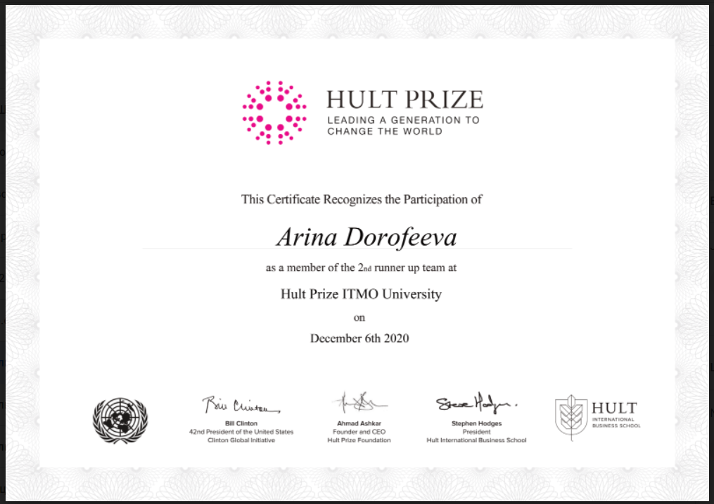
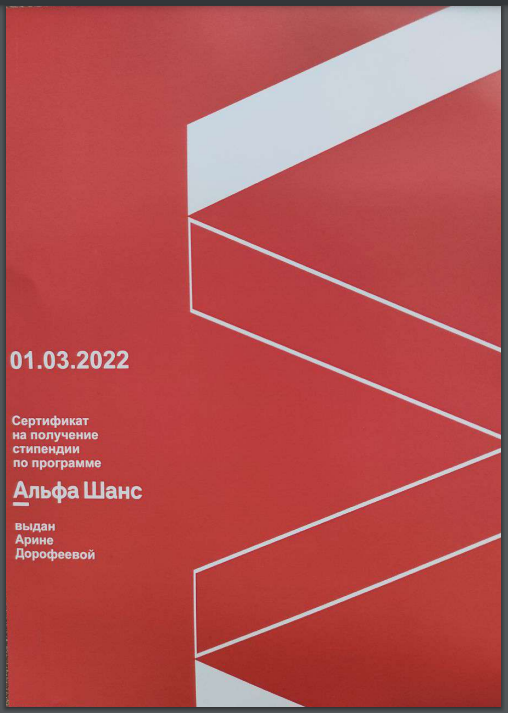

# Не совсем экологичный способ заработать на стартапе

Если бы хакатоны и конкурсы проектов были профессиональным спортом, Арина Дорофеева точно бы вошла в десятку паунд фо паунд. В прошлом она мобильный разработчик, сейчас владелец продукта, но все это в рабочее время.

Еще недавно, вечерами и выходными она надирала задницы на разных разрабовских, предпринимательских, продуктовых конкурсах, хакатонах и чемпионатах 

Собери ее регалии и дипломы, и попытка распечатать их на бумаге поставит под угрозу половину лесных площадей Земли.

Мы поговорили с Ариной и записали ее рассказ о том, как она больше двух лет собирала победы проектом, в идею которого даже сама не слишком верила. Как он родился на чемпионате с призом в миллион долларов, несколько раз преобразился и чуть не дошел до больших международных инвестиций на пике своей абсурдности.

Дальше, ее рассказ от первого лица, почитайте.

---

Мне всегда нравилось придумывать и создавать что-то новое в сжатые сроки, а победы во всяких мероприятиях давали приятные бонусы: бумажки в портфолио для повышенной стипендии (и самооценки), мерч, а если организаторы достаточно щедрые, то и денежный приз. Я просто всегда вписывалась туда, где знала, что смогу победить, и обычно побеждала. 

В декабре 2020, когда я училась в ИТМО и параллельно работала андроид разработчиком, проходил Hult Prize — международный чемпионат, в рамках которого команды студентов создают проекты для решения всемирных проблем, а победители получают миллион долларов на реализацию. Вообще формат чемпионата предполагал участие всяких Life Science стартапов, типа производства пластика из банановой кожуры или выращивания грибов для расширения прав и возможностей женщин. А мой естественнонаучный опыт на тот момент ограничивался исследовательской работой в 3 классе, когда я капала йод в стакан веселого молочника.

Но я все же решила попробовать выехать за счет «уникального» подхода и представить в качестве решения проект мобильного приложения. Как минимум, это не требовало особых усилий, а шансы занять что-то на региональном этапе имелись, да и опыт интересный. Темой 2020 года было что-то связанное с едой и экологией, и если бы не это ограничение, то я бы в жизни не придумала такую дичь: 

Tamagotchi Earth — мобильное приложение, которое отражает влияние действий пользователя на планету. Другими словами, персональная планетка в виде анимешной девочки а-ля «земля-чан», ест то же самое, что и хозяин, а потом плачет или смущенно улыбается в зависимости от того, насколько экологично производство съеденного продукта. Характеристики у нее тоже своеобразные: вместо уровней сна, сытости и счастья, как в оригинальном Тамагочи, у Планетки меняются показатели выбросов углекислого газа, использования воды и площади территорий, занимаемых производством продуктов.

 
 

Для защиты проекта было достаточно интерактивного прототипа, который мы набросали в фигме с дизайнером из моей команды с хакатонов, а его девушка сделала милые анимации для эмоций Планетки. За это я включила обоих в команду, чтобы подогнать им сертификаты и удовлетворить условиям участия.

На чемпионате я выступила одна с тремя бейджиками, по привычке рассказала какая у меня замечательная команда специалистов и как мы быстро и дешево готовы разработать полноценную версию приложения, за что получила второе место и три шоппера с книжками (с которыми я потом навернулась на льду по пути в офис)...

Первое место досталось какому-то крутому биотехнологическому стартапу, они прошли в следующий этап, а мне сказали, что я молодец и деньги мне не нужны — можно хоть сейчас разрабатывать. В целом, справедливо. 
Просто так разрабатывать я, конечно, ничего не стала. Но идея мне понравилась, захотелось пропихнуть Планетку еще на какие-нибудь конкурсы в будущем.

## Как менялась Планетка

Среди российских компаний царил тренд на экологичность, поэтому кейсы во многих хакатонах были связаны с проблемами окружающей среды. Да и вообще стало заметно, как все вокруг пытаются сделать вид, что они эко-френдли и заботятся о природе.

В апреле 2021 года проходил хакатон на тему экологии, и я решила залететь на него с Планеткой. (Выходить на соревнование с готовым решением — плохо и я такое осуждаю, но мы по факту полностью переделали идею, не говоря уже о том, что исходное приложение тоже не было реализовано.) Нужно было разработать сервис, который бы позволял бизнесу отслеживать и сокращать свой экологический след.

Так Планетка внезапно трансформировалась в веб-приложение с трекингом экологичности материалов, используемых при ремонте и обустройстве офисов, всевозможными подсказками и рейтингом компаний пользователей, а от изначального проекта осталось буквально одно название. Очень сомневаюсь, что подобное решение кто-то бы использовал на практике, но жюри видимо оценили наш креативный подход.

Мы даже успели сделать неплохой MVP, заняли первое место и получили айпады (типа экологичные девайсы) в качестве призов.
На гребне той же эко-волны я вписалась в конкурс социальных проектов и взяла там первое место, предложив запихнуть в Планетку отслеживание расхода воды и электричества, с помощью интеграции со счетчиками от «Умного Дома» МТС. А еще рекламу других сервисов экосистемы МТС, о которых до этого ни разу не слышала. 

Пиар получился отличный, и для организаторов, и для моего универа, а символический грант в размере 250к рублей даже отрабатывать особо не пришлось, потому что никто не был заинтересован в реальном внедрении решения. Я просто сделала отчет и раскидала денежку между сокомандниками.

...Такими темпами у Планетки поднакопилось приличное портфолио (и даже [научная публикация](https://www.elibrary.ru/item.asp?pff=1&id=48015333)), с которым можно было без проблем побеждать в других конкурсах с денежными призами, типа [Альфа-шанса](https://news.itmo.ru/ru/news/12466/). Чем больше грантов — тем больше грантов!

В свободное время я набросала мини-прототип приложения под андроид на котлине, потому что писала на нем на работе, и планировала как-нибудь переписать нормально на кроссплатформу. Но я так и не дождалась стабильной версии Kotlin Multiplatform и, окончательно выгорев, свалила из мобильной разработки летом 2021. Мне надоело заниматься чужими хотелками с минимальной возможностью повлиять на ТЗ.

В итоге я психанула и устроилась менеджером в немецкую компанию, где вроде бы снова почувствовала себя в своей тарелке. Теперь на работе я управляла разработкой уже зрелого продукта, а по выходным продолжала хакатонить, и там же находила людей, которые помогали мне со стартапом.

Планетку сначала перевезли на Flutter, когда я нашла флаттериста на хакатоне от РЖД, а потом — на Node.js с помощью Strapi. 

На готовый продукт она мало чем была похожа, но это позволило мне провести какой-то более менее релевантный кастдев и определить целевую аудиторию: экоактивисты, внезапно веганы и... анимешники(??). Постепенно вырисовывалась бизнес-модель, а с более проработанным проектом было проще подаваться на разные конкурсы и получать небольшие денежные призы.

В августе 2021 года Планетка победила в стартап-фестивале [DOERS](https://news.itmo.ru/en/education/students/news/12084/) на базе совместной школы от ИТМО и какого-то зарубежного университета. Чтобы попасть на защиты перед инвесторами, нужно было проработать проект на двухнедельном акселераторе — в первой половине дня посещать лекции, во второй — выполнять практические задания. Я совмещала все это дело с учебой и работой, поэтому на лекции ходил мой новый сокомандник с экологического направления, которого я нашла на этом же акселераторе.

Еще я выступала с Планеткой в Сколково, но там мне удалось выбить только бумажку призера, потому что само по себе приложение со своей F2P моделью было «волонтерским» и не подразумевало активной монетизации. 

Хайп на экологичность в стране как будто начал спадать, так что дальше я собиралась копать в сторону международного рынка.

## Конец «Планетки»

На 2022 год у меня назревали наполеоновские планы: получить крупный грант, зарегистрировать свою компанию, разработать полноценную версию Планетки... Я даже прошла отборочный этап в каком-то японском акселераторе. 

А когда случился конец февраля и меня уволили из немецкой компании одним днем, то стало уже не до Планетки — нужно было хотя бы найти новую работу. За три месяца откликов и собеседований в зарубежные компании я получила кучу отказов, в итоге устроилась в российскую компанию на должность владельца продукта.

Моя команда разъехалась по всяким Сербиям и Грузиям и вскоре распалась, а Планетку я отложила в долгий ящик, из которого вытащила только в 2023 году, для защиты диплома в рамках программы «Бизнес-тезис». 

Тут произошла очередная трансформация концепции приложения — теперь Планетка начала жрать мусор и трекать экослед пользователя в разрезе сортировки и переработки отходов. И, если для изначальной идеи у меня были хоть какие-то научные обоснования подсчетов изменения характеристик (какая-то статья на BBC с указанием приличного источника), то для дипломной работы я уже высасывала формулы практически из пальца, ориентируясь на сомнительные сайты со статистикой по РФ и еще более сомнительные ответы вовремя выстрелившего чата гпт.

По результатам защиты меня пригласили выступить с проектом перед китайскими инвесторами, но переделывать формулы под Китай казалось уже совсем дурацкой идеей — у меня больше не было ни команды, ни сил, ни хоть каких-то релевантных данных для подсчетов. На этом история Планетки закончилась.

Tamagotchi Earth — мой самый амбициозный и долгоиграющий проект, который я так и не реализовала. Планетка окончила свое существование, питаясь отходами, а я попыталась выжать максимум выгоды из заведомо провальной идеи.

Благодаря Планетке я стала «Лучшим выпускником 2023» в номинации «Предприниматель», так и не выпустив приложение и не открыв никакого бизнеса, а еще получила [NFT-диплом](https://rarible.com/token/0x2f69cced070a7c2e94a4172411b596294f4a26dd:12) в виде картинки тамагочи, сгенерированной на основе текста ВКР. 

Красный диплом отправился почтой к маме во Владивосток, а бабушка, кажется, начала подозревать, что мои победы на «хахатонах» это немного не про КВН.
