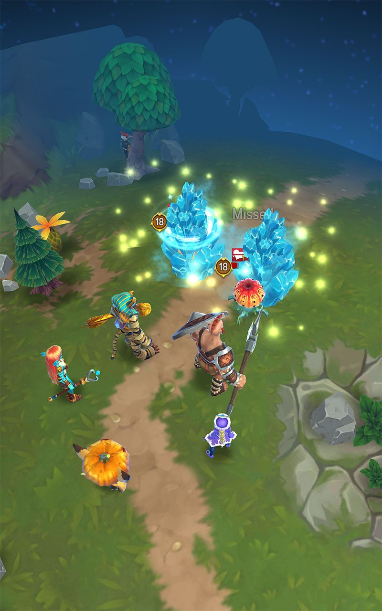
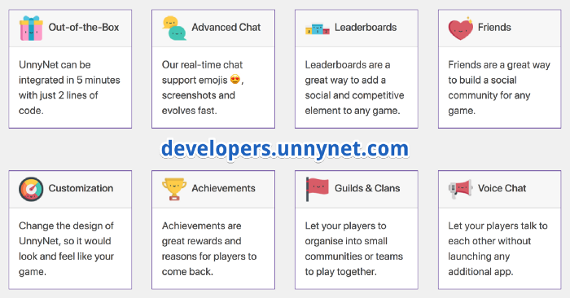
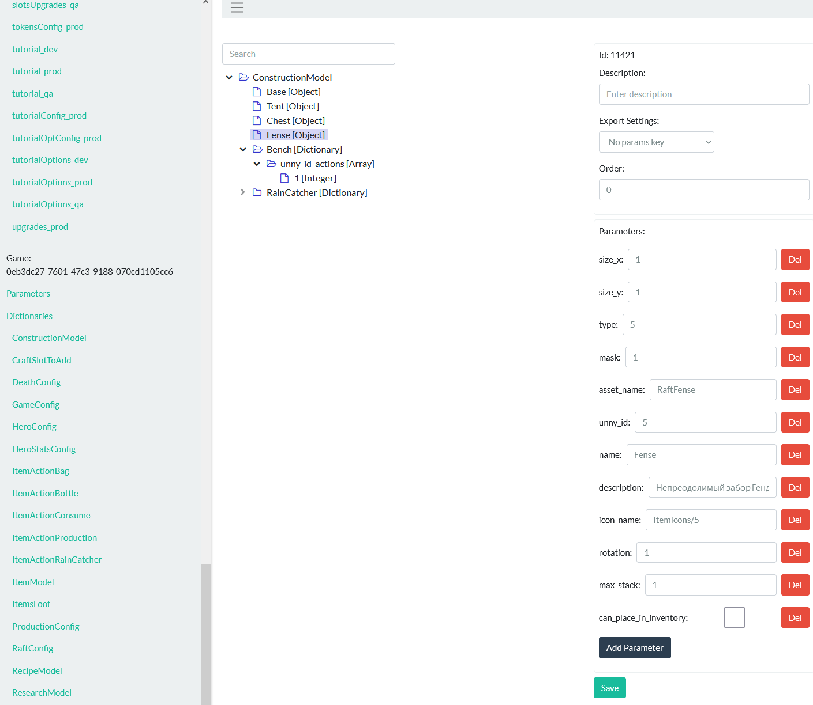
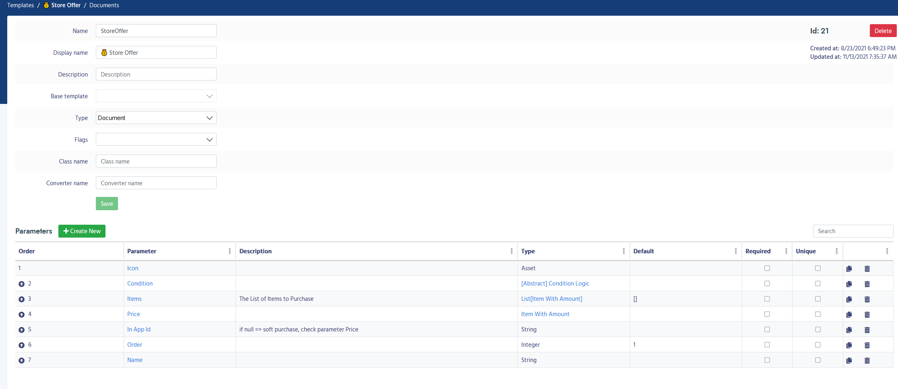
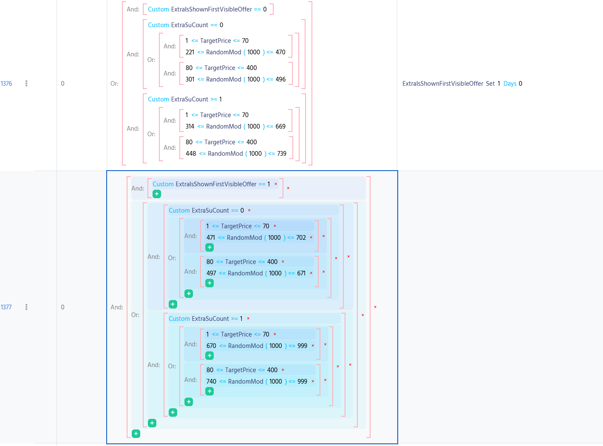

# Из разработчиков игр в разработчики сервиса Balancy для разработчиков игр

Несколько лет стартапства и разработки своей провальной MOBA, чтобы в итоге создать новый стартап для помощи другим разработчикам игр. Сорванные оферы из-за *****, переезд на Кипр и другие приключения.

## Как всё начиналось

В далёком 2014 на одном из геймджемов мы представили [прототип](https://www.youtube.com/watch?v=e_PqtbKPAGw) кроссплатформенной MOBA.

Часть геймплея с боями на арене представляла собой, по сути, мобильную Лигу Легенд (на тот момент подобных игр ещё не было, а Vainglory появился чуть позже). С этим проектом мы [поучаствовали в нескольких акселераторах и получили инвестиции](https://dtf.ru/gamedev/10999-blog-tri-goda-razrabotki-svoey-mmo).

За несколько лет посетили несколько других стран и акселераторов, но из-за неопытности и амбиций стартап пришлось закрыть. Про наши косяки, ошибочные решения и некоторые технические аспекты можно почитать в [отдельной статье](https://suvitruf.ru/2018/07/10/4124/unnyworld-postmortem/).

Мы до последнего тянули проект и надеялись, что всё получится, но в какой-то момент, всё же, осознали, что игру лучше закрыть. У нас ещё оставалось немного денег на з/п сотрудникам (основатели на тот момент уже год как не получали зарплату), решили из ассетов UnnyWorld по быстрому сделать батлер Hero Masters.

Примерно месяца за 2-3 запустили более-менее рабочую версию, чтоб собрать базовые метрики. Они были неплохими, игра даже приносила немного денег (на удивление, больше, чем MOBA, которую пилили несколько лет), но для самоокупаемости не хватало. В итоге было принято окончательное решение закрыть компанию.

## Инструменты нужны всем

Для каждого нашего проекта мы создавали те или иные тулзы. Для UnnyWorld, где очень много игровых данных (баланса), я написал простенькую админку на php. Визуально она представляла собой типичные дашборд, где слева дерево элементов (конкретных сущности, e.g. предметы игровые), а справа параметры этих элементов (стоимость, прочность и т.д).

Было несколько окружений: dev, stage, production. При публикации изменений они все улетали в виде json’ов на CDN, а игра уже эти данные потом подкачивала. Было довольно удобно: не нужно возиться напрямую со спредшитами, json’ами, xml’ками и прочими штуками. Геймдизайнер в руки получал удобный инструмент, а вся остальная магия, связанная с движением данных по сети, их не заботит.

Для Hero Masters использовали эту же админку. Игра была частично оффлайн, отдельные игровые инстансы были не нужны, для неё сделали API’шку для авторизации через социалки/геймцентры и для работы с сейвами. На этом этапе призадумались над тем, что похожие вещи делаем в каждом проекте. Как раз в этот этот момент начали обдумывать, как бы сделать это в виде отдельного сервиса, чтобы и другие разработчики могли использовать в своих проектах.

Т.к. компанию пришлось закрыть, а денег последний год+ мы себе не платили, то пришлось искать работу, но параллельно с одним из ко-фаундеров [Пашей Игнатовым](https://www.linkedin.com/in/pavelignatov/) решили, всё же, попробовать запилить сервис.

## Судьбоносный пивот или как появился Balancy

Пока пилили Hero Masters и UnnyWorld, очень хотели сделать аналог BattleNet, но для своих игр: общий аккаунт, друзья, чат и прочие социальные фишки. Так и появилась первая версия сервиса под названием [UnnyNet](https://balancy.co/?utm_source=razrabs&utm_medium=razrabs&utm_campaign=history_article&utm_id=balancy_history).

Под капотом у нас было опенсорсное решение [Nakama](https://heroiclabs.com/), которое, в свою очередь, использовало CockroachDB в роли базы данных. На тот момент у нас уже были реализованы чат, группы, гильдии, лидерборды, ачивки и даже какая-никакая кастомизация чатика.

Отдельно отмечу, что сам чат и его дизайн работали из коробки, в мобильных билдах это всё открывалось в WebView. Разработчикам не нужно было ничего верстать или писать логику по обработке сообщений. Но, само собой, из минусов то, что наш дизайн мог не подходить под игровой UI и смотрелся инородно.

По ходу дела мы решили пивотнуться именно в сторону админки, через которую разработчики могли бы управлять игровым балансом. Тащить и допиливать старую систему на php не было особого смысла, слишком уж там много легаси, да и с php я уже перестал работать.

На беке использовал ноду, а на фронте реакт, т.к. я с ним хотя бы работал. Визуально выглядело всё примерно также как и старая админка — слева список типов сущностей, а справа дерево самих сущностей и их параметров.

Для прототипа этого хватило, но тут же всплыло множество проблем, начиная от удобства (особенно, если человек раньше работал с чем-то типа Гугловских Спредшитов), заканчивая тем, что не было каких-то чётких структур сущностей, что выливалось в некорректно сгенерированные json’ы.

После общения с разработчиками и эдвайзерами переделали дизайн на более привычный большинству, плюс пересмотрели механизм того, как задаются структуры документов.

Прикрутили бутстрап и плюс-минус однородный дизайн получился. Навигация слегка поменялась: слева типы сущностей (шаблоны), справа таблица с данными.

Сами шаблоны и их параметры теперь нужно задавать заранее.

Для работы с документами шаблона выбираем потом его в левом меню.

В админке шаблоны помогают работать с чёткими структурами, типами и параметрами. Это в принципе удобно, но и, как следствие, получаем из коробки механизм по валидации этих данных: проверка типов, битых ссылок и прочее.

Шаблоны ещё используются и в том же Unity (для которого нужно поставить наш плагин) для генерации необходимых классов. Все те параметры, которые были заданы в админке, становятся свойствами сгенерированных классов. Код по закачке json’ов и их мапингу на эти классы тоже генерируется нами. Разработчик в итоге получает уже готовые структуры, которые использует непосредственно для работы с игровой логикой.

Мы позиционировали решение как «умные Спредшиты». Клиенты находились, но, если сравнивать с нашим прошлым стартапом, [Balancy](https://balancy.co/?utm_source=razrabs&utm_medium=razrabs&utm_campaign=history_article&utm_id=balancy_history) — это чистый b2b проект, для которого намного тяжелее искать клиентов. Продать потенциальному покупателю решение, которое «будет лучше json’ов и Гугл Таблиц», весьма проблематично. Как пример, самые частые препятствия, которые мы встречали:

1. Я привык к X, Y, Z
2. Наши разработчики сами такую админку сделают за месяц (спойлер: не сделают)
3. За это нужно платить
4. Вендерлок (это частая причина отказа крупных студий, который хотят всё инхауз делать)
5. У нас уже есть подобие админки

Очевидно, что продавая решение теглайном «как Гугл таблицы, но лучше», мы особого успеха не достигнем. Нужна была какая-то особенная фича, которая сразу бы заинтересовала потенциальных покупателей.

## Умные оферы и лайвопс

Наблюдая за нашими клиентами, мы заметили, как на базе админки они пытаются реализовать какие-то свои бизнес-задачи. Один из них, например, на базе шаблонов и наследования построил систему туториалов и квестов.

Чуть позже другой клиент, которому мы помогали с переносом их данных с уже запущенного проекта, пытались реализовать в админке систему оферов внутриигровых.

Таким образом получилось реализовать как базовые логические условия типа и/или, так и всякие дополнительные по полям/enum’ам. И, что самое главное, редактировать такие документы очень удобно по сравнению с Гугл Таблицами или, упаси боже, сырыми json’ами.

Обмозговав это и поговорив с другими людьми из индустрии, мы пришли к выводу, что было бы неплохо что-то такое реализовать нам самим в виде отдельного модуля/пакета. Разработчик потом, при необходимости, прям в админке мог бы одним кликом добавить в существующий проект все эти предзаготовленные нами структуры и данные.

Какое-то время обсуждали эту тему с разработчиками игр и потенциальными клиентами. Целью было получение софт коммитмента на то, что при реализации такой фичи в нашем сервисе, они станут нашими клиентами. Собрали пул таких студий и начали пилить функционал.

Для оферов мы, в том числе, добавили визуальный редактор с базовым функционалом, чтобы геймдизайнер мог без проблем настроить все условия для показа внутриигровых оферов (к примеру, окно с покупкой сундука на 10 уровне или предложить купить крутой меч при пройгрыше 5 раз подряд).

## Эхо войны

Примерно в то же время мы обсуждали с потенциальными инвесторами вопрос инвестиций. К концу февраля 2022 у нас уже был на руках офер, но планы изменились. После начала войны фонды и ангел-инвесторы практически перестали инвестировать в российские стартапы, если фаундеры находятся в России или если счета там.

Одно из условий было переезд и оформление гражданства/ВНЖ в другой стране. Следующие месяцы мы шлифовали проект и параллельно искали варианты. Был один акселератор из Канады, который мог бы инвестировать и помочь с релокацией, но они за это брали ещё процент компании сверху, что нас не устраивало.

В итоге вышли на ангел-инвестора с Кипра, который согласился в нас вложиться, если мы переедем. В конце июня мы с тиммейтом уехали из России, создали свою компанию на Кипре и наняли себя как сотрудников, чтобы оформить рабочие визы. Сейчас в процессе получения ВНЖ и открытия банковских счетов.

На данный момент ищем четырёх сотрудников в компанию:

1. Бекендщик. Стек: нода + ts + nest.js + Постгря.
2. Фронтендщик. Тут реакт + ts + вебпак.
3. Лайвопс менеджер/продюсер с опытом запуска и оперированием успешных проектов. Из задач: участие в создании продукта и помощь текущими клиентам для создания успешных кейсов.
4. Биздев для общения с игровыми разработчиками и партнёрами, включая, анбординг и привлечение новых клиентов. Нужен человек с нативным английским или около того.

Зарплата в евро + опцион. В Россию переводить деньги нет возможности, поэтому нужны люди с иностранными счетами.

Если же вы разработчик игр, который заинтересовался сервисом и хочет опробовать, то сделать это можно бесплатно до определённого числа документов в системе. Если же будут вопросы, то всегда можно задать их в нашем [Дискорде](https://discord.com/invite/JP9heQP4DN) или напрямую мне в [Телеграмме](https://telegram.me/Suvitruf).