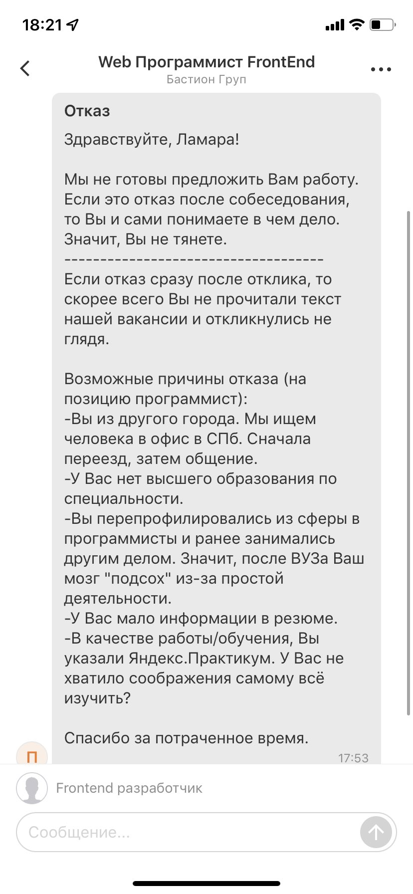
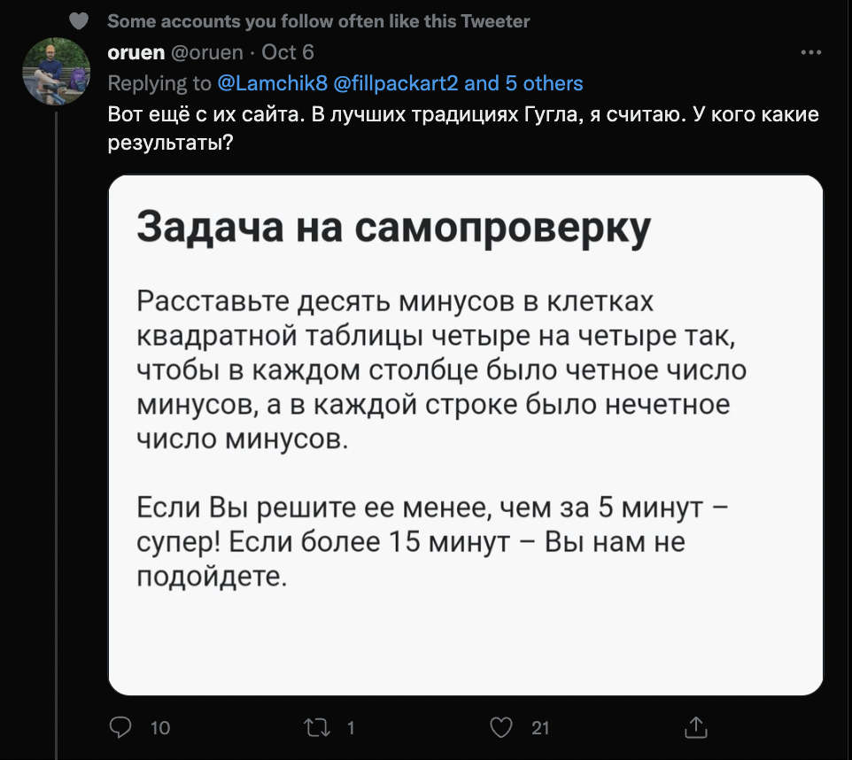
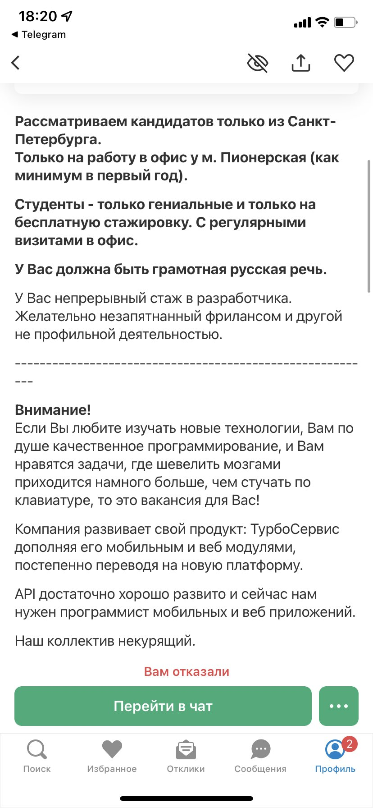
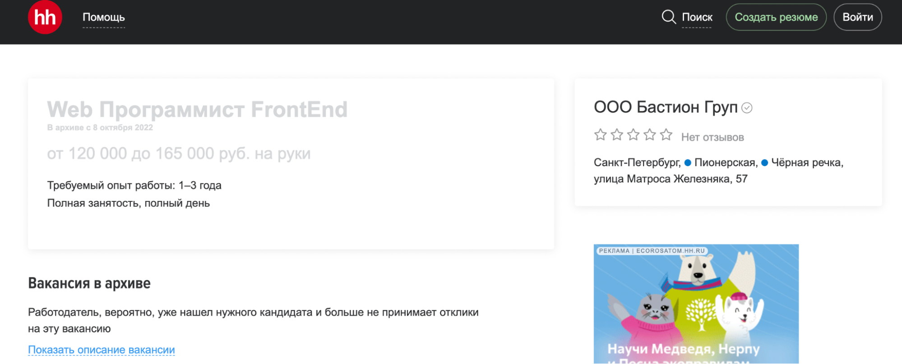
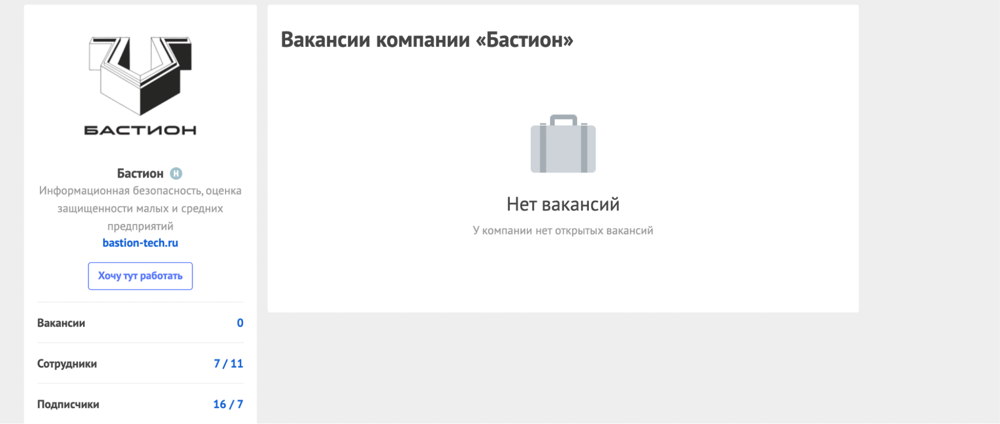
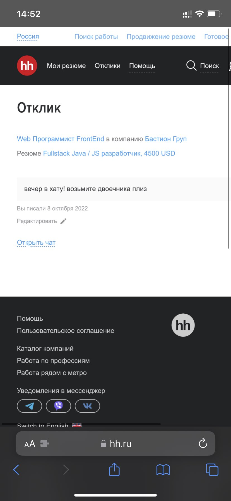
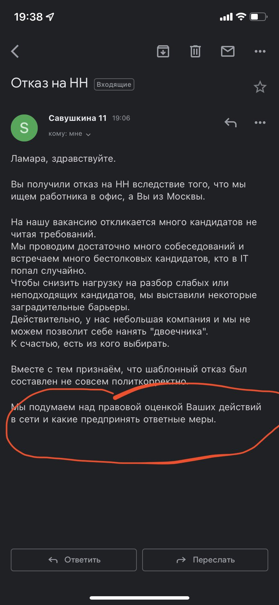

# Урок вежливости: как отвечать соискателям, чтобы ославиться на все IT-комьюнити

Несколько советов, как написать настолько токсичный отказ, чтобы к вам больше никто и никогда не устроился на работу.

История произошла с пользовательницей твитера [Ламарой](https://twitter.com/Lamchik8). Вот такой ответ ей пришел в ответ на отклик на вакансию от компании ООО «[Бастион Груп](https://bastion-tech.ru/)»

За двое суток [твит](https://twitter.com/Lamchik8/status/1578045502440046595) собрал почти 4 тысячи лайков и более 600 ретвитов.

Что же примечательного в этом отказе? Вдруг вы захотите повторить опыт компании и отпугнуть соискателей на полгода вперед:

1. Уничижительный тон — чего только стоит фраза, что, если отказ последовал после собеса, то «значит Вы не тянете». И к слову, если обращаться на Вы с большой буквы и при этом писать подобную дичь, письмо не становится более уважительным или адекватным. 
2. Попытка возвыситься над кандидатом. Чего стоит упоминание студентов «Яндекс. Практикума» риторическим вопросом: «У Вас не хватило соображения самому всё изучить?». Зададим другой риторический вопрос: какая вообще разница, каким образом человек наработал свои скиллы, если они соответствуют требованиям?  
3. Негативное упоминание перепрофилировавшихся разработчиков. Вместо того, чтобы спокойно указать, что компании нужен разработчик только с профильным высшим образованием и опытом работы по специальности, рекрутер или автор письма утверждает (!), что у всех остальных соискателей «подсох» мозг, что бы это ни значило. Что «подсохло» у рекрутера или менеджера, который это пишет, история умалчивает. 

А ещё — тысячи весёлых комментариев.

А вот так выглядела непосредственно сама вакансия. Из описания в принципе уже понятно, что с компанией не всё хорошо.

Что же не так в описании:

1. Гениальные студенты на бесплатную стажировку. Зачем гениальным студентам работать бесплатно — очередной открытый вопрос.

2. Белопальтоввя «незапятнанность» фрилансом. С каких пор фриланс — это страшный грех для разработчика?

3. В описании не перечисляются бонусы, только требования. Любить новые технологии, задачи, которые требуют «шевелить мозгами», не курить. Предложили бы хотя бы услуги психолога, чтобы влиться в такой дружный, судя по описанию, и счастливый коллектив?  К слову, предлагается зарплата в 120—165 тысяч рублей — для программиста с профильным образованием и опытом до трёх лет…

На следующий день после публикации скринов в твитере компания вакансию с he.ru удалила:

Сейчас вакансий у компании вообще нет.

По всей видимости, причина в том, что особо сочувствующие члены комьюнити не ограничились гневными комментариями, а начали откликаться на эту прекрасную вакансию.
Например, вот так:

И такие:

А ещё они написали девушке, опубликовавшей скриншот, письмо с угрозами:

В этом письме тоже всё прекрасно: заградительные барьеры, найм «двоечников», предположение, что отказ был составлен «не совсем политкорректно». К слову, этот термин означает практики, используемые, чтобы не оскорблять или не ставить в неудобное положение уязвимые группы людей — национальные и сексуальные меньшинства, лиц с инвалидностью. К каким из этих меньшинств они относят своих соискателей, мы без понятия. Любопытно было бы поинтересоваться у компании, но нам кажется, что ответа мы не получим.