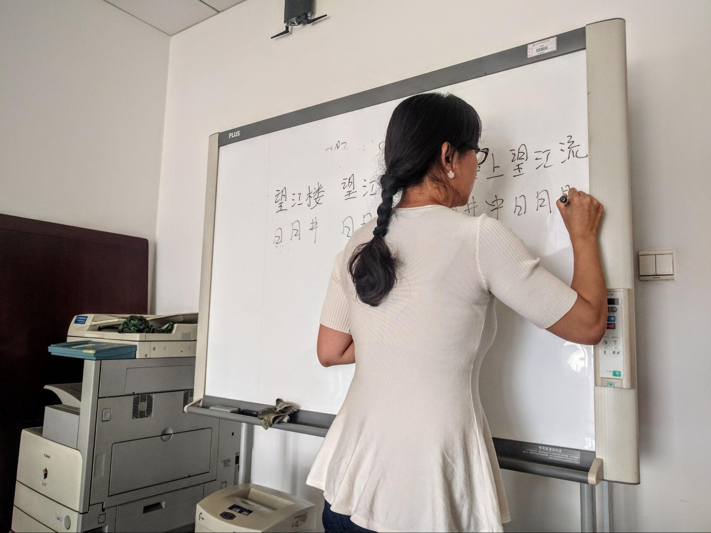
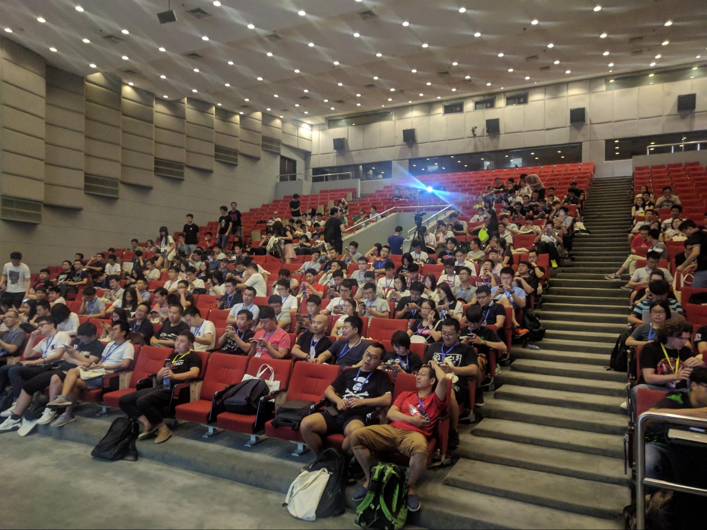

# Что происходит с IT в Китае и как туда релоцироваться

Действительно ли в Китае так распространена культура 9-9-6, чем отличается IT-индустрия и как туда уехать, а главное — зачем.

## Целые индустрии умирают и рождаются под давлением государства

Бизнес в Китае жёстко регулируется государством. 2021 [год стал переломным](https://www.lawfareblog.com/chinas-tech-crackdown-year-review) для китайского технологического сектора. Так, летом 2021 года правительство ввело жёсткие ограничения для индустрии дополнительного образования. Это был один из наиболее прибыльных секторов, рост которого сильно простимулировала пандемия. В результате введения ограничений размер китайского рынка репетиторства сократился в 4 раза — со 100 млрд до 24 млрд долларов. 

А ещё Пекин решил обуздать крупнейших мировых технологических гигантов, в том числе Alibaba и Tencent. Правительство предприняло серьёзные законодательные и административные шаги, в том числе ужесточило [антимонопольное](http://www.gov.cn/zhengce/2020-10/26/content_5554096.htm) законодательство и требования к [конфиденциальности](https://drive.google.com/file/d/1XzF368QsHyPwEOlVKhw_6LstgxJHy9jj/view). В результате [по оценкам](https://www.economist.com/the-world-ahead/2021/11/08/xi_jinpings-crackdown-on-chinese-tech-firms-will-continue) более 1 триллиона долларов было вычеркнуто из совокупной рыночной капитализации китайских технологических гигантов.

Жёстко регулируется игровая индустрия: геймерам в Китае разрешено играть только в игры, одобренные правительством, а ещё им запрещено играть с иностранцами на иностранных серверах. Хотя иностранные игры напрямую не блокируются, скорость интернета, как правило, слишком низкая и не позволяет играть.

Также длительность компьютерных игр ограничили для школьников — до трёх часов в неделю. А ещё притормозили одобрение новых игр. Две крупнейшие китайские геймдев-компании NetEase и Tencent (в том числе занимается разработкой игр и производством микросхем) [заставили](http://english.www.gov.cn/statecouncil/ministries/202109/09/content_WS61396250c6d0df57f98dfe70.html) удалить из игр женственных мужчин и прочий «неприличный и жестокий контент, который может вызвать у игрока нездоровые склонности, такие как поклонение деньгам, женственную слабость и изнеженность».

А ещё на индустрию жёстко давят США. Например, в сентябре администрация Байдена заявила, что американским технологическим компаниям, получающим федеральное финансирование, [запретят](https://www.bbc.com/news/62803224) строить объекты «передовых технологий» в Китае в течение 10 лет. Речь идёт, в том числе, о таких [компаниях](https://www.nytimes.com/2022/09/01/business/tech-companies-china.html) как Google и Apple, Microsoft и Amazon. Производство уже начали переносить в Индию и Вьетнам.

Руководство обнародовали в рамках плана стоимостью 50 млрд долларов, направленного на создание местной полупроводниковой промышленности. Это связано с тем, что бизнес-группы настаивают на большей государственной поддержке, чтобы уменьшить свою зависимость от Китая. Недавно они столкнулись с глобальной нехваткой микросхем, что замедлило производство. Такие ограничения тоже негативно повлияют на присутствие цифровых компаний в стране, число рабочих мест и ситуацию на рынке труда.

_Андрей Ситник — ведущий фронтенд-разработчик в [Evil Martians](https://evilmartians.com/). Занимается продуктовой разработкой для стартапов и крупных компаний. Руководит распределённой командой инженеров и opensource-лихачей. Разрабатывал российский Groupon, сайт Рокетбанка и даже немного «Хабрахабр». Создал «Автопрефиксер», PostCSS, «Браузерслист», «Логакс» и Nano ID._

Китайцы всегда живут обособленно, больше думая про свою страну и Азию. Это примерно как жизнь в России не изменилась после начала войны в Йемене.
Я сам встречался с людьми из индустрии, когда мог туда ездить. С моей колокольни увидел следующее:

1. Высокая централизация капитала. Деньги в основном дают пара очень крупных игроков.
2. Очень сильное влияние государства. Целые индустрии могут вымирать или расцветать из-за сиюминутных решений правительства. Например, недавно уничтожили местную игровую индустрию, перестав выдавать разрешения на игры.
3. Все в основном работают в огромных корпорациях в офисе — ну или я был на таких конференциях, но эти ребята, вроде, единственные, кто продвигает веб-стандарты.
4. Свой технологический стек — Vue.js вместо React. Своя школа дизайна: яркие перегруженные приложения уже в прошлом, но дизайн не похож на западный.
5. Денег, работы на порядки больше, чем в Японии и других странах. Общество прямо меняется под местными стартапами.

Чувствуется ли упадок в китайском IT? В теории да, но после 2020 года оттуда поступает очень мало информации. Из-за карантина я сам не могу приехать и поспрашивать. Но очень сильный удар однозначно пришелся по индустрии игр и e-commerce. Неизвестно, что про это думают в обществе. Это осталось скрыто за железным занавесом после коронавируса.

## В обществе ценят деньги и переработки

Богатство — доминирующая в китайском обществе ценность уже множество веков. Как [отмечает](https://elar.urfu.ru/bitstream/10995/45312/1/30_kafreligio_UrFU-2017-12.pdf) исследователь Н.А. Спешнев, до VI в. до н. э. богатство было органически связано со знатностью, а уже в «Книге истории» (Шуцзин), вошедшей в состав конфуцианского «Пятикнижия», перечислены «пять проявлений счастья», среди которых богатство уступает только долголетию.

Современные социологические опросы также демонстрируют, что богатство доминирует в списке ценностей общества. В частности, французская исследовательская компания Ipsos опубликовала результаты проведенного в 20 странах социального опроса. Темой опроса стало «Отношение к материализму, богатству и семье». Согласно опубликованным данным, стремление к материальным благам у жителей Китая почти в два раза выше, чем у представителей других наций.

На Новый год традиционным поздравлением является фраза 恭喜发财 («гунси фацай!»). Это не пожелание традиционных европейских благ — счастья, здоровья и любви, а переводится как «желаю вам огромного богатства!». На дверь вешается иероглиф 福 («фу») «богатство», который часто также переводится как «счастье».

_Андрей Ситник_

В Китае очень уважают деньги ещё испокон веков. В обществе считается, что кто богат — тот и умный. Например, глава компании Alibaba спел с популярным музыкантом. Он спел ужасно, но в Чинете, то есть китайском интернете, это очень позитивно обсуждали — в контексте: «Раз он столько заработал, то, значит, и слушать его песни нужно». На Новый год все дарят друг другу именно деньги. Когда собираются семьёй, тот, кто богаче, платит за ужин в ресторане, но при этом он сам выбирает, что все будут есть. То есть деньги там — самый главный ресурс.

Этот принцип множится на сильнейшую конкуренцию. Каждый пытается быть самым лучшим, но это тяжело в стране с 1 млрд населения. Поэтому переработки — полная норма вообще в любой индустрии. Например, на заводах там немалая продолжительность рабочего дня, но за переработки платят больше. В результате все начинают брать переработки и получается ужас.

Переработки в IT — следствие такой культуры. Ты можешь уйти раньше, но получишь ли потом повышение, если твои коллеги остались работать? А будут ли у тебя деньги на дорогие подарки родителям на Китайский Новый год? Будет ли семья считать тебя человеком, если ты не богат? А вот «сын маминой подруги» уже тимлид в Tencent, он-то оставался на переработки. 
Немного контекста есть в видео этой китайской блогерши:

[раз](https://www.youtube.com/watch?v=a5hg3DcC5R4) 
[два](https://www.youtube.com/watch?v=z2y1kPBEv2Q)

В Китае мало небольших команд. Все, с кем я сталкивался, в основном были из гигантов типа Baidu, Alibaba. Им строят целые города. Alibaba фактически контролирует свой родной город, где компания отгрохала целый квартал. В Пекине я был шокирован огромным районом для офисов IT-компаний, который воздвигло государство. Это было медвежьей услугой: айтишники бежали из Пекина из-за загрязнения воздуха, а правительство устроило добровольно-принудительный переезд компаний в Пекин. Понятно, что маленькие игроки тоже есть, но относительно России их меньше.

Конференции огромные, на них невероятно много людей, но всё строго по этикету. Afterparty с алкоголем не делают — вместо этого едут в ресторан. Еда тут важнее алкоголя из-за особенностей культуры.

Ещё одно отличие — дизайн. В 90-х был ужасный дизайн в IT, ему на смену пришла новая школа с простым подходом. Интересно, что их дизайн-язык как будто заимствует традицию рисования гуашью по мокрым полотнам — знакомые многим журавли на камнях. Характерны пастельные цвета, минимализм.

_hao123.com_

_Лаврентий Добижи, учится в магистратуре и стажируется в китайской компании_

Я учусь в магистратуре по IT-специальности. В рамках учёбы у меня была стажировка в Китае, но из-за пандемии COVID-19 она проходила онлайн.

Многие слышали о «правиле 9-9-6», согласно которому китайские специалисты работают с 9 утра до 9 вечера 6 дней в неделю. Это справедливо и для айтишников. Про них даже ходят шутки, что такие люди одиноки и ни у кого нет девушки, потому они всегда на работе. Это правда так, причём не только в IT, переработки — огромная проблема Китая. Молодёжь уставшая, у них нет ни на что времени. Только работа. Даже в России и Беларуси ребята из китайских компаний работают сутками.

Люди устали от этого, но ничего не могут сделать. У многих кредиты, а создать семью и растить даже одного ребёнка очень дорого. Все крутятся в этом порочном круге и ничего не могут с этим сделать. Я слушал подкаст про русскоговорящих иностранцев, которые работают в Alibaba. Там называли какой-то средний срок работы в компании — два с половиной года или даже меньше, если я правильно помню. В таких крупных компаниях довольно много народа приходит и уходит, просто не выдерживают. Один спикер рассказал, что продержался несколько лет, но однажды пришлось работать полгода без выходных. Он говорил, что превратился в робота и уже не понимал, что делает.

Молодёжь из числа моих знакомых работает именно так. Даже у тех, кто не связан с IT, один выходной в неделю. По закону должно быть два выходных, и есть компании, которые соблюдают этот закон, а в других его игнорируют. Усталость ощущается во всём обществе. В общественных пространствах в основном видишь стариков. Только они могут позволить себе отдохнуть, позаниматься спортом на свежем воздухе.

Я не могу судить о зарплатах из личного опыта, но, насколько я понимаю, зарабатывать там можно неплохо. Если ты лоялен компании, круглые сутки работаешь, ты хороший специалист, то будешь зарабатывать хорошо. Но в интернете и новостях встречаются сообщения, как кто-то умер на работе от остановки сердца, как топовые специалисты не выдерживают жёсткий темп и получают нервный срыв.

## Можно ли сейчас уехать в Китай из России?

Из-за паднемийных ограничений въехать в Китай сейчас особенно сложно. Даже стажировки сейчас проходят онлайн, а о туристических поездках и вовсе можно забыть. Тем не менее попасть в Поднебесную сложно, но возможно — по трудовому договору и серьёзно заморочившись с оформлением необходимых документов для получения разрешения.

_Лина Высоцкая, лингвист, пытается уехать в Китай_

Я начала учить китайский язык в университете. Загорелась этой идее ещё в школе. У меня с детства было внутреннее ощущение, что я должна быть там. Просто внутреннее веяние, что надо ехать, хотя в России мне нравится, тут моя семья.

В этом году я окончила университет по специальности «Лингвистика», направление — «Перевод и переводоведение» по английскому и китайскому языкам. Пока я училась, у меня были большие планы на стажировку в Китае, но из-за COVID-19 они отменились.

После выпуска искала работодателя за границей. Удалось получить оффер через своего друга, который работает в IT-сфере. Я по фану прошла собеседование ещё в марте 2022 года, когда училась на 4 курсе, и меня взяли на позицию продажника. Но ситуация в мире изменилась, рынок сильно упал и вакансия стала неустойчивой. Мне предложили альтернативу — преподавать английский в китайском детском саду или в частной начальной школе. Я согласилась.

С марта начала готовить документы: нужно было предоставить диплом о высшем образовании, справку о несудимости, сертификаты TEFL, TESOL, CELTA и пройти медпроверку. Паспорт должен быть валиден не менее двух лет с момента подачи заявки, а ещё понадобится рекомендательное письмо с работы и опыт от двух лет. Ещё нужно предоставить справку об отсутствии судимости. Срок её действия — полгода, и нужно следить, чтобы она была действительно на момент подачи документов на визу.

Эти документы отправляются работодателю для оформления приглашения. Насколько мне известно, сейчас они делают не приглашение, а оффер, который отправляют в посольство. А там идёт оформление рабочей визы.

Когда я начинала оформлять документы, не знала, как это делать. Всю информацию черпала из интернета. Сначала собрала необходимые документы и сразу отнесла их на перевод и нотариальное заверение. Это была ошибка: нужно было сначала отнести документы нотариусу, сделать нотариально заверенные копии оригиналов и уже после этого делать перевод на нужный язык и тоже его заверить. Только после этого документы можно подавать в Министерство юстиции. С этим тоже возникла неразбериха, потому что я не знала, в каком порядке это делать.

Когда я пришла в Министерство юстиции и увидела огромную очередь, подумала: почему бы не подать документы через МФЦ? Да, это займёт две недели, но зато не буду стоять в очереди с шести утра. К сожалению, у меня были неправильно оформлены документы. Соответственно, через две недели мне пришёл отказ. Возле Министерства юстиции нашёлся офис грамотного нотариуса, который помог всё исправить.

После этого я опять пошла в Министерство юстиции подавать документы. Заняло это пять рабочих дней, как и сказано на сайте. В Министерстве выдают расписку, с которой нужно забирать документы, и после этого их можно направлять в МИД. Всё это делается бесплатно.

В МИД запись ведётся за месяц. Тяжело поймать свободное окошко: если сегодня получил документы, завтра в МИД уже не попадёшь. Ещё можно подать документы через МФЦ. Да, это занимает две недели, но в целом, если ждать очередь на запись в МИД, получается примерно одинаково. Поэтому я выбрала МФЦ.

Так как документы были уже правильно оформлены, никаких проблем с ними не было. Нужно оплатить госпошлину, за один документ — 350 рублей. Я оплатила её на месте, написала заявление, у меня приняли документы и отправили в МИД. Где-то через две недели я забрала готовый пакет.

После этого необходимо подать документы в посольство. Это самый настоящий квест, потому что на фоне вновь разгорающейся в Китае эпидемии COVID-19 многие не работают. Посольство не так быстро рассматривает заявление, на легализацию трудно попасть. Я пыталась, но мне сказали, что документы принимают раз в неделю. Запрос можно подать по телефону в период с 15:30 до 18:00 по Москве. На попытки дозвониться я потратила три недели. Я практически отчаялась, у меня опускались руки. Пробовала звонить в другие подразделения, но там ничем не могли помочь: всё делается только через консульский отдел, по-другому никак.

В начале сентября я оставила попытки прорваться на приём самостоятельно и обратилась в агентство в Москве, которое занимается легализацией. Я позвонила, мы договорились, они назвали приемлемую сумму за свою работу: 5 тысяч рублей за один документ. Я отправила им сканы и заключённый с китайским работодателем трудовой договор. Сотрудник взял два дня на рассмотрение моего кейса, а потом признался, что сейчас они этим не занимаются и не смогут мне ничем помочь.

Я уже не знала, куда обращаться: до посольства не дозвониться, агентство не взялось. Но вскоре увидела в поисковой выдаче агентство с хорошими отзывами на разных площадках: ВК, Инстаграм. Цена оказалась выше в два с половиной раза: за один документ они берут 13 тысяч. Я рассчитала, что в любом случае потрачу эту сумму, пока живу в Москве, и договорилась с ними. Мне сразу же сказали прислать трудовой договор и свои документы, а также контакты работодателя. В тот же день я съездила в бизнес-центр и отдала документы. К работодателю ан=агентство обращается для того, чтобы его представители проверили документы. На этом этапе была выявлена ошибка. В переводе диплома на китайский язык обязательно нужно указывать направление, то есть языки, которые изучал выпускник. Из-за того, что при переводе мне не указали: “английский и китайский язык”, пришлось снова переделывать диплом.

Специалисты создали общую переписку в WeChat с работодателем, чтобы получить рекомендательное письмо в посольство и ускорить процесс. Если уже есть и работодатель, и договор, шанс получить легализацию выше, чем у тех, кто просто подаёт документы на легализацию. Агентство отправило запрос в посольство, сейчас мы ждём ответ. Я надеюсь, что он будет положительным.

Рекомендую тем, кто сейчас релоцируется в Китай, по возможности оформляться через агентство. Главное выбрать хорошее: которому можно доверять.

Ещё сейчас из Китая работодатели могут оформить так называемый short term notification, который выдаётся иммигранту и действует месяц с момента его прибытия в Китай. За этот месяц можно оформить long term пребывание. За счёт того, что тебе дают short term notification, ты можешь подаваться на рабочую визу без легализованных документов. Но их обязательно нужно сделать в России, чтобы, когда ты приедешь на место, у тебя были документы для подачи на long term.

## Что ещё почитать/посмотреть про Китай?

[Лучший русскоязычный подкаст про Китай](https://laowaicast.ru/)

[Девушка из Китая рассказывает про образ мыслей и социальные проблемы](https://www.youtube.com/channel/UCrRUQe61gG5bS-ysND9LO2Q)

[Этот парень круто рассказывает про Азию и железо](https://www.youtube.com/c/Asianometry)

[Телеграм-канал про ИТ-бизнес](https://t.me/road2china)

[Много аутентичной информации на этом канале](https://www.youtube.com/channel/UCfjpfd1ZEYBcrv6umNKDANw)

[Канал про Китай раньше и сейчас](https://t.me/china80s)
