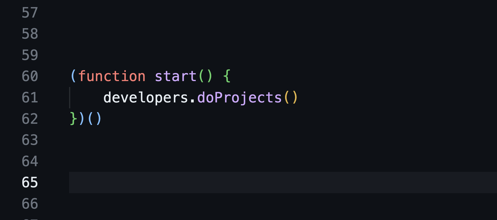

# Пора

С тех пор, как я написал свою первую программу – она спрашивала имя пользователя, чтобы потом послать его на хуй – я принялся пилить СВОЙ проект. Я в общем только поэтому и хотел программировать. В то время о высоких зарплатах в IT никто не говорил, в основном потому, что их и не было – в моём городе крутые программисты дай бог если пятьдесят тысяч рублей с премией получали. И программистами хотели стать ради двух вещей: сделать свою компьютерную игру, или свой суперстартап.

С тех пор я всегда параллельно с работой что-то пилил. Один, с друзьями, с коллегами – всегда был какой-то проект, на который я возлагал все свои надежды, и в который сливал всё свободное время. Кроме парочки некоммерческих библиотек, ни один так и не увидел свет – я или разочаровывался в идее, или понимал, что перерос свой код, а переделывать лень, или друзья отваливались, или слишком загорался новым.

Сейчас я их вспоминаю, и злюсь на себя – зря бросал. Даже самые ранние. Писал кучу кода, исследовал, просчитывал, генерил идеи – совершал море работы, а потом выбрасывал на помойку только потому, что не хватило веры и упорства. 

Но их и не могло бы хватить! Ты можешь на голом энтузиазме херачить месяц, можешь три, и даже целый год, но в какой-то момент энтузиазм кончится, если не будет внешней валидации. Больше того, я тогда мыслил вот так: "есть идеи, которые перевернут мир, и есть пустая хуйня". Чтобы продолжать работать над проектом, мне нужно было свято верить, что он из первой категории. Это сейчас я знаю, что идея вообще нихуя не стоит, а вот год работы заряженного разраба – стоит очень хороших денег. Особенно готового не только код фигачить, а всю работу по созданию продукта тянуть.

Мой батя часто повторял: "придумать – доллар, сделать – десять, продать – сто". Я слушал, но не следовал, да и он сам тоже – у него маленькое научно-производственное предприятие, всю свою жизнь и по сей день он придумывает и делает, но нихуя не продаёт. Не потому, что не умеет или не может, потому что не хочет, потому что продавать – противно, а придумывать и делать – благородно, интересно и приятно.

Продавать же нужно во всех смыслах, когда взялся что-то делать, сперва надо продать идею самому себе, потом, если делаешь с кем-то, надо продать им. Если у тебя есть жена, дети, или ещё кто от тебя зависящий – им тоже надо продать, убедить их, что ты не зря тратишь время и силы их кормильца.

Это я в общем и делал, правда интуитивно. Но тут такая штука – чем дольше ты делаешь проект в стол, тем труднее его себе продать. Когда я ловил себя за тем, что под утро, после восьми часов поиска причины бага в своем проекте, которому до релиза как до китая раком, я, злой, и выжатый как лимон, укачиваю маленькую дочь, и думаю, как бы мне не сдохнуть на работе – на которую вот прямо сейчас надо ехать – я злился и посылал этот свой проект к чёрту.

И вот таких как я, программистов, что пилят проекты в стол годами – легион. Хорошие проекты, нужные проекты, качественные – но всегда недоделанные. Пока умеющие продавать ляпают за вечер презу и находят потенциальных инвесторов, клиентов, партнёров, море валидации, сотрудников и советников, аудиторию и, самое главное, полную уверенность – надо делать.

Это само по себе не плохо, так работает мир, и многие крутые стартапы выросли из такой вот презы. А ещё есть такие, которые с самого начала делали технарь и бизнесовый чел, условные Джобс и Воз. 
Но я вот чё думаю: раз, в мире есть тысячи технарей, что фигачат крутые проекты в стол, но у них никогда не будет ни аудитории, ни клиентов, ни инвестиций, ни даже просто ощущения, что они не зря всрали пару лет своей жизни, выходит, выходит что ты можешь пойти к ним и сделать за них остальную часть работы – продать, рассказать миру, затестить альфу, дать фидбек, найти им партнёров и советников – всё то, что умеют делать вообще все предприниматели, но не умеют чистые технари – и сорвать банк!
Хорошо звучит на бумаге, но я успел с этой идеей обосраться дважды.

Первый раз, когда я запустил свои конференции, и они стали получаться. За пару месяцев из локальной пхукетской пьянки для айтишников мы превратились в организацию, которая проводит конфы в десятке разных стран, мы запустили Peredelano startups. Просто пошли в твиттер и призвали всех, кто пилит свои петы, объединяться в сообщество, и вместе с нашими ресурсами, медийкой, и, как мы тогда думали, крутым опытом (ахахаха) – пойдём значит все вместе покорять мир.

Сработало, и сработало так, что мы и представить себе не могли, в смысле, пришло больше двух сотен этих самых технарей, кто с идеей, кто с уже написанным проектом, все с вагонами энтузиазма, огнем в глазах и всем вот этим вот – время ещё было такое, все только эмигрировали, и отчаянно нуждались в какой-то большой идее для своего будущего.

А обосрались мы потому, что ничего с этим не сделали. Не оседлали волну, наоборот скорее, испугались масштаба, не вывезли ответственность. Энтузиазма и идеологии было слишком много, а реальных дел, и от нас, и от пришедших команд – кот наплакал. Кроме того, нас догнали проблемы с собственными бизнесами – опять же, время было такое, мир трясло, и всё очень быстро менялось. Потихоньку энтузиазм у всех кончился, и всё тихо заглохло, а я тогда даже попереживать и порефлексировать толком не смог – слишком много пожаров и в жизни, и в бизнесе.

Но идея не давала покоя, и я пришёл за ней снова, на этот раз чисто с медийной стороны, в которой я действительно хорош: мы задумали делать шоу про айтишников и их петпроекты, что-то вроде айтишной тачки на прокачку, чтобы, значит, популяризовывать и соучаствовать. Задумали сложнейший в производстве формат, сделали мини комьюнити — ещё 50+ технарей стартаперов – всё продумали и просчитали, начали съёмки. Судьба снова усмехнулась, и снова смыла и меня, и всех моих партнёров по всем моим проектам отборным дерьмом, но на этот раз ударила по самым ценным активам – медийным. Все наши рекламодатели – а мои медиа проекты в IT на 100% зависят от них – взяли и исчезли на пару месяцев. 
Засушили команду, остановили работу над всеми экспериментальными форматами, выжили, но этот проект сдох так же бесславно, как и предыдущий. 
Причём, сука, опять, опять мы собрали кучу желающих, опять был энтузиазм и ресурсы, и опять всё пошло по пизде.

Но идея никуда не делась. Несмотря на все провалы и регулярно происходящие жопы, ресурсы и возможности у меня всё равно растут, и меня глубоко ебёт, что мы никак не можем сделать самую большую и самую важную вещь для своего сообщества – инкубатор здорового человека, куда технарь приходит с хорошей идеей и наработками, и получает всё остальное, где каждый проект в системе как-то помогает остальным, где у вас есть общая экспертиза, проверенные юристы, гайдлайны, общий пул инвесторов, общие маркетинговые мощности, свой собственный внутренний краудфантинг – вот вся эта хуйня, чтобы делать проекты не ходя на поклон к большим дядям, играя по правилам КТО ПРОДАЛ ТОТ ПОБЕДИЛ, а на низовых инициативах, где будут вникать, что и зачем ты делаешь, и не смотреть на тебя как на попрошайку.

Делаем. Блядь. Делаем. Но на этот раз делаем по серьёзному, размеренно, продуманно, поступательно – не бросаемся как психи вперёд за светлой идеей – расчётливо строим хорошую систему для всех.

Мы ничего нигде не анонсировали, но уже многое подготовили. Прежде всего я нашёл партнёра, который будет заниматься только этим проектом, и который всю жизнь занимался именно такими вещами. Это был мой главный вывод – не завязывай ничего не себя, тупой идиот, пусть делают нормальные люди, а ты делай что умеешь: мотивируй и привлекай в проект новых людей. Мы нашли крупных партнёров на все случаи жизни: юристов, финансистов, маркетологов, технарей, пиарщиков, криптанов, венчурных экспертов, биздевов, аналитиков – уже сейчас, любому стартапу, который захочет быть с нами, мы сможем предложить пачку жизненно необходимых ништяков.

Мы привлекли на площадку несколько стартапов, которые уже состоялись, начали зарабатывать и закрепились на рынке.

Я за годы эмиграции оброс связями, сообществами, у меня десятки друзей-блоггеров, с доступом к их аудитории, свой финтех, специализирующийся как раз на тонкостях переброса денег из страны в страну, друзья предприниматели, сеть юрлиц, армия последователей айтишников, проверенные помогаторы во всех странах, куда разъехались русскоязычные, отвага и слабоумие – пора бы всё это приложить к чему-то полезному.

Ок, я айтишник, но я не разработал свой пет проект сам. Зато моя аудитория айтишники, мои друзья айтишники, куда бы я не пошёл, и что бы я не делал, меня всюду окружают бесконечные айтишники. И все они постоянно затирают мне про их проекты, которыми они живут, и которые делают всё свободное время. Я очень хочу, чтобы у меня, и у сообщества, наконец-то появилась волшебная палочка, чтобы оживлять эти проекты.

Пора. Доставайте из стола, что давно мечтали дописать. Будем всем сообществом думать, что с этим делать, как доводить до ума, где брать на это деньги и как выводить на рынок. Навалимся. Вместо это в тысячу раз возможнее, чем в одиночку. 

Сейчас мы готовы обсуждать вход для всех желающих – инвесторов, стартаперов, партнёров, исполнителей и сотрудников – но пока не готовы делать это слишком громко. Мы открыты и к обсуждению, и к критике, можете приходить ко мне [лично](https://t.me/fillpackart)
