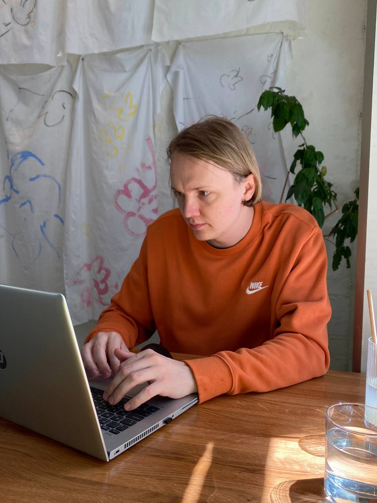
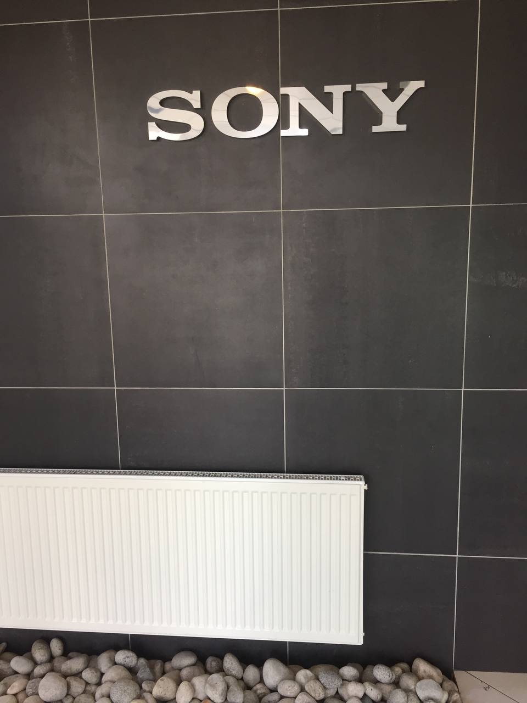

## Сокращение не приговор: как мидлу сменить стек с нелюбимого ABAP на любимый C#

Историй, как люди вкатываются в IT и попадают на модный стек и современные технологии — их масса. Но вот выучиться на программиста, и с первой же стажировки попасть на работу, где используют что-то настолько древнее и страшное, чего сторонятся даже матерые разрабы — это то еще приключение.

Такая история у Владислава Ващенкова. Его первая же работа оказалась связана с SAP и ABAP. И по условиям контракта, отработать с ними нужно было целый год.

Мы поговорили и записали его рассказ — как на тронутся умом, прикоснувшись к этому древнему злу и потом перейти обратно на свой любимый C#. Почитайте

***

До прихода в радужный мир IT я работал в сфере логистики. Но достиг потолка и понял, что хочу более интересную работу с более очерченными карьерными перспективами. Пошёл учиться программированию очно, в специализированную академию, так как немного понимал в компьютерах, собирал железо сам и мог справляться с простыми задачами сисадмина. Курсы были двухлетние, предполагали знакомство с несколькими языками. Сначала мы изучали железо и внутреннее устройство компьютера, потом были языки С, С++ и, наконец, C#, с которым у меня случилась любовь. Но об этом чуть позже.

Обучение сначала и правда было очным, но потом случилась пандемия и доучивался я уже онлайн. Но параллельно работал сисадмином и каждый день был вызовом: с 9 до 12 утра я учился, потом ехал в офис и работал там до 19-20 часов вечера. А ещё надо было делать домашку и курсовые, чему посвятил не один выходной.

### Первая стажировка

Спустя четыре месяца обучения я начал искать стажировку по новой специальности, чтоб параллельно получать релевантный опыт в IT. Начал искать стажировки в марте — предложения были, причём многие были готовы обучать чуть-ли не с нуля. Вдохновляло, что это шанс работать в той сфере, где и хотел. Смотрел предложения на предмет адекватности условий. За пару месяцев нашёл то, которое заинтересовало. Правда, после обучения, по контракту нужно было проработать на этом месте ещё год. Я согласился.

Работать предстояло на новом стеке — Sap и ABAP. Это довольно древний язык, и конечно он выглядел совсем не так круто, как C#. А ещё там своя система контроля версий, отличающаяся от привычного Git. В Sap нужно создавать запрос, ему присваивается номер, а потом этот запрос нужно применить ко всем изменениям. По номеру запроса можно войти на специальную страницу, где отображаются все сделанные тобой изменения. Внутри ABAP был SQL, встроенная в систему база данных. В ABAP тоже есть ООП, классы и функции, но довольно сложно переименовать переменные. Называть их нужно было очень внимательно, чтоб не пришлось менять, ну и, конечно, никаких тебе всплывающих подсказок.

За время стажировки я научился работать с SQL: составлять и оптимизировать запросы, использовать индексы и объединять таблицы во вьюхи. Работая с внутренней экосистемой Sap, изучал такие штуки, как работа транзакции в SQL, способы доступа для чтения и записи данных в зависимости от типов таблиц, хеш таблицы, буферизация.

В ABAP также есть специальные объекты которые называются лувами. Это логические единицы, обеспечивающие целостность выполнения набора транзакций в базе данных. Если происходит сбой в одной из транзакций, лув откатывает изменения всех транзакций, входящих в него. А ещё транзакциями называют программы и они поделены на странички. Ты вводишь номер транзакции и попадаешь на определённую страницу, на которой есть документы и различные отчёты.

На стажировке мы учили ABAP и Sap по книгам — нам дали 10 различных книг по теории, и каждый день нужно было практиковать изученное, решать задачи.

Стажировка продлилась пять месяцев и всё это время я параллельно доучивался на курсах. Помню как сидя в офисе глаза сами закрывались, до такой степени хотелось спать. То есть снова я утром учился, а после обеда приезжал в офис, но на этот раз читал методички, причём большинство — на английском, серия книг Sap BCxx. Это создавало дополнительные сложности. В некоторых методичках встречались логические ошибки и опечатки, что усложняло решение заданий.  Например, экземплярные и статические методы назывались в литературе как инстанционные. Сначала сложно понять о чём вообще речь, но постепенно начинаешь видеть сходство с другими языками. К тому же, всё это время у меня был наставник, который помогал советом или объяснением.

Несмотря на то, что стажировка оплачивалась, это были небольшие деньги, а после стажировки зарплату повысили незначительно, поэтому это был финансово тяжелый период. Из плюсов: так как в команде было несколько стажеров, мы общались, помогали друг другу,  что улучшало атмосферу. Из минусов: существовала система учёта рабочего времени, в которую нужно записывать часы, потраченные на задачи. Иногда целый день уходил на то, чтобы в этой системе все часы сложить правильно, это бесило. И даже если задач не было, нужно было сидеть в офисе до последнего.

Ну и, конечно, сравнивая языки, понимаешь, что возможности у ABAP совсем другие, ограниченные. Но я решил, что раз жизнь даёт мне возможность изучить новый стек, то почему нет — значит, так нужно.

После окончания стажировки ещё чуть больше года я проработал там же. Всегда буду благодарен компаниям, которые берут людей без опыта и обучают, ещё и платят за это. Новичкам очень нужны такие места для старта.

### Работа в Sony

Я проработал почти полтора года с ABAP на месте, где стажировался. И тут мне пришло сообщение в мессенджер с приглашением на собеседование в международную компанию Sony — снова как ABAP-разработчику. Я сначала не поверил, потому что я не столь опытен,  решил, что это спам. Но в конце концов решил пообщаться. В перерыв пошёл в соседний торговый центр, чтоб меня никто не увидел на работе и отвечал на вопросы, просто блуждая по коридорам. К тому же, там была плохая связь и в какой-то момент я попросил отключить видео.

Несмотря на все сложности, мне сделали оффер, предложив больше чем двойной оклад. Я рассказал об этом лиду, он очень удивился, поздравил. На текущем месте таких денег предложить не смогли, поэтому было понятно, что я ухожу. Конечно, было немного страшно: думал, что на новом месте за бОльшие деньги придётся работать в два раза усиленнее и требовать будут жёстко. Но первое, что спросили коллеги: сколько сможешь выпить пива, если пойдём в бар?

Вся команда была молодой, до 40 лет, загрузка — средняя. Работа — сначала на испытательном сроке в офисе, потом на удалёнке.

Это был мой первый опыт работы в международной компании. И он меня впечатлил: стильный офис, комнаты отдыха, столовая, возможность изучать технику компании, обучающие занятия, новогодние подарки.

### Сокращение и happy end

В 2022 году стечение обстоятельств вынудило компанию сократить штат сотрудников, под сокращение попал и я.

Всё произошло как в кино: на следующий день я должен был ехать в аэропорт и лететь в отпуск. И тут приходит письмо, что меня сокращают и в течение двух недель нужно оформить все документы. Я поехал в этот же день, а на следующий улетел в Евротур.

С одной стороны, сокращение было неожиданным — как гром среди ясного неба. С другой стороны я понимал, что теперь должен искать работу в том стеке, в котором всегда хотел работать. Приятным бонусом стало то, что компания выплатила солидную компенсацию в размере годового оклада, и я мог не спеша найти подходящее новое место.

Вернулся из отпуска перед Новым годом. В конце января начал искать работу, но уже на новом стеке. Проблема была в том, что на желанном C# у меня коммерческого опыта не было. Тем не менее, через полгода после сокращения я всё-таки нашёл работу бэкендером на С#. Поиски заняли около четырёх месяцев. На новом месте работаем по Scrum-методологии, все процессы регламентированы. Пришлось вникать в эти принципы и осваивать их.

Работа на разных стеках — это здорово, расширяет кругозор и понимание бизнес-процессов. Единственный совет, который я дал бы себе, оглядываясь назад: скопить больше денег, чтобы можно было на первых порах сконцентрироваться только на обучении. Теперь я счастлив, что работаю с любимым C# и развиваюсь в новом стеке. Не бойтесь всё менять: перемены дают буст для роста и движения вперёд!
