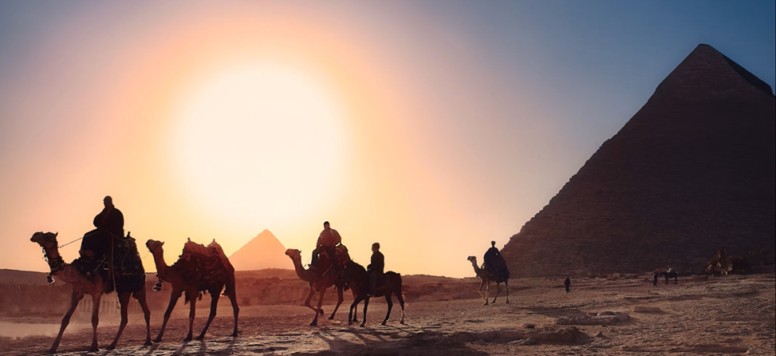
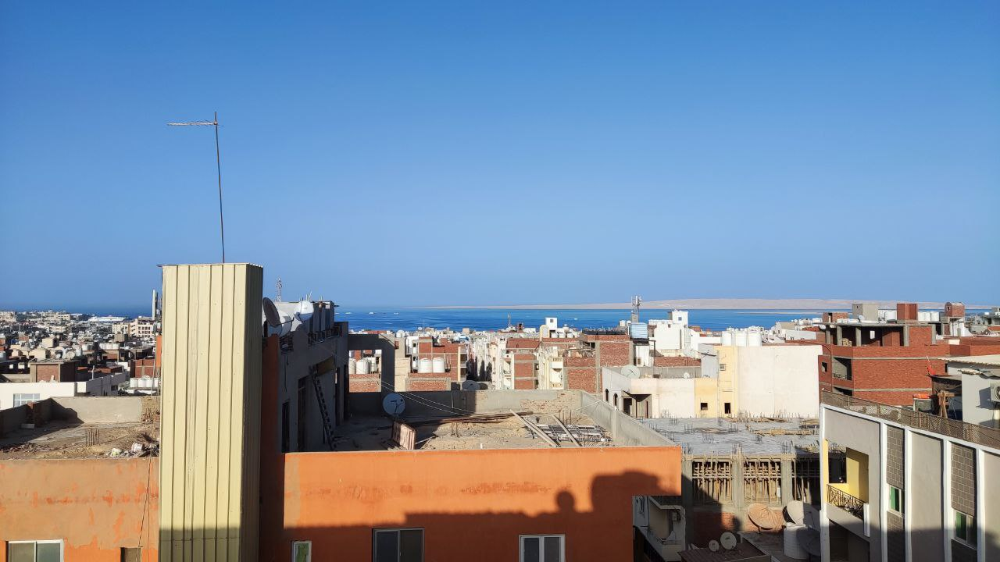
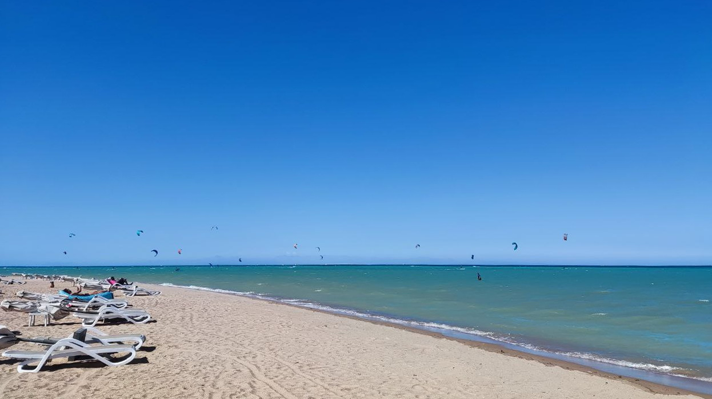
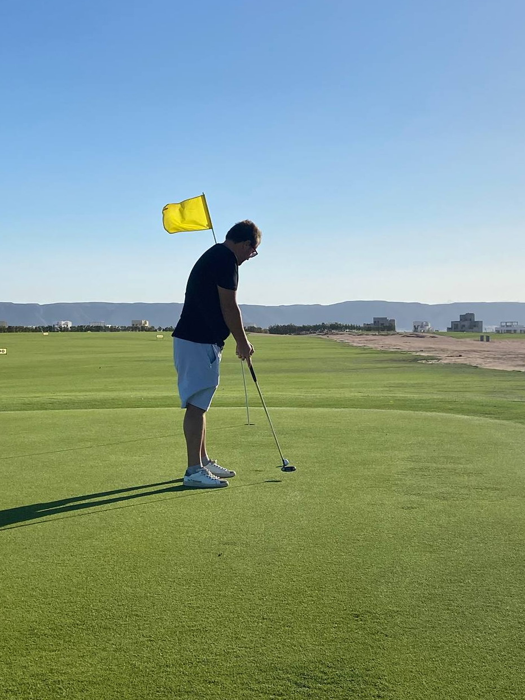
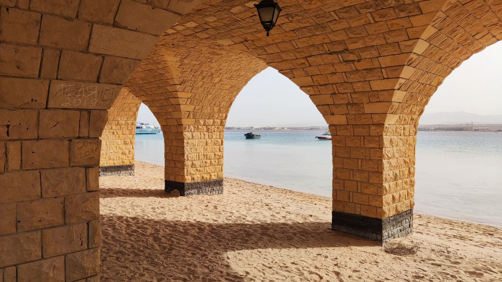
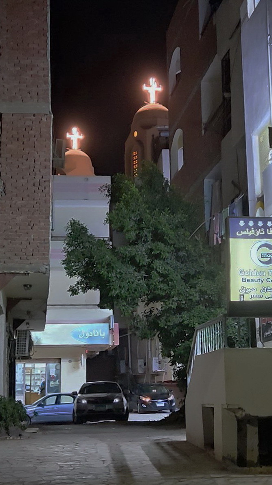

# Безопасный путь релокации: бюджетные возможности за пределами страны

Всем привет! Меня зовут Григорий, и я не айтишник. Почитав истории успеха релокантов, решил рассказать и свою. Она ни разу не про успешный успех эмиграции, а о том, что если страшно и если психологически тяжело настолько, что хочется уехать из РФ, то сделать это возможно и без золотых запасов. А в свете принимаемых в последнее время поправок и законов, возможно, в скором времени уехать и вовсе не получится.

> Автор статьи: [Григорий (r2d2_c3po)](https://t.me/r2d2_c3po)

Эта история не про страну мечты, а про некий буфер, ступеньку к следующему шагу. То место, где можно выдохнуть и собраться с мыслями. Возможно, выучить что-то новое из рабочих инструментов. В общем, заняться собой. Поэтому тем, кто сейчас живет в России и думает «вот сейчас подкоплю денег и уеду», я предлагаю задуматься о том, что есть куча других стран, где жить безопаснее, чем в России, и копить получится легче, поскольку стоимость проживания ниже, чем в России. При условии, конечно, что ваша работа позволяет использовать удаленный формат.

Пожалуй, не совсем честно раздавать тут советы, не рассказав моей предыстории. С нее и начнем.

В вялотекущем режиме об эмиграции я задумывался давно, наверное, года, этак, с 2012. После начала войны окончательно стало понятно, что мне с моим государством уже точно не по пути, но обстоятельства не позволяли в моменте все бросить и уехать. Когда объявили мобилизацию, я уже два года как немного сменил индустрию и работал в одной крупной Российской инвестиционной компании и отвечал в ней за развитие партнерского направления. Хорошая, даже по Московским меркам, зарплата; интересные и нетривиальные задачи. Но… жизнь в России стала несовместима с основной базовой потребностью - чувством безопасности, и будущее страны я для себя определил как бесперспективное. И это был уже очевидный повод распрощаться с Россией. Я купил билет, собрал вещи и через несколько дней улетел, просто выйдя с работы. Вещи лежали в каршеринговой машине у офиса. Конечно же, всех сотрудников компании, кто в столь трудное для страны время покинул границы нашей родины - уволили. Так я остался и без родины, и без работы.

И в то время, когда все экстренно бежали и летели в Турцию, Сербию, Армению, Грузию, Казахстан и Таиланд, я купил билет в Египет, в Хургаду.
Почему Египет, спросите вы? Да я сам был в шоке, если честно. Основных причин, наверное, было две (помимо отсутствия шенгенской визы):

- Во-первых, мало того, что билеты в популярные страны стоили нереально дорого - их, попросту, не было.

- Во-вторых, у меня, по стечению обстоятельств, в то время в Египте была мама. Чем не повод увидеться, тем более, видимся мы крайне редко, поскольку живет она не в Москве.

Последний раз я был в Египте лет 15 назад, и с тех пор желания сюда ездить не возникало, поскольку я не тот человек, который любит все вот это. Я люблю прекрасные курорты Испании, Италии, Греции. Прогулки по городам Старушки Европы Мне нравится тишина и звездное небо Алтая. Ну, то есть все то, что максимально не похоже на Египет с его Ближневосточным колоритом, а это именно Ближний Восток - даром, что на африканском континенте.

> Ближний Восток, как есть. Хургада. Вид на город и море.

## Что я оставил в России?

Я не айтишник, я всегда работал в бизнес-подразделениях крупных компаний и банков, отвечал за запуск партнерских программ, в частности программ автокредитования с автопроизводителями. Все, что вы видели из разряда «марка-модель под столько-то процентов годовых» – это все я, ну, практически все. То есть, главное, что я там оставил в части карьеры – это свое имя, свои бизнес-контакты и свой опыт, суперактуальный в России и слабо применимый без местных языков на уровне С1 во всех остальных странах, кроме части стран бывшего СССР, которые я не рассматриваю для себя. Я выстраивал партнерский бизнес с нуля, развивал существующий, учился новому. Но этого, по моему мнению, недостаточно для того, чтобы найти работу в своей сфере. Поэтому в своей эмиграции я посвятил время изучению языков (как истинный местный житель, я хожу на море пару раз в месяц).

Что касается личного – я в России оставил своих детей. Но, поскольку за 2 года до этого я пережил разгромный развод, в котором были уничтожены все мои активы и документы, и я переживал одни из самых тяжелых времен в своей жизни, то, по сути, я оценил поговорку «все, что ни делается – все к лучшему». То есть, очевидно, что, оставшись ни с чем, уехать из страны сильно проще, чем когда тебя балласт в виде кучи нажитого за долгие годы добра. Вся моя жизнь на тот момент уместилась в рюкзак и небольшой чемодан. Иными словами, я потерял всё до того, как это стало мейнстримом.

Какая разница, где восстанавливать с нуля свое благосостояние и душевное равновесие - подумал я и, мобилизовав все ресурсы, подсобрал денег и уехал.

В Хургаде я достаточно быстро оброс новым кругом общения. Энтузиасты, из числа новоприбывших, быстро создали местные чаты в Телеграм, там набралось много народа, а я легко нахожу общий язык с людьми. Я познакомился с интересными ребятами, но все они, в итоге, вернулись в Россию один за другим.

Находясь в Египте, я (конечно же, через нетворкинг) нашел удаленную работу на один финтех стартап с русскоговорящей командой и находящийся в юрисдикции ЕС. Мы сделали внушительный объем работ, я получил бесценный опыт работы в стартапе, у нас были сессии менторинга от реально крутых ребят, мы строили все с нуля и каждый делал все, что знал, и еще кучу всего сверху. Но по ряду причин бизнес пришлось переворачивать в другое направление, которое мне было совершенно не близко, и нам пришлось расстаться с командой. Но я заработал денег и опыт, и это на данный момент - главное.

Я сейчас открыт к новым предложениям и планирую переезд, поскольку год в Египте — это более, чем достаточно для рекреации. Переезжать, конечно, придется с учетом возможностей обладателя токсичного паспорта гражданина РФ и сложностями с визами.

Отдельная трудность в том, что мне уже 44, и в 44 начинать с нуля, конечно же, непросто. Не так просто, как в 30. И если твой уровень жизни в Москве был выше среднего: машины, рестораны на Патриках, своя квартира и регулярный отдых в пятизвездочных отелях на европейских курортах, то дауншифтинг всегда причиняет определенный дискомфорт. Но довольно нытья, и давайте посмотрим, такой ли это дискомфорт, если взглянуть на все под другим углом?

Итак, что я могу рассказать по итогу года, прожитого в Египте.

### Главные (и единственные) плюсы переезда в Египет:

1. Море
2. Солнце
3. Безопасность
4. Стоимость жизни
5. Визовый режим

### Море:

Красное море – одно из самых красивых морей на планете с богатейшей фауной. Масса возможностей для активного отдыха, и не только морского. Дайвинг, кайтинг, фридайвинг, снорклинг, морские прогулки на лодках, морские сафари на несколько дней, экскурсии по древностям, несколько полей для гольфа с международными сертификатами. Масса всего. И даже акулы, как мы знаем. Но море — это их дом, и надо просто соблюдать осторожность. Каждый год на курортах Красного моря происходят случаи нападения акул. Они приходят сюда в летние месяцы, когда вода особенно прогревается. Акулы есть практически везде. И в Америке, и в Индии, и в Австралии. Почему бы им не быть в Египте – непонятно. Да, государство предпринимает меры, но, как всегда, не очень эффективно.

> Кайт пойнт в Эль Гуне

> Гольф в Эль Гуне

### Солнце:

Здесь тепло круглый год. Разве что январь и февраль вынуждают немного померзнуть – ночью температура доходит до +14, и в квартирах слегка прохладно. Июль и август – самые жаркие. Днем температура поднимается выше 40 градусов. Но кондиционеры спасают.

### Безопасность

Египтяне очень дружелюбные, хоть и назойливые. Но нарваться на неприятности, такие как получить по голове в подворотне или быть ограбленным – это надо очень сильно постараться. За год не слышал таких историй. Туристическая полиция всегда встанет на сторону туриста – отсюда и поведение. Вообще, египтянин не может прикасаться к туристу — это запрещено на законодательном уровне. Последствия очень серьезные. Так что здесь правило «If I ignore it - maybe it will go away» работает на все 100%. Короче, безопасно. Хургада - одно из самых безопасных мест на планете, мне кажется. Если машина не собьет. Ну, или акула не съест :). И, несмотря на ситуацию в Секторе Газа здесь все еще спокойно и не чувствуется никакой напряженности. В текущем мире, вообще, сложно найти на 100% безопасное место.

### Стоимость проживания:

Основным расходом, пожалуй, для любого эмигранта, является расход на аренду недвижимости. Итак, внимание, недвижка:

- Квартира 1+1 стартует от 3000 до 5000 фунтов (75-120$)
- Квартира 2+1: от 5000 до 8500 фунтов (120-210$)

Это бюджетный район. Но его плюс – близость к морю. Минус – шумновато и грязненько.
Все остальное идет в сторону увеличения цены и снижения, вплоть до нуля, количества пляжей шаговой доступности.

Поскольку статья о бюджетной релокации, остальные районы описывать не буду.
Безопасно везде.

### Правила поиска квартиры:

Искать квартиру проще всего ногами – везде есть дормены (что-то типа администраторов), либо висят объявления с номерами телефонов. Нюанс: не все дормены знают английский, но Гугл переводчик в помощь. Неспешная прогулка на задворках центральной улицы Шератон принесет бесконечное количество вариантов аренды. Сразу и покажут. Хочется подороже – можно выбрать другой район, скажем, Эль Каусер или Интерконтиненталь. Ни о каких предоплатах за 2, 3, 5 месяцев речи не идет. Максимум - попросят возвратный залог за месяц. Использовать дистанционный поиск через агента не рекомендую, поскольку можно приехать и не застать никого, или квартира уже сдана или куча других нюансов. Сервисы типа Airbnb накручивают 200-300%. В общем, здесь сложнее найти гречку, чем снять квартиру. Но гречка тоже есть – без проблем.

### Прочие моменты

Продукты, в целом, дешевле, чем в РФ. Овощи-Фрукты ощутимо дешевле.

- Клубника 1$ р/кг, а на рынке и того дешевле.
- Черешня 1.5$ р/кг
- Банка колы 0.2$
- Молоко меньше 1$
- Литр свежевыжатого сока (апельсин, манго и т.д.) – 1.2$.
- Импортные сыры присутствуют

### По бытовым вещам:

- Русскоязычные врачи есть – на дом приезжают.
- Анализы сдать можно – лаборатории есть.
- Стоматологи есть, и они сильно дешевле российских. Люди с брекетами тут были в приятном шоке от цен на обслуживание системы.
- Лекарства все в свободной продаже, подделок нет (за подделку лекарств – смертная казнь),а рынок фармы регулируется и субсидируется государством. Некоторые препараты в 10 (!) раз дешевле, чем в РФ. Ценник пропечатан на упаковке.
- Прачечные на каждом шагу.

Короче, одному здесь жить очень дешево, да и с семьей, в целом, тоже не сверхдорого.

С интернетом особых проблем нет, хотя он и не на высшем уровне, но домашний 4G от Orange с лихвой перекрывает потребности. Все соцсети работают без VPN, естественно. LinkedIn - тоже. По стоимости – несколько дороже, чем в России. Понятия безлимитного интернета не существует.

### Что по деньгам вообще?

Местная валюта: Египетский фунт

Официальный курс к доллару 31 фунт за доллар, черный рынок предлагает предлагает 43 фунта за доллар. USDT уже 47 фунтов и продолжает стремительно расти. Евро в ходу в меньшей степени. Крипта официально вне закона, но решения, как всегда, найдутся. Фунт и Рубль до недавнего времени находились в плюс-минус синхронном падении к баксу, но сейчас рубль укрепляется, а фунт продолжает падение и кросс-курс на 25/10/2023 составляет 2,2 рубля за 1 египетский фунт. Инфляция высокая, поэтому жизнь не дешевеет. Менялы присутствуют - в обменниках менять нет смысла. Поддельных фунтов не встречается. Максимальный номинал купюр 200 фунтов. Доллар в обменниках не купить - только продать, но это лишено смысла при текущей разнице черного и официального курсов. Поэтому заблаговременно добавляемся в меняльные и бытовые чаты Хургады.

Кстати, в Египте можно открыть банковскую карту по турвизе, но в связи с жестким валютным законодательством это действие близко к бессмысленному. Хотя входящие переводы в валюте работают исправно. Но сейчас ЦБ Египта выпустил циркуляр, по которому все внешние валютные платежи запрещены, только с валютных счетов, которые открывают очень неохотно, и еще более неохотно выпускают к ним карты

### Визовый режим:

Понятно, почему много людей поехали в спешке, выбирая мало-мальски знакомые страны. Последствия этой спешки всем известны: это и отказы в ВНЖ (а при условии предоплаты аренды квартиры на долгий срок, это означало потерю денег), это и постоянные визараны, которые не гарантировали возвращение в страну, и многие другие нюансы. Да и вообще, внезапно нахлынувшие иммигранты взвинтили рынок недвижимости, когда стоимость аренды взлетела в 4-5 раз, что тоже требует теперь более осмысленного подхода к эмиграции, тем более, когда дальнейший путь не ясен, и нужно переждать.

В Египте же на въезде платишь 25$ и получаешь визу на месяц. Тут же едешь в паспортный стол, и тебе ставят штамп еще на 2 месяца. Абсолютно молча и бесплатно. Делов на 5 минут. Дальше есть 2 опции: визаран или долгосрочная виза. Долгосрочная виза стоит 1700 фунтов, но дается на совершенно рандомный период. Мне дали на 4 месяца без учета 2 месяцев ожидания ее выдачи. После того как она закончилась, я подал на второе продление. Но по истечении этого срока придется вылетать из страны, хотя бы на 1 день. И дальше можно все начинать с самого начала. В целом, год легального нахождения без выезда – легко. За оверстей штраф сопоставим со стоимостью визы, но я предпочитаю не экспериментировать. Если отдавать ребенка в школу (а здесь есть хорошие школы, в частности, при посольствах), то на ребенка тоже нужно продление визы. А так – дети до 14 лет оплачивают только въездную визу и дальше никаких обязательных продлений и штрафов за их отсутствие не предусмотрено. Есть русскоязычные детские сады. Есть англоязычные. Все это стоит очень недорого. Есть русскоязычные няни – это уже подороже.

### Если есть плюсы, то есть и минусы, их, конечно, немало, но с этим можно жить:

#### Шум:

Клаксоны. Все постоянно сигналят на дорогах, просто от скуки. Хаотичное движение. С непривычки это выглядит кошмарно. Привыкнуть к этому тоже непросто. Но, возможно, меня эти флешбэки от клаксонов будут еще долго преследовать.

#### Вечерний променад:

Здесь очень мало мест для прогулок, и совсем мало зелени на улицах. По сути, здесь три локации, где можно прогуляться с удовольствием (Мамша, Марина и набережная Старого Шератона). Ну, или выехать в другие города/районы. Более цивилизованные.

#### Эмигрантское довоенное комьюнити:

В Хургаде много лет живут переехавшие сюда, насовсем или периодами, жители бывшего СССР. Преобладают русские и украинцы. Обстановка спокойная – никакой политики или вражды не наблюдается. Все заняты своей жизнью или сплетнями о чужой. Это многолетнее комьюнити состоит в основном из женщин возраста 50+, и это накладывает свой отпечаток на жизнь в городе:

Во-первых, и это плюс, здесь без проблем можно найти черный хлеб, оливье, сырники, борщ, солянку, да даже сочник с творогом… В общем, практически любые продукты и блюда, такие милые нашему сердцу (то есть желудку).

Во-вторых, и это минус, это постоянные сплетни. Все знают обо всех то, что нужно и не нужно. Одним словом – большая деревня. Ну и ревностное охранение их привычного образа жизни от новоприбывших. Если представится случай с ними взаимодействовать – непременно надают непрошенных советов.

### Египтяне:

Взаимодействие с коренным населением, в целом, хлопот не доставляет. Они дружелюбны, но доверять, конечно, им не стоит. Тут ничего не изменилось за многие годы. 95% не очень чисты на руку и попытаются вас обмануть. Кэтколлинг развит, конечно, так что девушкам в мини придется научиться игнорировать или одеваться иначе. Но я часто вижу девушек и женщин, идущих одних не по центральным улицам ночью и это, действительно, безопасно.

Египтяне очень необязательны. Египет – страна вечного «бокра» (то есть завтра), вообще, культура «завтра» она не уникальна. Это и маньяна, и полако и много всего. Это просто надо принять. Здесь 10 минут легко превращаются в 2 часа... или 2 дня.

### Поесть:

Кухня здесь оставляет желать лучшего, но, как я и сказал, здесь есть варианты поесть знакомую еду. Даже есть магазины, где продают свинину. Ну, и вообще, в магазинах есть все: от сметаны до пармезана. В кафе - тоже много, что есть, но на египетский лад. Есть весьма неплохой суши-бар, есть неплохая пиццерия. Высокой кухни здесь не найти. Самые приличные (и дорогие) рестораны находятся в Эль Гуне. Но уровень все равно недостаточный, по моим оценкам. Шавуху делать не умеют, в одном месте более-менее похожа на привычную нам. Ценник 40 фунтов.

### Выпить:

Алкоголь тут, в основном, только местный. Пиво навынос можно купить в любом кафе. Крепкий алкоголь - тоже. Но, так как он местный, а нация - не пьющая, то и качество не очень высокое. Но всегда есть Дьюти Фри магазины, где по местным правилам можно купить алкоголь в течение 2 суток после въезда в страну. И, так как всегда кто-то прилетает, то вам, за умеренную плату, продадут свой паспорт. Правда, действует ограничение в 2 литра на человека. Пить на улицах, как и находиться там в явно нетрезвом виде, не рекомендуется. Но что взять с туристов). В ресторанах коктейли делать не умеют. В классическом понимании коктейлей, но ром с колой всегда смешают. Правда, ром будет местным и бюджетным.

*Резюме: Если вам надо вытащить себя или своих близких из РФ, то, однозначно, не стоит сбрасывать со счетов Египет. При этом, речь именно о Хургаде. Шарм-эш-Шейх процентов на 30 дороже, и там нет такого количества недвижимости в аренду, Каир переполнен и более религиозен. Плюс там холоднее, поскольку он на Средиземном море. А Хургада – самое то. Лояльное отношение к русским, лояльное отношение к внешнему виду, поскольку город туристический, и никто от вас не ожидает многого. Совершенно нормальная интеграция людей любой конфессии в довольно религиозное общество – никто ничего не навязывает. Но все же Египет — это не про «переехать». Египет — это про «пересидеть».*

### Подумайте. Вернуться в Россию или переехать из Египта в другую страну вы всегда успеете. А вот уехать из РФ – не факт.

> Сахль Хашиш. Под мостом на набережной. Привет от неизвестного Феди из 2019-го.

> Коптская христианская церковь. Хургада.
