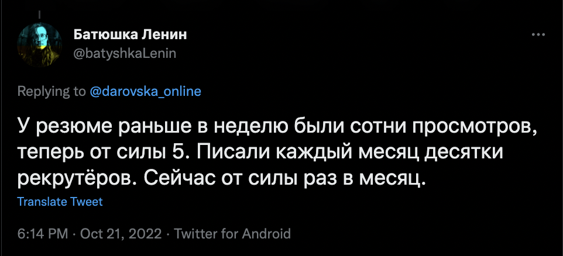
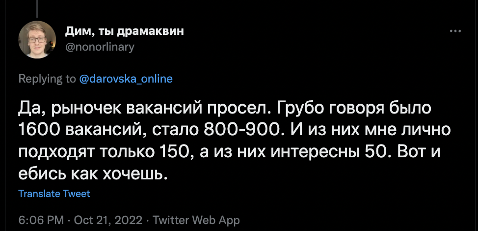
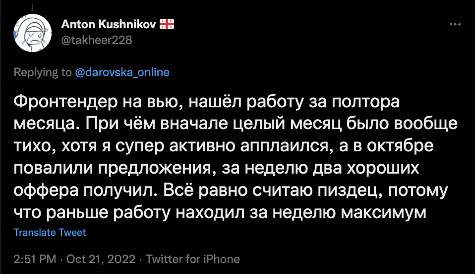
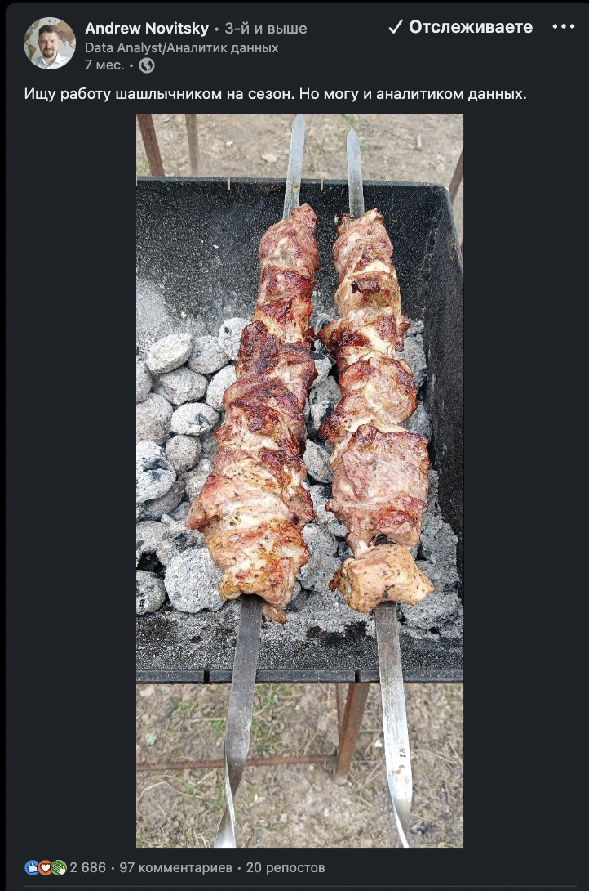

# Реально ли вкатиться в IT после 24 февраля: реальные истории

В IT индустрии за последние 8 месяцев многое изменилось: начались массовые увольнения в FAANG, заметно упало число вакансий — по отзывам разработчиков, предложений на российском рынке стало меньше, а требования жёстче и зарплаты ниже. 

 

 

Но выяснилось, что вкатиться в IT всё ещё вполне реально. Счастливые истории есть, несмотря на ужасающие перемены. Мы опросили джунов с различными стеками, которые нашли первую работу уже после начала войны. Вот их истории. 

## Выучился сам и нашёл работу в соцсетях

Меня зовут [Константин](https://twitter.com/shi_mi_gol), я — начинающий фронтенд-разработчик, работаю два месяца. Начал учиться в феврале 2022 года, а в конце августа нашёл первую работу. По образованию я инженер, около двух лет работал в компании «Росатом». Там я понял, что надо что-то менять в жизни, пока не поздно. Собрался с мыслями и начал учиться.

Учиться было не очень сложно и не очень просто. Если даёшь себе время разобраться, как правило, освоить можно всё. 

### Учился по книгам и курсам

Сначала я просто читал известный учебник Learn JavaScript. Потом, когда дошёл до главы о DOM, я нашёл интересный канал на YouTube [Freecodecamp](https://www.youtube.com/c/Freecodecamp) и стал повторять проекты, которые собраны там в курсе Vanilla JavaScript Course.

На этом же канале я нашёл 11-часовой курс по React. Оттуда меня перенаправили на образовательную площадку Scrimba, где я прошёл курс [The Frontend Developer Career Path](https://scrimba.com/learn/frontend), включающий 13 модулей. Полгода обучения обошлись мне в 5000 рублей. Я получил доступ ко многим курсам. Да, никто не сопровождал меня за руку в течение всего процесса обучения, но я пользовался чатом в Discord, где можно попросить совета. Это очень хорошая образовательная площадка, которая подойдёт фронтендерам, владеющим английским языком.

### Прошёл публичный собес и написал о поиске работы в Твиттер

Где-то на третьем месяце своего обучения я познакомился с [Наташей Давыдовой](https://twitter.com/nat_davydova), мы пообщались, я сделал тестовое задание и она дала мне несколько важных советов. Потом через пару месяцев провели [публичное собеседование](https://www.youtube.com/watch?v=aerncVzQHU8) и я написал тред в Твиттер, что ищу работу. Попросил пару человек ретвитнуть, в результате со мной связались с предложением удалённо поработать на австралийский стартап. Теперь я работаю на маленькую международную компанию, сидя в «Гараже» в Парке Горького. Хорошо, что я не постеснялся просить помощи и вообще писать о своей учёбе в соцсетях.

### На работе бывает тяжело до слёз

Я работаю всего два месяца, и мне до сих пор бывает так тяжело, что плакать хочется. Большинство моих вопросов решается, если внимательно посмотреть в код. Но я не всегда понимаю, как искать нужный файл по проекту. Поначалу сложно отследить, откуда что приходит, куда уходит. Основные сложности связаны не с программированием, а с незнанием проекта.

Я работаю уже два месяца и всё никак не могу избавиться от чувства, что я не справляюсь, что меня сейчас выкинут. Причём это чувство появилось не в первые дни, а примерно через месяц. Поначалу я делал себе скидку на то, что я новенький, и вполне нормально, что чего-то не знаю. Но когда что-то начало получаться, в случае затруднений стал ощущать свою ущербность.

Задачи бывают разные. Иногда надо поменять стиль какого-то компонента, а иногда дают задачи с таблицами: например, есть таблица, у неё есть фильтры, и когда ты разворачиваешь этот фильтр, нужно, чтобы перед каждой опцией стояло количество возможных вариантов. Над этой задачкой я долго тупил, но потом ребята мне подсказали, и всё получилось. Сейчас мне дали задачу на бэкенде, надо будет разбираться. В целом всё интересно, мне нравится.

Не очень удобный момент: команда разработчиков маленькая, всего пять человек. Один в Австралии, у него свой часовой пояс. Я, например, в Нижнем Новгороде. Ещё есть парень где-то в Казахстане, у него где-то четыре часа разницы со мной. И парень, который предложил мне работу, — в Сан-Франциско, это минус десять часов. Бывает такое, что я работаю, но мне некому задать вопросы по проекту, потому что все спят. Моему работодателю всё равно, откуда я. Они даже не следят, когда я начинаю и заканчиваю работать.

### Советую полностью отдавать себя учёбе и искать зарубежных работодателей

Людям, которые находятся в похожей ситуации, я бы порекомендовал не бояться уволиться с работы, чтобы погрузиться в учёбу с головой. Я полностью ушёл со старой работы, посчитал деньги и на три месяца отправился путешествовать. Не сказал бы, что семья была в восторге, но в любом случае меня поддержит. Моя девушка мне тоже помогала финансово, перед тем как я нашёл работу, потому что свободные деньги через несколько месяцев закончились. Если есть возможность не работать полгода или год, то надо этим пользоваться и посвятить всё время учёбе.

Очень важно быть морально готовым, что учиться придётся долго. Не корить себя за то, что не работаешь. В этот период учёба и есть твоя работа. Возможно, в данный момент ты делаешь самые важные в твоей жизни инвестиции. Не надо ни за кем гнаться, смотреть на какие-то сроки, переживать, что кто-то нашёл работу за три месяца, а тебе понадобился год. У каждого свой путь, каждому везёт по-разному.

Вы точно столкнётесь с проблемой отсутствия опыта, который надо где-то получить. Тут вам на помощь придут опенсорс проекты. Мне друг посоветовал проект [Open Food Facts](https://world.openfoodfacts.org/), в который я контрибьютил где-то месяц, пока не нашёл работу. Да, денег вам платить не будут, но вы будете получать реальные задачи, и покажете будущим работодателям свою мотивацию и заинтересованность в работе.

Мне помогло то, что я уже владел английским языком. Конечно, не в совершенстве, но говорю спокойно. Это позволило искать первую работу сразу в международных компаниях. По-моему, сейчас начинающему специалисту нереально найти работу в России. Я много откликался на вакансии, размещённые на hh.ru. Большинство откликов остались без ответа. В остальных случаях мне писали, что у меня недостаточно опыта. Ничего себе, на место с зарплатой 30 000 рублей вы ищете человека с большим опытом? В заграничную компанию у меня даже не было технического собеседования. Я просто рассказал о себе. Меня спросили, устроит ли меня зарплата, я ответил, что устроит, и мы договорились.

Чтобы не ограничивать себя поисками работы в России, нужно завести аккаунт на LinkedIn. С помощью этой соцсети можно найти работодателя из США или Австралии, которому не принципиально, что ты находишься в России. На старте они могут предложить зарплату 1500–2000 долларов. Думаю, сейчас в России джунам столько не платят.

## Ушёл из науки в аналитику

Меня зовут [Валерий Невмержицкий](https://twitter.com/MustDie_green) и теперь я продуктовый аналитик.

### Проанализировал свой опыт

Прежде чем пытаться войти в IT, я оценил полезный бэкграунд, который у меня был. На тот момент я почти закончил психфак СПбГУ, это фундаментальное научное образование.

Это означало, что я имею представление о когнитивных искажениях, логике научного (и не только) вывода, знания о научном методе. Я умею дизайнить эксперименты и другие исследования, знаю, в чём их преимущества и недостатки, пару лет читаю лекции по экспериментальной психологии, где всё это объясняю студентам, прививая им критическое мышление. В общем всё то, что лежит в основе всяких А/Б-тестов, продуктовых/маркетинговых исследований, я знаю с самого фундамента.

Во-вторых, с психфака я вынес для себя очень хорошие мягкие навыки — умею договариваться, структурировать информацию, планировать всё, что можно, производить хорошее впечатление. Складно говорю и, как говорит мой супервизор на практике, «эффективен в своей искренности и конгруэнтности». Много пользы я получил от работы в студсовете, организации научных конференций и других мероприятий. Там я строил процессы, вёл переговоры и совершал ошибки, которые помогают мне быть лучше.

А ещё я 8 месяцев проработал UX-райтером в компании МойОфис. Там я посмотрел на крутые корпоративные ценности, хорошо выстроенные процессы, закалил в реальной работе свои софт-скиллы и неплохо разобрался в процессе разработки IT-продукта. Ну и успешно прошёл свой первый собес.

### Решил анализировать данные для курсовых

Так получилось, что, хотя мне всегда нравилось анализировать всё подряд, я не сразу понял, что мне надо в аналитики. Я знал, что крутые аналитики программируют, и боялся программирования как чего-то скучно-ужасного. Поэтому то, что я начал учить в районе февраля, сначала мне было нужно не для моей текущей профессии.

У меня был приятель, который анализирует данные для курсовых и дипломов психологам. Как-то раз я узнал, сколько денег он за это берёт, и понял, что это золотая жила. Меня бесил SPSS, поэтому я решил пойти более прикольным путём и выучить R — это достаточно узкоспециализированный язык программирования для анализа данных и Data Science. Я рассудил, что это проще Python, потому что много кто в универе его знает, и моя девушка недавно прошла по нему курс.

Я взял учебник по статистике, учебник по R, прочитал их за несколько недель и пошёл искать себе жертву. За день нашел одногруппницу, которая согласилась дать мне немного денег, чтобы я сделал всю работу с данными за неё.

Ну и пошло-поехало: я анализировал данные, постепенно повышая ценник, вышел на рынок МГУ через знакомую, много развивался, читая Stack Overflow и разбирая код моей бывшей научной руководительницы, которая занималась тем же несколько лет назад.

Из этого я вынес неплохие и отработанные на практике знания мат. статистики, база которой у меня была ещё с этого предмета в университете, научился программировать и использовать это для анализа данных, круто продвинулся в написании чистого кода. У меня небольшое ОКР, поэтому меня бесит грязный код.

### Понял, что мне нужно в аналитику

А ещё я сделал реально много работ, заработал очень приятную сумму денег. Но самое главное — я понял, что мне в кайф программировать и работать с данными, и решил пойти в аналитику.

Я достаточно быстро сделал себе резюме и стал откликаться на вакансии, где было достаточно R или языки программирования были плюсом, но не обязательным требованием. Естественно, я получал только отказы, но у меня был план, что делать параллельно с этим — мониторить вакансии, которые мне нравятся, и учиться тому, что там нужно.

Так я познал:

* Python+pandas, matplotlib, seaborn, numpy, scipy и т. д. Прошёл курс на Hexlet, который очень рекомендую, и бесплатную часть курса по аналитике от Яндекс.Практикума и учился по статьям в интернете и на практике. Сделал свой [пет-проект](https://github.com/MustDie-green/AWD-forum-visa-parsing). Мне сильно помогли знания и опыт в R, потому что большую часть навыков я просто переносил оттуда. Python без numpy мне вообще казался каким-то неполноценным, мне всё ещё не нравится графика в matplotlib, ggplot2 в 100500 раз круче.

* SQL. Прошёл курс на Stepik. Тут особо много не попрактикуешься без поднятия своей БД, поэтому я купил курс с практикой на реальной БД и сделал пару тестовых заданий, где в итоге пришлось поднять свою БД. Сделал это на SQLite.

* Ну и, конечно, углубился в статистику для коммерческой аналитики, она несколько отличается от научной.

* Ещё я понял, что мне очень нравится Data Science, но побоялся не потянуть самостоятельно, поэтому поступил в Яндекс.Практикум на Data Science со скидкой от Цифровых Профессий. Пока мы ещё не дошли до тем, в которых я совсем не разбираюсь, но часть полезного по пунктам выше я узнал ещё и отсюда.

* Если бы у меня не было этих знаний изначально, то я бы изучал А/Б-тесты, логику выводов, исследования и т. д.

### Очень много откликов и мало собеседований

Искать работу было несложно, но потребовалось много времени. Я постоянно откликался на вакансии, старался писать адресные и хорошие сопроводительные письма, параллельно обрастая скиллсетом. Тут мне хорошо помогли твиттерские. Тимур [@TatarinFrontend](https://twitter.com/TatarinFrontend) ретвитнул и помог найти аналитика [@chill_fem](https://twitter.com/chill_fem) — она отревьюила мой пет-проект, а Маша [@primite_offer](https://twitter.com/primite_offer) отревьюила моё резюме и дала много ценных советов. Ещё мне помогли мои друзья-разработчики, они тоже отревьюили мой пет-проект, и он стал гораздо лучше.

Отказов было много, приглашений очень мало, полноценных собеседований и тестовых заданий ещё меньше.

Но в августе меня взяли в маркетингово-аналитическое агентство, которое изучает телесмотрение, там я просидел 4 часа, понял, что так жить нельзя, и уволился на следующий день.

Потом собеседовался в OneTwoTrip. Мы очень классно поболтали с ребятами, обменялись любезностями, но они сказали, что отдали предпочтение кандидату по рекомендации, хотя я им понравился. Я всё равно попросил тестовое задание, чтобы посмотреть и потренироваться. Они не пожадничали, за что им большое спасибо.

В итоге меня нашла рекрутерка из молодой мобильной gamedev-студии, там я прошёл пять этапов отбора и теперь работаю в gamedev-стартапе. Из сложного — в этой маленькой компании нет сеньора, который расскажет, что и как делать, потому что нет аналитики как таковой. Но команда супер, у меня есть право на ошибку, я стараюсь делать всё круто и обращаюсь за советами к приятелю-аналитику.

Тут мне помог мой бэкграунд в играх — я и сам геймер, и слежу за рынком игр и очень давно хотел работать в этой сфере.

## Работал менеджером в салоне связи, а стал Python-разработчиком

Я [Копылов Руслан](https://twitter.com/prbzdj), мне 29 лет и я Junior Python backend developer. Я живу в Санкт-Петербурге и сейчас занимаюсь бэкенд-разработкой. Текущий проект пишем на FastAPI, данные храним в PostgreSQL, для работы с БД используем Alembic, SQLAlchemy. За валидацию данных отвечает Pydantic.

### Выучился на курсах 

Я начал учиться в ноябре 2021 года — пошёл на курсы. Первые два месяца обучения я совмещал это с работой, а потом уволился и посвятил всё время учёбе.

Это был обычный, простой курс Яндекс.Практикум по разработке на Python. За плечами у меня практически не было опыта. Я получил высшее образование в области телекоммуникаций, где год учил C++. Это всё, что я знал о программировании.

С дипломом инженера телекоммуникаций я хотел пойти работать по специальности. Но, посмотрев зарплаты, решил, что это было бы как-то грустно. В итоге попал на работу в отдел продаж одного оператора связи. Там проработал почти семь лет. Было нормально, но хотелось заниматься чем-то более интересным.

Я давно приглядывался к курсам и хотел попробовать, а прошлой осенью решил больше не откладывать. Взял себя в руки и взялся за переквалификацию.

Учиться было достаточно легко. Материал в курсе был хорошо подготовлен, всё описывалось понятно. Кое-где нужно было дополнительно изучать материалы, особенно в разделе про алгоритмы. Но это связано с тем, что алгоритмы сами по себе — непростая штука.

В остальном мне понравилось, что с обучением проблем не было. Весь курс разделён на двухнедельные спринты. В основном я справлялся за несколько дней, максимум за неделю и ждал, когда начнётся новая тема. Ожидание было для меня самым тяжёлым. Хотелось побыстрее окончить курс. Под конец я узнал, что можно просить, чтобы тебя перекинули вперёд по программе. Перед защитой диплома меня перевели в другую группу, и я закончил обучение на месяц раньше.

### Искал работу в Телеграме и на HH

Получил диплом в августе 2022 года, но работу начал искать раньше, в начале июня. Почувствовал и услышал, что компании проводят набор сотрудников, появляются нормальные вакансии, и решил не затягивать процесс поиска. В начале августа у меня уже был первый рабочий день.

Работу, как и все, я в основном искал на hh.ru. Кроме того, мониторил телеграм-чаты. Если видел подходящие вакансии, обращался напрямую по указанным контактам — в Телеграм рекрутеру или на почту. Зарегистрировался в LinkedIn, но мне эта площадка показалась неудобной, и я не стал её активно использовать.

На hh.ru у меня было примерно 100 откликов, но предложений о собеседованиях поступало очень мало. Пару раз я брал тестовое задание, но справлялся не очень хорошо, и процесс не шёл дальше.

Главной сложностью в поиске работы была нехватка коммерческого опыта. Многие мне отвечали, что даже не смотрят резюме и не дают тестовое, если у кандидата нет опыта.

Технических собеседований у меня было три, в три компании. Проходить их было несложно, потому что у меня нет проблем в общении, я не стесняюсь и не стрессую. Помог большой опыт работы в продажах.

Естественно, в каждом интервью мы доходили до момента, когда я буксовал, отвечая на вопросы. Обычно это было тогда, когда собеседующий копал всё глубже. Так выяснялось, где ограничиваются мои знания, но это нормально.

Программа обучения на курсах мне дала все необходимые базовые знания для уровня джуна. Также я прочитал статьи о том, какие вопросы задают на интервью, посмотрел видео собеседований. Этого всего мне хватило, чтобы спокойно отвечать на большинство вопросов. Как я понял, они обычно типовые, особенно для новичков. По крайней мере меня спрашивали везде примерно об одном и том же.

В итоге увидел вакансию на hh.ru, работать предполагалось в офисе прямо в моём районе. Я решил, что это судьба, и откликнулся, написав также сопроводительное письмо. Через несколько дней со мной связались и сразу предложили техническое собеседование, без тестового задания. Через неделю после интервью мне сделали оффер.

### Мои доходы упали в три раза

После смены работы мой доход сильно сократился, почти в три раза. Я был морально и финансово готов к этому. Я рассчитываю, что зарплата вырастет до прежнего уровня в течение года, а потом можно будет зарабатывать больше.

Сейчас мы пишем один проект под заказчика. Это API-сервис. Мои задачи — это парсинг ресурсов для сбора информации, потом эти ресурсы нужно будет добавить в наш API-сервис, дописать туда эндпоинты и модели. Всё это мы пишем асинхронно, для меня это в новинку, поэтому было интересно научиться.

Поначалу работать было тяжело. Когда я пришёл, нужно было изучать много документации, разбираться, задавать вопросы. Много опыта учёбой не наберёшь. Всё равно, когда приходишь на проект, там всё будет для тебя новым. Но потихоньку я вкатился, разобрался. Теперь прихожу в офис, пью кофеёк, получаю задачи через свой приватный репозиторий на Gitlab.

### Найти работу без опыта — всегда квест

Говорят, что сейчас стало меньше вакансий. Мне кажется, найти работу без опыта всегда одинаково сложно. Это рулетка: однажды тебе повезёт, но до этого приходится тыкаться во все двери.

Во всех вакансиях миддлов и сеньоров пишут, что в обязанности входит наставничество. Это предполагает, что откуда-то в компаниях берутся младшие специалисты, которым нужны наставники. Где-то же они их нанимают? Но в чатах выпускников курсов пишут, что некоторые ребята до сих пор не могут найти работу. Возможно, желающих больше, чем вакансий для тех, кто окончил курсы.

Сейчас много компаний ушло с нашего рынка, они перестали нанимать. Оставшимся требуются разработчики более высокого уровня, они не всегда хотят обучать джунов. Всё это приводит к тому, что работу найти нелегко.

Джунам я бы порекомендовал не стесняться писать рекрутерам, даже насчёт позиций для миддлов. И если делаете тестовое задание, просите обратную связь. Это бесплатная прокачка! В какой-то момент, когда я искал работу уже два месяца без какого-либо выхлопа, у меня опускались руки. После одного собеседования мне сказали, что ко мне нет вопросов, но я просто им не подошёл. Это было очень грустно, но несмотря на отчаяние я решил продолжать дальше.

Всегда можно найти лазейку, чтобы куда-то устроиться и получить тот самый заветный коммерческий опыт, а потом уже можно будет поменять работу. Для начала я решил, что не важно, куда меня возьмут. Не смотрел ни на стек, ни на фишки проекта. Главное — получить первоначальный опыт, строчку в трудовой книжке. При этом проект мне действительно нравится, мне повезло с интересным проектом.

## Прочёл книгу Лутца и увлекся Python

Меня зовут [Артур](https://twitter.com/whatsyournickna), мне 26, я из СПб и работаю в муниципальном учреждении с Python на бэкенде. В работе в основном использую Django, DRF, Celery, Redis, PostgreSQL и так далее. 

### Учился с помощью курсов и книг

IT заинтересовался где-то в 2018 году, но тогда я прочитал всего одну книжку Марка Лутца и cделал для себя пару парсеров. А уже полноценно учиться начал где-то год назад в ноябре, когда остался на месяц дома без выхода куда-либо. Учился я самостоятельно: выполнял курсы на Stepik, на Coursera. Тогда там ещё были курсы от МФТИ и МАИЛ, очень тяжело прошел 3 из 4.

С января начал откликаться на вакансии, чтобы хотя бы получить тестовые задания, начал углубляться в инструменты, узнавать новое и понемногу крутиться в этой области. 

### 20 собесов на 420 откликов

Таким образом, за всё время сделал около 420 откликов на hh.ru, 20 откликов на Geekjob, писал на почту по контактам вакансий с Habr и с Hexlet. В результате получил около 20 собеседований, каждое из них показывало, что и где нужно улучшать. Так понял, что нужно прокачивать свою уверенность и подачу.

Я устроился на работу в августе, когда с первого отклика прошло 8 месяцев, а со старта обучения — 10 месяцев. Не скажу, что я всё время только учился, я не забывал ещё о том, что нужно отдыхать с друзьями и разгружать голову от того, что началось в феврале. 

### На первой работе в IT мои доходы выросли в 1,5 раза

По сравнению с прошлой работой зарплата здесь больше в 1,5 раза. Мне нравится эта область, и что все помогают друг другу, подсказывают, доброжелательное комьюнити. Нравится, что, хотя это муниципальная компания, там нет Z, чего я вначале боялся. Компания занимается обслуживанием информационных систем города.

Задачи больше по устранению косяков в работе систем, где-то что-то пофиксить, если работает не по логике, внести изменения, поддерживать работоспособность. Также ведётся небольшая внутренняя разработка для компании.

Планирую дальше развиваться в компании, так как мне нравится, что все на это смотрят очень позитивно, а это подзаряжает ещё сильнее. Хочу обеспечить комфорт и безопасность для себя и родных.

## Попал в IT благодаря менторингу

Меня зовут [Егор Сериков](https://twitter.com/farestothereal), сейчас я frontend-разработчик в веб-студии А2. А ещё я на part time работаю преподавателем в Hello world IT School. Мой стек на момент первого трудоустройства: HTML/CSS/SCSS/JS. Немного React, Redux, TS.

### Интересовался IT ещё в школе

IT я заинтересовался в 12 лет, у нас в школе был факультатив, там мы писали на Pascal и познакомились с вёрсткой. Сейчас на учёбу ушло 9 месяцев в спокойном и размеренном темпе.

Вёрстку я повторял/обновлял по программе школы. Материалы по вёрстке в нашей школе были очень хорошие — от блочной модели до того, как пользоваться подходом mobile first. Но тем не менее я доучивался по материалам из свободного доступа.

Так как у меня был опыт программирования, изучать новый язык мне было достаточно легко, но очень лениво. Изначально у меня не было конкретной цели стать разработчиком, мне просто нравилось этим заниматься. С JS я знакомился по большому курсу Минина. Если честно, толку от этого было мало. Чётко сформулированного понимания «почему и как» практически не прибавилось.

Не понимая, как и почему работает то или иное действие, я злился, бесился. Забросил JS. Спустя какое-то время я захотел сделать сайт с адаптивом, добавить бургер-меню и слайдер. На практике понимать, как доставать DOM-элементы и манипулировать ими, было гораздо проще.

После я ковырял [курс по React от Ulbi Tv](https://www.youtube.com/watch?v=GNrdg3PzpJQ) на YouTube. Рекомендую этот канал. Я переписывал код и старался разобраться, почему всё так, а не иначе. Для первого знакомства это идеально, глубоко разобраться без изучения документации не получится, но я ещё много раз возвращался к этому видео.

### Эффективное обучение началось с ментором

Потом я нашёл ментора в [чате джунов Наташи Давыдовой](https://t.me/natti_jun_front_chat) — Eugene Jesovile. Он направлял меня и помогал учиться. Мы сошлись на том, что я могу задавать вопросы и он будет меня направлять. С этого момента началось по-настоящему эффективное обучение.

Работая над своим пет-проектом, я очень много нового для себя узнал и сразу же закрепил. После завершения у меня было ощущение, что я прошёл JS, потому что я смог всё это реализовать с нуля и без чужих правок по коду. Я спрашивал только идеи по реализации.

Но я, конечно, не прошёл JS. Даже сейчас мне нужно изучить ещё очень много всего. Для этого я решил продолжить обучение с ментором, но уже в формате настоящего менторинга за деньги.

Мне очень понравились материалы с Открытого лектория ШРИ от Яндекса. Очень сильно рекомендую. К Яндексу можно относиться по-разному, но материалы у них качественные. Я пересматривал их даже перед собеседованиями.

Ключевыми аспектами обучения назову:
1) Фильтрация материалов;
2) Изучение и закрепление на практике;
3) Получение удовольствия от процесса.

Английский — тоже must have. Не стоит забывать также и о конспектах. Я не любил их в университете, но во время обучения писал почти всегда.

### Искал работу полтора месяца

Когда я начал искать работу, я сделал на hh.ru около 35 откликов. Поиски заняли полтора месяца. Я прошёл одно собеседование на неоплачиваемую стажировку, выполнил одно тестовое задание к ним же, в итоге отказали из-за событий 21-го сентября. Фидбэк дали положительный.

### Устроился в компанию, где искали миддла

В диалоге с подругой узнал, что её парень работает в компании, в которой ищут миддла. Я спросил, не нужен ли им джун. Парень подруги сказал, что ничего не обещает, но резюме руководству показал. Мне назначили общее интервью, за ним техническое собеседование, которое я прошёл успешно.

В компании очень крутая команда, не могу представить себе онбординг лучше. Но для идеала не хватает ментора, я об этом сам договариваюсь с одним из коллег.

Интересно, что на собеседовании я отвечал по React, а на проекте работаю с Vue. Vue очень понравился. Я поверстал статические странички, добавил проверку на авторизацию на фронте, поработал с Яндекс.Картами, добавил пару функций кнопочкам и перекрасил спец. продукты. Почистил мелочи, которые упали с тестов у более опытных коллег. Я помогаю ещё по одному проекту на jQuery, который мне сильно не нравится.

Самое сложное на работе — вникать в проекты. Читать чужой код и разбирать функционал по началу было тяжело. Строчек много, но написано, по моим ощущениям, хорошо. В первые недели мне показалось, что я очень проактивно себя веду, и что здесь так не принято.

В основном мне достаются задачи по вёрстке или несложные тасочки с Vue. В ходе работы уже познакомился с подходом mobile first, поработал с cookies, Intersection Observer API и кучей других интересных штук, о которых только слышал. А самое главное — с самим фреймворком, который мне в итоге понравился.

Несмотря на то, что в наше время тяжело что-то планировать, вне зависимости от событий в мире я хочу расти и повышать свою экспертность в мире фронтенда и веб-разработки. Кто знает, куда занесет судьба!

## Делал таблицы в Excel, а теперь дата-аналитик в геймдеве

Я Андрей, работаю в GameDev Data analyst. Сейчас мой стек — Tableau, SQL. 

### Заинтересовался программированием еще в 90-х

IT заинтересовался еще в 1990-е. В 1992 мне купили первый компьютер, и в том же году я учил учительницу информатики Pascal и Basic. В дальнейшем всё моё продвижение шло благодаря благоговению маглов перед волшебниками. После появления Excel маглы научились не только писать записки в Лексиконе, но и считать. Сотрудников, которые не боялись цветных экранов, искали по всей стране каждый в своей отрасли, и ими замещали счетоводов со счётами.

Помимо расчётов поручали такие мелочи, как развернуть домен на Windows NT, проложить коаксиал, а потом витую пару, доукомплектовать компьютеры по стране модемами, а потом организовать для них почту (привет, BBS и FidoNet), организовать удалённый доступ в сеть, ну и, классически, починить утюг.

Всё это надо было изучать. Изучал и работал, работал и изучал. Узнавал новую фишку — внедрял. Не узнавал — не внедрял. Кроме меня было некому.

Последнее время я работал в госкомпании в сфере статистики. Анализировал «надои, прирост скота», сравнивал с аналогичным показателем прошлого года, строил графики и составлял аналитические записки на бумаге. Мы обходились Word и Excel. У меня был компьютер с цветными монитором, доступ к оракловому серверу и куча Excel-файлов, которые я объединял с помощью библиотеки pandas в Python.

### Прошёл курсы и пошёл искать работу на HH

В какой-то момент подумалось: а чем я не айтишник? Прошёл курсы на data analyst и в ноябре выставил свою кандидатуру на Headhunter. В марте потерял работу, но новую ещё не нашёл. Продолжал откликаться на вакансии, которых резко стало мало.

В мае нашёл работу. Теперь необходимые данные для моей команды Tableau выбирает из PostgreSQL, формирует дашборды, а я этим мудро руковожу.

### Много дурацких тестовых с некорректными данными

Работу я искал на HH и в LinkedIn. Благодаря опыту работы с людьми на собеседованиях совсем уж сложностей не было, за исключением случаев, когда аналитика данных собеседовали на системного аналитика. Но «не имеете коммерческого опыта» закрывало мне доступ к «коммерческому опыту». Ещё были дурацкие тестовые с некорректными данными и без фидбеков.

### Нашёл работу благодаря посту про шашлычника

Работу нашел в LinkedIn, разместив там такой пост:

Именно эта публикация привлекла внимание HR, собрав почти 180 тысяч показов:

Я много читал о том, что кандидат должен выделяться. Но чем выделиться? Как-то я приготовил шашлык, всем очень понравилось. А у меня возникла мысль: если я никому не нравлюсь как кандидат-аналитик, то, может, как кандидат-шашлычник понравлюсь больше. Тем более что готовить люблю и это получается. Взял и отправил фотку в LinkedIn, дописал только, что на аналитика тоже согласен. И вдруг посыпались просмотры, а меня всё не радовало. Вот бы мне, как Карлсону, получить восемь пирогов и одну свечку, то есть офферы. Но потом последовали и приглашения на собеседование и даже приглашения на работу. На 1-to-1 после испытательного срока прямо спросил, почему я. Мне ответили, что именно постом про шашлычника я привлёк к себе внимание.

Теперь я занимаюсь аналитикой в геймдеве. Это анализ поведения пользователей, который заодно показывает качество продукта, маркетинг, оперативные метрики, выборки по запросу.

Самый кайф в моей работе — это удалёнка. Не надо никуда ехать, никаких тебе галстуков. Свободный график — это тоже кайф, если умеешь самоорганизовываться. Бывает, вечером мысль в голову придёт — реализуешь. А днём можно и в магазин сходить.

### Если ты работаешь с ПК, ты уже айтишник

Хочу ещё донести такую мысль: где бы ты не работал, если ты работаешь за компьютером, вероятнее всего, ты уже немножко айтишник.

В работе мне понадобилось знание английского языка. Я закончил курсы на уровень B2, потом благополучно забыл его без практики. На собеседованиях, если нужен английский, все хотят C1, просят рассказать про себя. На деле разговорный C1 не нужен для решения рабочих задач, если ты не бизнес-аналитик, PO или PM высокого уровня. Хотя, пока дорастешь до высокого уровня, английский сам появится.

Достаточно владеть своим предметом на английском и уметь переводить переписку в Telegram. Требования обычно письменные, их перевести тоже не составит труда. Для разнообразия можно выучить вежливые выражения вроде: Morning, hope you are well вместо Good morning.

В общении с индусами и китайцами вообще не важно, какой у тебя уровень, всё равно их не поймёшь, как и британцев или выходцев из Южной Африки.

## Проджект-менеджер на двух работах

Меня зовут Иван Ладкин, я работаю проджект-менеджером на двух работах. Обе компании иностранные, первая — aspex.kz — интегратор bi-аналитики. Здесь мы в основном используем решения MS: Power BI on Azure и т.д. Вторая — это студия, занимающаяся веб-разработкой на заказ. Основной стек: на фронте — JS, немного React, на бэке — Python, Flask.

### Работал в IT, но потом попал в ресторанный бизнес

Работать в сфере IT я начал сразу после института — 1С-администратором в крупной аптечной сети. Единственным нормальным человеком там был руководитель IT-отдела Евгений, он меня многому научил и привил повышенный уровень грамотности в том, как работают протоколы, как устроено сетевое окружение и MS Server. Но ввиду самодурства директоров и бардака в бизнес-процессах я уволился.

Потом жизнь как-то закрутила, и в итоге я три года был директором сети ресторанов в Санкт-Петербурге. В начале февраля владелец и ключевой инвестор оказался в СИЗО, а я оказался на улице и чуть не под уголовкой, которой чудом избежал.

### Самое сложное — отказаться от предыдущего опыта

Как только я оправился от произошедшего, следом грянула война и моё моральное состояние снова ухудшилось. Поскольку навыки управления людьми и проектами у меня уже были, было решено отправиться в IT-отрасль. В этом мне очень помогли курсы от PMClub и чтение литературы.

Особенно тяжко было сконцентрироваться на цели и не попытаться ухватится за первое попавшееся предложение о работе из ресторанной сферы, ну и признаться себе, что пора начинать новую жизнь и убрать в долгий ящик прежний опыт.

### С февраля конкуренция среди джунов сильно выросла

Я искал работу в основном на hh.ru. Основная сложность, как и у всех джунов, это отсутствие коммерческого опыта в сфере, в которую заходишь. К тому же после начала войны рынок просто перетряхнулся. Многие компании ушли из России, и высвободилось огромное количество классных и более опытных специалистов.

Однажды я пришёл на собеседование в одну компанию и получил отказ, а на обратной связи сказали: «Ты классный, но к нам пришло вместо ожидаемых 30 человек — 150, из них часть со своими проектами и своей клиентской базой». При этом вакансия была на 50 000 рублей.

Готовясь к собеседованиям, я написал себе шпаргалку в Notion по совету одного твиттерского. Готовился и отвечал по ней, иногда нагло подглядывая в процессе. На собеседованиях спрашивают стандартное: «Отличие Scrum от Kanban», «Что такое проект?», «В чём суть проектного управления?» То есть часто кадровики не могут придумать ничего нового и смотрят просто на коммерческий опыт. В редких случаях дают тесткейсы или тестовое задание.

Мне понравился процесс в kt.team, хоть я и не прошёл к ним. У них клёвая система отбора, состоящая из тестового, собеседования, тестового дня и испытательного срока.

### Первую работу нашёл через стажировку

Первую работу я нашёл через бесплатную стажировку/обучение. Через три месяца обучения я попал в команду. Многие скажут, что стажироваться бесплатно не достойно. Но мне это обучение дало очень много в плане понимания проектной деятельности и упорядочивания знаний в голове.

А вторую работу я нашёл через пару дней после начала мобилизации — по сути, благодаря Твиттеру. Мы c Деном [@dungeonhamster](https://twitter.com/dungeonhamster) познакомились там и делали проект на YouTube по D&D, где я отвечал по сути за то же, за что проджект-менеджер в любом проекте. Если коротко, то за то, чтобы всё было сделано в срок и желательно не за миллион. И вот спустя пару дней после того, как началась мобилизация, он звонит мне. И говорит, что его позвали в команду разработки и им нужен проджект-менеджер, который готов включиться и понимает, что он делает и зачем. Я сходил на собеседование с руководителем, и вот я уже получаю велком бонус и приступаю к работе.

На работе я решаю задачу, как уложиться в сроки за те деньги и получить то качество, которое обещали. А если что-то пошло не так, то как откатиться назад. В обеих компаниях суть моей должности примерно одинаковая, основное средство производства — это голова, чат и телефон. Помогает то, что команды в разных часовых поясах и можно, сделав таски на первой, перескочить на вторую, пока первая ждёт реакции на статусы.

В работе мне нравится примерно всё. Иначе бы я тут не работал. Я экстраверт и люблю общаться с людьми, рассказывать истории, спорить и слушать. Правда, 8 часов созвонов утомляют даже экстраверта до состояния выжатой губки.

Но надо понимать, что это первый год работы в новой сфере, и у меня очарование вкатившегося в IT.

### Перебрался в Казахстан

Зарплата на первой работе, конечно, стала меньше, чем была у меня как у генерального директора. Но полгода без работы привели меня к некой аскезе во многом, и сейчас я всё ещё не до конца могу расслабиться и покупать какие-то вещи без оглядки.

Благодаря работе я оказался в Казахстане в сжатые сроки после объявления мобилизации. Меня здесь приняли, оформили казахстанский договор, мне самому осталось найти квартиру, и сейчас я в процессе оформления РВП. Благодаря коллегам процесс адаптации вышел максимально комфортным и лёгким, спасибо за это обеим командам и лично ceo Aspex Юлии.

В командах, конечно, бывают споры над разными моментами, иногда дурацкие. Но мы проводим их конструктивно. И стараемся делать выводы из этого. Когда у кого-то из нас случаются приступы синдрома самозванца, что для новичка не редкость, команда поддерживает приунывшего. Часть команды — часть корабля.

В ближайшем будущем я планирую закрыть проект на первой работе и стартануть в новый, запустить второй проект на второй работе. Также я должен окончить курс на Яндекс.Практикум по специальности проектный менеджмент. Туда я поступил по программе «Цифровые профессии», пока был безработный. В марте получу корочку.

В дальнейшем планирую либо получить РВП в Казахстане, либо переехать в Кыргызстан, в Бишкек и после перевезти супругу и нашего корги Данте. Очень сильно по ним скучаю.

## Вкатился за год и устроился в Сбер

Меня зовут [Мирослав](https://twitter.com/DalPrishel1). Мне 28 лет, я из Беларуси, но переехал в Москву, так как устроился в Сбер. Мой стек — это React/Redux.

Заинтересовался IT уже давно, но заниматься начал весной прошлого года. Сначала вкладывался минимально — посматривал курсы по HTML и CSS без JS. Серьёзно засел за учёбу уже в середине сентября прошлого года, когда уволился с работы. До этого в течение 5 лет работал в Следственном комитете в Беларуси, расследуя айтишные дела.

### Зарегистрировался на бесплатные курсы

Зарегистрировался на курс RS school на первый этап и приступил к выполнению заданий за 2 дня до первого дедлайна. Это бесплатные курсы, которые организуются раз в полгода и строятся практически на полном самообразовании. Курсы по сути предоставляют задания и площадку для коммуникации с другими учащимися и менторами. Учёбе я уделял всё свободное время. В неделю мог прозаниматься 40 и более часов.

Учиться было тяжело, я не был в топе студентов, и не многие задания получалось выполнить на отлично. Но всё же в феврале, не закончив второй этап обучения, приступил к поиску стажировки.

### Прошёл отбор на стажировку, но затем найм приостановили 

Отослав резюме в несколько компаний, прошёл отбор в две из них. Собеседования проходил во второй половине февраля 2022 года. В обе компании прошёл, но выбрал ту, где предполагался более быстрый старт карьеры. Первый день стажировки выпал на 25 февраля, и уже тогда мне сказали, что я последний стажёр и компания приостановила найм вообще.

На стажировку ушло ровно 3 месяца. Там я успел сделать 2 маленьких проекта, после чего меня добавили к работе над внутренним проектом, которым я и прозанимался в оставшееся время стажировки.

Когда прошло 3 месяца, мне сказали, что найм в Беларуси приостановлен и меня не могут взять.

### Нашёл ещё одну стажировку, но в итоге попал в Сбер

Я продолжил проходить собеседования. В основном на них были какие-то стандартные вопросы, процентов 80 из которых можно найти на GitHub у Евгения Ковальчука. Он сделал очень классные плейлисты для подготовки к техническим интервью, я по ним и готовился. Кроме этого, просмотрел множество собеседований на YouTube.

Ещё во время стажировки прошёл собеседование в одну компанию в Беларуси. После собеседования мне скинули тестовое задание. Требования и стек там были, как мне показалось, очень большими, и я не стал доделывать его. Знакомый посоветовал не делать тестовые задания, которые занимают более 3-4 часов. Этого принципа и придерживался в дальнейшем.

Затем через друзей удалось пройти собеседование в Сбер. Как я понял, я не совсем подошёл им по хард скилам, и меня не взяли, но пообещали быть на связи.

Потом были сотни откликов на hh.ru и бесконечные отказы. Из всех откликов приглашения в виде тестового были примерно от 3-5 компаний. Удалось еще пройти собеседования в 3 компании, но по разным причинам я им не подходил.

Затем через клиента своего друга-барбера получилось пройти собеседование ещё в одну компанию на Node.js-разработчика. Хотя до этого несколько месяцев я писал на React, мне предложили стажировку, и я согласился.

За несколько дней до стажировки мне написали из Сбера и сказали, что ждут меня, но там нужно было ещё решить вопросы с документами и пройти внутренние проверки.

В первый день новой стажировки со мной связалась HR и сбросила пре-оффер. Началась проверка, которую я прошёл через неделю, после чего поехал в Москву оформлять документы, и в итоге я всё-таки работаю в Сбере.

### Я доволен тем, как изменилась моя жизнь

Сейчас я полностью доволен решением изменить свою жизнь. Мне нравится то, что я делаю, коллектив и условия работы мегакрутые. Очень классно, что я шёл джуном и в компании это понимали и дали время на раскачку, очень многим помогали в процессе адаптации. В первое время было тяжело справляться с задачами, сориентировать по срокам выполнения,  но за пару месяцев встал на рельсы и теперь работаю в удовольствие.

## Моё коммуникационное агентство осталось без заказов, и я пошла в IT

Меня зовут Яна Бубнова, я младший разработчик в ООО «Рубитех». Мой стек — Python, Flask, Postgres, RabbitMQ, Docker.

Я никогда не интересовалась IT до марта текущего года. Последние три года занималась своим коммуникационным агентством, в феврале-марте мы лишились почти всех клиентов. Ситуация на нашем рынке оказалось печальной. Чтобы не сойти с ума, в освободившееся время я решила занять мозг чем-то сложным. Разработка показалась достаточно сложной областью.

Я пошла на курс бэкенд-разработки в Яндекс.Практикум. Работы оставалось на 1-2 часа в день, поэтому училась я всё оставшееся время — 6-10 часов каждый будний день и чаще всего столько же в выходные.

Спринты Практикума обычно закрывала быстро, за 2-4 дня вместо двух положенных недель. Кроме них проходила бесплатные курсы на Stepik, читала книги, смотрела курсы и лекции на YouTube (во время прогулок — простые, дома — сложные). Первые три месяца были очень тяжёлыми для меня, каждая тема давалась нелегко. Сложнее всего было жить без определённости, совсем не понимала чем закончится моя «вайтишная» авантюра, справлюсь ли я с учёбой или окажусь недостаточно умна для этого.

В то время я завела закрытый телеграм-канал для себя, в котором много ныла. Спустя время перечитываю старые посты и думаю, что я молодец: раз тогда справилась, то и с текущими задачами разберусь. [Канал «для нытья»](https://t.me/the_crying) сделала публичным в первый рабочий день. Теперь в ответ я получаю полезные советы в комментариях.

### Работодатель нашёл меня в чате

В неформальный чат «Практикума» попал мой будущий руководитель, в августе он позвал меня на собеседование. По soft skills я прошла, потом он дал мне тестовые задания и к следующему собеседованию попросил составить представление о Flask, Alchemy, Postgres, RabbitMQ, Docker. У меня была неделя, до Docker к тому времени на курсе мы ещё не дошли, а всё остальное даже не трогали.

На следующем интервью я должна была читать чужой код со всеми этими технологиями и рассказывать, что происходит в каждой строчке. Собеседование длилось часа два, мне очень понравилось. Ещё через неделю было итоговое собеседование с начальством, и ещё через неделю — оффер.

Кажется, мне очень повезло устроиться с первого приглашения. Было сложно за неделю сделать три или четыре тестовых и разобраться хотя бы поверхностно в куче новых для меня технологий. Но я даже умудрялась спать!

На работе я успела написать API на Flask, потупить над декодированием токенов внешней системы авторизации, написать тесты, разобраться с линуксовским кроном и запуском тестов на работающем приложении. В планах — доработка чужого кода в том же проекте. 

### Мне нравятся задачи, но полюбить инфрастуктуру я не успела

Мне нравятся интересные задачи и сам проект, удалёнка, определённая свобода. Не люблю, но должна полюбить инфраструктуру разработки. Виртуальные машины, сервера, линукс, контейнеры заставляют меня страдать — не хватает опыта, срочно пытаюсь добрать.

Уровень жизни во время смены работы никак не изменился, потому что у меня было самое важное — финансовая подушка безопасности. Относительно последних лет моя зарплата, конечно, стала ниже.

Я работала директором по маркетингу, а потом у меня с подругой было собственное агентство, а тут я снова начинаю с первых ступенек. Это не пугает, потому что разработкой очень увлеклась, мне интересно и весело — сейчас это важнее денег. Надеюсь за пару лет догнать прежний уровень дохода.

Весь ближайший год буду растить скиллы, получать удовольствие от работы, учиться дальше. В декабре закончу курс бэкенда и перепрыгну на расширенный курс, по большей части из-за любимого ревьюера. Дополнительно с сентября я прохожу десятимесячный курс по фронту в Яндекс.Практикуме. Скучать не приходится!

Из далеко идущих планов — повысить hard skills до уровня миддла и смотреть, на какой позиции они хорошо сочетаются с моими софтами. Вряд ли я стану гениальным разработчиком/архитектором, а вот стать хорошим тимлидом, наверное, смогу.
