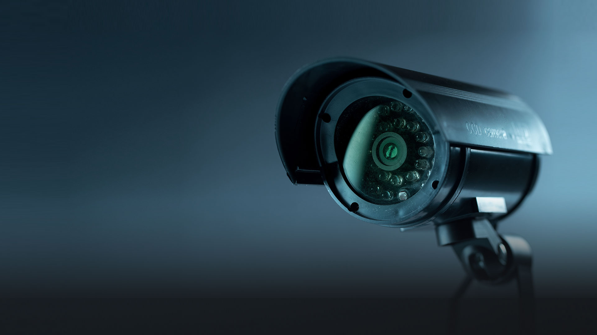

# Этично ли работать в Яндексе?

Я опять сижу курю и думаю свои мысли. Всё ещё идёт война, точнее две. Одна жестокая и кровавая, а вторая экономическая, санкционная. Но одна мысль не даёт мне покоя, она крючком цепляет мою голову. Эта мысль - этика. 

Она и раньше меня цепляла, но тогда это было скорее внутреннее ощущение. Эти мысли были про гемблинг или про крипту. Насколько этично работать в таких компаниях? Насколько этично делать инфраструктуру для сервисов проституции или торговли наркотиками. Насколько этично создавать казино, где люди могут проигрывать свои состояния. На мои вопросы часто слышал ответ - ну братан, если он не потеряет деньги у нас, то потеряет деньги где-то ещё, считай налог на лоха. 

А мне от таких слов всегда немного противно становится где-то в глубине души. Я давно живу, и делал много глупостей, и самая большая глупость которую я делал это врал сам себе. Оказывается если даже никто не знает, что ты поступил нечестно, подло или неэтично, то об этом знаешь ты сам. А самому с собой по вечерам перед сном договариваться, что ты не такой уж и плохой человек намного сложнее. Ты знаешь и тебя мучает совесть. Ты понимаешь, что из-за тебя пострадали люди или потеряли деньги. Ты знаешь, что ты мразь, а жить мразью очень не хочется. 

Сегодня идёт война, и эта война сорвала все маски. Все те кто прикидывался хорошими оказались мразями. Ещё до войны я ходил и спрашивал у людей - а почему ты работаешь в втб? И слышал ответ - я просто делаю свою работу, я не имею никакого отношения к руководству и коррупции. Нет, братан, это так не работает. Без тебя и всех остальных, кто просто делает своё дело, крупные боссы не смогли бы делать своё грязное дело. Ты мне скажешь - если не я, то придут другие. А если не придут? 

Сегодня идёт война, и мы видим как Яндекс вручную ранжирует выдачу, скрывая правду от людей. Мы видим как блокируют оппозиционные сми, журналистов признают иноагентами, но вот чего я не понимаю - почему люди продолжают в этом самом Яндексе работать? Я слышу мнение - я создаю технологию, я не несу ответственность за то как этой технологией пользуются. Нет, братан, это так не работает. Ты создаёшь технологию для одного заказчика, это всё равно создать пистолет и дать его одному маньяку и не дать остальным для самозащиты. 

Сегодня идёт война, я сижу курю и думаю об этике. Гемблинг и крипта уже не выглядят настолько неэтичными. Неэтично оказалось помогать государственным компаниям. Я очень хочу встретиться и послушать истории людей кто работает в РКН или тех кто создавал систему умный город. Просто встретиться, выслушать и посмотреть им в глаза. Зачем?

Сегодня идёт война, а я вижу как люди продолжают работать в российских компаниях. И я не понимаю зачем. Они не увольняются, они молчат, а если и увольняются то единицы. Я не понимаю почему ребята продолжают помогать затыкать рты неугодным. Помогают кормить дракона. Я понимаю, что менять жизнь страшно и сложно, я понимаю что многих пугает неопределённость. Я понимаю, что жить по инерции сильно и проще. Но ведь нам открыт весь мир. И у нас всегда есть выбор, а выбор это и есть свобода. 

Я никого ни к чему не призываю, я никого не стыжу и у меня нет никакой агрессии. Я просто сижу, курю и думаю свои мысли. Я понимаю у каждого своя жизнь, своя история. Но помните, без нас кормить дракона будет некому. И иногда нужно остановиться, подумать и сделать правильный выбор. Выбор за который не будет стыдно, и за который не придётся врать самому себе вечером перед сном. 

P.S. Яндекс это собирательный образ русского айти