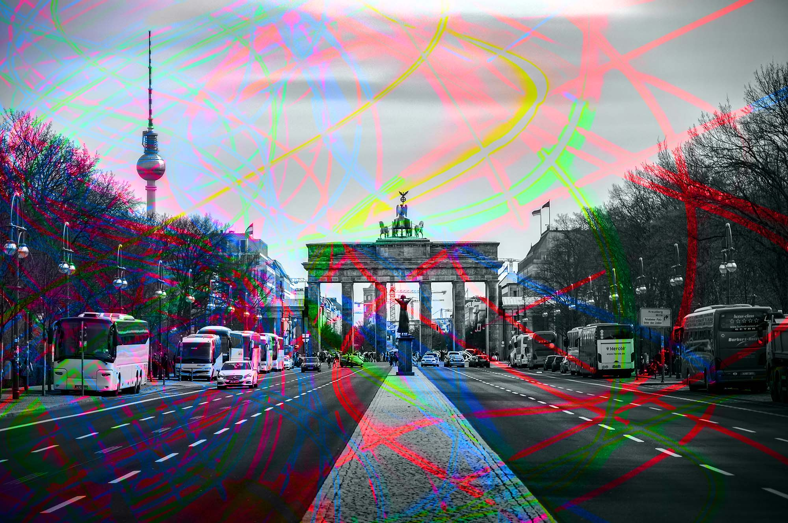
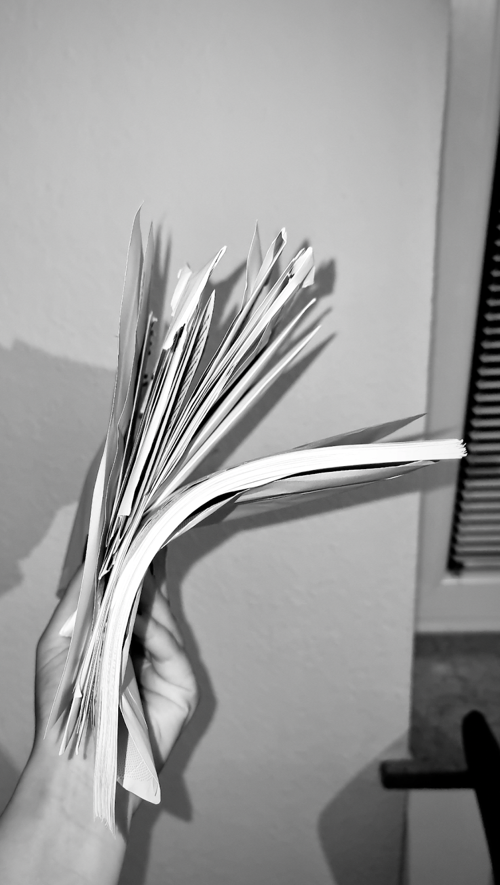
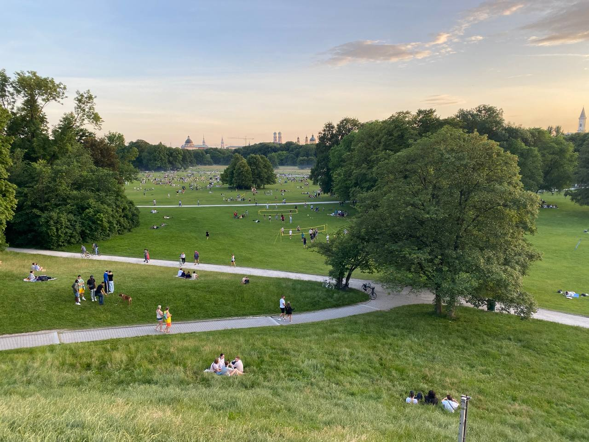
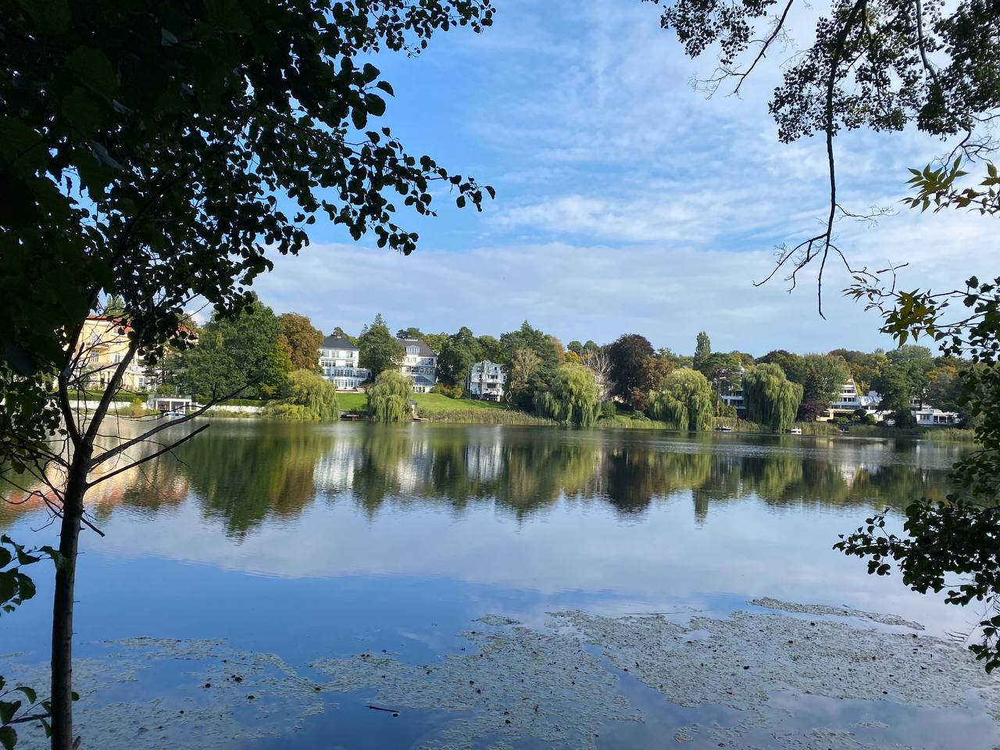

# Как уехать из России в Германию: две истории со счастливым концом

Истории двух разработчиков из России, которые бросили всё и уехали в Германию.

## История 1. Зора: «Я не собираюсь возвращаться»

Меня зовут Зора, я родом из Ингушетии и работаю фронтендером в немецком стартапе P. Я решила уехать из России после начала войны, потому что не хотела находиться в РФ и чувствовала себя там в опасности.

_Горы Баварии напоминают о доме_

У меня уже начинались панические атаки от звонков в дверь, от того, что мои родные не берут трубку. Я начала контролировать соцсети своих близких, чтобы там не появилось ничего опасного для их жизни. И мне было омерзительно стыдно, что нужно жить так — молча и склонив голову. Я понимала, что эта карета несётся в ад. Когда ты с Кавказа, то у тебя вообще нет никаких иллюзий по поводу этой страны с самого рождения. Ты всю «любовь и заботу» этого государства видишь своими глазами каждый день. И слышишь, как тебе говорят «не расслабляться», потому что все там знают, что ничего хорошего не произойдёт. 

_Последнее фото в Москве_

После февраля просто стало уже невыносимо ясно соображать. Казалось, что кругом страшный гул, крики, плач. Мы с супругом по очереди выводили друг друга из паники. Благодаря его решительности мы и уехали в итоге — с двумя чемоданами, не дожидаясь готовности документов. Мне очень повезло быть с близким человеком на всём этом пути.

Я начала искать работу в иностранных компаниях — понимала, что работать на Россию из зарубежья будет сложно и неэтично. Выехать было проблематично, вылеты постоянно откладывали, три рейса отменили. Я уже потеряла надежду улететь, запаниковала. Улетев, до последнего не верила, что я в уже Турции.

Фактически сразу после 24 февраля я начала отправлять отклики повсюду, где видела вакансии. Резюме и портфолио я готовила заранее, зная, что такой день наступит. Какие нужны документы, тоже выясняла заранее. В тот период ещё появилось огромное количество крутейших ресурсов с помощью.

Английский у меня как-то сам по себе выучился за годы в IT, я только вписалась в разговорный клуб весной для надёжности.

Мне была принципиальна только Европа, поэтому я просто искала визовую поддержку в тексте вакансии и откликалась. Ресурс был не важен. Мне даже больно думать, какое количество сайтов в интернете сейчас владеют моей контактной информацией.

В целом отдача была неплохая, хотя сильно суше, чем мои тестовые отклики год назад. Были собесы, на некоторых мой английский хвалили, на некоторых он был недостаточным, так же и с технической стороной — для кого-то я была крутым инженером, а для кого-то не достаточно скилловым, поэтому я просто забила на фидбек и шла дальше, по возможности подтачивая навыки в процессе.

В итоге с моим текущим работодателем было 4 этапа — тестовое задание, созвон с HR, собеседование с тимлидом, тимммейтами и потом ещё 4 коротких созвона на cultural fit.

_Прохожу собеседование в какой-то кафешке_

Каждый этап мне очень сильно нравился, я вообще люблю европейские интервью. После них очень странно участвовать в отечественных собеседованиях, которые часто проводятся без камеры, никаких разговоров, чтобы расположить к себе, никто даже не улыбается, сразу начинают тебя грузить задачами.

Часть этапов я прошла в РФ, часть уже в Турции. Тестовое задание было очень прикладное, нужно было создать интерфейсы для работы, не было никаких задач про эти ваши бинарные кусты и прочее. А на созвонах были ламповые беседы про технологии, про мой опыт взаимодействия с командами, фидбек по тестовому. Я абсолютный фанат Vue, поэтому тестовое на React делала с тревогой в сердце, но они оценили мою искренность и отчаяние, наверное.

_Я очень полюбила Турцию. Не остались там только потому, что пресытились автократией_

Увольняться с прошлой работы было очень легко, работодатель приложил все усилия, чтобы облегчить процесс, и я очень благодарна за это. Ноутбук передавала через попутчика. Но эмоционально очень тяжко было, я сильно сработалась с командой и не планировала уходить до этого всего никуда.

_Работа в полевых условиях_

Визы я оформляла в немецком посольстве в Стамбуле. Компания выделила менеджеров, которые помогали информационно, но в целом мы всё делали самостоятельно. Благодаря тому, что я успела сделать апостили и доверенности в России, всё прошло относительно гладко и быстро. За две недели посольство мне выдало паспорта с визой, только перед этим пришлось писать консулу письмо с прошением, потому что нерезидентов Турции они официально не принимают.

Детей или домашних питомцев у нас нет, поэтому огромное количество проблем и стресса просто отпали. 

_В Германии первым делом пошли искать турецкую еду_

На месте всё оказалось максимально комфортно. Все гайды о переезде в Мюнхен старые, и там всё описано намного страшнее, чем есть. Квартиру мы нашли за месяц, хотя и пришлось увеличить бюджет, бюрократия была не сильно сложнее, чем в Москве. В офисе я встретила русскоговорящих коллег, все были очень рады подсказать и помочь, если что-то нужно. Практически везде в городе понимают английский и принимают оплату картой. В начале не получилось открыть банковскую карту, требовался ВНЖ, который сейчас долго делается. Завела сразу PayPal, поэтому не страдаю от топорности банковской системы никак. Медицинскую страховку получили сразу оба, ещё до прилета в страну — через менеджера.

_Это бумажная почта от государства в первые недели_

_Ратуша в Мюнхене_

В Германии мне нравится отношение людей, доступность красоты и комфорта вокруг. Удивляло, насколько обыденно для людей тут просто расслабленно и приятно жить. Курьеры не выглядят убитыми, кассиры в магазине желают хорошего вечера, 30-летние стажёры на работе объездили полмира — в общем, не чувствуешь себя виноватым в чужих проблемах. Неприятна мне здесь лишь цена за интернет и то, что все мои близкие остались в РФ.

Мне нравится, что по воскресеньям всё закрыто, если честно. Думаю, все заслужили выходной, и это заставляет и тебя самого расслабиться и ничего не планировать на этот день.

_Городской бассейн_

В городе больше всего люблю бассейны. Была поражена их красотой и состоянием. Постоянно гуляю без цели. Могу с работы до дома идти пешком 50 минут и не устать. Ну и хлеб. Какой же тут крутой хлеб. С доставкой продуктов тоже нет проблем, но мне пока нравится ходить в магазины самой.

Мой уровень жизни остался примерно таким же, но путешествия стали намного доступнее, и количество вещей, которые можно приобрести, увеличилось просто за счёт географии.

_Моя первая крупная покупка в эмиграции_

Я почувствовала первые особенности IT-индустрии и культуры. Очень много фидбека и очень много общения, все стараются помочь. В начале назначили двух человек, которые были моими «бадди», то есть помогали со всеми глупыми вопросами. Одновременно почти 3 месяца шёл процесс онбординга. Мне компенсировали затраты на переезд, визы и один месяц аренды жилья. Предоставили психотерапевта, и оказалось, что на английском языке мне гораздо проще проходить терапию.

_Офисная кухня_

_Частичка Октоберфеста с работы_

На работе очень много разнообразия, все постоянно ищут, чем ещё заняться: фронты изучают бэкенд и наоборот. После шести вечера рабочие чаты вымирают, никто не позвонит и не напишет. Отпуск — тоже святое. По скорости работы не замечаю разницы с Россией: похожие таски и эстимейты. Правда, до сих пор немного сложно на созвонах общаться по-английски, чувствуешь неуверенность и в технической части, и в английском тоже. Но команда международная, у всех акценты и свои приколы, очень толерантны к тупым вопросам, поэтому страх постепенно уходит.

Стараюсь выучить и немецкий, обучение оплачивает компания. Не представляю, как тут можно прожить несколько лет без языка, как некоторые мои коллеги. Возможно, я продолжу путешествовать и перееду в другую европейскую страну, но обратно возвращаться в Россию не собираюсь. Я хочу вытащить своих любимых оттуда и забыть про это место навсегда.

_После всего пережитого у нас развилась гиперфиксация на комфортных рабочих местах_

На работе все очень приветливые, предлагают провести досуг вместе. Здесь легче выбраться с кем-то пойти на ланч или кофе-брейк, чем в России. Мне очень нравятся «фальшивые» европейские улыбки и small talk. Мне очень не хватало таких вещей в России. Здесь я стала намного менее тревожной и социально неловкой. К русским здесь относятся со скукой: или просто теряют интерес к этой части твоей личности, или задают вопросы про войну.

_Ещё не облитый супом Ван Гог_ 

Меня удивило, что тут чтут национальные традиции и почти все в браке. Из России кажется, что Европа — это сплошной безумный технорейв, а по сути в окрестностях деревенской Баварии женщины даже не носят брюки. Люди здесь менее уставшие, больше отдыхают, ездят по миру, никуда не спешат и уважают себя и друг друга.

_Великолепная река Изар_

## История 2. Денис: «Релокация позволяет выдохнуть» 

Меня зовут Денис, я — средней руки фронтенд-разработчик примерно с четырьмя годами опыта. Последние полгода работаю в Берлинском офисе крупного банка. Жена работает в соседней команде. Релоцироваться нам предложили в начале апреля.

Вопросов, нужно ли уезжать, не было. 24 февраля мы с будущей женой подали заявление в ЗАГС. А 26-27 февраля были уже в Душанбе, потому что боялись, что границы закроют.

Мы какое-то время пожили в Турции, думая, что теперь придётся искать другую работу. Но в компании нас успокоили, сказав, что релоцируют в Германию всех, кто захочет, только попросили вернуться для оформления документов. Мы приехали в Москву и встали в очередь на получение рабочих виз. Месяц спустя мы жили в гостинице за счёт компании.

Перелёт прошёл нормально, единственная неприятность — [поступали сигналы](https://t.me/+yHACAsBxEXo4OGEy), что на границе могут проверять телефоны, поэтому пришлось удалить почти все переписки.

Так как желающих было много, работодатель обратился к нескольким агентствам по релокации. Те со скрипом, но смогли обработать такой наплыв заявок. Компания помогает платить налоги и страховки, предоставляет курсы немецкого, помощь с документами/поисками жилья/устройством детей в школы.

Каждый день в воюющей России очень давил на психику, был постоянный страх закрытия границ, ощущение бесполезности работы и накоплений, отсутствие возможности строить планы на неделю вперёд. Да и массовый отъезд всего круга общения не давал особой мотивации ждать конца режима внутри страны.

Сразу после прохождения немецкой таможни появилось чувство лёгкости, будто снял с плеч рюкзак с камнями. Можно было вздохнуть полной грудью, расправить плечи и думать о том, как вытаскивать родителей на зимовку за рубеж. Одно это ощущение спокойствия стоило того, чтобы переехать.

В Берлине очень распространён русский язык. Если кто-то не говорит по-русски, он почти всегда говорит по-английски. Нет острой необходимости учить немецкий язык. Есть непривычная особенность бюрократии — на каждый чих отправлять тебе несколько писем в конвертах. Фразы «вам придёт на почту»  и «вам придёт на email» тут значат не одно и то же. Первый месяц было грустно без финтеха и удобных маршрутов 2ГИС, но потом привыкаешь и к кэшу, и не верить картам в телефоне.

Как правило, если ты айтишник и переезжаешь в любую европейскую столицу, там обязательно найдутся как минимум знакомые знакомых. Мы вышли на контакт с парой друзей, через них — на комьюнити околоайтишных ребят из стран СНГ. Естественно, можно найти иммигранские чаты на любой вкус.

Берлин — очень комфортный и зелёный город. В нём много парков, рядом леса и милые деревушки. Тут нет вылизанного центра и убитого пригорода, а есть разные районы со своими особенностями и центрами притяжения. Тут своеобразная система метро, отличающаяся по принципам от московского, много автобусных маршрутов и выделенных полос. Есть трамваи, велодорожки и междугородние поезда, стабильно чучухающие со скоростью под 300 км/ч. 

В Германии очень удобная система оплаты общественного транспорта даже по меркам Европы: тут нет кондукторов и турникетов, но есть немного контролёров, штраф 60 евро за безбилетный проезд и общий билет на всё за 49 евро/месяц. 

Очень приятно ходить по городу, замечать отличия с довоенной Россией, ценить то, что уже лучше у нас, и подмечать местные рабочие практики, которые можно будет легко перенести в готовом виде. Хочется верить, что, если сохраним себя, то всё успешно пересоберём. 

