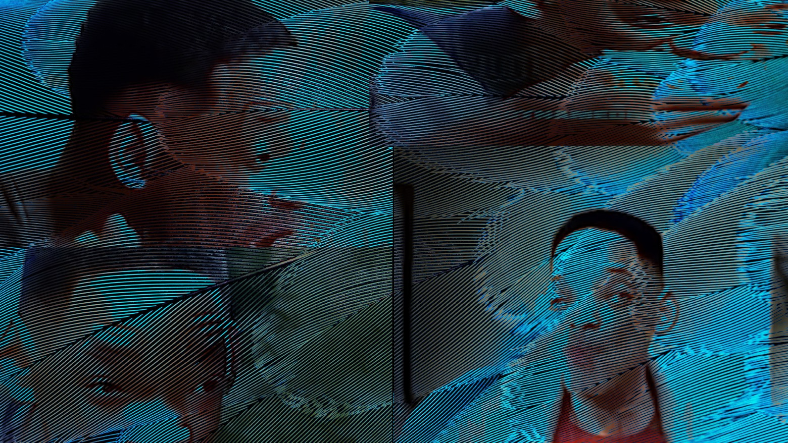

# Большой языковой призрак коммунизма

> Сумасшедшая колонка [Артема мать его Малышева](https://twitter.com/ArtyomMalyshev)

У меня есть врожденная особенность, и у нее две стороны — одна делает мою жизнь интереснее, вторая — тяжелее.

Мое воображение с детства одержимо историями. Я, как это говорили, всегда витал в облаках и считал ворон. Всегда что-то сочиняю в голове, там всегда есть несколько воображаемых миров, в которых вечно что-то происходит. Внутри это ощущается так, как будто я прочитал сотни книг (или посмотрел фильмов, или прошел видеоигр) которых не существует. Голова полна впечатлений от того, чего нет. 

Идея все записывать пришла тоже очень рано. Это было когда я впервые взял книгу из библиотеки — Винни-Пух в пересказе Бориса Заходера (я тогда и знать не знал, что еще за пересказ) — прочитал, и вместе с бабушкой понес ее обратно.

По пути я как всегда исчез в облаках. В моей голове разворачивались драматичные приключения уличного кота в духе Короля Льва, но ближе к реалиям моей жизни в маленьком русском городке. Внезапно меня так окрылила идея, что я могу взять и сам написать про эти приключения! Сидеть и сочинять что хочу. И тогда я как будто еще острее смогу их пережить, сам для себя сочиню историю своей мечты. Это все равно что увидеть ее по настоящему, но в сто раз круче.

Ох, как я загорелся. Я выпросил у бабушки отдельную большую тетрадь — она была формата А4, в оранжевой обложке и в клеточку. Взрослая, то ли советская студенческая, то ли даже рабочая, для учета чего-то важного. Я уже представлял ее исписанной от корки до корки.

И вот дома, я сел, взял ручку, открыл тетрадь — и столкнулся с обратной стороной своей особенности.

У меня нахрен врожденный писательский блок.

При виде белого листа мои фантазии растворяются, миры гибнут, задумки прячутся по темным углам. Я не могу родить ни слова. Как будто что-то сломано. Какой-то преобразователь между древними-древними участками сознания, где не существует человеческого языка, и мысли роятся в неосязаемом виде — и тем, что отвечают за письменную речь на языке придуманном людьми и выученным мной.

Эти истории в моей голове — гениальны. Они особенные. Если бы я только мог их достать, я был бы трижды миллиардером, самым великим мыслителем на планете.

Но тетрадка так и осталась пустой. Всю жизнь я мечтаю писать, но за свои 34 года смог вымучать только две небольшие повести — ценой адских страданий и нечеловеческих усилий. Оба раза я был опустошен и измотан, и эти жертвы не то чтобы конвертировались в невероятное качество и великую художественную ценность. 

И вот всю жизнь — ворочая в голове сотнями историй и пытаясь их записать, я себе говорю — оно того не стоит.

А теперь, когда я рассказал о себе, мне кое-что интересно про вас. Допустим, фантазировать и витать в облаках, это обычная человеческая черта, ничего в ней особенного нет. Что вы почувствовали, когда я назвал это своей особенностью? Поверили, что у меня есть какой-то потенциальный талант? Что я реально особенный и мои задумки гениальны? Подумали что я — хоть это никак нельзя доказать и проверить — лучше вас в сочинении историй? Что мое воображение от рождения богаче вашего? Если да, как вам эта мысль? Пофигу или немного раздражает, где-то глубоко на подкорке? 

Только что в интернете я видел ролик сгенерированный нейросетью, где Уилл Смит ест спагетти. Кадр в этом ролике поделен на две части. Слева изображение подписано “ИИ год назад” и выглядит как ночной кошмар при температуре под 40. Картинка изменяется так быстро и жутко неестественно как будто сама не успевает принять форму которую хочет принять. От нее буквально тошнит.

Справа в кадре надпись “ИИ сейчас” — и там вполне живой Уилл Смит вполне нормально ест вполне аппетитные спагетти. Тоже конечно не совсем, и отторжения чуть побольше чем в фильме Гемини, где Уилл Смит омоложен с помощью компьютерной графики — но прогресс еще какой наглядный. Наверное похожие впечатления я бы испытывал и глядя на реальное видео, где он набивает себе полный рот еды.

Ну и конечно же я смотрел это видео зная весь контекст хайпа вокруг развития ИИ. Сейчас чтобы сойти за умного следует относиться к этому хайпу с долей скепсиса. Обязательно добавлять в речи “Я конечно не могу ничего предсказывать, но мне кажется…” и поругивать журналистов и прочих не разбирающихся в технологиях людей, что они больно уж сочиняют сказки и накручивают ерунды. Я тоже здесь буду скептичничать, чтобы сильно никого не раздражать. 

Но что поделать — если судить по миру только из заголовков техно новостей, он и правда начинает напоминать сюжеты из научной фантастики. Забавно, что они — эти сюжеты — нехило взвинтили нам стандарты принятия технологий, но из-за них мы ждем изменений не там, где они могут произойти.

Надуманные ожидания — роботы отнимут работу у людей. Роботы начнут убивать людей. Роботы станут осознанными и захватят власть. Роботы станут частью общества и будут жить с нами наравне. Ясен хрен этого ничего не происходит, и мы такие — ну и чего, ну и где? Херня этот ваш хваленый ИИ. Сделайте сначала чтобы интернет не лагал, а там уже и пробужайте сколько хотите свои ЭлЭлЭмки.

Самый социально одобряемый и уважаемый взгляд на развитие ИИ — это вот так скрестить руки на груди, чуть-чуть закатить глаза и рассудительным голосом сказать — да господи, это всего лишь еще один инструмент работы с интернетом, ниче тут сверх особенного нет и не будет.

Но инструмент работы с интернетом может иметь чертовски огромное значение в нашу эпоху. 

В сай фае может и есть роботы неотличимые от людей и полеты в космос, но в целом там все слишком знакомо. Люди ведут классическую социальную жизнь 20 века, ходят ногами, разговаривают ртами и словами, встречаются-расстаются, у них те же страсти, проблемы и переживания, что у нас — просто немного вычурные декорации вокруг. 

Покажите мне хоть один научно фантастический фильм, где люди 10 часов в день залипают в гаджеты и это не выглядит как страшная антиутопия, где гаджеты прямым текстом сравнивают с наркотиками и инструментом порабощения всего человечества большим братом.

Где просто обыденно и без осуждения от авторов люди тупят в интернет.

Социальные изменения почти никогда не видны в моменте и изнутри. Только задним числом, спустя годы, мы можем сказать — ой, даже и не представляю как мы раньше жили.

Самая мелочь — какие будут ощущения, если например вы вечером в паре-тройке районов от дома, и у вас разряжается телефон? Как ощущения если вы уже далеко уехали от дома, и обнаружили что вообще его где-то забыли? У меня вот так себе, хотелось бы лучше избежать — но попадая в такую ситуацию я не помню, чтобы хоть раз подумал, ну все, пиздец, как же изменился мир, что же с нами стало, что за гребаная проблема выйти из дома без телефона.

Зато помню, как я думал именно такие мысли, посмотрев через тот же сраный телефон на записи концертов двадцатилетней давности. В зрительном зале не было ни одного человека с камерой телефона в руках. И я такой — о черт. 

Я не осуждаю. Просто контраст слишком бросается в глаза. 50 тысяч людей с телефонами над головой и 50 тысяч людей без телефонов над головой выглядят капец по разному. Что изменилось? Зачем этим 50 тысячам посетителей концертов снимать все происходящее на сцене? Почему раньше было не надо а сейчас надо?

Потому что появились новые инструменты и развился интернет, который с их помощью можно бесконечно много наполнять контентом. А уже с помощью этого контента мы теперь взаимодействуем с другими людьми и строим там целые новые общественные институты, системы и договоры, построенные на привлечении внимания. Это огромная часть жизни. Наполняете вы интернет контентом или только потребляете — не важно. 

И вот в этой огромной части жизни заговорили про новый инструмент, значимый и большой.

Бля, да это пиздец как важно.

Мне чертовски интересно, что в 2044 году будет вызывать у нас ощущение — и как же так мы раньше без этого жили? И я здесь в первую очередь думаю, не о пробуждении самосознания в генеративных системах. Что считать сознанием — это вообще отдельный разговор.

Скорее — до каких абсурдных высот эволюционирует наша капиталистическая система. Мы не на пороге появления живых роботов — мы на пороге появления инструмента, у которого есть потенциал за несколько лет вызвать взрывную инфляцию внимания и цифровой ценности, на которых сейчас построена охренеть какая жирная часть экономики. ИТ-сектора уж точно почти всего.

Я смотрю на видео, где сгенерированный Уилл Смит поедает спагетти — его левая половина вызывает у меня физическую тошноту, а правая глубокую экзистенциальную тревогу. 

А нахрена это нужно?

Современные технологии ИИ уходят корнями почти на 100 лет назад. Тысячи ученых сломали головы об эти алгоритмы, некоторые сломали рассудки и жизни. Прошли десятки лет, прежде чем железо догнало идеи на бумаге, миллиарды долларов сгорели в провальных проектах, рождались и тухли целые технологические сектора, ИИ расцветы сменялись ИИ зимами а потом снова расцветами. Люди с учеными степенями поколениями двигали прогресс до момента, где я, на экране сверх-технологичного гаджета, с редкими металлами внутри, добытыми черт знает где и черт знает какой ценой, по патентам стоимостью в ВВП нескольких стран — буду смотреть как сгенерированный Уилл Смит ест спагетти.

Ну надо же, как настоящий — подумаю я пару секунд, и проскроллю дальше.

Я помню, как в 2019 году готовился к интервью с бывшим техдиром ВК, и меня поразил его доклад — реальной технической сложностью, интересными, баснословно дорогими и тогда совсем мне непонятными идеями тренировки нейросетей — ради того, чтобы накладывать на сэлфи красивые фильтры в духе разных стилей искусства.

Что-то во мне уже тогда начало трескаться и из трещин этих начали лезть первые ростки технодумерства. Слишком сильный контраст между невероятным развитием человеческой мысли — и мелочностью результатов, к которым они приводят.

Я спросил его — а нахрена это все? Тебе не кажется, что мы тратим себя на какие-то пустяки?

Конечно, он сказал, что не кажется. Его мысль была в том, что прогресс фундаментально движется от любых пустяков, которые мы разрабатываем. Сегодня алгоритм рисует котиков, а завтра диагностирует рак на ранней стадии.

Я ушел со своим выводом. Сейчас мне кажется, что наша тяга к прогрессу иррациональна. Где-то в ее глубинах живет наше стремление и к саморазрушению, и к принятию бессмысленности. Но прогресс, как и тягу к нему, не остановить, поэтому мы всегда будем оправдывать свои дела потенциальным спасением жизней в будущем и лечением рака на ранней стадии.

И все же — нахрена мне видео где сгенерированный Уилл Смит ест спагетти? Нахрена эта крадущаяся по улице кошка? Эта женщина в красочных огнях Таймс-Сквера? И все эти посты «вот еще 10 умопомрачительных примеров, на что способен новый инструмент OpenAI»

Почему вдруг нейросети с ноги ворвались в область, где они меньше всего нужны? Кто в здравом уме будет смотреть эти сгенерированные видео? Для кого эти нейро картинки? Для кого компьютерные песни? Зачем они первым делом ворвались в творчество. Не в рутинную работу, которую человечество веками пытается облегчить и автоматизировать. А в ту, которую людям нравится делать самим.

Я пытаюсь быть адвокатом дьявола и рассуждаю в том же спасительном направлении — прогресс всегда приносит пользу не там, где ее ждут.

Хорошо, допустим у нас появились популярные сервисы, еле-еле держащие нагрузку. Даже сейчас, когда всем этим генерированием контента занимаются ИИ энтузиасты — деньги на вычислительные мощности уже горят как в печи, и все равно приходится ждать пока сервис доберется до твоего запроса и сгенерирует тебе чего ты там хочешь.

Может это подтолкнет развитие инфраструктуры, заставит железо работать еще быстрее, найти способы наконец то оптимизировать все, чего там понаизобретали в последние десятилетия. То есть — сделать интернет технически лучше и надежнее.

Чтобы он мог вместить в себя еще больше Уиллов Смттов пожирающих спагетти.

Пойду дальше в фантазии — допустим технологии стали невероятно быстры, и условная восьмая версия нового сервиса от OpenAI уже может генерировать не минутную ожившую картинку, а сорокаминутный более менее связный видеоролик, скажем, секунд за десять, да еще и сразу в формате VR для Apple Vision Pro 6s. От переизбытка контента хранилища займут еще миллиард гектаров, что создаст еще очень много рабочих мест в африканских шахтах, а для нас, чтобы мы все успевали потреблять, выпустят Neuralink 4 стимулирующий когнитивные способности и повышающий скорость восприятия информации до 10 раз по сравнению с классическим чтением; а визуальной информации — на скорости икс пять без потери качества восприятия.

Что если тогда мы сможем ускорить получение образования в разы и уже без иронии становиться синьорами за две недели. Но самое главное — успевать смотреть еще больше Уиллов Смитов пожирающих ВООБЩЕ ВСЕ возможные блюда. 

Все мои рассуждения упираются в эту сраную морду, пихающую в себя спагетти.

Я смотрю на сгенерированного Уилла Смита, который пожирает спагетти — на его левую часть — и кроме тошноты чувствую кое-что еще. То, как неестественно движется форма, как один кадр перетекает в другой и я не могу уловить момент смены картинки — оно блин мне что-то напоминает.

Что если где-то глубоко в моих мозгах, то, что я считаю своими мыслями до того, как они стали словами — что если они выглядят так же. Хаотичная череда четырехмерных узоров в десятке параллельных одновременных потоков.

И где-то там, среди них, звучит хитрая мысль с дьявольским хихиканьем.

— Артем, а не думал ли ты, что ИИ решит твою проблему с врожденным писательским блоком? Что если у тебя появится некий инструмент, новый интерфейс для выражения историй из твоей головы. Ручка и бумага, да даже экран и клавиатура слишком несовершенны для этого. У тебя в голове уже есть впечатление от готовой книги, а писать ее придется в муках целый год. Просто дай мне это впечатление, и я покажу тебе готовую книгу. Хочешь приключения уличного кота в маленьком русском городке и в духе Короля Льва? Я тебе помогу.

И вот эта идея — что ИИ не убьет творчество, а наоборот — сделает его доступным для всех.

Для всех одинаково. А не только для элиты, и избранных творцов. Что если генеративный инструмент всех уравняет. Не будет больше такого что этот талантливый, а этот бестолочь. Этот умеет красиво говорить — а этот нет. Этот талантливый писатель-музыкант-художник, а этот — неудачник несчастный. 

А что если тогда. 

Больше не надо учиться рисовать, писать, фотографировать, сочинять музыку, петь, не надо испытывать никаких творческих мук, тратить жизнь на рутину. От замысла до результата один шаг. Нейропромпт, напрямую из черепушки на сервак.

Вся эта херня про невероятный талант, врожденные способности, гениальность, сраный элитаризм зазнавшихся и дохера возомнивших о себе творцов — все наконец то можно выбросить на свалку. Сраный тиктокер который виляет задницей на камеру и гребет за это миллионы больше никому не нужен, потому что кто хочешь за минуту нагенерит красивее, увлекательнее и веселее чем он за всю жизнь. Дурацкие инфоцыгане разорятся, потому что кому теперь в жопу сдались их уроки. 

А сраные леваки мыслители в белоснежном пальто и на своем гребаном троне морального превосходства думают, что у них одних есть право на верное мнение только потому что они красиво чешут языком и умеют дискутировать — ну посмотрим как они попляшут против моей нейронки, тренированной на террабайтах интернет срачей.

Какие же лохи эти художнички, которые угрохали всю жизнь чтобы качать скиллы рисования. Я теперь за секунду сделаю в сто раз лучше. Наконец-то бесячие актеры и всякие блогеры пойдут по миру, понюхают реальной жизни. Привыкли суки жить в шелках и с напыщенными мордами смотреть на всех свысока — просто блин потому что родились с красивой мордашкой и торгуют ей на камеру. Как можно за эту бесполезную херню получать миллионы!? А никак — если бесконечное количество самых красивых во вселенной морд генерируется за две секунды.

И жрет эти сраные спагетти.

Вот уж теперь то все будут равны — нет никаких больше сраных гениев любимцев публики. Теперь любая задумка любого человека — это высококлассное искусство. Всемирное творческое равенство. Гребанный нейро-арт-коммунизм.

Супер справедливость!

Чертовы гуманитарии! Вздумали считать себя талантливее и способнее. Лучше других людей! Просто потому что научились превращать свои задумки — в дебильный контент. Да этого контента теперь завались! Все — вообще все — мыслят одинаково, у любого рандома этих мыслей полная башка — а эти сволочи забрались на монумент, потому что всех наебали и впарили свою вонючие мысли как охренеть не встать ценность.

Сколько веков вы, поганые творческие нетакусики твердили про свои ебучие полеты мысли и невероятные глубины души, кичились со своими эмоциями и высказываниями.

Все, железяка теперь вас переплюнула. Как вам, возвышенные вы мои мыслители, а? Напишете еще эссе как компьютеру никогда не достигнуть высот человеческого творчества? Соберете профсоюз обиженных писак, которые не могут потягаться с видеокартой? Компьютерные нерды переиграли вас к хуям.

Вот и жрите теперь! Новая классовая революция! Мир равенство и братство. Все равны, все одинаковые. Обожритесь, до тошноты, чтобы изо рта валилось 

И когда этот бесконечный поток из десяти миллиардов голов вас нахрен захлестнет и затопит — вот тогда и поймете, что вы просто вши. Дерьмо случайно наросшее на камушек среди бесконечной пустоты. И нет в вас самих никакого сознания и души, и нихрена не стоят ни ваши идеи, ни ваши мысли, сраные зазнавшиеся кожаные мешки.

Вот тогда и поймете что такое прогресс на самом деле — торжество нигилизма и саморазрушения. И никто нахрен не собирался никогда спасать ваши сраные жизни и делать ваш ебучий мир лучше.

Вы просто десяток тысяч лет строили прямой конвейер говна из своей жопы себе в рот. И теперь наконец то в нем захлебнетесь.

Блять, Уилл Смит справа был настоящий.

_Если вы хотите рассказать свою историю на «Разрабах» — добавляйтесь в [чатик](https://t.me/content_razrabs) и читайте закреп._
