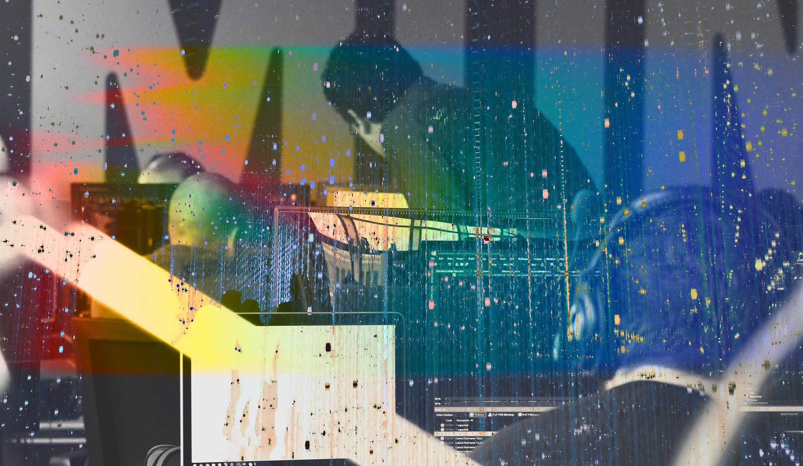

# «Мир, в котором почти все — айтишники, наступает. Надо быть готовым». Глеб Михеев рассказывает про учебу, будущее и собесы в барах

Глеб Михеев — видный человек в мире IT. Завсегдатай конференций и герой десятков видео на ютубе. Когда-то он работал в Nvidia, открывал, развивал и продавал свой программистский бизнес.

Разраб с кучей неочевидных советов и историй [рассказывает](https://www.youtube.com/watch?v=hamdtY6laR8), как он попал в индустрию. Обязательно посмотрите.

Ниже мысли Глеба о проблемах современного айти сегодня.

------

В 2020 году индустрия требовала более 40 миллионов разработчиков. Через год рынок вырос на четверть, понадобилось 50 миллионов человек. К 2025 году потребуется 190 миллионов айтишников. Индустрия не успевает с закрытием текущих проблем, а мы должны увеличить количество разработчиков в 4 раза.

Каждому десятому человеку в мире в возрасте от 20 до 35 лет придется стать цифровым трудягой. И это капец какая мировая проблема. Те, кто не хотят меняться, очень быстро окажутся на обочине. Что нам делать в такой ситуации? Мы обязаны «научиться учиться».

Жизнь программиста — это синоним постоянного обучения. Ты не можешь один раз чему-то выучиться и эксплуатировать этот навык без развития. Мир быстро меняется, приходят новые инструменты и технологии. Не обучаясь, невозможно быть не только разработчиком, но и жителем 2022 года. 

Представьте, каково сейчас министерству образования. У него сейчас большие проблемы. Там не понимают как образовывать людей в мире новой дистрибьюции — дистрибьюции через цифру. Мы помним, как в пандемию учителя оказались заложниками принятых методологий. Привычный прием, когда ты собирал всех вместе, перестал работать. Это одна из причин появления такого количества EdTech-компаний.

## Пока ты боишься батиного ремня, бизнес растет на провалах

Нам страшно, когда мы не знаем правильный ответ. Мы боимся ошибиться и даже не пытаемся найти решение. Бездействие, задрайвленное страхом, растет из страха ошибки, которое нам прививают в детстве. Пятерка — хорошо, двойка — а-та-та. Учителя ругают, одноклассники посмеиваются, родители ждут пятерок. Все общество работает по принципу: либо знаешь, либо — лох. Страшно показывать свое незнание. Нас учат прятать его поглубже.

Наверняка вы встречали людей на работе, которые долго-долго сидят, что-то делают. Потом выясняется, что они крепко накосячили. Знали, что косячат, но скрывали это. Им было страшно признаться, их ругали за это в школе.

Страх ошибки — это супер пагубная вещь. Не умеешь ошибаться, не делаешь выводы. И не растешь на своих ошибках.

В продуктовой разработке есть концепция Fail fast, Fail cheap. Быстро ошибаемся — дешево ошибаемся. В компаниях работают команды развития и фигачат гипотезы. Из глины и палок они быстро собирают проекты и проверяют: взлетит или нет. Тратят очень мало денег, докручивают пока не заработает. И только потом красиво и в деталях масштабируют.

Чтобы проверить гипотезу им нужна лишь маленькая плохонькая кнопочка на сайте. Просто частный пример, как этим пользуется реальный бизнес. Если бизнес находит ценность в частых ошибках, почему мы не хотим ее замечать?

## Собеседовать в баре — нормально

На одной из вечеринок подошел парень, который полгода назад был у меня на собеседовании. Подходит и говорит: «Блин, братан, ты мне собесом жизнь поменял». Я сначала подумал, что он шутит.

Мы собесились с пивом. У меня есть такая практика по пятницам. Считаю абсолютно не зашкварным угостить пивом человека, который пришел вечером на собеседование.

С ним так и поговорили. Затронули много всяких тем. Что-то я посерьезнее спрашивал, где-то просто болтали. Я практикую собеседования с обратной связью с тех пор, как впервые сам оказался на таком собесе.

Однажды я попал на собеседование буквально к двум пацанам. Один с дредами, импланты с колючками, туннели в ушах, язык проколотый — полный набор. Начали в восемь вечера, просидели до одиннадцати. Давали покодить, просили что-то объяснить. Было очень интересно.

Я не со всем справился. Тогда мне казалось, если от меня ожидают знаний, а я не вывожу — это фейл. Но там было по-другому. В духе «смотри, ты почти решил, но здесь надо было сделать вот так. В целом круто, пошли дальше». Это было собеседование в Nvidia.

Собес с обратной связью — топчик. Если вы оказались на собеседовании с обратной связью, скорее всего в компании все хорошо с корпоративной культурой. Людям нравится проходить такие собесы. Даже те, кто не получают работу, все равно благодарят за такой подход.

## Компаниям нужны тащеры

Раз в полгода в Nvidia сотрудники друг друга оценивают. Ответы на вопросы о коллегах превращается в понятную цифру от одного до пяти, где:

1 — сотрудник драматически не справляется,
2 — справляются не со всем, на что его взяли,
3 — работает ровно так, как от него хотели,
4 — иногда что-то привносит, драйвит, чувствуется, что с ним компания растет,
5 — тащер, постоянно берет челленджи, всем помогает, его проекты улучшает жизнь, развивает компанию, импактит в нее.

Единички и двойки увольняются. Они обуза и не нужны компании. Если увольнение не создает проблем, тройки тоже увольняются. Четверки получают, допустим, условный коэффициент плюс полтора к зарплате. Пятеркам увеличивают оплату в три раза. 

Этот процесс помогает понять, кто нужен компании. Если ты тащер — это ожидают и ценят. Тащить круто (очень больно, но всегда интересно). Это похоже на бег по пересеченной местности, по которой еще никто не бегал, или на бег с препятствиями по терновым кустам. Тебе реально тяжело, но от этого очень круто.

## Если ты джун — общайся. В айти-тусовке тебя не пошлют. Наоборот, многое расскажут

Будь такая возможность, я рассказал бы себе джуну о том, что существует комьюнити. Что ему будет нравиться в них общаться. Первое что нужно сделать каждому — это выйти в комьюнити. Сообщество легко принимает новичков.

Удивительно, но ты можешь приехать на конфу послушать спикера, которого считаешь топовым. И потом затусить с ним. Попить пива, пока он рассказывает тебе кучу всего интересного. Оказывается, так можно. Мое послание для себя молодого: так можно, найди себе тусовку.

Я не всегда знал, что так бывает. Разработчик, который только начинает свой путь, думает, что его все пошлют. Нет, не пошлют. Концепция комьюнити-тусовок строится на том, что есть ребята, которым хочется делиться знаниями. Если они собираются пить чай или что покрепче, приходи тусоваться. Приходи общаться, они же открыты.

## К онлайн-образованию еще не привыкли. Но пора бы уже

У Крылова есть басня “Мартышки и очки”. Она очень классно иллюстрирует то, как люди воспринимают любую инновацию. И в том числе EdTech.

Помните, в 90-е были твердые сидушки в автобусах? А потом появились из ткани: мягкие, красивые и комфортные. Люди не понимали что с ними делать. Кто-то резал ножом, другой садился с ногами, третий — ссал на них. Как в басне: и на хвост очки примерят, и вверх ногами наденут в попытке понять, как ими пользоваться.

Когда появились телефоны с тач-экранами, дизайнеры придумали скевоморфизм. Вещи из реального мира перетащили в телефон, чтобы всем было удобно и понятно. Прилага Notes выглядела как блокнотик. А когда все привыкли, на смену пришел плоский дизайн, совсем не похожий на реальный мир.

EdTech тоже пытаются мерить классическим образованием. Но эта иная форма образования с другой доставкой и возможностями. Мы в самом начале пути. EdTech очень молодой.

Новые вызовы человечеству: цифровизация, взлет количества IT-вакансий в мире, где количество разработчиков не растет, непонимание того, как учиться. У меня и бизнес в разработке. Я страдаю от того, что нам стало сложно нанимать людей.Что нам с этим всем делать, ребята? 
