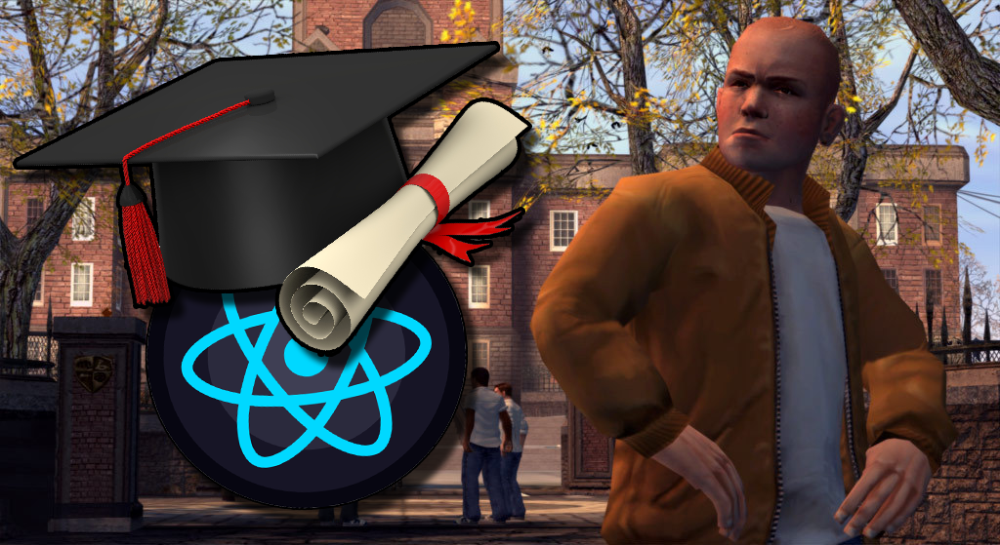

# Преподаватель о том «как не потерять время в университете впустую»

Я Мельников Максим, преподаватель в классическом университете и один из авторов образовательного YouTube-канала по программированию PyLounge. Давно занимаюсь программированием, много чего узнал за это время, и мне есть чем поделиться.

# Поступить в ВУЗ было ошибкой? 

Я сам довольно много учусь. Даже сейчас, будучи преподавателем вуза, я продолжаю учиться. Закончив бакалавриат по направлению «Информатика и вычислительная техника», продолжаю обучение в магистратуре «Бизнес-информатика» с перспективой стать аспирантом по компьютерным наукам. Поэтому тема образования и студенчества очень близка мне как никакая другая. Это действительно то, что заставляет трепетать мою душу. Поэтому я хочу поделиться своим опытом с теми, кто только поступил или думает о поступлении в вуз/ссуз. Здесь будет приведено несколько моих мыслей-советов, к которым, скорее всего, ты пришёл бы и сам рано или поздно. И пусть, наверное, это будет рано. Я просто хочу сесть и поговорить с тобой. Только ты и я. 

За время работы я столкнулся с большим количеством студентов, и очень печально наблюдать либо погасший огонь в их глазах, либо полное смятение, непонимание того, что они делают и что вообще происходит. Чтобы ты не повторил их судьбу, предлагаю подумать над тем, что я здесь напишу, чтобы при неблагоприятном стечении обстоятельств не потратить 4–5 лет в университете впустую. 

После поступления в вуз/ссуз важно понять — школа закончилась. За тобой, скорее всего, уже никто не будет бегать. Поэтому теперь ты должен перестать плыть по течению. Ты не должен упускать инициативу. Ты сам должен быть инициативой, потому что взрослая жизнь уже началась. 
Ты пришёл учиться, и ты в первую очередь заинтересован в том, чтобы получать знания. Университет или колледж — это не то место, где в тебя будут насильно запихивать знания. Это то место, которое даёт тебе некоторый вектор, направление, в какую сторону тебе двигаться, что изучать. В идеале цель образовательной организации — **дать тебе такой минимум, чтобы дальше ты смог уже сам взять максимум**. Поэтому ты должен не пускать всё на самотёк. Надо брать инициативу в свои руки. 

Да, преподаватели бывают разные. Бывают те, кто старается донести знания, те, кто горят мыслью обучать людей, а бывают те, кому откровенно плевать. Такое бывает, часто бывает, это суровая реальность. Если ты действительно хочешь чему-то научиться, например, стать программистом, и тебе сразу же попались преподаватели из второй категории, которые вообще не ведут занятия, которые безразлично относятся к ремеслу, то твоя задача — не забивать, не сдаваться, не обижаться, не показывать «характер» риторикой по типу: «ну и пошли они в жопу, я тогда и делать ничего не буду». Всё по-прежнему в твоих руках. Ты видишь учебный план, видишь рабочие программы по дисциплинам, посмотри, что подразумевает изучение этого предмета, что ты должен выучить по этой дисциплине и попробуй потихоньку разбираться в этом сам. Здесь важно понять — научиться чему-то хочешь ты. Спасение утопающих — дело рук самих утопающих. Это главная ошибка почти всех студентов: они просто плывут по течению. В надежде, что кто-то возьмёт знания, пережуёт их и положит их прямо им в рот. Но нет, даже с хорошими учителями такого не будет. 

Когда чуть позже у тебя будет, например, курсовой проект, не бери первую попавшуюся тему. Возьми курсовую по теме, которая хоть чуть-чуть тебе интересна. Что-то, что ты сам бы хотел изучить, попробовать и сделать. У тебя будет «повод» получить те, знания, которые ты сам хочешь получить, так ещё и курсовую сдашь. Одни плюсы. Аналогично с дипломной работой. Прояви инициативу, возьми на свой выпускной проект то, что ты сможешь, например, добавить себе в портфолио. Да, это будет не «боевой» проект, но диплом подразумевает уже какую-то относительно серьёзную работу, и, если сделать её на достойном уровне, она сможет стать добротным pet-проектом.

Допустим, интересуешься ты веб-разработкой — сделай шикарный сайт своей кафедры, чтобы прям SPА c `TypeScript`, `React` и `NextJS`. Или аналогичный сайт «портфолио студента». 
Пусть твои курсовые, дипломы, проекты, которые ты делал во время учёбы, станут хоть каким-то подтверждением твоей компетентности как IT-специалиста, пусть и не обладающего опытом коммерческой разработки. Имея хоть какие-то свои проекты, ты уже будешь на уровень выше кандидатов, у которых таковых нет. 
За эти 4–5 лет в университетских стенах ты должен взять максимум. Даже если учебная программа идёт вразрез с твоими интересами — уделяй время тому, что тебе интересно. Это касается и случая, когда родители отправляют учиться. Важно то, что, несмотря на разного рода обстоятельства, ты не должен потерять это время в пустую. 

Если ты учишься на специальности, которая тебе интересна, изучай дополнительный материал сам, погружайся дальше, обгоняй программу. Если преподаватели попались хорошие — бери от них максимум, задавай вопросы, спроси, что ещё можно почитать, посмотреть, бери всё и максимально жадно. Если же преподаватели не особо заинтересованы в твоём обучении — ты видишь путь, цель, навёрстывай сам. 
Если специальность идёт вразрез с интересами — делай необходимый минимум по учебному плану, а остальное время уделяй изучению того, что интересно тебе. Хочешь по-настоящему что-то знать в программировании — учишь сам. Много разработчиков не имеют высшего образования вообще, однако это не помешало им стать профессионалами своего дела.

Учеба в университете — это в первую очередь время, которое есть именно у тебя, когда тебе не нужно работать (бывают исключения) или служить в армии. Поэтому это время нужно потратить с максимальной пользой для себя и для своей карьеры в будущем — обучаясь и заводя связи. 
На личном опыте могу сказать, что учиться надо, когда ты молод. Когда тебе, образно, 16-20 лет очень хорошо идёт учёба. Однако, чем старше ты становишься, тем тяжелее воспринимать новую информацию. Мне 24 года и я уже начинаю ощущать, как мой мозг сопротивляется при изучении чего-то нового. А чем дальше, тем хуже. Поэтому, потратить 4-5 лет ВУЗа на интенсивную учёбу, чтобы тебе не пришлось переучиваться в 30 лет. Безусловно, можно учиться и в 50, но объём трудозатрат несопоставим.
Самое главное на этом пути - не сдаваться. Особенно, если придётся обучаться самостоятельно. Запомни - Нет, ты не тупой. Ты просто приступаешь к принципиально новой для себя деятельности. Тебе нужно время, чтобы «въехать». Всем нужно время, просто кому-то больше, а кому-то меньше. Жизнь устроена так, что, если тебе не тяжело, значит это не приносит результат. Это верно и для учёбы, и для спорта, и для личностного роста. Точка твоего роста - это всегда точка надлома.  

# Университет — это только про знания? 

Перейдём к следующему важному моменту, на который я хотел бы обратить твоё внимание, и, наверное, то о чём я сам жалею. Учёба учебой, но в какой-то степени есть штука даже более важная чем знания - нетворкинг. Пока ты учишься, ты находишься в среде людей, которые, пусть и косвенно, связаны с областью твоей деятельности. Это идеальное место для того, чтобы обзаводиться связями. Заводи контакты, друзей, знакомства в любом их виде. Университет - это место, где скорее всего работают практикующие в прошлом или настоящем специалисты. Дядя, который преподает программирование, вполне может работа параллельно разработчиком, или его друзья работают, или бывшие студенты имеют какой-нибудь IT-стартап и т.д. Это даст шанс, в последствии, зацепиться за эти связи, и относительно малой кровью найти первую ITшную работу, даже без коммерческого опыта, а по рекомендации.

Участвуй в олимпиадах, научных конференциях, семинарах, посещай выставки или просто в период учёбы — не упускай возможность обзавестись контактами. Возможно, в современном мире они пригодятся тебе даже больше, чем твои навыки и умения. 

Единственное, надо быть готовым, что университет будет давать лишнюю информацию, в виде «бесполезных» для специальности дисциплин. Университет, он обучает «глобально». Если ты хочешь стать конкретно Frontend-разработчиком или конкретно Python-разработчиком, то не надо питать иллюзий, что вуз будет учить тебя именно этому. Там довольно обширная программа, где будет математика, история, программирование на С++, Prolog и т.&nbsp;д. Университет учит преимущественно работать с информацией. Он задаёт направление и даёт минимальный набор знаний по очень большому количеству разных дисциплин, областей и сфер. Тебя немного научат компьютерным сетям, чуть-чуть программированию, немножечко линуксу, дадут капельку веб-программирования, два слова расскажут про ИИ с Python и т.&nbsp;д. Ты посмотришь на это всё и уже на основе имеющихся базовых знаний сможешь определиться с вектором своего развития и дальше сам начнёшь развиваться в конкретной, интересующей именно тебя области. 
Поэтому если ты уже чётко определился со сферой деятельности, технологиями и языком программирования, то однозначно не стоит идти в университет. В таком случае тебе нужны просто курсы (*«От ревматолога до Senior'а за 21 день»*). 

В связи с этим, я часто слышу: «образование никому не нужно», «Билл Гейтс, вон, с Цукербергом отчислились из Стэнфордов своих». Однако люди, которые это говорят, не обращают внимание на одну вещь. Все эти люди бросили учёбу потому, что у них была другая основная деятельность, у них было дело их жизни, куда они хотели вливать своё время. Они чувствовали, что это дело принесёт им плоды, учеба в университете же просто мешала, так как забирала время.  
Поэтому запомни одну простую вещь: если ты не занимаешься ничем, если у тебя нет какого-то своего дела или стремления, смысла бросать учёбу нет. Если же ты нашёл дело своей жизни, то вкладывайся именно в него. Если его нет, то учёба — это хоть какая-то возможность для дальнейшего развития. 

# Синдром отличника

И дополню свою тираду мыслями про «синдром отличника». Если у тебя синдром отличника, перфекционизм и ты пытаешься всё сделать на 146%, то лучше попытайся это перебороть. Это я советую тебе как человек, у которого все дипломы красные. Бери только то, что тебе нужно, делай так, чтобы было достойно, но не жертвуй собой. Ни один диплом не стоит эмоционального выгорания и истощения нервной системы. Береги себя. Всё остальное приложится. 

# И что в итоге?

Студенчество — это в какой-то степени один из лучших периодов в жизни. Да, ситуации бывают разные. Но в целом это время, когда тебе дают возможности или ты можешь создать их сам. Студенческая жизнь одна, и, безусловно, глупо будет её потратить исключительно на то, чтобы закопаться в книжках и конспектах. Но в любой момент времени ты всегда должен чётко придерживаться своей цели. Вспомни про начало нашего разговора, про инициативу. Всегда держись её. Если ты хоть как-то воспринял эти мысли, то тебе станет гораздо осмысленнее учиться. Всё будет круто, друг. 

Если какие-то из моих студентов читают эту статью, то знайте, вы классные и я правда вас всех люблю. И спасибо ребята «Мы обречены» за возможность высказаться не на Хабре. 

В заключение скажу, что да, молодость, наверное, всё прощает, кроме безынициативности. Вот это молодость не прощает. Поэтому дерзай. Ты уже проделал большой путь. Дальше только больше. Дальше путь к твоей карьере, к твоим амбициям, к реализации твоей мечты. Как говорил один мой приятель: «Жги, сын, пока молодой». 

---

P.S. Найти меня можно: в [телеграме](https://t.me/pylounge), [твиттере](https://twitter.com/pylounge) и на [YouTube](https://www.youtube.com/channel/UCru5FZQN_Xa0tKfrBqUIcng). 
