# Таинственный остров: как Java-разработчику живётся в Индонезии

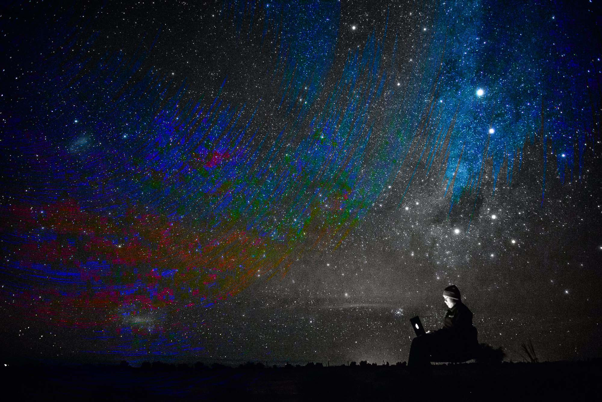

Илья Соболев решился уехать жить в Индонезию. Теперь он занимается сёрфингом, катается на байке и часами смотрит на океан. Просыпаясь каждое утро, он вспоминает, что находится далеко от России и всего происходящего. Это и была главная мотивация уехать на другой конец света. 

Меня зовут Илья Соболев, я работаю бэкенд-разработчиком с 2010 года. Основной стек — это Java и связанные с ним Kotlin, Scala, немного знаю Go, работаю с DevOps-технологиями вроде Kubernetes. Прошёл через Yota, Юлмарт, разные платёжные системы в России. Работал в бэкенде в крупных интернет-магазинах, а последние несколько лет — в небольших компаниях, скорее стартапах. В частности таких, которые занимаются электронным документооборотом, например, DocsInBox. Сейчас сотрудничаю с крупными западными компаниями.

Кроме разработки, в качестве хобби, ничем особенным до переезда не занимался. Как и все, любил кататься на велосипеде, читать книги, смотреть кино, ходить на пробежки. А переехав в Индонезию, на Бали, стал заниматься сёрфингом и кататься на байке.

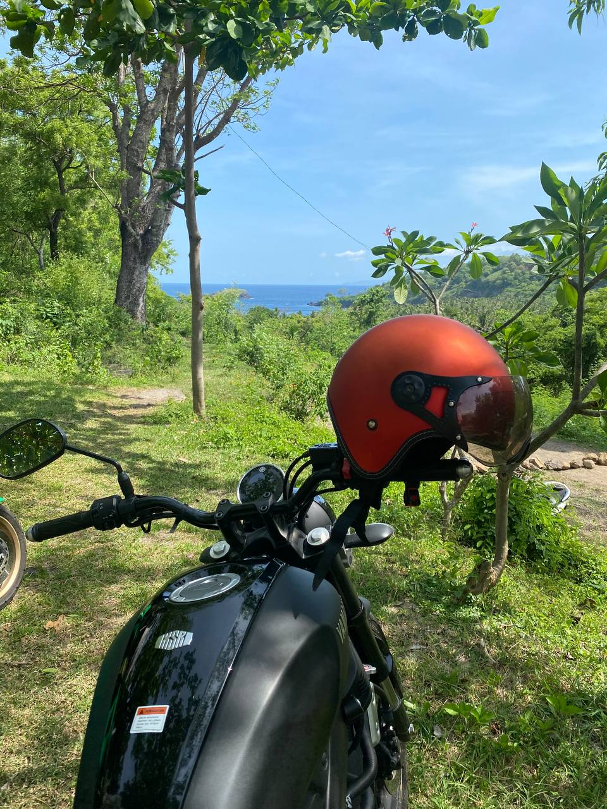

Уехать хотелось всегда: и просто поездить по миру, и поработать удалённо. Для полноценного трудоустройства не хватало знания английского языка. До 2020 года удалённый формат работы не был тотально распространён, но я так работал ещё с 2015 года. Команды часто были распределены по миру и моё присутствие в офисе не требовалось.

Ковид всё изменил: я в очередной раз поменял работу и у меня банально не стало офиса, куда можно приезжать. Появилась возможность уехать насовсем. Как только стали открываться какие-то страны, мы с женой вплотную занялись вопросом релокации. 

> В 2021 году нас подтолкнули в том числе митинги, которые мы видели изнутри. Стало понятно, что надо срочно что-то менять. Мы решили уехать достаточно быстро, собрались за несколько недель. 

Мы с женой покинули Россию в апреле 2021 года. Выбирали исходя из немногих доступных вариантов. Сначала пожили в Черногории, потому что в Индонезию из-за ковида с трудом выдавали визы. А спустя несколько месяцев дождались наших балийских виз и в конце мая 2021 года наконец оказались на Бали. С тех пор живём здесь и посещаем соседние острова.

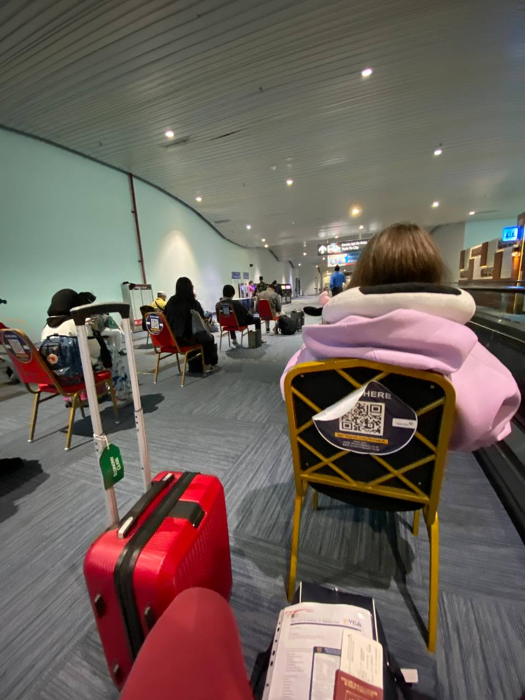
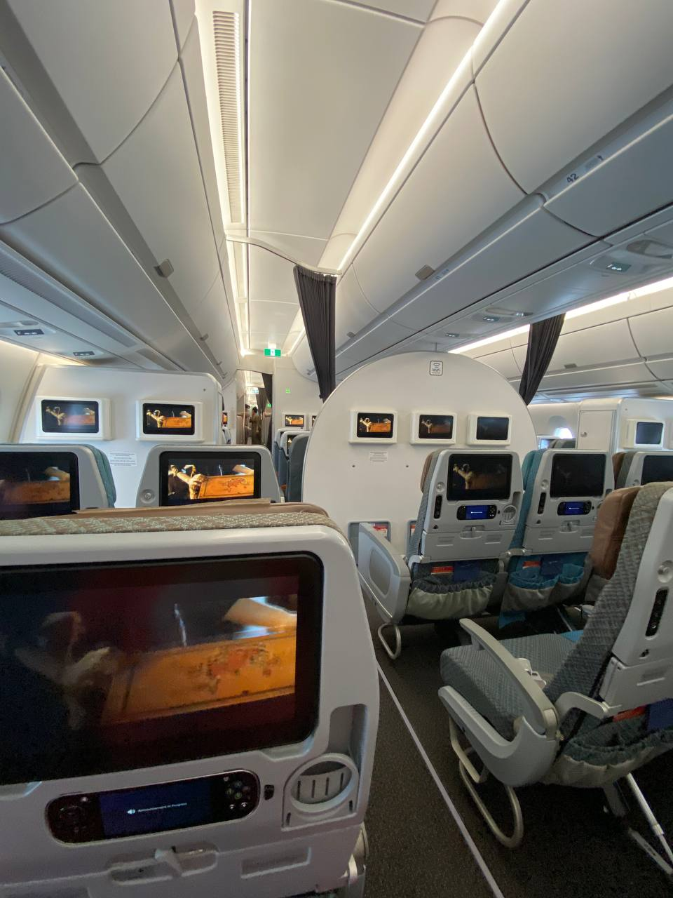

> Перелёт на Бали в мае 2021 года

## В отличие от России, люди в Индонезии постоянно улыбаются

Жизнь в Индонезии сильно отличается от жизни в России. Первое, что приходит на ум, это улыбающиеся люди на улицах и тёплый климат. Общее настроение вокруг — позитивное, куда бы ты ни приходил. Это курорт, здесь люди отдыхают и веселятся. Такая атмосфера резко контрастирует с тем, к чему привык в Петербурге. 

> Кроме климата мне нравится удалённость от текущей политической повестки. Каждое утро я просыпаюсь с мыслью о том, что я в другой части мира. Здесь маленький курортный остров. Те, кто тут отдыхает и живёт, находятся на своей волне. Иногда мне совестно, что я здесь комфортно провожу время, а кто-то там — нет. 

Когда мы приехали сюда, я мог изъясняться по-английски только на базовом уровне. Здесь много иностранцев, но просто поболтать с ними в баре о жизни я не мог. Спустя полтора года общаться стало, конечно, значительно легче. В Азии живут совершенно другие люди, они по-другому смотрят на мир. 

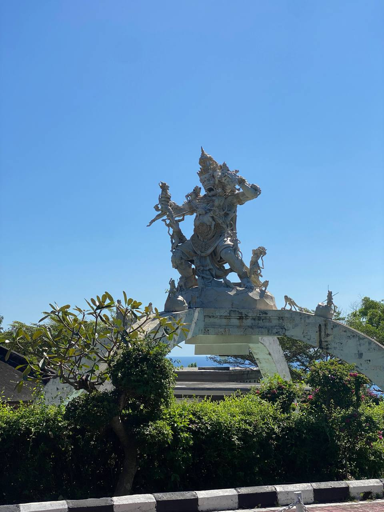

Бали сильно затягивает. Ты привыкаешь к расслабленному образу жизни, тебе уже не хочется переезжать в европейскую страну. У индонезийцев по-другому устроено будущее время в языке. Это отражает их состояние: никто никуда не спешит. Всё всегда делается завтра, а лучше послезавтра. Ты можешь расслабленно проводить время, потому что знаешь, что никто от тебя ничего срочного не ждёт. Завтра ты проснёшься и сделаешь то, о чём тебя попросили. А если не вспомнишь — не сделаешь. Индонезийцы не парятся, и поэтому они такие счастливые. 

Сильно бросается в глаза отношение местных жителей к природе. Ещё их бабушки и дедушки использовали импровизированные тарелки из банановых листьев. Поел, выкинул этот банановый лист — и он исчез. С появлением пластика это привело к привычке мусорить. Бали сильно развит с точки зрения сортировки мусора, но не такой, как мы себе представляем. Они по-своему утилизируют мусор и зарабатывают на этом деньги. Но иногда количество грязи на улице и мусор в океане бросаются в глаза и заметны. Тяжело смотреть на бедность населения, многие люди абсолютно не беспокоятся по этому поводу, но из-за моего менталитета я не всегда это понимаю. 

## Цены здесь выше, но и качество жизни — другое

До переезда мы снимали в Петербурге квартиру примерно за 600 долларов. Сейчас жильё обходится нам на 200-300 долларов дороже, но это не квартира, а дом. С арендой проблем нет, например, во время ковида мы сняли за 1000 долларов большую виллу с бассейном в туристическом центре. С открытием Бали в феврале-марте этого года сюда стали приезжать австралийцы и европейцы и цены поползли вверх. Чтобы вписаться в наш бюджет, мы выбрали дом поменьше и без бассейна. 

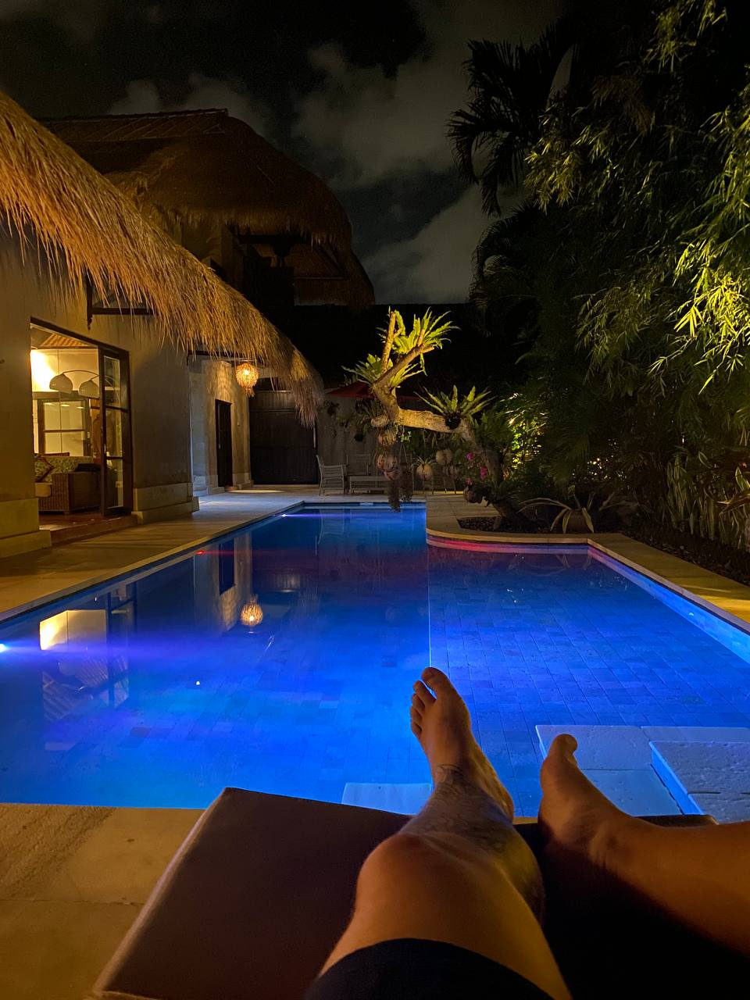

В целом стоимость жизни здесь процентов на 20-30 выше, чем в России. Расходы увеличились из-за медицины и всего того, что в России условно бесплатно. Продукты не дороже, но их даже нельзя сравнивать. Мы тратим на еду здесь чуть больше, чем в России, потому что покупаем импортные для Бали продукты и чаще едим не дома. В целом, траты сильно зависят от потребительских привычек.

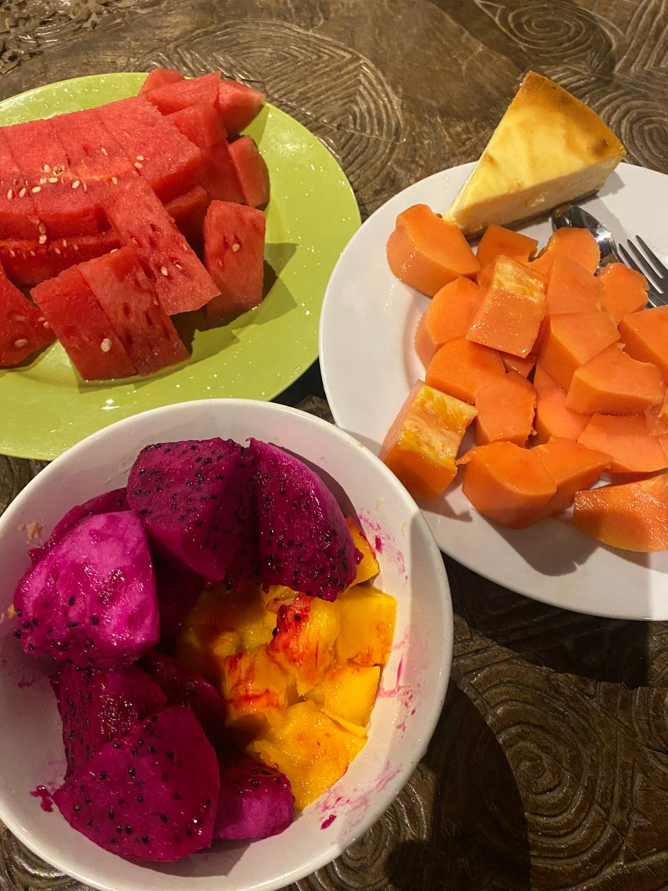

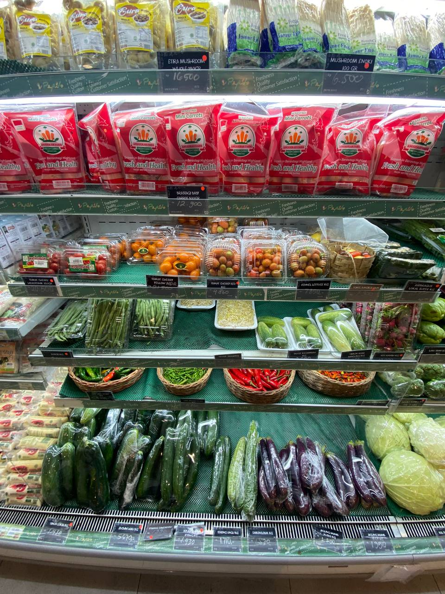

Местная еда однообразна. Чтобы найти что-то оригинальное и вкусное, надо поискать. Плюс Бали в том, что здесь представлены разные кухни мира. Например, я иногда хожу в грузинский ресторан. Грузинская кухня сильно отличается от той, что я пробовал в Петербурге. Знаю хороший греческий ресторан, вкус у блюд такой, как будто оказался в Греции. То, что мне нравилось из азиатской кухни, когда я жил в России, я ем и здесь. Рамен, фо-бо, разные варианты китайской и тайской уличной еды — встретить все эти блюда здесь можно в изобилии. 

## Логистика — сложная, но это не пугает

Вокруг Бали много островов. Не могу сказать, что мы постоянно путешествуем, но на самолётах я летаю в два раза больше, чем когда жил в России. Здесь для любой поездки нужны самолёт или лодка. Основная цель путешествий — сёрфинг. Берёшь доску, едешь на соседние острова на пустые споты и катаешься там. Можно несколько дней провести в хорошем отеле, в который раньше мы бы не полетели — нет смысла платить за дорогой перелёт ради нескольких дней отдыха. Внутри Бали, конечно, много необычных уголков, разных климатических зон, недавно мы даже гуляли в хвойном лесу. 

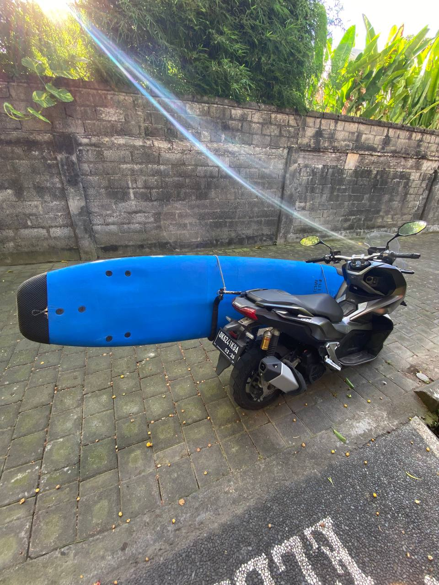

Кто-то ездит по острову только на машине. Таким людям тяжело, ведь здесь сложный трафик, нет широких магистралей, поэтому движение плотное. На мотоциклах всё более чем комфортно, пока не идёт дождь. В сезон дождей — с октября-ноября до марта-апреля — приходится как то изловчаться. Но дождь при температуре +30 — это не страшно, можно даже назвать это маленьким удовольствием. Чтобы жить на Бали, требуется привыкнуть к жаркому климату. Некоторые люди, к моему удивлению, приезжают сюда и включают кондиционер на 17 градусов. Потом они жалуются, что на улице душно. При желании всё можно решить поэтапной акклиматизацией и жить спокойно, но это не быстрый процесс.

Сложность перелёта трудно оценить, потому что я летел во время пандемии, дали о себе знать ковидные ограничения. Наш рейс постоянно переносили, пришлось ждать в аэропорту три дня и потратить много денег. В итоге мы летели на огромном самолёте — семь пассажиров и больше десяти стюардесс. 

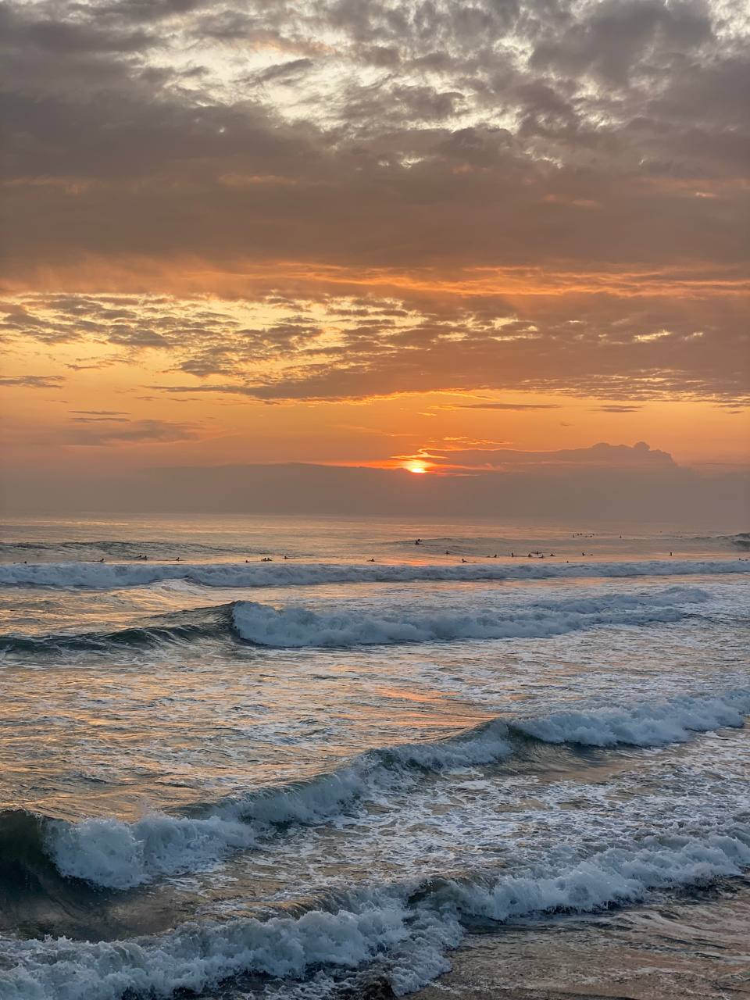

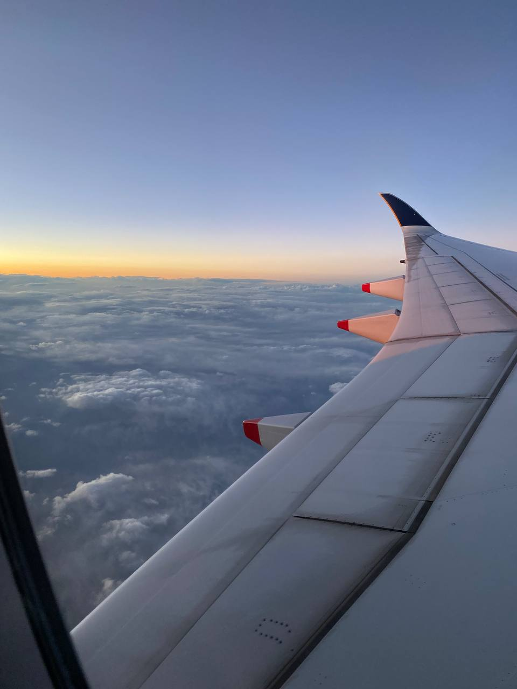

Сейчас мне будет гораздо легче сорваться с места, если вдруг понадобится.
Основная проблема — легализация доходов. Когда ты живешь не в стране своего гражданства, это превращается в сложный бюрократический процесс, не всегда прозрачный и быстрый.

Чтобы найти работу в IT в другой стране, скорее всего, придётся ехать в большие города. Это после жизни в Индонезии не так прельщает. Раньше мы хотели в Австралию, так как эта страна привлекательна и своим месторасположением, и рынком IT, и относительно доступной релокацией. Также мы рассматривали такие популярные направления как Португалия и Канада, но сейчас переезд туда стал заметно сложнее. Мы ищем пути релокации, не связанные с получением оффера и рабочей визы от конкретного работодателя, например, визы цифровых кочевников.

Мы намерены жить здесь, но на всякий случай будем мониторить обстановку. Может быть, на время съездим в Америку — пожить, посмотреть на людей. Я ищу возможности — через трудоустройство или по туристической визе, но получить их сейчас трудно. Будучи российским гражданином, я не могу подать документы на шенгенскую визу, не находясь в России. Большая часть азиатских стран были закрыты из-за ковида, только недавно открылся Сингапур. Из-за бюрократии и особенностей вакцинации эти направления пока недоступны для нас. 

На организацию работы достаточно сильно влияет часовой пояс. Например, с командой в часовом поясе Ванкувера и Лос-Анджелеса было бы проще работать из Петербурга, больше рабочих часов у нас пересекались. 

>Сейчас у нас с многими коллегами разница во времени по 14 часов. Нам приходится искать возможности связаться онлайн и пообщаться. 

## Если бы мне снова пришлось выбирать, я всё равно оказался бы здесь 

Если бы у меня был второй шанс, я бы всё равно поехал в Индонезию, но кое в чём подстраховался: сделал бы долгосрочные визы в третьи страны, чтобы у меня была возможность попадать в них, минуя Россию. Кроме того, я бы оставил доверенность на имя своих родителей, чтобы они помогали мне с вопросами, которые нельзя решить удалённо. 

Я бы завёл себе несколько банковских карт, в том числе в банках третьих стран, потому что российские карты сейчас заблокированы. Взял бы с собой поменьше вещей и что-то по возможности сделал бы с техникой — из-за климата мой тонкий MacBook Pro быстро пришёл в негодность. И ещё было бы гораздо легче, если бы я начал учить язык лет на пять пораньше. С другой стороны, на Бали большое русскоязычное комьюнити, и кто-то обходится здесь вовсе без знания английского. 

Сюда не стоит ехать с работой, на которую тратишь больше обычного количества рабочих часов. 

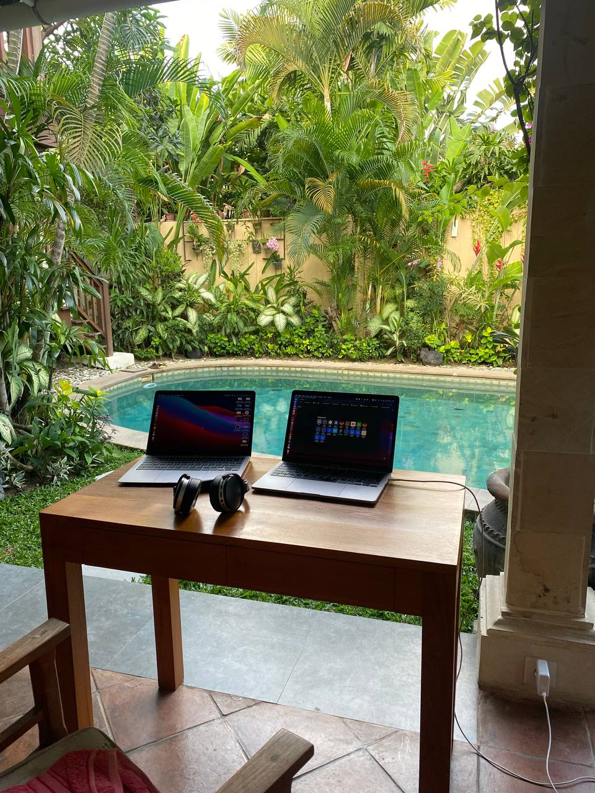

>Лучше быть уже состоявшимся специалистом, причём достаточно дисциплинированным, чтобы суметь выполнять задачи, глядя на пальмы и океан. Мне иногда нелегко сконцентрироваться и приходится прикладывать для этого дополнительные усилия. 
