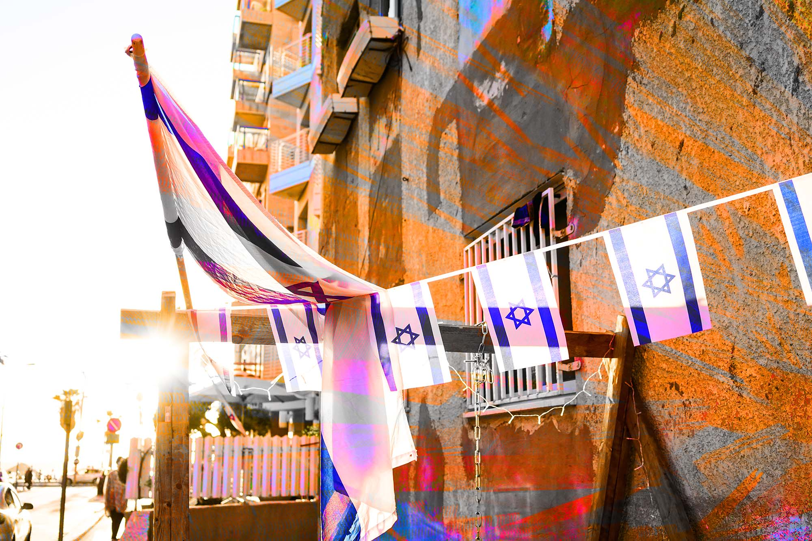
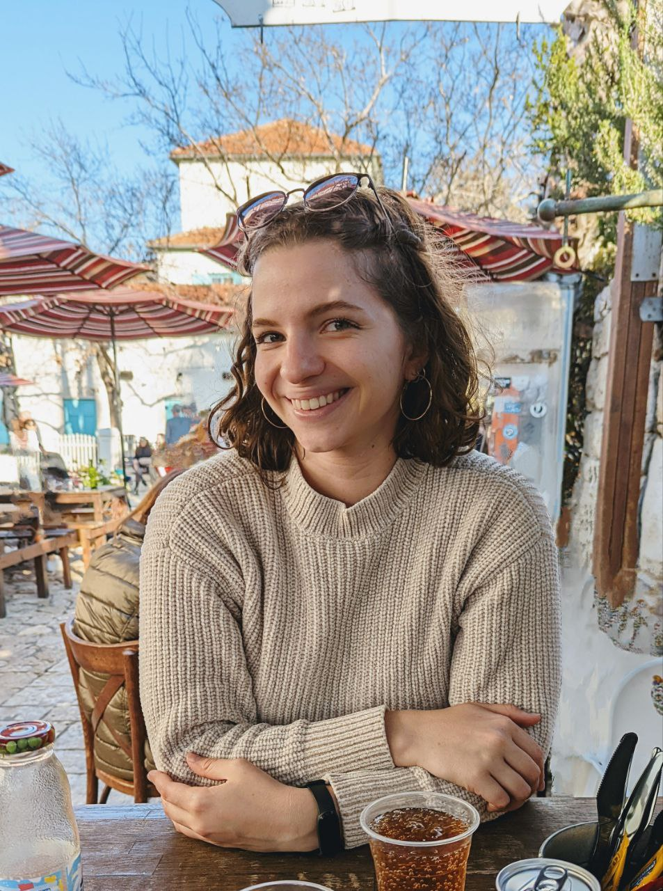
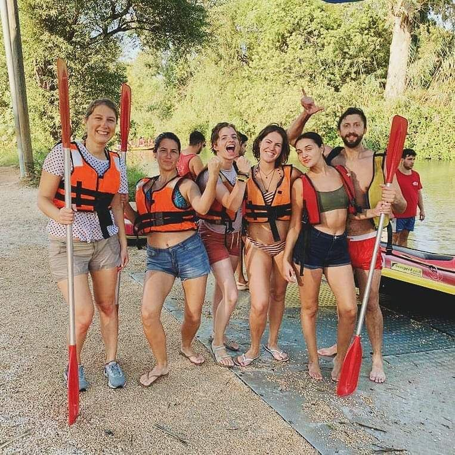
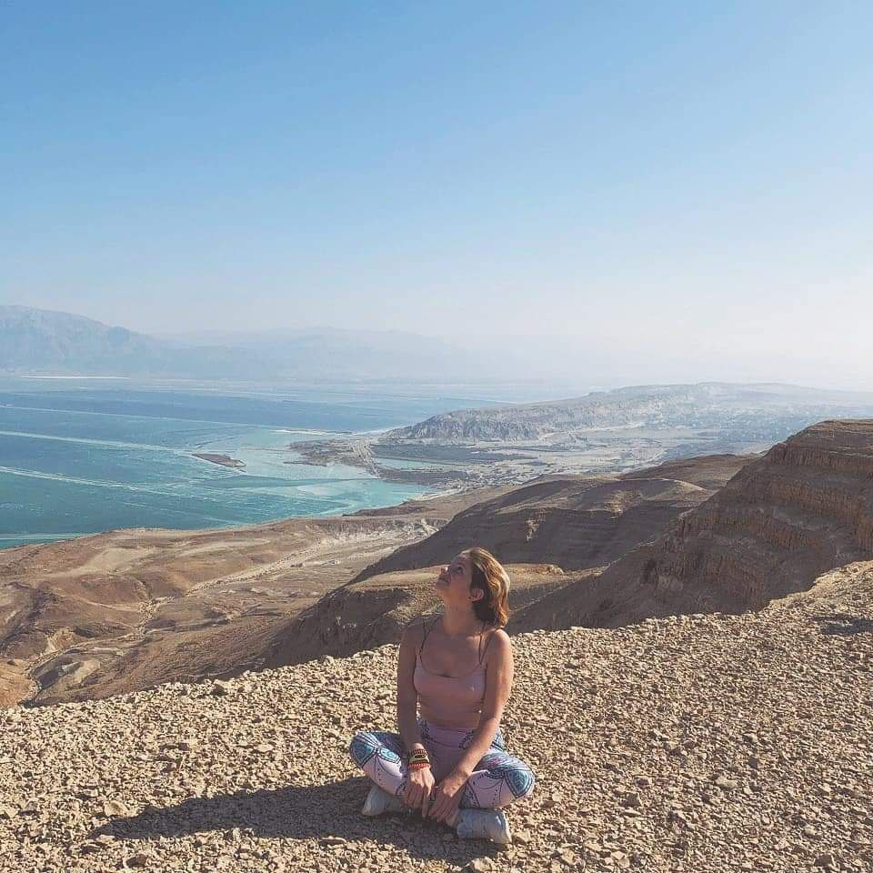
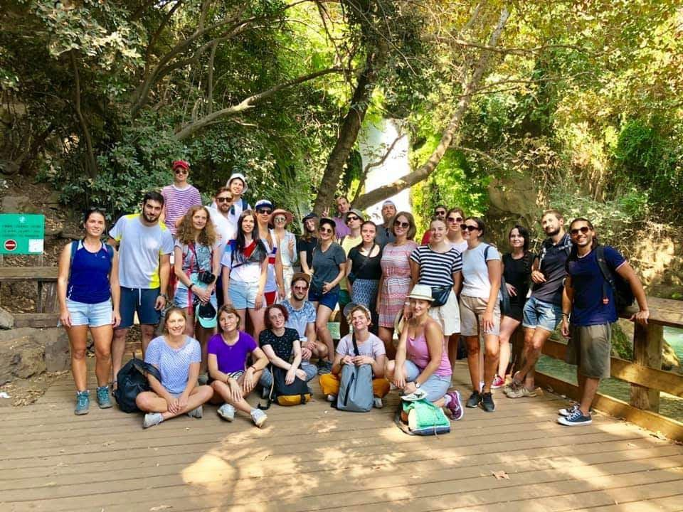
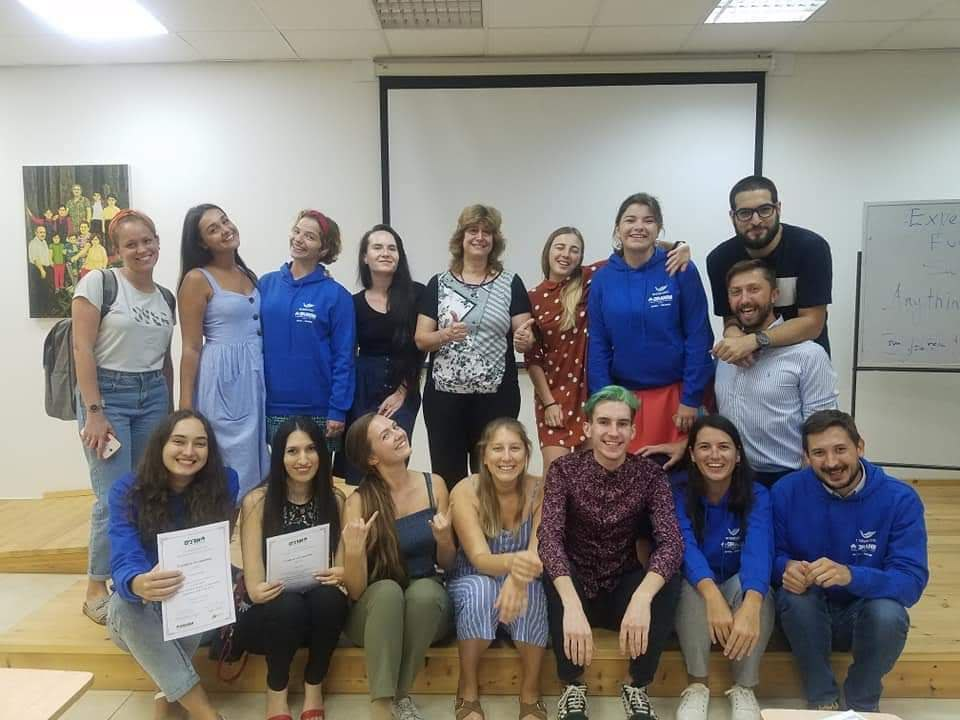
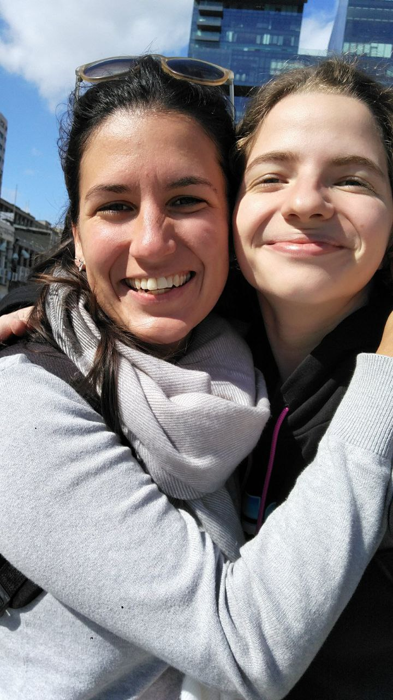
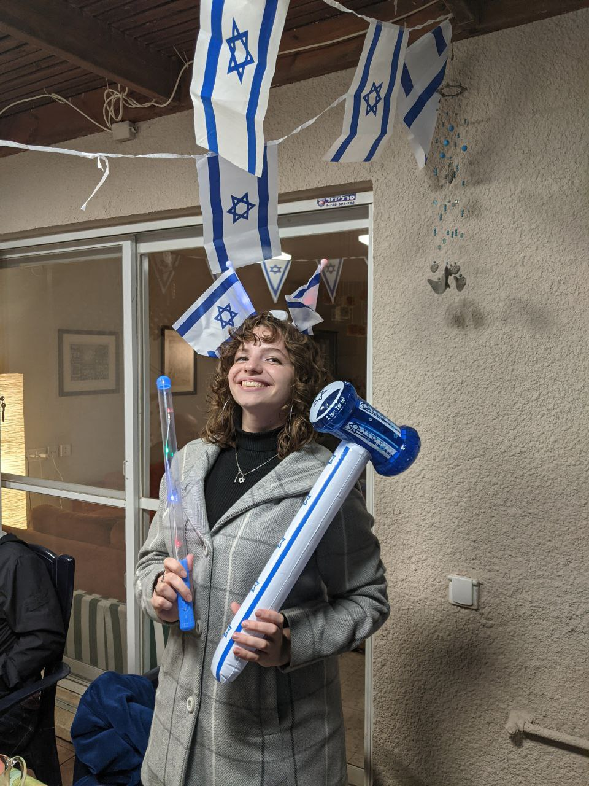
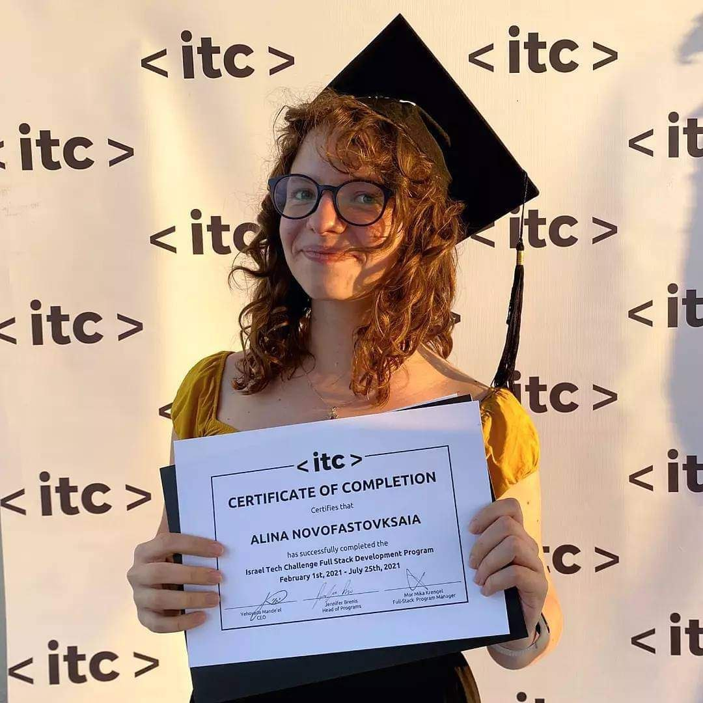

# Я переехала в Израиль по программе для молодёжи, осталась в стране и стала веб-разработчицей

Какое оно — комьюнити в Израиле, почему так важно строить отношения и заводить новые знакомства и почему жить в Израиле оказалось перспективнее, чем в Санкт-Петербурге. 

Меня зовут Алина Новофастовская. Раньше я жила в Питере, а теперь — в Израиле. До переезда я была в этой стране два раза — один раз в детстве, и ещё один раз, когда ездила в образовательный тур «Таглит». Так называется программа для тех, у кого есть еврейские корни. Это насыщенная бесплатная поездка по всему Израилю. В ней принимают участие молодые люди, у которых родители или бабушки и дедушки — евреи.

> Путешествия по Израилю в рамках проекта «Маса»: Иерусалим, каякинг по Иордану, пустыня и Мёртвое море, водопад Баниас на Голанских высотах

## Была маркетологом

До 2019 года я занималась маркетингом, SMM и организацией музыкальных мероприятий. Я решилась поехать в Израиль снова — на восемь месяцев по программе «Маса». Это совместный проект правительства Израиля и Еврейского агентства для привлечения в страну еврейской молодежи из других стран.

> Наша группа с первой «Масы», где учили английский ребята из разных городов РФ, Украины, Аргентины, Кубы, Парагвая, а также наша учительница-израильтянка и руководитель группы из Уругвая. Плюс тут есть израильтянка, которая с нами тоже училась

Таких программ много в разных частях Израиля. Некоторые посвящены изучению языка и профессиональным стажировкам, есть медицинская «Маса», сёрфинг, дайвинг и так далее. Я жила в академическом колледже на севере Израиля, рядом с Хайфой. Там в течение четырёх месяцев совершенствовала свой английский. Это был продвинутый курс, чтобы подтянуть разговорный язык и подготовиться к международным экзаменам. Мне так понравилось, что я решила остаться в Израиле и потом ещё четыре месяца учила иврит.

Изначально переезжать идеи не было, я просто ехала посмотреть, что вообще такое Израиль, как мне там будет. Но так получилось, что, собрав вещи на несколько месяцев, я осталась там на три года, а может, и на всю жизнь :). Только через два года после начала того путешествия я вновь приехала в Россию.

В Израиле у меня больше перспектив, чем в России. Я это чётко увидела уже тогда. К тому же ещё до окончания программы «Маса» я познакомилась со своим молодым человеком, а он израильтянин, и это стало определяющим фактором.

## Меня поразили климат и мультикультурность 

Процесс интеграции проходил для меня плавно. Сначала я жила в Израиле как участница программы, без гражданства, по студенческой визе. Документы на получение гражданства подала сразу же после окончания программы.

Когда я только приехала, у меня был культурный шок. Вместе со мной в программе участвовали ребята буквально со всего мира. Например, моей близкой подругой там стала девушка из Аргентины. До этого знакомства я почти ничего и не знала об этой стране. На соседнем курсе программы были ребята из Папуа — Новой Гвинеи. Если ты всю жизнь провела в России, то особо не представляешь, кто там живёт, что это за страна. Были ребята из США и стран Южной Америки, мы со всеми общались, дружили. Несколько месяцев провели очень круто.

> Я и моя аргентинская подружка Марина

С другой стороны, мне было очень непривычно. Климат совершенно другой, Израиль и Питер в плане погоды похожи на разные миры. Я приехала в июне, в это время и в последующие несколько месяцев было очень жарко. Летом мне до сих пор бывает нелегко переносить температуру +45 градусов. Приходится передвигаться от кондиционера к кондиционеру. Это тяжело, если ты всю жизнь жила в Питере.

Но количество солнечных дней здесь — самое яркое впечатление первых месяцев. Несмотря на то, что было жарко, я почувствовала изменения в своём эмоциональном состоянии. В Питере очень мало солнца, и это вводило меня в коматозное состояние, особенно зимой.

Ещё было удивительно, что транспорт не ходит по субботам. Если ты не в Тель-Авиве, то просто сидишь дома и не можешь никуда поехать без машины. К таким вещам нужно было привыкать, но я поняла, что готова со всем этим соглашаться. Уж слишком мне здесь интересно.

Мне сразу понравилась открытость людей и готовность помочь. У меня тут есть дальние родственники, с которыми я не виделась и не общалась с детства. Когда я приехала, они приняли меня как родную, как будто все эти годы мы регулярно созванивались. Так же относились и посторонние люди: стоишь на остановке и кто-нибудь с тобой обязательно заговорит: «О, ты новый репатриант? Может, я могу тебе чем-то помочь? Обращайся, звони». Это удивляет меня до сих пор, такая душевная теплота очень радует.

> Фото с дня независимости Израиля

Люди здесь отличаются, это многие замечают. В России, например, при столкновении с бюрократической системой ты понимаешь, что должна сделать только так: конкретные бумажки принести в определённое время. Тебе дают понять, что никаких дополнительных возможностей тебе не положено. В Израиле в бюрократических организациях ты как на рынке. Ты говоришь: я могу у вас получить вот это и вот это. Тебе возражают, а ты доказываешь! Доходит до того, что надо кому-то позвонить и наорать, это здесь нормальная ситуация. Ты звонишь, кричишь и получаешь то, что нужно. Для меня это было очень странно, потому что я спокойный человек, не люблю повышать голос на незнакомых людей. Но я поняла, что иногда иначе ничего не добиться.

Есть такое слово, которое часто здесь употребляют: балаган. Оно есть и в русском языке, и в иврите. Здесь очень много где балаган. Пример — бюрократия, система государственных услуг. Люди, которые в этой системе работают, иногда ничего не знают, не понимают, как правильно. Что они должны сделать, что другой человек должен получить — это всё ты должна знать сама.

Например, мне потребовалось удалить зуб мудрости. Это заняло несколько месяцев, и мне до сих пор его не удалили! Я обратилась в стоматологическую клинику, где меня осмотрели и сделали снимки. Дальше надо было получить от них направление в больницу. Я постоянно звонила им по поводу направления, они говорили подождать две недели, потом ещё две недели… Потом невозможно было дозвониться до больницы, куда нужно записаться с направлением на руках.

Сфера медицины вообще устроена не так, как мы привыкли. Нельзя просто так вызвать скорую помощь. За вызов нужно заплатить кучу денег, и это доступно только в случае, если человек при смерти и не может сам доехать до больницы. При желании можно пройти через круги бюрократии, чтобы поликлиника вернула часть денег за вызов неотложки.

Есть несколько больничных касс, к одной из них каждый гражданин страны обязан присоединиться. Если что-то случается, они оплачивают срочное лечение. Обычно нужно оплатить медицинские услуги из своего кармана и потом ждать, когда вернётся часть средств. Лучше всего добраться до больницы самостоятельно, если только ты не умираешь. И, скорее всего, придётся несколько часов прождать помощи в приёмном отделении.

Говорят, в Израиле хорошая медицина. Это действительно так, если у тебя серьёзное заболевание. В случае онкологии или чего-то такого тебя, скорее всего, вылечат, причём бесплатно или за небольшие деньги. То, что связано с беременностью и родами, здесь тоже на высоком уровне. Но человеку с больным горлом, с проблемами с животом не очень просто быстро получить помощь. Я уже немного привыкла к этому и принимаю такую систему, но поначалу с этим сложно было смириться.

Каждый месяц все граждане Израиля делают отчисления с зарплаты в Агентство национального страхования. Даже если человек не работает, он должен платить фиксированную сумму каждый месяц. Агентство занимается медицинской страховкой граждан, платит деньги в больничные кассы. В случае серьёзного заболевания практически все расходы покрываются этой системой страхования.

Израильская кухня мне знакома давно, ведь я здесь не первый раз. Она очень разнообразная, состоит из арабских, ближневосточных блюд. Но коронные хумус и фалафель уже давно знакомы тем, кто живёт в России. Когда я переехала, узнала о таком десерте как кнафе. Его я очень люблю и стараюсь часто не есть, потому что это очень жирно и сладко. Но если кто-то собирается в Израиль и хочет рекомендацию по еде, то обязательно попробуйте. Кнафе сложно описать — это такой сладкий сыр, покрытый сверху тоненькой стружкой теста. Блюдо едят горячим, сыр немножко подплавливается. Блюдо часто подают с мороженым, иногда посыпают тёртым орехом.

> Вот так выглядит кнаффе

Сервис в Израиле оставляет желать лучшего. В кафе или ресторане тебе могут что-то не принести, подать что-то плохое, а ждать можно бесконечно. Когда я начала работать программисткой и получать больше денег, то стала посещать места получше, где не всё так плохо.

Но мне всё равно очень нравится в Израиле. По сравнению с Россией я чувствую себя здесь намного комфортнее и безопаснее.

## Как подтвердить своё происхождение

Я оформляла документы три года назад, поэтому не знаю, насколько изменился этот процесс для россиян. Нужны были документы, которые подтверждают еврейские корни. Вообще еврейство передаётся по материнской линии, соответственно, если мама еврейка, то это всё упрощает. Достаточно показать своё свидетельство о рождении, где указана мать, и документы, в которых указана её национальность.

У меня другая ситуация: у моего дедушки еврейское происхождение, поэтому было немного сложнее. Нужно было доказать, что моя прабабушка, мама моего дедушки, — еврейка. Это было сложно, первый раз я не прошла консульскую проверку. При второй попытке другой консул удивился, что его коллега не дал мне согласие. Он сказал, что прошлого комплекта документов было достаточно.

Документы, которые подтверждают еврейство, — это свидетельство о рождении, свидетельство о браке родителей или бабушек и дедушек, военные билеты, фотографии с еврейских кладбищ, выписки из архивов. Чем больше документов, тем лучше. Подходит всё, но это должны быть оригиналы. Это тоже вызвало у меня трудности, потому что мой дедушка живёт в Житомире. Но нашлись люди, которые передали от него документы. Кроме того я подавала паспорт, школьный аттестат, диплом из университета, справку об отсутствии судимости с апостилем. Сейчас список документов мог измениться.

В 2022 году многие стали пользоваться процедурой экстренной репатриации. Она непростая, но, если кому-то срочно нужно уехать, то есть возможность собрать максимум необходимых документов, подать заявку в Израиль и сразу же полететь с этими документами. Встреча с консулом будет уже в Израиле. Сложность в том, что без счёта в Израильском банке и чековой книжки невозможно снять квартиру. А российские карты здесь не работают. Но люди находят выход, потому что на ожидание консульской проверки в России сейчас можно потратить год. Кто-то живёт у родственников, кому-то приходится снимать дорогое жильё через Airbnb.

Если пакет документов уверенный, дальше особых проблем не будет. Особенно легко получить одобрение после «Масы», потому что ты проходишь консульскую проверку до того, как поехать по программе. Сразу после участия в программе тебе помогают получить документы. Но для участия есть возрастные ограничения. Сейчас это возраст от 18 до 34 лет, исключение составляют программы для врачей, там возраст участников может быть до 40 лет. Удобно, что во время участия в программе можно подыскивать себе жильё на потом. Ты уже всё знаешь, немного выучил иврит и при этом живёшь ещё какое-то время не как гражданин, то есть не нужно сразу же начинать возиться с бюрократией.

Хорошо, что программа ещё работает, и участникам предоставляется грант, ведь российские банковские карты не принимаются. Если ты приезжаешь без всего и тебе надо строить жизнь заново, «Маса» очень облегчает эти задачи. Я до сих пор не знаю, как здесь оплачивать счета, потому что это делает мой молодой человек. Но обычно новые репатрианты учатся таким базовым вещам заново, потому что всё немного отличается от России.

## Из гуманитария в IT-специалисты

В России я получила высшее образование — закончила бакалавриат по направлению «Социально-культурная деятельность», то есть организация мероприятий. Всю жизнь я считала себя гуманитарием, очень любила языки и литературу, а математику и информатику — не очень.

Когда приехала в Израиль, познакомилась с парнем. Он учится в университете на специальности «Информационные системы» и ещё со школы осваивает языки программирования. Я посмотрела на него и подумала, почему бы мне не попробовать. Он тоже уговаривал меня, что будет интересно. В целом в Израиле очень развита индустрия хай-тек, так здесь называют IT. Здесь много компаний, а открыть стартап — будто национальный спорт.

Я начала с того, что смотрела видео на YouTube и проходила бесплатные онлайн-курсы. Поняла, что мне это интересно, у меня получается. Я решила пойти на буткемп. Он дорогой, но частично оплачивается Министерством абсорбции, которое помогает новым репатриантам. У них я получила ваучер на прохождение профессионального обучения.

Большинство курсов по программированию можно оплатить таким образом, хотя бы частично. Программа оплаты моего курса предполагает, что нужно внести 2000 шекелей в начале, чтобы попасть на курс. А полную стоимость обучения студенты выплачивают только тогда, когда устраиваются на работу и получают зарплату больше определённой суммы в месяц. 

> Выпускной с айтишного курса

Это очень выгодно, так организаторы обучения дают мотивацию выучиться и найти работу, а взамен ты потом отчисляешь им 10% от зарплаты, пока не выплатишь всю стоимость обучения. У новых репатриантов нет больших сбережений, поэтому они как правило не готовы платить огромные суммы за обучение.

В таком буткемпе я очень интенсивно училась четыре месяца. Это было ещё во время коронавирусных ограничений, поэтому почти всё приходилось делать из дома. Мне понравилось учиться в Zoom. Часть курса — двухмесячная стажировка. Организаторы сами подбирают компанию, куда тебя отправить. Меня взяли на работу в ту же компанию, где я два месяца стажировалась. Я проработала там полтора года, но недавно получила оффер от другого работодателя и теперь меняю работу.

## В IT-комьюнити множество тематических сообществ

Здесь очень активное IT-комьюнити с классной атмосферой. Постоянно проходят разные мероприятия, есть разные сообщества: женское комьюнити, русскоязычное комьюнити, сообщество разработчиков на React.

Женские комьюнити здесь классные, там все помогают друг другу. Когда я искала новую работу, я обращалась в менторскую программу по поиску и там пообщалась с одной опытной специалисткой, которая работает в этой сфере больше десяти лет, выступает на конференциях. Она мне, джуну, подсказывала, отправляла моё резюме своим знакомым. Это мне очень помогло.

Ещё есть комьюнити специально для новых репатриантов, например, Gvahim. Они проводят мероприятия по нетворкингу, тестовые собеседования, чтобы помогать новым репатриантам найти работу. На сайте [Meetup](https://www.meetup.com/) всё время публикуют новые мероприятия, конференции, посвящённые разным языкам программирования и веб-разработке.

Много профессиональных мероприятий здесь проводится на английском языке, но есть и на иврите. К счастью, я выучила иврит. Я вижу тех, кто спустя несколько лет ещё не знает язык. Им тяжелее в стране и с поиском работы. А у меня есть бонус: на собеседованиях, которые я стараюсь проходить на иврите, я говорю: «Смотрите, я в стране три года, и вот как я хорошо выучила язык».

Осваивать иврит было тяжело. Когда я приехала на «Масу» и осталась получать гражданство, я учила его очень интенсивно в течение восьми месяцев. Я закончила ульпан — учебное учреждение для изучения иврита. Утром у меня были уроки, вечером я делала домашнее задание. Посвящала этому всё время и не устраивалась на работу.

Мне помогло то, что я в отношениях с парнем-израильтянином. В какой-то момент он начал говорить со мной на иврите. Я стала всё больше слышать язык и пытаться что-то говорить. В конце обучения я могла понять, что от меня хотят на кассе в магазине или что спросили в автобусе. То есть за восемь месяцев я освоила самые простые вещи. Хорошо разговаривать я начала не так давно, через полтора или два года после изучения. Часто бывает, что люди долго учат язык, но так и не начинают уверенно говорить на нём. В ульпане ты получаешь базу: знаешь буквы, базовые слова, фразы. Дальше надо идти и говорить везде, где только можно. Неправильно, с ошибками, как получится. 

## В Израиле важны отношения

Работа в IT оплачивается в Израиле хорошо. Даже джуниоры получают зарплаты выше среднего. Я пошла работать без опыта и у меня была не очень большая зарплата. Сейчас я перехожу в другую компанию, где зарплата будет намного выше. Рост зарплаты происходит с ростом опыта.

Доходы и расходы зависят от места проживания. В Тель-Авиве и в Иерусалиме цены гораздо выше, чем везде. Это особенно заметно в аренде и покупке жилья. В остальных городах продукты и бытовые товары стоят относительно одинаково. В Хайфе всё стоит не так дорого, но и зарплаты небольшие. Поэтому очень выгодно, что я живу здесь, а работаю на Тель-Авив.

> В Хайфе такие ребята прямо по улицам гуляют, фото сделано рядом с моим домом

Сейчас у меня гибридный график — три дня в офисе и два удалённо. После ковида стало больше возможностей удалённой и гибридной работы. Все компании дают хотя бы один день в неделю для работы из дома, а чаще всего два или три дня. Но полностью удалённо работа организована мало где. Всё равно все стараются встречаться в офисе.

В Израиле очень важно заниматься нетворкингом. Очень редко находят работу просто так. Обычно это делается по знакомству, когда резюме кандидата передают знакомые знакомых.

Мне это тяжело даётся, потому что я не люблю проявлять инициативу в общении с новыми людьми. А в нетворкинге это очень важно: подойти, поговорить с человеком на конференции.

Этот процесс никогда не заканчивается. Можно постоянно ходить на мероприятия, общаться в Facebook и LinkedIn, и всё равно каждый раз будешь встречать новых людей. Я всё ещё в процессе заведения связей, но первоначально мне понадобилось около полугода, чтобы достаточно уверенно себя чувствовать, и чтобы меня где-то узнавали.

Просто ходить на конференции недостаточно, надо ещё проявлять какую-то активность онлайн. Я этим не очень занимаюсь, но специалисты рекомендуют публиковать контент в LinkedIn и лайкать чужие посты. Говорят, эта соцсеть очень эффективна для поиска работы. Я её не очень люблю, поэтому просто создала себе страницу и написала пару постов.

Надо без стеснения попробовать влиться в любое комьюнити, которое тебе нравится. Иногда читаешь публикации и чувствуешь, что тебе это сильно откликается. В такие моменты радуешься: как классно, что я это прочитала. Люди пишут полезные комментарии. Даже если не хочешь сама участвовать в дискуссиях, всё равно надо туда периодически заходить и читать.

Если ты ищешь работу, можно писать людям из комьюнити. Обязательно найдётся кто-то, кто работает в интересной тебе компании. Самый простой способ — написать человеку: «Привет, мне нравится твоя компания, я увидела там подходящую вакансию. Можешь ли ты отправить моё резюме?» Вариант посложнее — поговорить с человеком и предложить короткий созвон. Расспросить про компанию, рассказать о себе. Так собеседник лучше тебя узнает, может завязаться интересное и полезное знакомство, и он сможет порекомендовать тебя в компании.

Даже без поиска работы такая активность очень полезна, потому что ты всё время узнаёшь что-то новое, знакомишься с интересными людьми, по-другому смотришь на то, чем занимаешься.

Я переехала три года назад и ни разу не пожалела об этом. Здесь мне удалось сменить профессию, начать нормально зарабатывать, найти новых друзей и влиться в местное сообщество. 
