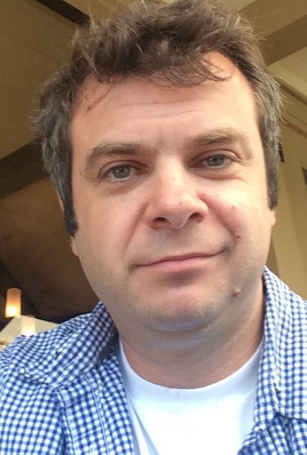

# IT-стартапы из России и Беларуси теряют рынки, доступы в сторы и инвестиции. На что они теперь надеются и как перестраиваются

Что с перспективами российского IT-бизнеса — вопрос открытый. Будет ли теперь возможность масштабироваться, находить инвестиции и выходить на международные рынки? Или санкции бесповоротно уничтожили их? Выяснили у представителей айтишного бизнеса и венчурных инвесторов.

## Конец прекрасной эпохи: что будет со стартапами

Если коротко, то венчурные инвесторы считают, что на рынке всё плохо. Но, хотя будет очень нелегко, некоторые все же рассчитывают, что начинается эра новых возможностей и перспектив. Вот что нам рассказали.

### Трансформация и турбулентность

Иван Лунегов, Startup Advisor и управляющий партнёр в компании Olimp Investments LLC 

Российский рынок IT-стартапов сейчас переживает трансформационный период за счет турбулентности рынка. Безусловно, февральские события вносят в рынок свои коррективы и стартапам приходится искать новые возможности в текущих условиях. Например, многие стартапы, с которыми я работаю, размещали свои приложения в App Store. Сейчас они жалуются на то, что пользователи больше не могут оплачивать подписку за приложения, ведь российские банковские карты не принимаются. Из-за этого резко упало количество клиентов, которые платят за приложение. 

Из России произошел серьезный отток IT-специалистов, причём уезжают одни из самых талантливых. Наши айтишники ценятся во всём мире, и профессия позволяет работать удалённо. Более того, сейчас наблюдается вторая волна эмиграции, ещё более сильная. Это оказывает значительное влияние на рынок IT-стартапов. Он явно просядет, пока не вырастут новые специалисты, которые могут работать в текущих условиях.

В придачу к этому серьёзное влияние оказывает уход с российского рынка западных компаний. Ведь они были частью инновационной инфраструктуры: давали рабочие места, внедряли новые знания и технологии, которые работали во всём мире. Российские IT-стартапы использовали зарубежное ПО для создания своих продуктов, а уход с рынка производителей данного ПО, соответственно, повлиял и на сферу в целом.

***По моей оценке, около 70% стартапов покинут Россию. Это связано в первую очередь с изначальной глобальной ориентацией стартапа. Большинство стартапов создаются для того, чтобы масштабироваться не только на российском, но и глобальных рынках. Становится всё сложнее работать глобально, например, получать из-за границы платежи за свои продукты и услуги или привлекать иностранные инвестиции. Не думаю, что зрелые стартапы откажутся от зарубежных рынков. Это возможно только для тех, кто ориентирован преимущественно на российский рынок или ещё не успел изучить своих потенциальных клиентов за рубежом. Вместе эти две группы составляют около 30%.***

Пострадали больше всего стартапы, ориентированные на B2C рынок, например, занимающиеся разработкой мобильных приложений. В текущих условиях многие клиенты отказываются от подписок в пользу экономии или невозможности платить за них. Чуть лучше дела у B2B. Бизнес сейчас активно ищет способы оптимизации издержек, поэтому стартапы, ориентированные на это, очень востребованы. Сюда относятся чат-боты, аналитика данных. При этом есть сектора экономики, которые сильно пострадали от западных санкций (такие как логистика, машиностроение). Соответственно, IT-проектам, которые работали в этих отраслях, сейчас также тяжело. 

На мой взгляд, сейчас в выигрыше сервисные IT-стартапы, которые могут заместить решения ушедших зарубежных компаний, и стартапы, ориентированные на B2G рынок, обслуживающие интересы государства. Наиболее перспективными направлениями в текущих условиях будут: Big Data, облачные технологии, кибербезопасность, автоматизация производства, искусственный интеллект.

Государству по-прежнему нужно уделять большое внимание индустрии IT, создавать всё больше программ поддержки для IT-стартапов и развивать инфраструктуру для комфортного ведения бизнеса. На данный момент организуются акселерационные программы, в которых IT-стартапы могут получить необходимые знания для успешного развития проекта. Но многие из них сталкиваются с проблемами получения финансирования после программы. То есть знания есть, а денег на развитие проекта нет. Многие частные инвесторы сейчас боятся инвестировать в стартапы из-за рисков неопределенности, поэтому государству важно уделять внимание именно венчурному финансированию.

Сейчас очень сложно прогнозировать будущее, потому что важнейшие условия для формирования рынка — сохранение экономической стабильности, увеличение доходов и потребительской активности населения, а это зависит от очень многих факторов. Я считаю, что будущее рынка российских IT-стартапов будет напрямую коррелировать с направлениями государственной политики. Если политика государства будет направлена на развитие индустрии IT, создание комфортных условий и инфраструктуры для развития стартапов, то их число будет расти.

### Конец прекрасной эпохи

Алексей Сухоруков, основатель и владелец [Кадрового агентства Алексея Сухорукова](http://suhorukov.com) и [IT-академии Алексея Сухорукова](http://itsuhorukov.ru/), сооснователь и совладелец международного кадрового агентства [Alex Staff Agency](https://alexstaff.agency/)

Сейчас большие проблемы возникли у многих предпринимателей, зарегистрировавших свои компании в штате Делавер, ставшем в последнее время своеобразной Меккой для стартапов. Благодаря местному законодательству любой стартап за 350 баксов может зарегистрировать себя в Америке с упрощённым получением счёта и налогообложением в прослойке RBL банка (похож на наш Rocket). И сейчас практически у всех, кто проживает на территории России, возникли проблемы, ведь регистраторы должны подтвердить их данные. Они отказываются продолжать сотрудничество, узнав, что люди живут в России. Большое количество стартапов сейчас занимается тем, что переправляет документы, выводит из своего состава оунеров/фаундеров с российскими и белорусскими паспортами, чтобы сохранить компании. 

С другой стороны, **мировая тенденция сейчас — на снижение инвестиций. В результате стартапы страдают во всём мире. Получить финансирование своей идеи, как это можно было сделать пару лет назад, практически нереально.** Финансирование получают в основном те, у кого есть живой cash flow, причём чаще всего положительный, с перспективами роста уже функционирующего бизнеса. 

До пандемии во всём мире инвестировалось очень много денег, они скапливались у фондов, которые старались вкладывать их в IT, потому что IT-направление уверенно росло, такая была тенденция. Но все ждали, что счастье в конце концов закончится, потому что усилится инфляция. Экономисты собирались сгладить последствия кризиса, растянув выход из него на годы. Хотели, чтобы он прошёл незаметно. Если бы это удалось, то такого спада в инвестициях бы не случилось. Но произошло 24 февраля, которое наложило на постковидные кризисные явления ещё и санкционные, в том числе сложности с логистикой, рост стоимости углеводородов. В результате все процессы сейчас стоят на паузе, инвесторы ждут осени. 

Для стартапов сейчас очень тяжёлое время. А если у вас российское или белорусское гражданство, то на вас косо смотрят любые инвесторы, даже если у вас уже есть инвестиции, действующий бизнес и просто нужен следующий раунд. Поэтому многие стараются изменить свой статус. И если у вас красный паспорт, то, скорее всего, вам ничего не дадут. Это серьёзное ограничение, очень жёсткое. Проживание за пределами РФ и Беларуси, наличие европейского ВНЖ решает вопрос в большинстве случаев. 

### Новый золотой век

Павел Черкашин, Venture investor, [источник](https://www.facebook.com/pavel.cherkashin)

Мы на пороге великого ралли венчурных и частных инвестиций, какие ещё не видывало человечество. В итоге и фондовый рынок отыграет всё падение за несколько месяцев, и для стартапов открывается невиданный простор для привлечения инвестиций в новых реалиях.

Расскажу чуть более подробно про обе возможности.

Венчурные и прямые фонды собрали рекордный объём наличности — более $500 млрд «сухого пороха» (dry powder). Такого никогда ещё не было в истории человечества. Управляющие напродавали истории про волшебных pre-IPO единорогов как крутую фишку «на всю котлету», а тут вдруг — рецессия, и всё пропало. Вкладывать страшно, наличность копится.

Эти деньги должны быть проинвестированы, иначе у фондов ломается экономика IRR, от которой зависит способность фондов привлекать новые средства, а также бонусы управляющих.

Часть из них пошла сейчас на выкуп подешевевших на панике публичных активов (наиболее очевидные уже отросли на 50-70% от дна в июне, но ещё на полпути к докризисным значениям), чтобы потом раскрутить оптимистичный новостной фон в режиме «Pump» и зафиксировать прибыль уже в этом году (стратегия Баффета, грубо говоря). Тут ничего нового. Хедж-фонды сделают свои 100% годовых, как в 2020 году.

Революционность момента заключается в том, что львиная доля этих новых денег пойдёт в качестве прямых инвестиций в стартапы поздних стадий, потому что там можно за 2-3 года сделать 10х относительно текущих уровней, причём с уровнем математического риска ниже, чем в фондовом рынке. Не удивительно, что все деньги мира сейчас туда ринутся.

Простыми словами: мировой экономике в лице 3,000 управляющих фондами нужно срочно распихать $500 млрд живых денег по единорогам, иначе они бонусы и новые капиталы не получат.

Даже если вкладывать в стартап по 10 млн, то нужно 50,000 таких стартапов найти. В мире сейчас менее 5,000 «инвестпригодных» стартапов поздних стадий, т.е. тех, которые попадают на радары этих фондов.

Образовался дефицит в 45,000 инвестпригодных стартапов (в мире сейчас официально 1,100 инвестпригодных единорогов). Не удивительно, что фонды фактически уговаривают именитых фаундеров запускать новые бизнесы и брать сразу мега раунды в $100 млн и выше.

***Стартапам более ранних стадий в поисках первых денег тоже достанется, но до них основная волна этих денег дойдет, скорее всего, к концу уже следующего года, когда деньги дотекут до акселераторов и фондов ранних стадий, которые докажут свою эффективность в подготовке единорогов (единороги — стартапы, оцененные в 1 мдрд или выше).***

В прошлый раз похожая картина сложилась в 2015 году. Тогда это называли «Series A Crunch» — нехватка качественных стартапов для первых институциональных денег при резко выросшем финансировании на более поздних стадиях. Мы посчитали, какие стартапы нужны будут страждущим инвесторам (ИИ и автономный транспорт) и  начали в них инвестировать. 8 из 25 сидовых инвестиций превратились в единорогов за следующие 3 года.

Что значит «инвестпригодный» стартап в таких условиях? Такой, который понимает правила игры и под них подстраивается, т.е. имеет амбиции и продукт, достойные  выхода в $10 млрд через несколько лет. С хорошими юристами и пиарщиками любой стартап можно так упаковать, были бы амбиции у фаундера.

Как это ни странно, 99 из 100 основателей стартапов сегодня с негодованием отвергают предлагаемую логику, считая это надувательством. Они говорят: «мы не такие», а потом сетуют, почему никто не хочет им давать денег на зарплаты «команду кормить».

Соответственно, питч стартапа ранней стадии, чтобы гарантированно привлечь осенью 2022 года первые деньги, должен строиться на том, что «мы готовим компанию к неизбежной волне хайпа в следующем году с неизбежным десятимиллиардным IPO в течение 5 лет, но даже на росте к следующему раунду ваша инвестиция в 10 раз вырастет за следующий год, если вы верите в наши способности. Вот реквизиты для перевода, спешите, места ограничены».

Джоны Галты, Говарды Рорки и прочие авантюристы всех мастей, готовьтесь! Наступает ваш Золотой Век, когда инвесторы будут уговаривать вас взять их деньги на вашу фантазию про вечный двигатель и таблетку от смерти. И этот Золотой Век начнется не через 20 лет, а как только я опубликую этот материал и пойду искать следующего авантюриста мечты.

## Сколково стало маркером проблем?

Чёрная метка, волчий билет для посещения американского «храма бабла» и токсичный фонд — чем стало членство в «Сколково» для российского бизнеса?
Мы поговорили с фаундерами стартапов и юристами, чтобы выяснить, чем чревато ожидаемое попадание «священной коровы» «Сколково» в [санкционные списки США](https://home.treasury.gov/policy-issues/financial-sanctions/recent-actions/20220802).

## Черная метка для инвесторов — любая связь с Россией

Владимир Новосёлов, CIO группы компаний Realweb

Со «Сколково» меня связывает несколько проектов, в которых мы выступаем разработчиками софта. И, хоть вокруг этого института ходит много легенд и домыслов, он реально работает. «Сколково» способствовало запуску в жизнь и развитию множества интересных технологических инициатив. Фонд предоставляет уникальный инструментарий для молодых проектов, которым нужно просто уметь пользоваться. 

***Но есть и проблемы. Например, мой товарищ, резидент «Сколково» и популяризатор космонавтики Виталий Егоров рассказывал: «Я помню почти физическую боль, когда нам пообещали минигрант на наш стартап и полгода докапывались до запятых в заявке, пока не признались, что денег нет ни на мини-, ни на микрогрант. А больно стало, когда узнал о выделении в то же время средств на дендрарий в Технопарке «Сколково». Тогда хотелось кричать, что мне не нужен дендрарий, я могу съездить по грибы в Подмосковье, дайте хоть копейку на спутник…»***

Но в то же время он же подтверждает мои наблюдения. Фонд «Сколково» делал реально полезные вещи для российских стартапов: давал налоговые льготы, упрощал таможенные проблемы с поставкой иностранных комплектующих, возил на международные конференции по льготной цене. Даже само звание — «резидент Фонда «Сколково» — было каким-никаким знаком качества, белой меткой для потенциальных инвесторов, что к ним пришёл не откровенный скам.

Теперь эта белая метка стала чёрной за пределами Российской Федерации. И ей обладают если не все, то точно больше половины российских технологических предпринимателей. Санкции лишь закрепляют этот статус юридически.

### Санкции против «Сколково» ничего не меняют 

Марк Лиепинш, основатель проекта «Русский спорттех»

Моё мнение: из-за санкций в «Сколково» ничего не поменяется. Присутствие «Сколково» в капитале наших стартапов и раньше вызывало вопросы у западных коллег. Хоть это и не транслировалось открыто, но многие стартапы, в том числе близкие к спорттеху, привлекали инвестиции из США. И их всегда расспрашивали, есть ли какое-то участие «Сколково» или других российских институтов развития.

Уехавшие стартапы, которые работали со «Сколково», наверняка будут избавляться от разных упоминаний о своих взаимосвязях с этим инновационным центром, начнут убирать его логотипы из своих презентаций, сайтов, чистить публикации.

***Раньше многие были готовы участвовать в мероприятиях на площадке «Сколково» или организованных им, просто потому что это была площадка для коммуникаций. А теперь те, кто смотрят в сторону Запада и вообще worldwide, будут стараться уберечься от репутационных рисков и, возможно, игнорировать любое упоминание «Сколково», перестанут посещать их ивенты.***

Глобально, думаю, всё изменилось ещё задолго до событий февраля. Сейчас, из-за санкций, это стало очевидным и прозрачным для глобальных стартапов — быть осторожными в партнерствах с российскими институтами развития.

