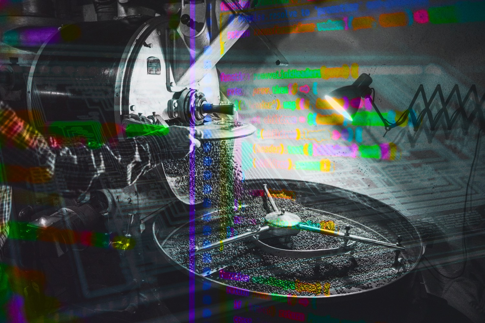

## Разработчик-самоучка превратил свою кофейню в США в IT-стартап

Виталий Яковлев уже три года живет в США, развивает собственную кофейню и параллельно создает для неё мобильное приложение. Сегодня его заведение живёт не только на ароматном кофе, но и на технологиях. Клиенты делают заказы через приложение, получают бонусы, а скоро смогут смотреть обучающие видео по завариванию кофе прямо в интерфейсе. Виталий создает цифровую экосистему для кофейного бизнеса и видит, как код превращается в реальные процессы. Вот его история.

### Как я совместил бизнес и разработку

Мой путь в программирование начался не в США, а ещё в России. Я управлял салоном красоты и пытался автоматизировать его работу, но существующие CRM-системы были неудобными. Тогда я решил, что лучше напишу свою.

Я нашёл программиста, который согласился адаптировать систему под наши нужды, работая удалённо. Я внимательно наблюдал за его работой, изучал код, а затем решил попробовать дописать некоторые функции самостоятельно. Постепенно осваивал процесс, экспериментировал — и в какой-то момент понял, что способен разработать полноценное решение уже без сторонней помощи.

Когда я рассказываю свою историю в США, люди часто не верят, что можно просто взять и научиться программированию самостоятельно. Здесь это не так распространено, как кажется.
Но для меня всё просто: если тебе что-то нужно — ты будешь землю грызть, чтобы разобраться. Если не нужно — то никакие платные курсы не помогут. Я учился через YouTube, статьи, документацию и просто постоянно писал код, пробуя разные решения.

### От первых строк кода до мобильных приложений

Когда навыков и знаний, чтобы реализовать всё задуманное, стало не хватать, я начал изучать разработку мобильных приложений. На освоение Java и принципов работы с Android у меня ушёл примерно год. В результате создал рабочее приложение с внутренними платежами — тогда мы использовали эквайринг от Тинькофф.

Следующим шагом перенёс систему на iOS. Это заняло ещё месяц, но в итоге мы получили полноценное приложение для двух платформ.

Это изменило мой бизнес. Мы внедрили онлайн-запись. Теперь клиенты могли записываться к мастеру в любое время, выбирая свободные окна. Мастера самостоятельно управляли своим расписанием через приложение. Запись подтверждалась автоматически, без участия администратора.

Кроме того, мы интегрировали оплату внутри приложения через Apple Pay и банковские карты. Клиенты могли следить за историей посещений и управлять своими визитами без лишних звонков и переписок. А мастера со своей стороны автоматически получали оплату за выполненные услуги на карту.

Этот опыт стал для меня переломным моментом. Сегодня я продолжаю разрабатывать IT-решения уже для собственного бизнеса в США, совмещая предпринимательство и программирование. Мой проект растёт, а с ним — и мои навыки в разработке.

Важное наблюдение: в России большая часть аудитории — Android, а в США — iOS. В моём приложении iOS-пользователей — около 95%, а Android — всего 5%. Сейчас заходя в статистику я вижу, что в среднем из 20 пользователей в день только один использует Android. В России ситуация была противоположной.

Кроме того, Google недавно изменил правила публикации приложений, и теперь, чтобы опубликовать продукт, нужно собрать 30 тестировщиков, которые согласятся протестировать приложение.
- Проблема №1: Где найти 30 человек с Android? В США таких пользователей очень мало.
- Проблема №2: Людям лень проходить сложные процедуры регистрации тестеров.

На форумах разработчики жалуются: «У меня даже друзей 30 нет, а вы про тестеров говорите».

### Как мы запустили кофейню в США и зачем нам приложение

После переезда в Америку мой первый IT-бизнес в России стало невозможно  поддерживать: Apple Pay перестал работать, мастера больше не могли оплачивать подписку, и систему пришлось заморозить. К тому же, даже если бы она продолжала функционировать, этих денег всё равно бы не хватило на жизнь в США.

Но переезд затронул не только меня. Спустя полгода моя сестра с её мужем приняли решение тоже переехать в США. У них в России до этого была кофейня формата TOGO. В какой-то момент, уставший от ожидания разрешения на работу, чтобы устроится в IT компанию, я начал прощупывать почву. Спросил статистику по их кофейне в РФ и, немного посчитав, предложил открыть кофейню здесь.

В Америке кофейный рынок насыщен, но не так однороден, как кажется. Starbucks доминирует, но у независимых кофеен есть свои ниши: спешиалти, локальные обжарщики, кофейни с уникальными форматами. Мы поняли, что можем занять своё место, если предложим качественный кофе и технологии.

Так, спустя некоторое время мы открыли свою первую кофейню Redshift Coffeе Roasters в Оранж Каунти — пригороде Лос-Анджелеса. Разработку я начал ещё на этапах проектирования кофейни, основная часть написания архитектуры и дизайна заняла пару месяцев. Двери кофейни открыли без приложения, запустили бета тест уже спустя пару месяцев и ещё несколько прошло до запуска основного релиза. Сейчас мы развиваемся и готовимся к расширению.

Один из самых ярких моментов — наше торжественное открытие. Приехал мэр, собралось было много людей, крутая атмосфера. Даже забавно получилось: я работал за баром, и один посетитель просто осматривался, пока его не пригласил человек в костюме. Оказалось, это был сам мэр города.

### Рост бизнеса и поиск новых решений

Сейчас мы жарим кофе на собственном небольшом ростере — всего по килограмму за раз. Калифорния известна своей сложной бюрократией: открыть полноценное производство здесь гораздо сложнее, чем в соседних штатах, где для этого не требуется столько разрешений.
Чтобы увеличить объемы обжарки и выйти на онлайн-продажи, нам нужен более мощный ростер. Однако сертифицированное оборудование для Калифорнии стоит в 2-3 раза дороже, такого же, но без сертификации, и пока такие расходы нам не по карману.

Сейчас рассматриваем вариант аренды дома и установки ростера в гараже — это позволит обойти строгие ограничения, так как частное использование не требует лицензий.
Но планы на расширение кофейного бизнеса остаются: в этом году хотим открыть вторую кофейню. А дальше постепенно будем масштабировать проект в сеть. Не в последнюю очередь рассчитываем на приложение как дополнительный плюс в поисках инвесторов.

Я всегда интересовался разработкой и понимал, что цифровизация процессов — ключ к эффективности. Приложение для кофейни уже работает, и мы собираемся расширять его функциональность. Добавить программу лояльности и предоставлять дополнительные бонусы за оплату с внутреннего счета. Внедрить в приложение обучающие материалы по приготовлению кофе. Создать гибкую систему заказов и персонализации.

В программировании у меня тоже свой подход. Например, я придерживаюсь архитектуры MVVM — так привык работать ещё в России. Конечно, сейчас появились новые подходы, но я продолжаю использовать проверенные модели, потому что они логичны и удобны для меня.
Но есть ещё одна интересная возможность — вывести приложение на рынок США.

### Выход на B2B: предложение для других кофеен

У меня возникла идея: предложить мою систему другим кофейням. В США есть крупные решения для бизнеса, такие как Toast, Square, они предлагают готовые решения для онлайн заказа через сайт. Они работают, но их интерфейс напоминает про 90-е годы, а функционал явно требует обновления. Я разработал свое приложение на базе API Square и пошел дальше. Дополняя его своим функционалом, отсутствующим в Square. В таком виде моё приложение будет отличным дополнением любым бизнесам, кто уже использует Square, а таких уже 4 миллиона по всему миру.

- Гибкое — достаточно изменить ключи API, и оно будет работать с любой системой.
- Современное — с интуитивным интерфейсом и актуальными технологиями.
- Автоматизирует заказы, лояльность, аналитику и кассовые операции.

В программировании я придерживаюсь принципа Apple: лучше сделать меньше функционала, но чтобы он работал идеально, чем пытаться запихнуть все возможные фичи и получить сырой продукт.

То же касается дизайна. Многие малые бизнесы хотят «своё приложение», но на рынке полно решений, которые выглядят, как будто их разрабатывали в 90-х. Это и устаревшие UI, и нелогичные UX-потоки.

У меня уже есть потенциальные клиенты — небольшая сеть кофеен, где проходят обучающие курсы по приготовлению кофе. Они еще не запустили своё приложение, и я общаюсь с владельцем на предмет внедрения нашего.

А дальше в планах:
- Завершить тестирование приложения в нашей кофейне.
- Подготовить B2B-версию для других кофеен.
- Продумать стратегию выхода на рынок США.

### Существующие на рынке Штатов решения для малого бизнеса — просто заглушки

Многие бизнесы в США работают с устаревшими IT-решениями, и это шанс для меня. Я уверен, что моё приложение сможет конкурировать и закрывать реальную боль малого бизнеса.

На рынке уже есть приложения для автоматизации кафе и ресторанов, но они ничего не решают. Большинство — просто имиджевые, созданные для галочки: бизнес может заявить, что у него есть собственное решение, но на деле оно нефункционально.

Если через такое приложение можно хотя бы оформить заказ, это уже успех. Но, честно говоря, я не уверен, что кто-то реально использует их по назначению.

Взять хотя бы раздел работы с ассортиментом. В большинстве приложений нет гибкой настройки товаров.

Вот такой список кастомных полей уже используется в приложении, то есть конкуренты не имеют таких мелочей в принципе. Но это только начало, в ближайшее время готовится ещё большее расширение функционала, для управления которым уже будет написано дополнительное приложение.

В других системах такой кастомизации попросту нет. Там просто каталог товаров с минимальными настройками. Ты можешь добавить товар в корзину, но не можешь выбрать параметры или тонко настроить заказ.

Приложение Starbucks даёт пользователям множество вариантов кастомизации. Но несмотря на функциональность, их дизайн и юзабилити застряли в 2010-х. Однако в малом бизнесе всё еще хуже: у многих кафе либо нет приложений, либо они представляют собой крайне ограниченные решения.

Я понимаю, почему малый бизнес пытается создать свои приложения — это статусная вещь. Клиенты удивляются, когда видят, что наша новая кофейня уже имеет своё приложение, потому что знают, сколько стоит разработка в США. Цена стартует от $100 000 и выше. Поэтому наличие современного, удобного и реально работающего продукта повышает ценность бренда и доверие клиентов.

Для меня этот проект – не просто бизнес. Это способ доказать, что технологии могут менять малый бизнес, делать его эффективнее и удобнее. Я начал с кофейни, но хочу, чтобы мой продукт помогал предпринимателям по всей Америке.

Многие малые бизнесы уже работают со Square (одним из самых популярных POS-решений). Но у Square нет полноценного мобильного решения, которое выглядит современно и работает стабильно.

Моё приложение можно адаптировать под любую сеть кофеен, работающих на Square. Доступна кастомизация — индивидуальная настройка витрины и параметров товаров. Интерфейс — интуитивный и современный, адаптированный под мобильные платформы. Фактически, я создаю готовый продукт, который легко внедрить в малый бизнес.

### Новые фичи

Мы постепенно дорабатываем функционал. Например, недавно изменили систему размеров напитков. Раньше они были фиксированными: латте — 12 унций, капучино — 8 унций. Теперь добавили увеличенные размеры, но пока только для холодных напитков.

Square не позволяет настроить ограничение на продажу горячих напитков больших размеров, но в моём приложении я это реализовал вручную. Таких нюансов очень много, и они критически важны для удобства работы.

Еще одна важная опция, которую я хочу внедрить, — внутренние платежи, как у Starbucks. Клиент пополняет баланс в приложении заранее. Заведение получает эти деньги сразу. Клиент использует их при покупке, получая бонусы.

Это удобная фича для бизнеса: даёт больше свободных денег в обороте, стимулирует повторные покупки, Ведь клиенты привязываются к заведению и возвращаются чаще. Я уже придумал, как это реализовать, но пока не хватает времени.

### Планы на будущее и проблема ресурсов

Сейчас мы слишком маленькие, чтобы бросить все силы на разработку. В Калифорнии минимальная зарплата — $16 в час, и пока нам дешевле работать самим, чем нанимать сотрудников. Но как только появится больше времени, я планирую завершить все доработки приложения, подготовить его для других кофеен и запустить пилотную B2B-версию.
Времени катастрофически не хватает. С 6:00 до 11:00 я работаю в кофейне. Днём разбираюсь с документами, налогами и вопросами по бизнесу. Потом забираю ребенка из школы. Вечером — время с семьей.

Но мне всегда было важно реализовывать собственные идеи. В этом смысле кофейня — идеальный проект: я могу разрабатывать именно то, что хочу, а главное, сразу видеть, как мои решения работают на практике. Это действительно вдохновляет. Пока с удовольствием делюсь приложением с теми, кто интересуется и планирую выход на широкий рынок.
