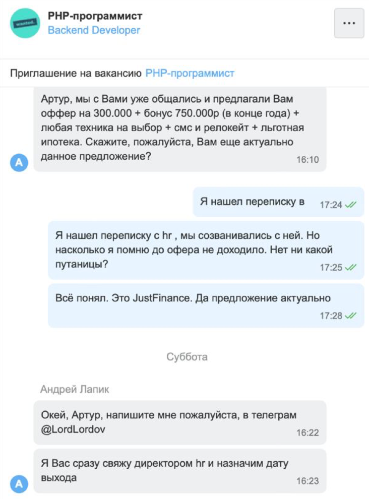
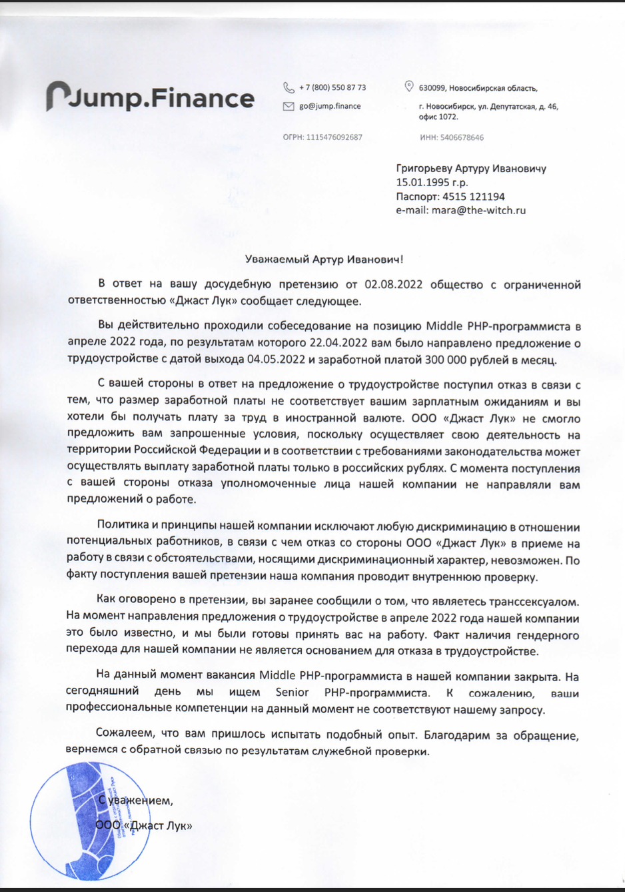

# Мне сделала оффер компания, которая разделяет ценности дайверсити и инклюзивности, разрешила работать под женским именем. А потом отказала за то, что я транс

Это рассказ о том, как я потратила время на собеседования в компанию Just Look (а так-же их продукты Just.Finance и Jump.Taxi) на данный момент на 51% приобретённая Группой “Тинькофф” и как на этапе высылки документов получила отказ по причине моей трансгендерности

## Предисловие
Меня зовут Мара, это не паспортное имя. Я родилась парнем, но уже год на гормонотерапии. В России я ищу работу под мужским именем и местоимениями, ну потому что так тупо проще. Решила что если хочу работать как женщина, это хороший повод искать валютную удалёнку на западе. 

В марте я вступила в сообщество Антона Назарова [Осознанная Меркантильность](https://boosty.to/m0rtymerr) где произошел следущий диалог

> - я работаю сейчас на двух работах по 160к на каждой  
> - а сколько у тебя опыта?  
> - 6 лет  
> - ты долбоёб? Ищи за 300к минимум  
Диалог не точный с авторскими допущениями

Так я открыла резюме с новой суммой. И о чудо меня позвали пособеседоваться. 

Я пообщалась с Софьей (как понимаю внештатный HR), потом пообщалась с Юлией, HR’ом компании. По условиям всё было шикарно. Мы договорились о тех. собесе. Собес прошел огненно, тимлид меня вдохновил

Мне выслали оффер

Я была рада, но отказалась. Хотелось в нынешних условиях валютной удалёнки

> На данный момент отношение к компании такое:  
> Это самая крутая компания с которой я собеседовалась. Тимлид огонь, задачи крутые. Буду всем рекомендовать  

## Второй шанс
На данном этапе разговор с компанией закончился. Я с валютной удалёнкой проебалась. Закончились силы, чего я не ожидала. За три месяца я проела свою финансовую подушку и влезла в долги. Некоторые дни ела хлеб с мазиком и паштет за 30 руб (не тысяч, обычных рублей).  Братаны и сёстры из сообщества помогали донатами и долгами, помогли и родители.
В последний момент начала наконец-то апплаиться на вакансии. Тут уже было всё-равно на ЗП. И тут я неожиданно для себя вижу такую картину на hh.

дата переписки: 15 июля, пятница

Почему-то о том что такие вакансии могут быть открытыми несколько месяцев я не подумала. Была рада до усрачки. В субботу созвонилась с HR. Он говорит выходи хоть завтра. В эту субботу мы с ребятами из [стаи](https://boosty.to/m0rtymerr) отдыхали в коттедже за городом. Было приятно закричать “ОФФЕР НА ТРИСТА КА, СУЧКИ!!!”. В общем день был прекрасный. 

В понедельник HR позвонил и предупредил что выйти во вторник завтра не получится. Еще трое ребят проходят онбоардинг, не успеем всех разом. Ждём в следущий понедельник. 
Во вторник мы созвонились с HR’ом компании - Юлией Ким. С ней мы уже общались три месяца назад.
Темы были такие:
- ща мы вышлим документы
- как вас представить команде? Мы за дайвёрсити, поэтому с этим нет проблем

Я честно была в шоке. Я не просила, но мне дали возможность работать под женским именем. Пиздец! Какая же охуенная компания

В среду с утра я так и не получила документы. Дальше всё сказано в переписке

И так что же произошло:
* Я потратила время на собеседования
* Я услышала “ждём вас как можно скорее, ща доки вышлем”
* Я отказалась от прохождения дальнейших этапов собесов в менее привлекательную компанию
* Мне предложили дайверсити
* Мне отказали по причине “ты транс”
* Я предложила компенсацию. За потерянное время и нарушение ТК РФ
* Меня попытались обвинить в вымогательстве
* Ребята потёрли все переписки и внесли меня в бан. Но было поздно. Самое важное было переслано себе в сохранёнки и снято на скринкаст

Щас некоторые индивиды могут надумать о сранных трансах, которые принуждают работать с собой тех, кого этого не устраивает, качают права и вымогают деньги. Угроза нашему обществу. Поясняю:
> Я не зря ищу работу под мужскими именами. Я уверена, было просто дохуя компаний, которые видя мой телеграм и гитхаб, решали НЕ НАЧИНАТЬ со мной общение. Я не могу назвать их имён, потому что я тупо их не знаю. Некоторые HR даже наваливали кринжа в самом начале общения. Могла ли я с ними судиться? Да. Делала ли я это? Зачем? Мне что делать не хуй судиться со всеми налево направо?  
> Но тут ребята потратили уйму моего времени. Заявили что они про ссанное дайверсити и инклюзивность и стрельнули себе же в ногу.   
> Сейчас я работаю в другой компании, где таких умных слов не знают. Работаю под мужским именем. Мы просто созвонились с HR, она меня предупредила, что владелец компании может не понять и не будет ли мне проблемой работать под мужским именем. Просто взяли и договорились  

На данный момент моё отношение к компании такое
> Никакого хейта к Юле, никакого хейта к тому самому техдиру. Произошла ситуация и её надо решать. Отношение к компании уже не очень. Заявляют про честность, давят на жалость, шантажируют встречным иском о мошеничестве и удаляют переписки. Но если вы честные такие, че вы пытаетесь скрыть? Плюс не вывозят за свои же ценности про дайвёрсити  

Поредактировали так-же переписку на HH

## Досудебная претензия
В этот же момент со мной связался юрист и предложил бесплатную помощь. Обьяснил почему моя просьба о компенсации не является вымогательством, а они данным сообщением делают себе хуже. То есть по факту запугивают

> *сейчас я распишу почему 163 ук здесь не применима  
> Пункт 13 Постановления Пленума Верховного Суда РФ от 17.12.2015 N 56 “О судебной практике по делам о вымогательстве (статья 163 Уголовного кодекса Российской Федерации)”  
> “13. Если требование передачи имущества или права на имущество или совершения других действий имущественного характера является правомерным, но сопровождается указанной в части 1 статьи 163 УК РФ угрозой, то такие действия не влекут уголовную ответственность за вымогательство. При наличии признаков состава иного преступления (например, угрозы убийством, самоуправства) содеянное следует квалифицировать по соответствующей статье Особенной части Уголовного кодекса Российской Федерации.”  
> Часть четвертая статьи 3 Трудового кодекса Российской Федерации :  
> “Лица, считающие, что они подверглись дискриминации в сфере труда, вправе обратиться в суд с заявлением о восстановлении нарушенных прав, возмещении материального вреда и компенсации морального вреда.”  
> п. 10 Постановления Пленума Верховного Суда РФ от 17 марта 2004 г. N 2 “О применении судами Российской Федерации Трудового кодекса Российской Федерации” (с изменениями и дополнениями):  
> “необходимо учитывать, что запрещается отказывать в заключении трудового договора по обстоятельствам, носящим дискриминационный характер”.  
> Иными словами, в сообщении было указано на возможность подачи заявления в суд в целях восстановления нарушенных прав в виде упущенной выгоды и компенсации морального вреда, причиненного путём незаконного отказа в приёме на работу по дискриминационным основаниям. Законность требований обусловлена вышеперечисленными нормативно-правовыми актами и позициями высших судов Российской Федерации”, что исключает преступность данного деяния и его квалификации в соответствии с ч. 1 ст. 163 УК РФ.  
> Также необходимо обратить внимание, что требование о компенсации было выражено после факта незаконного отказа в приеме на работу, что исключает преступный умысел в виду законности требования компенсации.  
>  Также выраженное намерение обратиться в суд для защиты своих прав является свидетельством желания обеспечить защиту прав, чьи интересы нарушены, законным путём. Таким образом, требование компенсации законно и обосновано и не зависит от факта придания огласки действий потенциального работодателя.  
> Также факт угрозы подачи заявления в правоохранительные органы станет доказательством запугивания соискателя в случае проведения судебного разбирательства.* 

Решили составить досудебную претензию. Надо было заверить переписки и скринкаст у нотариуса. Далеко не все нотариусы умеют и хотят этим заниматься, поэтому кто умеет запростили по-итогу 13400. У меня таких денег не было, но удалось собрать донатами в [твиттере](https://twitter.com/mara_moika/status/1552635735798419456). Такая вот сила нашего IT-сообщества. Пришло так-же много крабов “в России прав нет, а если какие-то есть, мы за них бороться не будем и тебя за это осудим” а так-же “трансухи заставляют нас насильно с нами работать”. Пришлось написать [уточнения](https://twitter.com/mara_moika/status/1552954535399809024), чтоб не надумывали кто во что горазд. Но вот эти натягивания представлений о среднестатистическом трансе на конкретного человека - эта та самая трансфобия. Ну я не дура, понимаю что мнение чела без аватарки ничего не стоит по сравнению с мнением подкреплённых деньгами. Присылали от 100 до 2000 рублей.

## Ответ компании
На днях мне пришел ответ. Ответ убил. Это полный булшит. 

Вдруг появились грейды. Middle, Senior. Сорян ребята, вы их не указывали до этого момента, поэтому можете придумывать что угодно. Так же сделаю большое допущение, что мидлов на собесах не спрашивают System Design. 
Так же компания пытается закрыть глаза и сделать вид, что после апрельского разговора больше ничего не было. Я отказалась от оффера и всё. Больше ничего не было. Это очень смешно читать, имея заверенные июльские переписки.
Политика нашей компании исключают дискриминацию. Но мы проводим проверку. И сожалеем что вам пришлось испытать подобный опыт. Если ничего не было, то что вы проверяете? И о чем сожалеете?

> На данный момент отношение к компании поменялось прям совсем. От честности нихрена не осталось. Очень смешно, что они до сих пор смеют что-то говорить про политику компании и дискриминацию. Ребят, вы делом доказали что вы не соответствуете тому, о чем вещаете. 

## Что дальше
Компании был дан выбор. Либо компенсация, либо я пишу статью с именами и названиями и подаю суд. Как видите, статью я уже написала. О суде еще думаю, надо ли оно мне и хватит ли мне моральных сил. 

Под конец пару моральных наставлений
- Дорогие айтишники, знайте свои права и отстаивайте их. Цените своё время. Не будьте гражданскими куколдами “блимн мы в рашке, всё-равно всё плоха”. А если хотите такими быть, не мешайте другим. Лично я получила очень много веселья и поддержки. Не быть терпилой круто.   
- Компанию Just Look я призываю следовать своим принципам честности.  И отказаться от “дайвёрсити и инклюзивности”. Пока что вы просто российская компания с российскими сотрудниками, не стройте из себя тех, кем не являетесь. Ну или публично увольте неподходящего под ваши принципы техлида. 
- Юлю Ким я призываю уволиться из компании если еще не. Потому что вашими словами компания нагло врёт и манипулирует. Быть в данном положении постыдно
