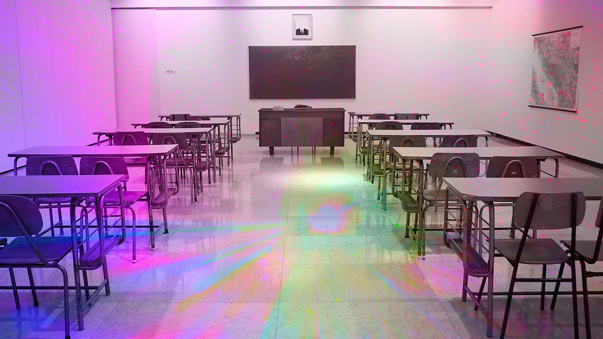

# Кириллу Никифорову 16 лет, он работает программистом, девопсом и учится в онлайн-школе вместо обычной. Как у него все получается?

Сколько языков программирования можно успеть попробовать в 10 классе, можно ли стать программистом без курсов и университетов, и обязательно ли ходить в школу, если умеешь писать код.

Меня зовут Кирилл Никифиров, [@allmazz_](https://twitter.com/allmazz_) в Твиттер, я из Москвы, программист и DevOps в T1. Учусь в 10 классе и мне 16 лет. Компьютерами интересовался ещё с дошкольного возраста, а лет в семь научился собирать их самостоятельно.

Моё хобби — электроника, 3D печать. Раньше занимался фотографией, сейчас учусь играть на электрогитаре.

## От увлечения железками к программированию

Заниматься IT меня вдохновил отчим, который работает сисадмином. Сначала нравилось просто возиться с «железом», а пять лет назад я начал интересоваться ещё и программированием.

Изначально я не хотел профессионально заниматься программированием. Это было хобби. Мне больше нравились компьютеры — электроника, железо. Но постепенно появлялись задачи, связанные с программированием, и всё больше погружался в эту сферу.

Начинал с программирования под [Arduino](https://www.arduino.cc/), а потом под Windows на C++ и C#, затем начал изучать веб: Python и JS.

На Python писал мелкие программы, например, боты в Telegram, парсер для Авито. Это был один из первых полных проектов, бэкенд+фронтенд, который приносил кому-то пользу. Так программирование увлекало меня всё больше и больше. Я начал погружаться, пробовал новые языки, заводил новые знакомства в комьюнити и получал первые заказы через знакомых.

Какими-то задачами я занимался из чистого интереса, к другим приводили обстоятельства. Например, у нас был небольшой конкурс среди школьников в одном маленьком городке в Подмосковье. Наша команда написала библиотеку для работы с азбукой Морзе. Тогда я первый раз писал библиотеку. Но мы единственные сделали работающий проект, поэтому никакого конкурса не случилось.

А одним из моих первых масштабных проектов была система умного дома на Python — освещение, дверной звонок, сигнализация. Когда начинал им заниматься, ещё не знал о существовании уже готовых и хороших систем, поэтому начал писать собственный костыль. Трудно было разобраться, как всё архитектурно представить. Не было опыта проектирования приложений и было непонятно, как сделать систему с легко расширяемой функциональностью. Многое делал с нуля: собирал устройства, писал прошивки под них, бэкэнд, веб дашборд, даже приложение под Android. За неделю, работая по 12 часов в день, я всё написал, и система работала, но функциональность была ограничена. Потом мне рассказали, что есть Home Assistant и ESPHome, и я оставил этот проект.

## Учился с помощью Google и Youtube

Когда меня что-то интересовало, я гуглил, как это должно работать, как люди это делают. Искал документацию, читал статьи, а когда еще плохо умел писать под декстопы и находить нужную информацию, спрашивал на форумах. Пока что не читал ни одной книжки по программированию, но собираюсь. Курсы тоже никакие не проходил, но смотрел видео на Youtube, когда мне было нужно очень быстро влиться в технологию и за пару часов понять, как это работает.

Тем, кто недавно увлёкся программированием, я бы посоветовал вникать глубже, а не ограничиваться тем, что код работает. Многим не важно, в чём суть той или иной технологии. Но лучше интересоваться новым и не стесняться спрашивать об этом у менторов.

Первые шаги зависят от того, чем хочешь заниматься. Сначала нужно узнать азы — как устроены компьютеры, как работают операционные системы. Необязательно глубоко в это погружаться, но иметь какое-то представление всё-таки нужно. Не уверен, что стоит начинать с высокоуровневых языков вроде Python, так как они ограничивают взаимодействие с железом и имеют готовые решения фундаметальных задач, что на мой взгляд плохо при обучении. Из-за наличия готовых библиотек очень много от программиста оказывается скрыто под капотом. Это может развить абстракцию — когда человек не понимает, что делает. Лучше погружаться в язык достаточно глубоко, но не зацикливаться на одной теме. Всегда можно перейти к другой и вернуться, когда уровень знаний будет выше, — шансы на понимание повысятся.

Иногда ко мне обращались ребята, которые не знали, с чего начать. Я давал им советы, но вскоре им становилось лень и они забрасывали учёбу. Я считаю, кто хочет научиться, тот справится и самостоятельно.

Я понимал, что вставать в 8 утра и сидеть 7 часов в школе, из которых полезных 30 минут — абсурд. Мне было жаль своего времени и я ушёл на семейное обучение в 7 классе в онлайн-школу. Там надо делать минимум контрольных, чтобы получать оценки для аттестации. Школьная программа на самом деле не сложная, не требует много времени. Четверть можно закрыть за условную неделю. Поэтому учёба никак не мешает работе.

В онлайн-школе я учусь на четверки и пятерки, потому что не трачу время зря, а концентрируюсь на конкретных задачах. У меня появилось свободное время, сложилась спокойная обстановка, в которой я могу лучше вникать в то, что меня интересует. Любимых предметов у меня нет. 

## Начал зарабатывать деньги

У меня есть знакомый бизнесмен, которому понадобилось сделать интернет-магазин. Мы встретились, он объяснил, что ему нужно, и я взялся за заказ. Тогда не знал, как буду решать эту задачу, но всё получилось. Я ещё практически не освоил PHP, а опыт верстки был мал, но за месяц всё заработало. Я вспоминаю это как самую сложную задачу, потому что когда брался за неё не знал какой язык и движок выбрать. В итоге это был мой первый проект на PHP. Это понадобилось ещё и задеплоить за сутки. Но сложно было просто потому, что я ещё не имел такого опыта.

Когда получилось, я решил, что, если справился, всё работает, можно брать за это деньги. Начал выполнять фриланс-заказы как фуллстек-программист.

Сейчас занимаюсь бэкенд-разработкой. Во фронтенде разбираюсь меньше. Знаю, как это работает, но почти не знаю фреймворков. В бэкенде задачи больше связаны с железом и мне это интереснее.

По знакомству попал на собеседование в Т1. Теперь я официально специалист инфраструктурной поддержки, то есть и DevOps, и программист. Коллеги ко мне относятся хорошо, мой возраст никаких вопросов не вызывает, с эйджизмом я не сталкивался ни разу.

Я работаю 4 часа в день. Смотрю, какие есть таски, и иду их выполнять. Если случилось что-то срочное, переключаюсь на это. В отделе инфраструктурной поддержки мы обрабатываем задачи, поступающие от техподдержки, которая работает с заказчиком. Либо передаём их программистам, либо я выполняю их в срочном порядке. Иногда нужно что-то починить, а иногда — и новое написать, например, недавно я писал экспортер для Prometheus.

Мне было очень интересно разбираться в коде продукта, вникать в архитектуру. Это большой проект, в котором много микросервисов. 
Мне нравится, что всегда есть интересные задачи. Не могу долго не писать код. А здесь занимаюсь реальным проектом, которым пользуются люди. Конечно, это развитие и опыт.

Сейчас я работаю в T1 и развиваю стартап в сфере ресторанного бизнеса. Учу Go, а в ближайшее время хочу начать изучать ML. Ещё собираюсь поступать в вуз за границей, но не уверен, что не передумаю через два года. Сейчас склоняюсь к программированию, но потом, возможно, выберу Computer science или Data science. В следующие два года вряд ли перееду из России, но собираюсь путешествовать.

70% моего круга общения — технари. Я рад, что на моем пути всегда встречались люди, которые помогали, объясняли, направляли, давали интересные проекты и задачи. 
