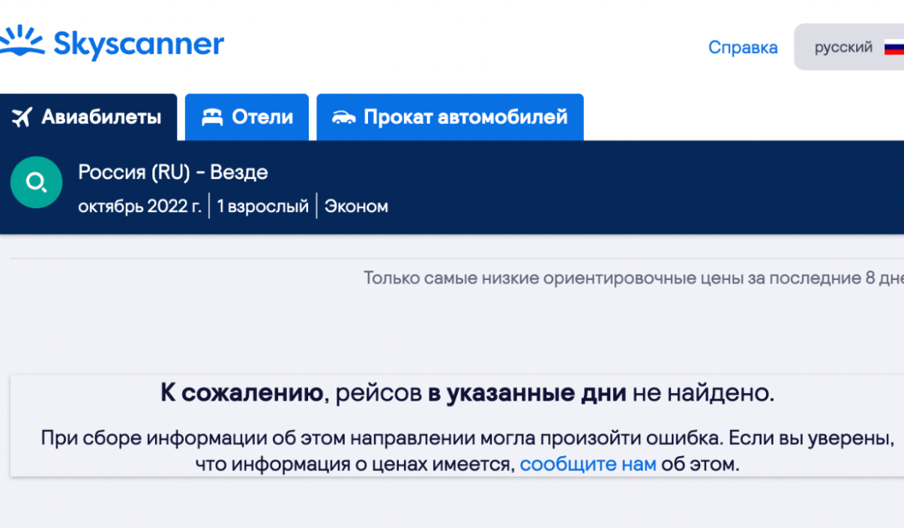

# Избежать мобилизации: горячие направления для экстренного отъезда из России

Указ о мобилизации был опубликован и вступил в силу сегодня, в Международный день мира, который отмечается по инициативе ООН уже двадцать лет. В видеообращении Путина мобилизация названа частичной, но де-юре, согласно Указу, может затронуть кого угодно.

В телеграм-каналах распространяется инфографика, показывающая очерёдность призыва резервистов.

_[источник](https://t.me/dvachannel)_

## Улететь будет сложно: билетов нет

Уже через несколько часов после появления этой информации сайты-агрегаторы авиабилетов демонстрировали дефицит мест на рейсах в Ереван, Стамбул и Тбилиси. По этим популярным с февраля 2022 года направлениям билеты остаются только на более отдалённые даты, а цены на них начинаются от 60-70 тысяч рублей. Причина — безвизовый въезд для граждан РФ.

## А если на машине?

Надежда — на сухопутные границы. Напоминаем, что с 15 июля сняты все ковидные ограничения со стороны России.

1. Граница с Грузией — открыта, коронавирусные ограничения были сняты. По сообщениям в чате пункта Верхний Ларс (https://t.me/VerhniyLars), сегодня переходы через границу осуществляются в прежнем режиме. Грузия не рассматривает введение виз для россиян, как следует из специального заявления лидера правящей партии "Грузинская мечта" Ираклия Кобахидзе. 
Это открывает россиянам возможность приехать на машине в Турцию, Армению, Азербайджан.

Официальные лица других граничащих с Россией стран также выступают с заявлениями. Глава МИД Латвии Эдгар Ринкевич объявил, что никаких гуманитарных виз, с помощью которых россияне могут скрыться от мобилизации, [не предусмотрено](https://rus.lsm.lv/statja/novosti/mir/latvija-ne-vidast-vizi-beguschim-iz-rf-ot-priziva--glava-mid.a474613/). По туристическим визам в Польшу и Прибалтику въехать всё ещё нельзя — запрет действует с 19 сентября. Власти Эстонии намерены также [предотвратить](https://rus.err.ee/1608721696/vysokie-scheta-za-jelektrichestvo-povlekut-za-soboj-zakrytie-rjada-magazinov-krupnyh-torgovyh-setej) въезд в страну лиц, участвовавших в военных действиях на территории Украины.

2. Ещё одно популярное направление — Беларусь. Местные арендодатели отмечают небывалый всплеск спроса на посуточную [аренду квартир](https://mediazona.by/article/2022/09/21/arenda).  Часть направлений открывается для граждан РФ из Минска. Наиболее популярные — Стамбул (Турция), Шарджа (ОАЭ), Тбилиси, Батуми, Кутаиси (Грузия), Нур-Султан (Казахстан), Ташкент (Узбекистан), Ереван (Армения), Баку (Азербайджан).

_*это не все доступные направления_

3. Попасть на машине  в Казахстан можно из восьми регионов России. 
Астраханская область – КПП Курмангазы
Алтайский край – КПП Шарбакты, Ауыл, Убе, Жезкент.
Курганская область – КПП Акбалшык
Новосибирская область  – КПП Сулу Агаш.
Омская область – КПП Карагога и Урлитобе.
Оренбургская область — КПП Аксай, Алимбет, Жайсан.
Саратовская область  – КПП Таскала.

Находиться в Казахстане можно 30 дней без регистрации, 60 дней с регистрацией по месту жительства. Из аэропортов Казахстана есть регулярные рейсы в 23 страны, помимо России. В том числе это безвизовые для россиян Турция, ОАЭ, Узбекистан, Грузию, Таджикистан, Кыргызстан, Беларусь.

4. По действующему внутреннему или заграничному паспорту можно пересечь границу России и Абхазии. Из аэропорта Сухуми популярны рейсы в Тбилиси, Ереван, Стамбул.

**upd — по грузинскому законодательству нельзя посещать Абхазию без разрешения правительтва Грузии, такой способ может создать массу проблем при посещении этой страны**

## Где искать информацию?

Уже несколько месяцев активно пополняется [гайд [по эмиграции] в свободный мир (relocation.guide)](https://relocation.guide). Сегодня инициаторы проекта совместно с изданием “Холод” выпустили [материал-напоминание](https://holod.media/2022/09/21/kuda-uletet-iz-rossii-pryamo-sejchas-gajd-po-ekstrennoj-emigraczii/), куда можно экстренно уехать из России. В материале отмечается, что без загранпаспорта для россиян доступен  Казахстан (на 30 дней без регистрации и дополнительно 60 дней с регистрацией по месту жительства), Армения (на 180 дней, только самолётом), Кыргызстан (30 дней без регистрации, далее 6 месяцев с регистрацией по месту жительства). В последних двух странах предлагается выбирать города подальше от границ из-за тлеющих конфликтов с Азербайджаном и Таджикистаном. 

# Без визы на самолете

Стран, куда можно попасть с загранпаспортом, но без визы, больше. Помимо уже названной нами Грузии, это Мексика (нужна электронная виза, которая оформляется самостоятельно на сайте), Аргентина, ОАЭ, Бразилия, Коста-Рика, Чили, ЮАР, Марокко, Перу, Эквадор, Катар, Израиль, Азербайджан, Молдова, Таджикистан, Египет (нужна электронная виза, которая оформляется самостоятельно), Кабо-Верде, Маврикий, Турция, Узбекистан, Южная Корея (нужна электронная виза, которая оформляется самостоятельно), Таиланд, Индия (нужно оформить электронную визу длительностью от 30 дней до 5 лет), Индонезия (визу проставляют по прилете в аэропорт), Малайзия, Черногория, Шри-Ланка (нужно оформить электронное разрешение), Монголия, Лаос, Сербия.

Обязательно нужно учитывать период времени, на который россиянам даётся безвизовый въезд. Он варьируется от 30 до 360 дней. 
Возможно, при пересечении границы понадобится подстраховка в виде обратного билета или брони отеля для туристов. 

_Скриншот рассылки сотрудникам Сбера. Источник — телеграм-канал Baza_

## Можно ли выехать?

Остаётся открытым вопрос о свободе перемещения лиц, подлежащих первоочередной мобилизации. Им предлагают дождаться [официальных разъяснений](https://www.m24.ru/news/vlast/21092022/503859). РЖД и Аэрофлот опровергли информацию о том, что при покупке билетов проводятся дополнительные проверки документов. Российское законодательство о мобилизации предполагает запрет выезда, но глава комитета Госдумы РФ по обороне Андрей Картаполов заявил, что "дополнительных ограничений на право выезда резервистов в связи с частичной мобилизацией не предусмотрено". По крайней мере это актуально для тех, кто ещё не получил повестку на руки.
