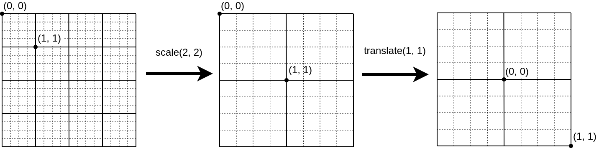

# Трансформации Pan and Zoom в Canvas


В этом посте я расскажу, как сделать сдвиг и масштабирование при рисовании в Canvas. Самыми простыми средствами, без использования матриц аффинных преобразований. Это взаимодействие есть во многих приложениях, например в Google Maps: вы можете покрутить колёсико и карта под мышкой приблизится или отдалится. В цифровых аудио-редакторах похожим образом реализована навигация по аудиофайлу. В приложениях для просмотра изменений котировок финансовых инструментов так реализована навигация по историческим данным. Отличие состоит только в том, что в случае Google Maps трансформация влияет на обе координаты в равной степени, а в других  — только к одному измерению.

## Translate и Scale
Представьте, что у вас есть окошко фиксированного размера, под которым находится резиновый холст некоторой длины и ширины. Вы можете рисовать на этом листе, двигать его вдоль осей координат, сжимать и растягивать. Рисунок тоже будет сжиматься и растягиваться.

В контексте рисования на HTML Canvas, холст это `CanvasRenderingContext2D`, а окошко это HTML элемент `<canvas>`. События, связанные с мышью, имеют координаты элемента `<canvas>`, но рисование на холсте выполняется в системе координат холста, которая будет отличаться от `<canvas>`, если к ней применить трансформации.


Нам нужен механизм, который сопоставляет систему координат элемента `<canvas>` с системой координат контекста рисования `CanvasRenderingContext2D` с учетом трансформаций. Нам нужно будет разобраться с тем, как переводить координаты из одной системы в другую, но сначала посмотрим, как работают трансформации `scale` и `translate`.

## Scale
Представьте, что холст это такой резиновый лист, на который нанесены линии, как на миллиметровой бумаге. Трансформация scale работает следующим образом:
точка (0, 0) всегда остается на своем месте. Эта точка называется origin. Scale принимает 2 аргумента, назовём их sx и sy, которые отвечают за масштабирование холста по каждой из осей:


После трансформации scale видимое расстояние между точками на оси x (y) становится в sx (sy) раз больше.

## Translate
Translate сдвигает лист в координатах холста. Не в координатах экрана, а именно в координатах холста. Продолжая аналогию с миллиметровой бумагой: мы двигаем лист на количество клеточек, которые нарисованы на этом листе. Если холст растянут, то клеточки будут шире, а движение будет сильнее.


## Translate и Scale
Интересный факт, если выполнять translate и scale с одинаковыми аргументами, но в разном порядке, то результат будет отличаться. Говоря математическим языком, композиция трансформаций не коммутативна. Коммутативность означает, что операция не изменяется от перестановки аргументов. Например, сложение коммутативно, потому что a + b = b + a при любых значениях аргументов. Возведение в степень не коммутативно, потому что есть хотя бы одна пара a и b, для которой равенство a^b = b^a не выполняется.

Простой пример: применим translate и scale в разном порядке:
 

Мы увидели, что порядок применения трансформаций влияет на результат.

## Математика преобразований
### Элементарные преобразования

Если у нас есть только scale и translate и нет вращений, то преобразования координат x и y можно рассмотреть независимо. Для простоты рассмотрим одномерный случай, с координатой x.

Нейтральное преобразование, которое оставляет координату неизменной, выглядит вот так:
`f(x) = x`

Если мы к нейтральному преобразованию применим scale, то получится: `f(x) = sx * x`
Если мы к нейтральному преобразованию применим translate, то получится: `f(x) = x + tx`

Можно заметить, что оба преобразования соответствуют паттерну линейной функции,
`f(x) = a * x + b`. Функция называется линейной, потому что её график это прямая линия. Пример нелинейной функции: `f(x) = x^2 + 4`.

Но что делать, если мы хотим применить scale или translate не к нейтральному преобразованию, а в более общем случае? Композиция функций не даст нам нужный результат, нужен более хитрый механизм.

### Композиция преобразований
#### Scale
Пусть есть некоторая трансформация `t`, заданная линейной функцией:
`t(x) = k * x + b`

Мы хотим применить к ней трансформацию `scale`, с аргументом `sx`, то есть мы хотим растянуть или сжать холст в `sx` раз и получить новую трансформацию `t'`:

```
[t'] = [t] ⚬ [scale sx]
```

Композиция с трансформацией scale sx должна обладать следующими свойствами:
* должна “растягивать” холст в s раз: `s * (t(x1) - t(x2)) =  (t'(x1) - t'(x2))`
* Точка `(0)` должна оставаться на своём месте: `t'(0) = t(0)`

Внимательный читатель может заметить, что поворот вокруг точки 0 с масштабированием тоже соответствует этим условиям, но повороты мы рассматривать не будем.

Нам нужно подобрать `k’` и `b’`: вот в таком выражении:

```
[k * x + b] ⚬ [scale sx] = [k’ * x + b’]
```

Выражения в угловых скобках это трансформации, а кружочек ‘⚬’ обозначает композицию трансформаций.

k’ = k * sx, потому что холст должен растянуться в sx раз

b’ = b, потому что масштабирование не двигает холст.

Теперь мы получили композицию произвольной трансформации с трансформацией scale:

`[k * x + b] ⚬ [scale sx] = [s x * k * x + b]`

#### Translate
Операция Translate должна двигать холст в его координатах, с учетом того, что он может быть сжат или растянут.

`[k * x + b] ⚬ [translate tx] = [k’ * x + b’]`

Сразу можно заметить что `k' = k`, просто потому что translate не масштабирует холст.
Сдвиг точки на `tx` единиц в координатах холста сдвинет точку на `k * tx` единиц в экранных координатах.

```
k' = k 
b' = k * tx + b
```

Теперь мы получили композицию произвольной трансформации с трансформацией translate:

`[k * x + b] ⚬ [translate tx] = [k’ * x + (k * tx + b)]`

#### Примеры

Мы можем вычислить композицию некоторой трансформации `[k * x + b]`  с трансформациями scale и translate:

```
[k * x + b] ⚬ [scale sx] = [s x* k * x + b]
[k * x + b] ⚬ [translate tx] = [k * x + (k * tx + b)]
```

Интересное свойство:
```
[k * x + b] = [translate b]⚬[scale k] = [scale k]⚬[translate b / k]
```

Вернемся к примеру, который рассмотрели раньше:


E это нейтральная трансформация: `[1 * x + 0]`
```
(E ⚬ [translate 1]) ⚬ [scale 2] =
([1 * x + 0] ⚬  [translate  1]) ⚬ [scale 2] =
[1 * x + (1 * 1 + 0)] ⚬ [scale 2] =
[1 * x + 1] ⚬ [scale 2] =
[2 * 1 * x + 1] = [2 * x + 1]
```

Получили `t = [2 * x + 1]`.

Трансформация `t` переносит точку `(0, 0)` в позицию `(2 * 0 + 1, 2 * 0 + 1) = (1, 1)`
а точку `(1, 1)` в позицию `(2 * 1 + 1, 2 * 1 + 1) = (3, 3)`

А теперь применим трансформации в другом порядке, сначала `scale`, а потом `translate`:


```
(E⚬[scale 2]) ⚬ [translate  1] =
([1 * x + 0] ⚬ [scale 2]) ⚬ [translate 1] =
[2 * 1 * x + 0] ⚬ [translate 1] =
[2 * x + 0] ⚬ [translate 1] =
[2 * x + (2 * 1 + 0)] =
[2 * x + 2]
```

Получили `t = [2 * x + 2]`

Трансформация `t` переносит точку `(0, 0)` в позицию `(2 * 0 + 2, 2 * 0 + 2) = (2, 2)`
а точку `(1, 1)` в позицию `(2 * 1 + 2, 2 * 1 + 2) = (4, 4)`. 

### Обратные преобразования
Мы научились преобразовывать координаты холста в экранные координаты. Но нам может пригодиться обратное преобразование: по заданным экранным координатам определять координаты на холсте. Например в таком сценарии: мы кликаем на холст мышкой и хотим определить, кликнули ли мы на какой-то нарисованный объект.

Имея вот такие условия
```
t = [k * x + b]
t' = [k' * x + b']
t ⚬ t' = E
```

Можем вычислить значения k' и b':
```
k' = 1 / k
b' = -b / k 
```
Применение обратной трансформации можно обозначить с помощью символа `⁻¹`:
```
[k * x + b]⁻¹ = [1/k * x - b/k]
```

## Масштабирование с помощью мыши
Теперь у нас есть все инструменты для того, чтобы сделать масштабирование холста в той точке, на которую указывает курсор мыши, вот так:


### Трансформация ZoomAt
Можно выполнить трансформацию в 2 этапа: сначала делаем scale. Мы получим отмасштабированный холст, но точка под мышкой “убежит”, потому что scale оставляет на месте только начало координат. Чтобы это компенсировать, нужно применить translate. Это можно сделать так: с помощью обратной трансформации определяем, насколько точка под мышкой сдвинулась, а затем делаем translate на величину сдвига:


Обозначим начальную трансформацию через t

Вычислим промежуточную трансформацию t'
```
t' = t ⚬ [scale s] = [k * x + b] ⚬ [scale s] = [k * s * x + b]
```

Пусть координата мышки это `mx`. Найдем точки на холсте, которые соответствуют положению мыши перед трансформацией `t'` и после:

```
mxₜ = t⁻¹(mx) = [k * x + b]⁻¹(mx) = [(1 / k) * x - b / k](mx) = mx / k - b / k
```
```
mxₜ' = t'⁻¹(mx) = [k * s * x + b]⁻¹ = [1 / (k * s) * x - b / (k * s)](mx) = mx / (k * s) - b / (k * s)
```

Нужно компенсировать сдвиг на разницу между этими значениями. Трансформация, которая компенсирует сдвиг, будет выглядеть так: [translate (mxt' -mxt)]

Сложим scale и translate с помощью композиции и получим:
```
(t⚬[scale s])⚬ [translate (mxₜ' - mxₜ)] = ([k*x+ b]⚬[scale s])⚬ [translate (mxₜ' - mxₜ)]=
[k * s * x + b] ⚬ [translate (mxₜ' - mxₜ)] = [k * s * x + (k * s *  (mxₜ' - mxₜ)) + b]=
[k * s * x + (mx - b - mx * s + b * s) + b] = [k * s * x + mx + s * (b - mx)]
```

Готово. мы получили трансформацию zoomAt, которая масштабирует холст под курсором мыши:

`[k * x + b] ⚬ [zoomAt(mx, s)] = [k * s * x + mx + s * (b - mx)]`

где mx это координата мыши
## Практика

Мы разобрались как работают трансформации. Теперь посмотрим, как их использовать при рисовании на HTML Canvas.

Здесь есть 2 подхода:

* можно применить трансформацию непосредственно к canvas, тогда изменение масштаба повлияет на всё, что мы рисуем, включая толщину линий и размер шрифта. Это нужно достаточно редко.
* можно применить трансформацию только к координатам. Трансформация повлияет на положение геометрических объектов, но размер текста и толщина линий останутся без изменений.

### Трансформация Canvas

Нам понадобятся функции translate и scale из  [CanvasRenderingContext2D](https://developer.mozilla.org/en-US/docs/Web/API/CanvasRenderingContext2D)

Нарисуем кружок:
```typescript
 const context = canvas.getContext("2d")!
 context.resetTransform()
 context.translate(pz.tx.b, pz.ty.b)
 context.scale(pz.tx.k, pz.tx.k)

 context.beginPath()
 context.ellipse(x, y, 2, 2, 0, 0, 360)
 context.fill()
```

Применяем трансформацию к `canvas`, затем рисуем. Радиус кружка будет масштабирован в соответствии с трансформацией, в `k` раз.

### Трансформация координат
Применяем трансформацию к точке `(x, y)`, получаем ее координаты на канвасе, и рисуем:
```typescript
const context = canvas.getContext("2d")!
const c = pz.apply(p.x, p.y)
context.beginPath()
context.ellipse(c.x, c.y, 2, 2, 0, 0, 360)
context.fill()
```

Поскольку мы применяем трансформацию только к координатам, кружок всегда будет нарисован с радиусом 2, вне зависимости от масштаба, заданного в параметрах трансформации.

## Демки
Можно посмотреть трансформации в действии [вот здесь](https://vzhilin.me/notes/pan-zoom-demo).
Код демки выложен в [github](https://github.com/vzhn/pan-zoom-demo).


Классы `PanZoom1D` и `PanZoom2D` отвечают за трансформации. Вспомогательные классы `ConstrainedPanZoom1D` и `ConstrainedPanZoom2D` отвечают за ограниченные трансформации, которые не позволяют сдвинуть холст дальше заданных границ.

### Chart
Состоит из 2х частей: график и миникарта. События мыши `drag` и `wheel` обновляют трансформацию, сдвигая или масштабируя график вдоль оси `x`.  Здесь я использовал трансформацию координат, чтобы трансформация не влияла на толщину линий.

### Map
Демка Map демонстрирует масштабирование карты по обеим осям. На карте нарисованы прямоугольники, которые можно приближать или удалять. Миникарту я делать не стал. Здесь я использовал трансформацию Canvas, которая влияет на все графические элементы: высоту текста, толщину линий и так далее.

## Что почитать дальше
Эти трансформации являются частным случаем [аффинных преобразований](https://ru.wikipedia.org/wiki/%D0%90%D1%84%D1%84%D0%B8%D0%BD%D0%BD%D0%BE%D0%B5_%D0%BF%D1%80%D0%B5%D0%BE%D0%B1%D1%80%D0%B0%D0%B7%D0%BE%D0%B2%D0%B0%D0%BD%D0%B8%D0%B5), которые нашли широкое применение в компьютерной графике: OpenGL, Direct3D, игровые движки и так далее.

В HTML Canvas матрица аффинного преобразования задается с помощью [этой функции](https://developer.mozilla.org/en-US/docs/Web/API/CanvasRenderingContext2D/setTransform). В отличие от PanZoom аффинные преобразования позволяют сделать ещё сдвиг и поворот.

Сконвертировать трансформацию PanZoom в матрицу афинного преобразования можно [функцией matrix](https://github.com/vzhn/pan-zoom-demo/blob/master/src/transformation/PanZoom2D.ts). 

### Обо мне
Вова, программист. 

Linkedin: [Vladimir Zhilin](https://www.linkedin.com/in/vladimir-zhilin-950599181/)

Twitter: [vzhilin_me](https://x.com/vzhilin_me)

Github: [vzhn](https://github.com/vzhn)

Скромная домашняя страничка: https://vzhilin.me/