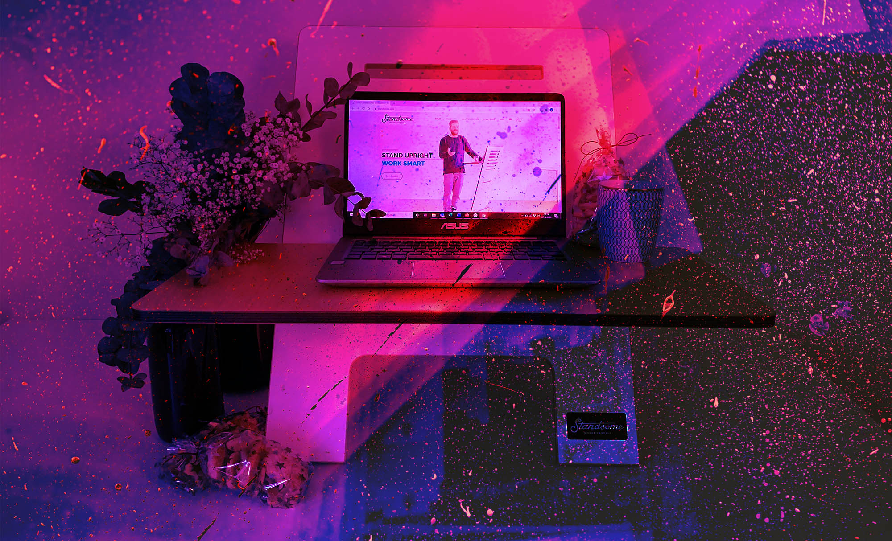

# Podlodka Crew переизобрела конференции на фоне пандемии, а в 2022 работает не скрывая позиции. И это очень непросто

Женя Кателла — ведущий подкаста Podlodka, организатор конференций Podlodka Crew. Руководил отделом Android в Rambler&Co и мобильной разработкой в Яндекс Транспорте, а последние пару лет руководит мобилкой в Яндекс Еде. Он рассказал нам, как команда Подлодки свернула конференции в феврале 2022, но затем вернулась к работе вновь — и через какие трудности им приходится проходить. Вот его монологи

## 24 февраля я провёл, уставившись в стену. А через три дня улетел из страны

Я работаю из офиса два дня в неделю. 24 февраля как раз был дома. Помню, как проснулся, прочитал новости, сел и уставился в стену. Пытался делать вид, что работаю, потому что надо было как-то поддерживать команду, но получалось не очень хорошо.
Я помню, что был четверг, потом наступила пятница. Все эти два дня я пытался имитировать работу, но ничего не получалось. В субботу мы пошли на день рождения к другу, и я просто сидел там и думал о том, как невыносимо всё, что происходит. Тем же вечером мы с женой приняли решение уехать, и уже на следующий день сделали это.
Я улетел в Тбилиси 27 февраля. Тогда мне было физически сложно думать, я запаниковал. У нас на глазах формировалась совсем новая реальность. Начали происходить кошмарные вещи, но на высоких трибунах пытались делать вид, что это «необходимое зло во спасение». Но вскоре все маски окончательно слетели и риторика изменилась. Стало звучать, что «мы до Атлантики дойдём и вернем Советский союз». В этот момент я понял, что чайник свистит и дальше будет намного хуже. Дело не столько в налогах: газовые деньги из Европы больше финансируют ракеты, чем мои «копейки» с подоходного налога. Но с моих денег идёт зарплата людям, которые эту чушь несут, а я этого точно не хочу.

## IT-сообщество разделилось 

Я, откровенно говоря, не очень активный член комьюнити. Активно присутствую только в Twitter. Там я ощутил нарастающую напряжённость. Все мусолят одни и те же темы по кругу, происходит какой-то круговорот хейта: одни и те же обвинения в один и тот же адрес, ничего конструктивного в этом нет и быть не может.
Забавно, что люди, которые раньше были активными участниками комьюнити, сейчас переезжают в условный Амстердам и надевают «белое пальто». Вместо того чтобы вносить конструктив, помогать другим, они выбирают компании, которые сейчас проще всего шеймить, и говорят, что все, кто из неё ещё не уволился — сволочи и мрази. Я знаю нескольких таких людей лично. 
Я считаю, что это тоже вариант травли, хоть её и проще оправдать для себя с моральной точки зрения. Но это всё равно травля, потому что ты «стрижешь» всех под одну гребёнку и не пытаешься понять конкретного человека. Например, хочешь, чтобы все уволились из Яндекса. Но лучше от этого никому не становится. Те, кто не мог уехать, от этого не уедут. А тем, кто мог и задумывался, скорее всего, самого факта ***** (мы убираем или оставляем это запрещенное слово по желанию спикера — примечание редакции) хватило, чтобы принять решение. Факторы, важные для переезда, у них всё равно другие.
В отдельных частях сообщества люди занимаются благотворительностью. Я заметил это, когда находился в Тбилиси и в Ереване. Это круто, в таких кругах общаться мне приятнее, потому что там нет времени заниматься травлей, все заняты делом.

## Остановили конференции в феврале и восстановили их в мае

Мы с командой Подлодки мало общались первые три дня после начала *****, почти ничего не делали, приходили в себя. Потом списались — нужно было что-то решать. Было абсолютно очевидным, что продолжать конференции пока невозможно. Это было абсолютно неуместно, ни при каких условиях. 
Только в мае мы решились вернуться, потому что за эти два с лишним месяца жизнь в комьюнити постепенно начала возрождаться. Компании снова начали кого-то нанимать, а разработчики — снова интересоваться разработкой. Мы вложили очень много времени, сил и энергии в проект, и продолжать его хотелось в любом случае. А на тайминг повлияло как «оживление» в комьюнити, так и то, что у нас есть люди на зарплате, и тянуть бесконечно мы не могли. Мы несём перед ними обязательства  — платим этим людям их основной, а часто и единственный, доход. 
Мы решили не ждать каких-то непонятных перемен, когда точно и стопроцентно этически правильно будет снова проводить конференции. Потому что для этого есть только один понятный вариант: наступил однозначный мир. Все остальные варианты сложно подвести под какую-то рациональную базу. Что должно случиться, чтобы мы сказали, что сейчас точно можно возобновлять активность? 
Мы решили провести мероприятие, ведь, возможно, для кого-то это станет отдушиной. Подумали, что, если нарвемся на негатив — то и хрен с ним, если это хоть кому-то принесет пользу, например, поможет найти работу. 
Негативной реакции на то, что мы вернулись с конференциями, я не помню. Возможно, были точечные негативные комментарии, но точно не массовые. Я объясняю это тем, что мы не слишком масштабны и привлекли не так много внимания, как другие организаторы. А ещё тем, что, в феврале мы однозначно высказали свою позицию.

## Мы против травли

Мы с командой ещё не обсуждали, как относиться к конкретным спикерам из российских компаний. Совершенно точно, что есть спикеры с ярко выраженной провоенной позицией, и у нас в программе конференций их не будет. 

Но мы не хотим отказывать спикерам, основываясь только на том, в какой компании они работают. Конечно, и тут могут быть исключения: я не могу представить у нас в программе людей из РКН или NTechLab. Но в остальном может быть миллион причин, почему люди работают там, где работают, и обвинять их мне не кажется конструктивным. Кто-то не может переехать, кто-то находится в затяжном процессе переезда, и на это нужна куча денег, кого-то держат обязательства. Отказывать спикерам, потому что они не демонстрируют радикальность своих намерений – неправильно.

## Острые вопросы обходят нас стороной

Хочется держать пальцы крестиком, но пока нас все напряжённые вопросы обходят стороной. Я не понимаю, почему. У меня были опасения, что придёт спикер и повесит слайды, за которые нас всех могут посадить в тюрьму. И если мы эти слайды оставим — мы молодцы, но отъезжаем на нары. А если мы их убираем — мы правительственные подстилки и нас всех нужно закенселить. Но пока такого не было. Мы обсуждали, что будем делать в этой ситуации, но ничего не придумали. Когда случится — тогда решим. 
Высказывать свою точку зрения о *#%@# — сложное решение для спикера. С одной стороны, есть совесть, высказываться нужно, и это правильно. Но всегда есть риск этим нанести ущерб другим, и это твоя ответственность. Готов ли ты за это отвечать? Если бы меня позвали на конференцию, а я у себя в докладе поставил слайд против *#%@# и к организаторам потом из-за этого кто-то пришел, то я подставил бы их под удар. А у меня рисков в этом случае меньше. Поэтому я считаю, что лучше найти другие способы высказывать свою позицию, например, в личных соцсетях, а не за счёт свободы, денег, бизнеса других людей.
Пока у нас не было открытых конфликтов в сообществе — видимо, из-за того, что у нас онлайн-формат. Всё проходит спокойно и мирно. К нам люди приходят с конкретной целью. Гости платят деньги за билеты, а спикеры получают гонорар за выступление. Все понимают, ради чего они стараются. Конечно, финансовая сторона не может быть единственной мотивацией, но наличие таких формальных «деловых» отношений, возможно, работает как механизм саморегуляции. В результате люди на конференции фокусируются вокруг технических дискуссий, а не политических. 
И здесь двоякая ситуация. Быть вне политики, разумеется, уже нельзя. Но 99% политических дискуссий в комьюнити сейчас таковы, что не несут никакого конструктива, а только наоборот разобщают и сеют еще больше ненависти и зла.

## Новые условия рынка и новые правила мероприятий

Спрос у аудитории всё так же есть. Некоторые мероприятия это очень наглядно демонстрируют — мы их проводим, люди на них охотно приходят, общаются, обмениваются опытом. А маркетинговая составляющая сильно изменилась.
Раньше экономика наших конференций строилась на том, что примерно 60% мы зарабатывали с билетов, еще 40% — с партнёров. Когда после начала ***** мы решили возобновить мероприятия, то сели обсудить, с кем нам норм, а с кем нет. Пытались договориться, но ничего не вышло. Тогда приняли решение отказаться от всех спонсоров и зарабатывать только на билетах. 
Маркетинг в это время просел, привлекать людей стало гораздо сложнее. Мы начали придумывать другие способы поднять выручку. В итоге всё сводится к тому, что на конференциях зарабатывать всё ещё можно, но гораздо меньше и не так стабильно. Пока одна конференция продается нормально, другие — абсолютно непредсказуемо проваливаются и выходят либо в ноль, либо в незначительный плюс — буквально чтобы хватило «на пиво». Мы всё ещё думаем, что с этим делать. Есть несколько идей:
- Подтянуть маркетинг. Тут ничего нельзя гарантировать, поэтому будем экспериментировать, не зная, получится или нет. 
- Пробовать возвращать партнеров. Есть компании, с которыми мы бы не стали ни при каких условиях сотрудничать. Условно это Роскомнадзор, NtechLab. В общем, чистое воплощение зла. С остальными — будем думать.

Как относиться к компаниям, которые раньше были норм, но сейчас подпортили себе репутацию, я пока даже для себя не сформулировал. Совершенно точно есть прям плохие истории, как например у Яндекса с новостными агрегаторами. Но есть и примеры крутых команд и крутых сервисов, которые делают объективно хорошие, правильные вещи. И их вина только в том, что они сделаны в тех же стенах. Насколько плохо с ними сотрудничать, я не знаю. Мы сейчас с фаундерами Подлодки договорились, что прощупаем эту сторону.
При этом некоторые форматы сотрудничества мы полностью исключили. Например, раньше мы могли с кем-то громко заколлабиться и написать, что конференция проходит при поддержке конкретной компании. Сейчас очевидно, что некоторые бренды вешать на лендинги и называть соорганизаторами мы бы не хотели.
В целом привлекать людей на конференции стало намного труднее. Реклама работает гораздо хуже: в ФБ нельзя давать рекламу. На Россию таргетировать теперь невозможно, таргет можно настроить только на тех, кто уехал. Поэтому мы потеряли значительную часть трафика, которая раньше шла оттуда. 
Многие Telegram-каналы просто перестали публиковать контент, и понятно, что заходить к ним сейчас с какими-то рекламными анонсами просто неуместно. Раньше мы размещали рекламу у наших украинских друзей, а сейчас мне совесть не позволяет к ним обращаться. Кроме того, часть аудитории эмигрировала, и поэтому они либо не могут, либо не хотят покупать билеты за рубли. Завести платежи в другой валюте — это разрешимая задача, но очень много сложностей под капотом. Можно попасть в ситуацию, когда у тебя болтаются деньги в евро, но вывести их нормальным образом очень сложно. Вплоть до того, что их могут просто заблокировать и сказать: извините, но мы вам эти деньги вернуть не можем.
Недостатка спикеров я не заметил, но, возможно, это связано с нашей моделью работы. У программного комитета другой конференции есть CFP, они пишут: «Ищем людей на такие-то конференции, на такие-то темы», открывают CFP, и люди сами подают заявки. Они легко могли заметить, что раньше было 200 заявок, а сейчас — 150.
У нас модель иная: мы выбираем тему недели, конкретные её аспекты, которые хочется раскрыть. Например, тема недели – UI во фронтенде, а в ней конкретные сессии по анимации и CSS. Значит, нам надо найти специалистов именно в этом. Мы знаем, что в CSS хорошо шарит София Валитова, и стучимся к ней в личку. Может, мы и сталкивались с отказами спикеров идти к нам, но не в такой степени, чтобы было проблематично сформировать лайнап конференции.
Были и забавные казусы. Например, у нас вокруг Podlodka Crew развернута большая инфраструктура: мы сами написали свой биллинг, у нас множество автоматизаций, боты, отдельная CRM, отдельные маркетинговые базы. Мы это всё делали сами, своими руками. Что-то крутилось на GitHub, что-то где-то ещё. Например, огромный кусок инфраструктуры висел на Heroku. Где-то в середине марта пришло письмо: «Мы по косвенным признакам поняли, что вы пользуетесь нашей инфраструктурой с территории России. В связи с новыми санкциями вы идёте на хер, такого-то числа вся инфраструктура перестанет работать, примите меры». 
Я засучил рукава, недели три сидел после работы по четыре часа, всю инфраструктуру перевозил в AWS, потому что Amazon ничего такого не объявлял. В результате всё перевёз. До этого я никогда в жизни с AWS не работал, теперь же считаю себя чуть ли не сертифицированным AWS мастером. Часть информации из Heroku я не успел перевезти, но это было не критично. Наступил час Х, и ничего не произошло. Вся инфа, которую мы не вывезли, всё ещё крутится на Heroku. Зато я получил очень ценный опыт, могу теперь в AWS инфраструктуру поднять на раз-два.

## Что дальше

Вкратце проблемы понятны, мы их локализовали, придумали несколько способов, как привлекать больше людей. Теперь будем перестраивать маркетинг, пробовать работать по-другому. Есть несколько идей, как эффективнее вовлекать людей извне и как растить retention. Никаких революций мы не планируем, скорее, есть набор точечных инициатив. Они суммарно многое изменят с точки зрения подкапотной реализации, но не будут заметны рядовым слушателям. 
Сейчас мы начнем это делать и станет понятно, что работает, а что нет. Скорее, это вещи, похожие на обычную нормальную продуктовую работу. Если бы мы не делали их потому, что изменились структура рынка и маркетинг, то делали бы что-то другое, чтобы привлекать людей и растить retention. Просто принимали бы меры не с целью выживания, а чтобы больше зарабатывать.

## Смотрю на мир сквозь мутное стекло

В первый год COVID-19 казалось, что вся наша жизнь закончилась и всё теперь будет по-другому. Пандемия меня сначала деморализовала: привычные вещи стали работать по-другому, но это не было тектоническим сдвигом. Да, раньше я мог спокойно планировать любое путешествие, а из-за пандемии они отменились. Но больше в моей жизни глобально ничего не поменялось. К ограничениям легко можно привыкнуть: носить маску, перчатки. С этими можно жить. 
Но ***** — это совсем другое дело. Часть моей семьи — дядя, тётя, двороюдная сестра — живут в Украине. Сидеть и бояться за них — это совсем другой опыт. Мне до последнего казалось, что этого просто не может произойти. Сначала меня это деморализовало полностью, на все 100%. А сейчас, хоть это и отвратительно прозвучит, произошло привыкание. Жизнь начала постепенно восстанавливаться. Первый, самый ударный шок прошёл, но всё равно я продолжаю видеть вещи через пелену этой тревожности.
Я попробую объяснить это чувство. Ты живёшь, кажется, всё как обычно. Вот смотришь в окошко, а там зелёные деревья, птички летают, всё классно. А вот всё тоже самое, но окно грязное. Ты видишь, что твой мир, с которым физически взаимодействуешь каждый день, остался таким же, но ты не можешь видеть его, как прежде. 
Есть разные мнения о том, насколько важно сейчас проводить конференции. Некоторые участники говорят, что им было по кайфу, потому что это помогает держать под контролем психику. При этом, если высказаться так на широкую аудиторию, сразу набежит куча неадекватов, которые будут обвинять и говорить, что ты не имеешь права делать то, что тебя радует. Потому что как можно не жить в агонии, когда такое происходит. 
Но люди все разные. Есть те, для кого ничего в этом вопросе не изменилось, они всё также ходят на конференции. Есть люди, которым это стало даже более важно, потому что помогает отвлекаться. А есть люди, которым сейчас не до конференций, у них другие заботы. Как они друг с другом соотносятся, я не знаю, но считаю, что они все имеют полное право на свое мнение.

