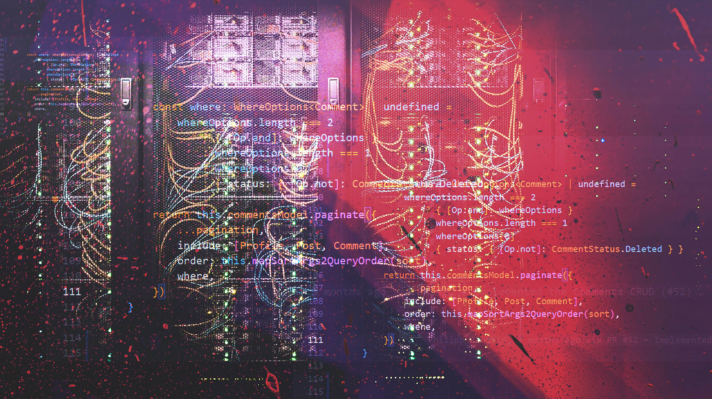

# Большой Толстый Апдейт

На самом деле он маленький и тощий, но — но это первая статья из регулярного цикла "а что вообще мы тут накодили". Будем приходить сюда и рассказывать про новые фичи, багфиксы, изменения в поведении сайта, наши планы на будущее и всё в таком духе

Мы релизнулись первого августа, и это было жарко — всё полетело к чертям, ничего не отработало как надо, команда с горящими жопами поднимала стенд, чинила отваливающуюся на каждый чих интеграцию с гитхабом, в общем — классика.

Поэтому когда мы разобрались с проблемами, что не давали проекту банально существовать — почти вся команда ушла хорошенько отдыхать. Этой статьи и не было бы, если бы мы готовили текущий релиз своими силами, но произошло чудо, к нам пришло сообщество, и сделало всё за нас.

А именно: я представляю вам **Светлую Тему** — вы можете нажать на свежепоявившийся тумблер `день / ночь`, и насладиться сайтом "Разрабы", раскрашенным в дурацкий, гумманитарский белый цвет, и перестать наконец ныть, что у вас болят глаза.

Строго не судите, уверен, будет пачка багов, но в целом пользоваться уже можно. Любой обнаруженный баг — тащите к нам в [ишьюс](https://github.com/razrabs-media/journal/issues). Да, туда же можно приносить и любые ваши пожелания по работе сайта — мы постараемся вежливо объяснить, почему не будем этого делать. Ну или будем, посмотрим.

За светлую тему стоит особо поблагодарить контрибьютера из сообщества — [Ninedev_i](https://twitter.com/Ninedev_i). Человек просто пришёл, посмотрел на макеты, и за пару дней решил боль, которая казалась нам нерешаемой. С багами по светлой теме, которые мы успели обнаружить, ему помогли [batyshkaLenin](https://twitter.com/batyshkaLenin) и [gkopylov1](https://twitter.com/gkopylov1).

Хорошенько поработали над комментами — поубирали мелкие баги, сделали анимации перехода к реплаю и к своему, свеженаписанному комменту — и всякие мелочи вокруг этого — почти всё силами тех же контрибьтютеров

Особое спасибо [batyshkaLenin](https://twitter.com/batyshkaLenin) — он сделал кучу работы связанной со всякими аппманифестами, сайтмапами и прочей фигней, чтобы мы стали поудобнее на мобилках и лучше индексировались. Так же начал прикручивать rss, которую вы зачем-то так настойчиво просите.

Ещё над мелочами со шрифтом при загрузге поработал [dmowski](https://github.com/dmowski) — за что ему большое спасибо.

[wadzari](https://github.com/wadzari) починил нам дурацкий баг с тегами статьи, которые склеивались и портили всем настроение!

Починили чертову тонну багов с вертской на идиотских мобильных устройствах, но ещё тонна осталась ждать следующих релизов.

Мы слышим и видим всё что вы говорите и пишете, и понимаем — проект ооочень далек от идеала. Поэтому в планах — большие работы над типографикой, улучшением читаемости (тут к сожалению одной разработкой не обойдешься, наши дизайнеры трудятся в поте лица), оптимизацией фронта. Наша большая боль — картинки к статьям лежат на гитхабе, своего бакета пока нет, оптимизировать работу с ними не можем — и это то, над чем мы сейчас работаем.

В общем-то мы как смотрели на вещи — мы проект сделанный разрабами для разрабов, поэтому должны быть близки к техническому совершенству. А потом имели прекрасную возможность убедиться, чего мы стоим на самом деле. Главная грузится сто миллионов лет, всё скачет и прыгает, мы облажались. Но, но — исправимся. Обещаем.

Другая большая боль — сраный домен. Мы взяли домен `.ru` еще до войны вместе с пачкой других, без задней мысли сделали его основным, а потом началась война, и домен .ru принёс нам совсем не те ассоциации, которых мы искали. Наш проект русскоязычный, но не российский, и последнее чувство, которое мы хотим внушать людям не из России — что этот проект не для них. Собираемся для начала переезжать на домен `.tech` — надеюсь это произойдёт в самом скором времени.

Так же мы работаем над тем, чтобы заопенсорсить бек. Нам не хватает инфобезных компетенций, чтобы понять, насколько это сейчас опасно, но мы с этим разберёмся — и будем ждать ваших пуллреквестов.

Продуктовый опенсорс — странная и необкатанная штука, но у нас он вроде завёлся — большая часть сегодняшних обновлений сделана руками людей из сообщества. Вы можете к ним присоединиться — [репозиторй фронта](https://github.com/razrabs-media/journal) открыт к совместной работе. С нашей стороны скажу, что если вы стали другом "Разрабов" — это двусторонняя история. Наши медиа возможности и вес в сообществе будет работать и на вас тоже — насколько это возможно.

Когда мы начнём наконец зарабатывать сносное бабло, мы подумаем так же и в сторону финансового поощрения контрибьютеров, но это, кажется, дело не близкого будущего.

На этом пока всё, спасибо что читаете и следите за нами, ещё большее спасибо что пишете нам ишью, и совсем уже запредельное спасибо за то, что пишете нам код. 

Заходите в комменты к этой статье и делитесь своими соображениями — люди, которые работают над медиа, будут их читать и отвечать.
