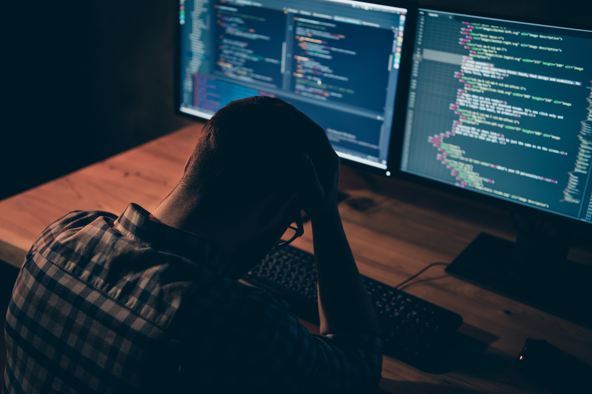

# С.Т.Р.Е.С.С. - Совет Тем Релоцировавшимся, Еле Сдерживающим Слезы

Представь ситуацию.

Тебе 22-25 лет, ты только что закончил(-а) институт и понимаешь, что вот он - момент, когда ты можешь всё. Тебе открыта дорога в дивный новый мир.

Получив диплом, решаешь посмотреть на мир. Но не так, как делают все: прилететь на пару недель на другой край мира, сфотографировать пару-тройку достопримечательностей, провести стереотипный вечер с местными жителями в стиле "чем живут наши с вами страны?", а затем осознав, что всё желаемое было изучено, благополучно отправиться назад. Туда, где всё знакомо. Туда, где дом и семья.

Нет, я говорю о большом, масштабном путешествии, испытывающем тебя на прочность, проверяющим твои навыки дипломатии, доброжелательности и умения "понять людей и разделить с ними жизнь". Я говорю об эмиграции.

Как человек, начавший международный миграционный путь менее года назад, и до этого имеющий опыт смены социума (переход в другую школу, переезд в другой город) думаю, что могу заявить от лица большинства мигрантов о мысли, которая всегда успокаивает на протяжении всего процесса.

Сформулировать её можно так: "В худшем случае, меня ждут дома".

С конца Февраля 2022-го я словно остался один. 

"Как ты смеешь такое говорить, если домов и семей лишились люди не в твоей стране?"

Считайте меня драматургом, но все мы чего - то лишились.

Всего за 2 недели я остался в незнакомой стране без денег, у меня умер близкий родственник, а затем произошел разрыв в отношениях, в которые я вложил 3 года и много усилий. Помимо прочего, на горизонте замаячил риск мобилизации, что не особо упрощает положение, а в стране, которой я нахожусь, при наличии проблем приходится иногда уходить от вопросов о гражданстве, чтобы разблокировать банковские счета или получить страховку для аренды жилья на пару месяцев побыстрее.

Меня никогда не пугал страх смерти, или боязнь акул. Мой единственный страх - всеобщее человеческое безумие, потеря осознанности и контроля. Для меня “Не смотрите наверх” куда больше фильм ужасов, чем “Пила” или “Кошмар на Улице Вязов”, поскольку события всегда склоняют чашу весов, либо в сторону порядка, либо в сторону хаоса. клишированно звучит, однако так мне искренне кажется.

Этот текст не несёт большой ценности с технической точки зрения, однако есть однозначная уверенность, что печатая его, я формулирую мысли в головах многих людей, которые не рассчитывали на такой исход, кто уезжал не потому что “хочется свалить из Рашки”, а кто несмотря на любовь к своей стране хочет масштабироваться, познавать мир и обмениваться опытом. В каком то смысле этих людей можно было назвать “непризнанными послами доброй воли”.

Однако реальность такова, что мы, обозначенные выше люди, оказались по итогу теми же беженцами, и вся наша высшая, как нам казалось, миссия на деле оказалась глупостью для небольшой группы наивных детей.

К лучшему ли это? Сложно сказать сейчас.

Однозначно можно прогнозировать, что определенный процент людей сломается и не привнесет в мир тех замечательных идей, некогда обуревающих сознание. Другие же только сильнее укрепятся в своих целях, и необходимости их донесения в массы.

Я всегда искренне полагал, что АйТи доступно всем. И со мной по сей день регулярно спорят самые разные люди, стараются переубедить, доказать мою неправоту.

Тут стоит вспомнить жизнеутверждающее творчество одного из наших современников - режиссера Брэда Бёрда, известного как автора мультика “Рататуй”. Готовить могут все, но великим поваром станут только те, кто несмотря ни на что приложит кучу усилий, не свернет с пути, и кому будет сопутствовать удача.

Эта заметка, поскольку статьёй назвать у меня язык не повернется. Направлена на то, чтобы морально поддержать тех, кто сейчас переживает кризис смыслов и ценностей. Зачем жить, если в любой момент всё может рухнуть, словно карточный домик?

Вы не одни, кто задаётся этим вопросом. Я здесь, с вами, по ту сторону интернета и мне тоже ничего не понятно.

И всё же я знаю, что продолжать жить стоит хотя бы потому, что просто хочется. Хочется вновь мирного неба над головой, хочется чтобы главной проблемой был недостаточно жирный оффер на работе, а главным счастьем - уверенность за то, что будущим поколениям достается не пепелище, а плацдарм для дальнейшей работы и развития.

А потому у меня есть совет для людей, которые остались без пути назад, по любой причине. 

Возможно, нам давно пора переосмыслить границы между государствами и начать воспринимать мир как единый, живой организм. Нет я не говорю, что нужно “смёрджить” все культуры в одну, так не получится. Скорее нужно для себя принять ценность собственной личности и стараться вне зависимости от места и окружения нести в мир то, что мы сами обязались нести.

Потому что ваш дом - Земля. И ваших участия и помощи ждут абсолютно везде, без исключений.

Счастья и удачи 💛
