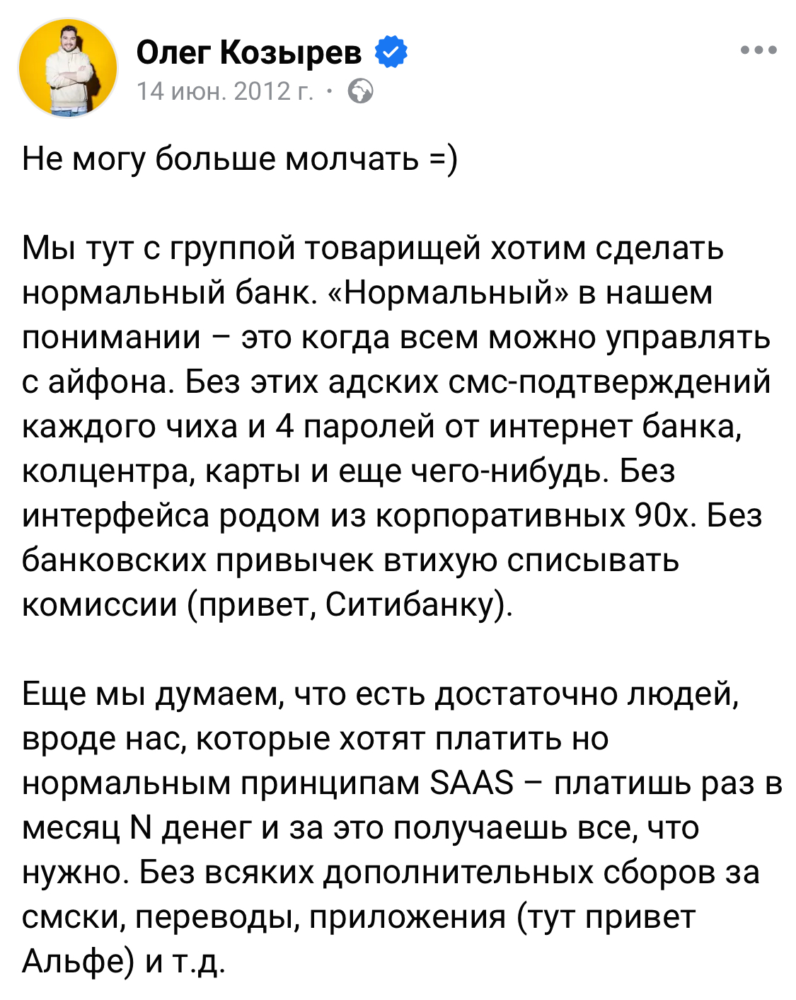
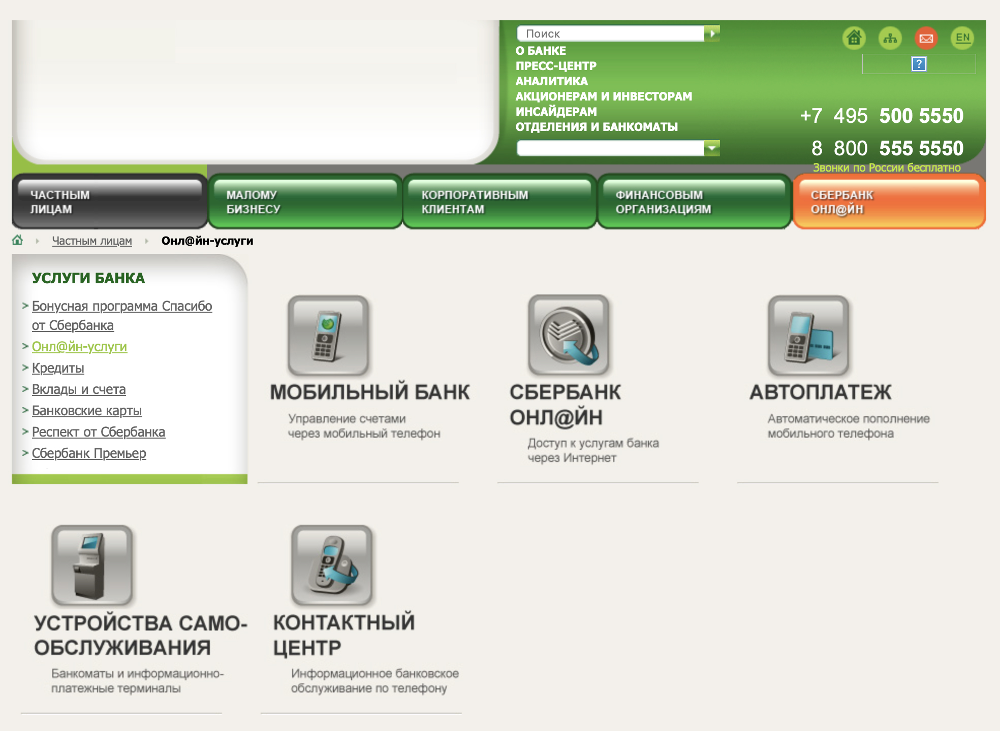
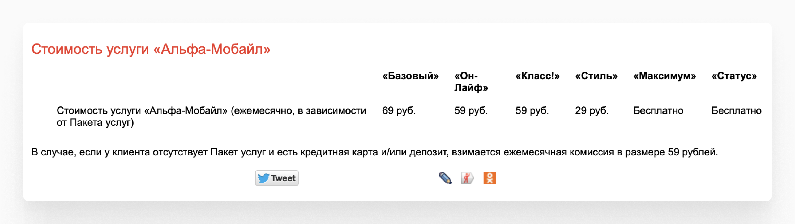
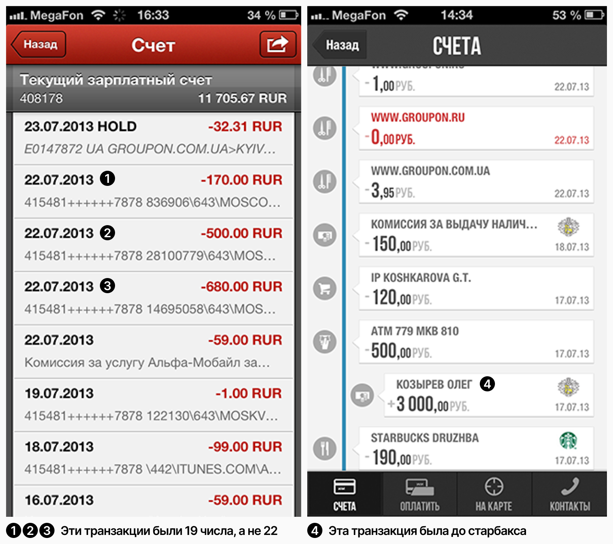
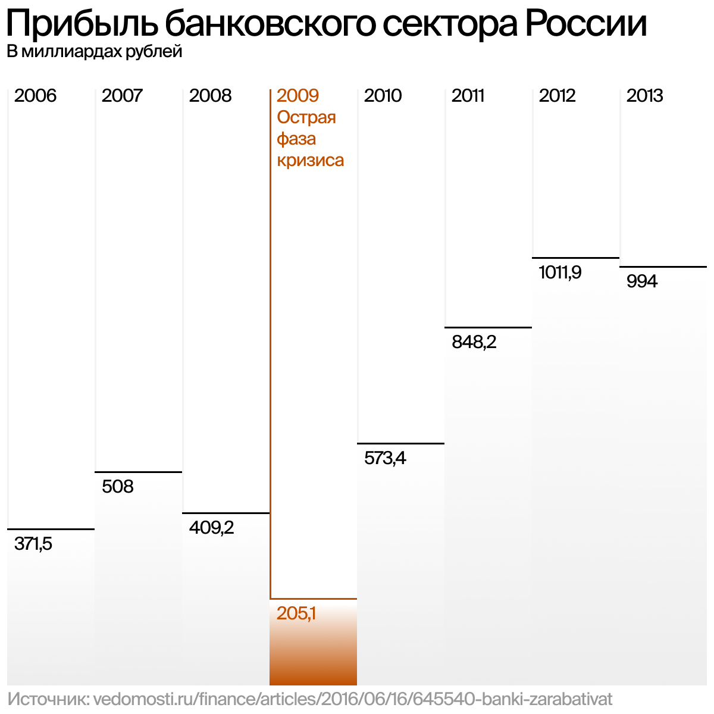
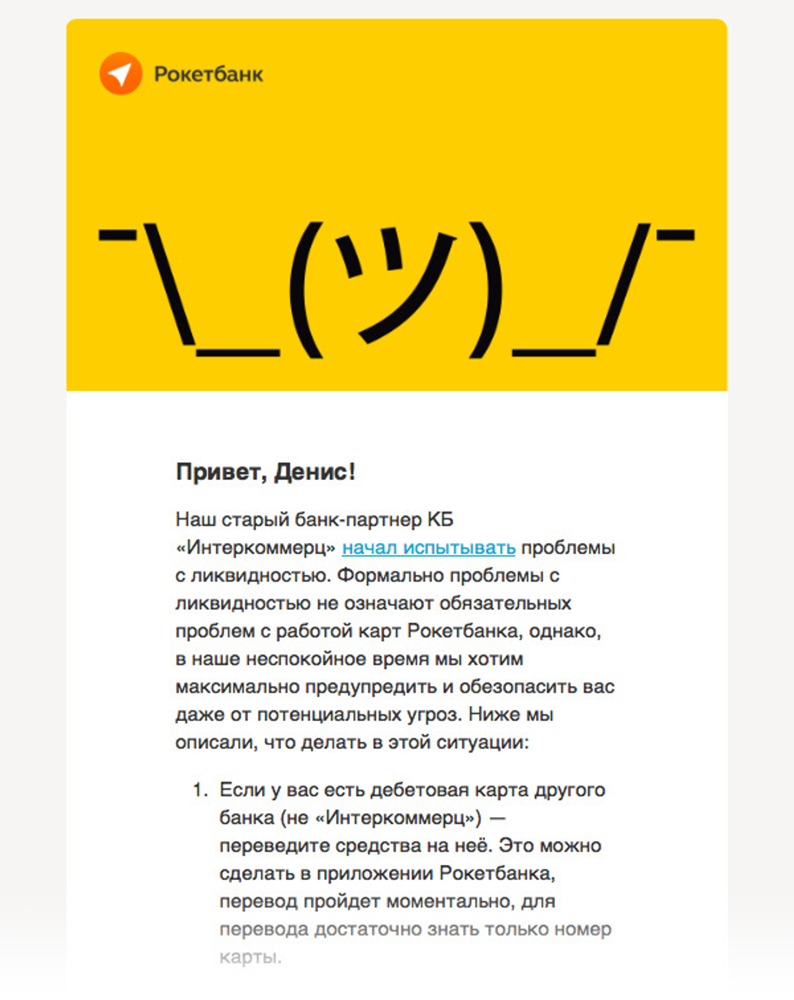
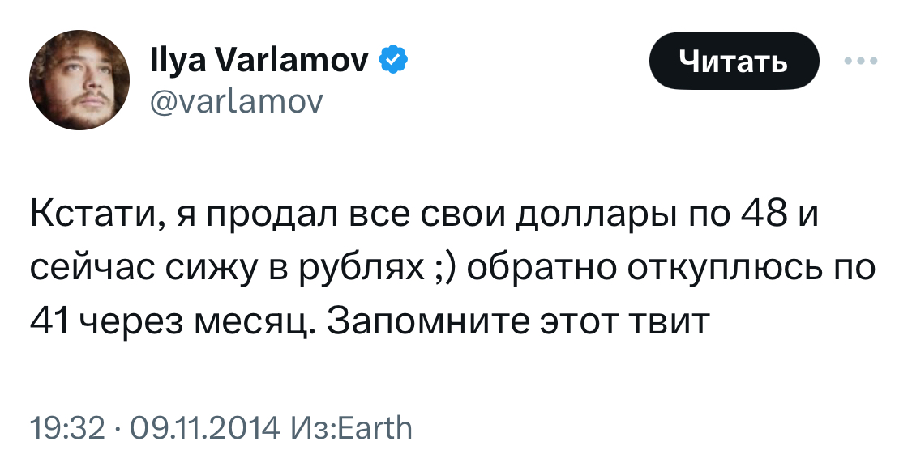
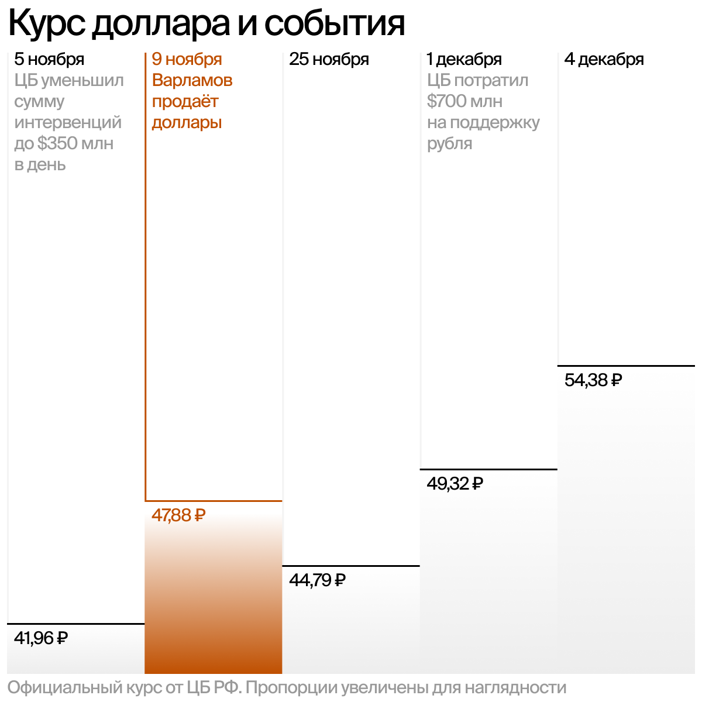
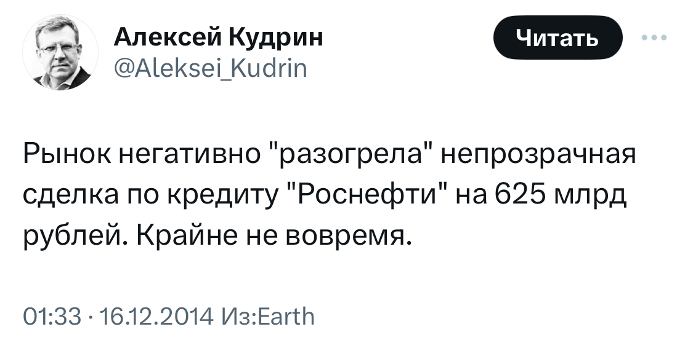
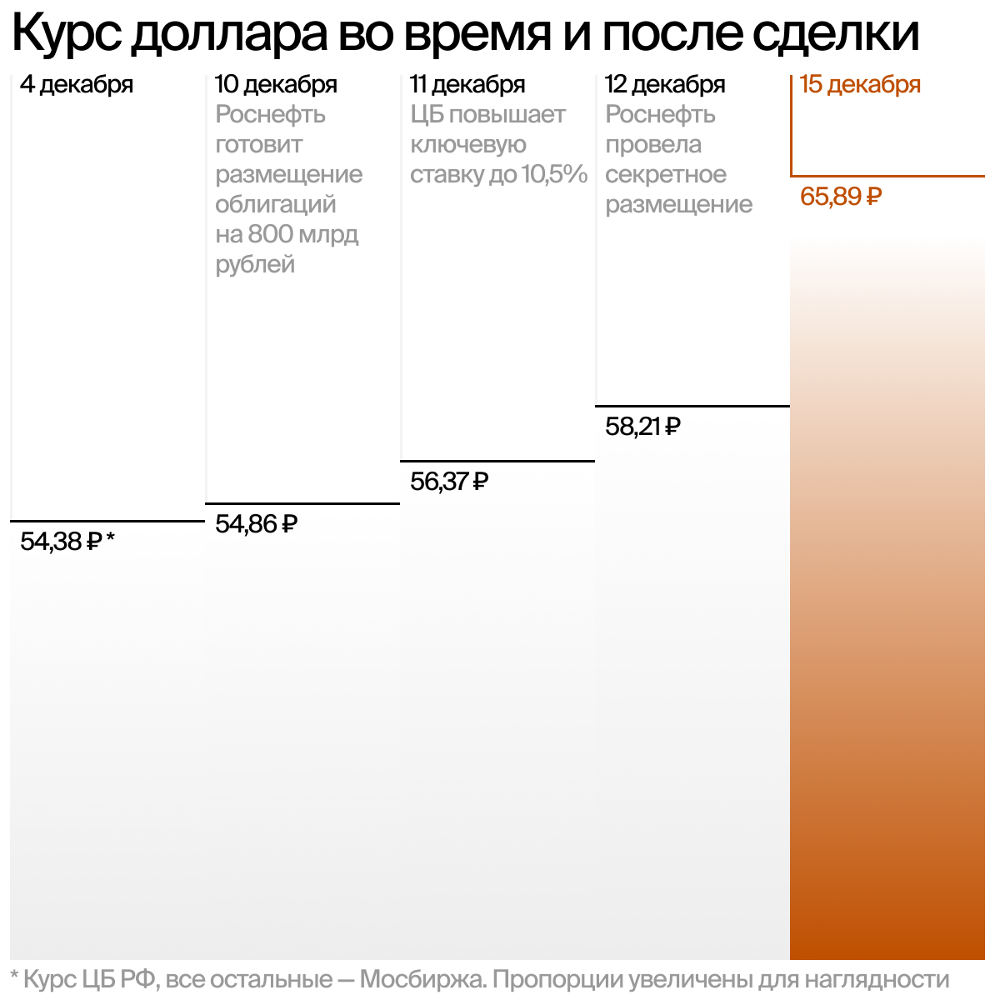

# Тихая революция. Как банки стали символом России 10-ых

> Автор статьи: [Максим Барбухин](https://twitter.com/Zaoprolaps), дизайнер интерфейсов

В 2022 году моим финальным босом стала частичная мобилизация, которая отлично легла на моё увольнение — в Ереван летел с голой жопой и без будущего. Я перестал понимать что к чему, но прилетев, сразу осознал, что банки тут какие-то плохие. Следующие три месяца я существовал довольно скучно, а выживать приходилось на 1400 драмм в день.

Наступил февраль — ночью очень драматично листаю фотографии из той старой жизни, с теми привычными проблемами, с теми привычными друзьями на расстоянии нескольких станций метро и с той привычной надеждой на будущее. Я разбит в слюни, а мой айпад лежит в соплях. Утром иду завтракать сигаретой в милый ереванский дворик с виноградной лозой. 

Вечером разговариваю сам с собой, чтобы сдвинуть пет проект с мёртвой точки. И в этом потоке у меня происходит щелчок — «Эссе. Почему Российский банкинг ТАКОЙ». Я бегу записывать заметку на том самом айпаде, а потом начинаю чувствовать тепло — запахло надеждой. Но откуда она здесь взялась? 

А как так получилось, что в такой авторитарной стране случился ТАКОЙ банкинг? Почему любой деревенский магазинчик принимает карты или переводы по номеру? Почему вы или кто-то из ваших друзей работает в банковской экосистеме? Почему Сбербанк занимается телемедициной и музыкальным стримингом, а в Тиньке есть Сторис? Откуда в Твиттере хейт заграничного банкинга и ностальгия по нашему?

Если отвечать коротко, то мы пропустили чудо — банки смогли не только изобрести инновации, но и распространить их по всему рынку. Впервые государственный институт не мешал этому процессу, а даже помогал нам в этом. Более того, этот госинститут — единственный, кто сумел сохранить свою независимость — Центральный банк. Синергия его независимости и наших способностей вылилась в тот уровень банкинга, к которому мы привыкли.

Но короткие ответы самые простые. Чтобы показать все острые углы и проблемы, я начну издалека: поговорим, что было 10 лет назад и по каким причинам банки начали трансформироваться.

Это цикл статей, который будет состоять из трёх частей. В этой, первой части, поговорим о том, с чего всё начиналось. Во второй я расскажу, кто строил банковскую трансформацию. А в третьей поразмышляю, что будет с банками в будущем. Стей тюнед.

# Начало 10-ых. Мобилки только рождаются, а банки заняты потребительскими кредитами

Четыре человека идут на последний бизнес-обед во Фрайдис на Артплее. Настроение вялое — 6 месяцев они искали идеи, у которых есть шансы выйти на IPO и глобальный рынок. Они искали консервативные рынки, которые можно раскачать с помощью IT: выйти на ювелирку и сделать площадку по типу Амазона или сделать мобильный сервис для приёма пластиковых карт, как Square. Но за это время они так и не нашли ту самую идею. 

Во время обеда кто-то из них предлагает отбросить мысли о глобальности и взять ту идею, которая протестирована и больше всего нравится. Если ничего не получится, то это будет хоть каким-то завершением работы. Все согласились и через какое-то время они сделали лендинг: «Рокетбанк избавит пользователей от проблем, присущих привычным банкам, — скрытых комиссий и медленной службы поддержки».

Основателей Рокета бесило, что им мешают пользоваться своими деньгами. Кому-то из них заблокировали карту заграницей, и он не смог дозвониться до поддержки. Кому-то отказали прислать выписку по почте. Они хотели сделать честный банк, который не будет запутывать клиентов тарифной сеткой и не будет взимать лишних комиссий. Плати 290₽ в месяц и пользуйся удобным приложением с дебетовой картой. 

С лендинга они получили конверсию в заявку около 10%, и теперь им нужно было найти партнёра. Они не могли запуститься без банковской лицензии, а на свою лишних денег не было. Значит, нужно просить помощи у банкиров, но эти классические дяди не понимали их идей — какая польза бизнесу от мобильного приложения и дебетовой карты?

# Мобильный банкинг в зачаточном состоянии

Банкиров смущала идея полностью мобильного банка. По некоторым данным, за 12 год их аудитория была около двух миллионов человек. Люди в основном пользовались вебом: делали крупные переводы или оплачивали налоги. А вот мобилке они не доверяли и делали короткие платежи: оплатить коммуналку или интернет.

С другой стороны, банкиры как будто сами не понимали, зачем это всё нужно. Посмотрите на страницу Сбера с онл@йн услугами — попробуйте найти карточку, которая поможет скачать приложение.

Если вы захотели нажать на карточку «Мобильный банк» — откроется страница USSD сервиса, чтобы с кнопочной нокии платить по кредитам с помощью СМСок. Если захотелось тыкнуть по карточке «Сбербанк онл@йн» — откроется лендос веб банка и уже на этой странице вам нужно найти ссылку на мобильное приложение. На крайний случай её можно найти в подвале.

Чтобы подключить приложение, нужно было топать в отделение банка и писать заявление на подключение к услуге «Сбербанк Онл@йн». Но даже если это сделать, придётся разобраться с тем, как получить логин и пароль для входа:

> Получите Идентификатор пользователя и пароль — через банкоматы и устройства самообслуживания Сбербанка России (данная операция проводится с использованием карты и вводом ПИНа), либо пароль — с помощью SMS-сообщений на Ваш мобильный телефон, подключенный к услуге «Мобильный банк»; Идентификатор пользователя — по телефону банка, указанному в ответном SMS-сообщении.

Короче говоря, как будто на рынке начала 10-ых концепция мобильного банка ещё не устоялась. Сбер его помещал на страницу веб-банка, как какой-то придаток, а Альфа просила за него деньги. Если вам нужно отправить деньги своему другу через айфон  — платите за приложение от 69₽ в месяц. Для клиентов с пакетом услуг «Максимум» и «Статус» — оно совершенно бесплатно. Но зато была урезанная бесплатная версия: можно было переводить деньги между своими счетами, смотреть на свой баланс и курс валют.

А что там с пользовательским опытом у приложений — ну у Сбера и Альфы он какой-то был. Если у вас была мобилка от Альфы и вы хотели узнать, сколько вчера потратили в рестике, то увидите такую подпись: «415481++++++7878 14695058\643\MOS…». А вот комиссии от Альфы, подписаны человеческим языком: «Комиссия за услугу Альфа-Мобайл». У Сбера было чуть получше, но не так хорошо, как у Тинька: если вы купили кофе в Старбаксе, они так и напишут, плюс добавят логотип в операции. 

Ещё приложения могли отображать транзакции в неправильной последовательности. Если верить маленькому исследованию ребят из Рокета, у них не получилось сделать так, чтобы они отображались в правильном порядке в большинстве приложений.

Почему у топовых банков было такое качество приложений? Можно предположить, что из-за отсутствия команд, которые занимались бы приложением, процессов и плохой коммуникации. [По словам Дмитрия Барыбина](https://ux-marafon.ru/reports/report?id=45), руководителя продуктов мобильных приложений Сбера, на момент 12 года хоть и был Айти отдел, но *«…обмен бизнес-требованиями проходил через ворд, через почту»*. Процесс работы занимал длительное время и могло получиться так, что обновление могло выйти один раз за год.

У Альфы было что-то похожее. [По словам Ивана Васильева](https://youtu.be/BCzD7LwIMWI?si=9Dgn_m0wpjB8Out9&t=1332), руководителя отдела дизайна банковских продуктов в Альфа-Лаборатории, Айти и Бизнес сидели отдельно друг от друга — *«Бизнес говорит: давайте что-нибудь сделаем прикольное… с карточками. Идёт в студию Лебедева и говорит, сделайте нам что-нибудь прикольное с карточками и отправляет это в Айти. Айти почесали, посмотрели и такие: ну мы как-нибудь будем делать. И делают на своё усмотрение»*.

При всех этих проблемах с приложениями и процессами классические дяди понимали тренд. Та же Альфа запустила в 13 году новый департамент с кросс-функциональными командами — Альфа-Лаборатория, которая занималась вебом и мобилкой. А Сбер потихоньку переходил на аджайл и менял процессы. Вполне было допустимо сделать полностью мобильный банк, но точно не в связке с дебетовой картой.

[По словам Алексея Колесникова, сооснователя Рокета, дебетовые карты на тот момент](https://music.yandex.ru/album/15187587/track/89536520) — витрина, их использовали, чтобы в день зарплаты вывести с неё деньги. Банкиры не понимали, как на этом можно построить бизнес, и рекомендовали выпускать кредитные карты. Сейчас это кажется странным, ведь дебетовки превратились в главную точку входа в экосистему банка. Тогда откуда такая рекомендация? 

# Основная бизнес идея банков — потребительское кредитование

Начало 10-ых — это эпоха, когда The Village выпускал статьи по типу «Куда съездить на выходные, кроме Берлина». Если иначе — Россия выходила из экономического кризиса 2009 года: росли доходы населения, вместе с ними рос ВВП, а безработица продолжала падать. Банковский сектор сразу после выхода из кризиса, начал бить рекорды по прибыли следующие 3 года подряд.

Откуда эта прибыль? Одна из причин — потребительское кредитование. Банки увидели сигналы, что экономика начала восстанавливаться и у них проснулся аппетит к риску, что вылилось в новый бум потребкредитов. На следующие 3 года они станут основной бизнес-идеей у банков.

Этот тип кредита можно даже выделить в отдельный «жанр». Если сейчас мы видим либо универсальные банки, как Альфа или экосистемные, как Сбер, то в ту эпоху была ещё одна категория — монолайновые банки, которые специализировались на кредитовании: Русский Стандарт или Хоум Кредит. И на этом они неплохо зарабатывали. В 12 году они получили рекордные прибыли за ту эпоху: первый получил 6,1 млрд рублей, второй 19,1 млрд рублей.

По словам Олега Тинькова — «*Гонку вооружений открыл «Хоум Кредит». Именно он развернул эту вакханалию*». Этот банк с 11 по 13 год «…*увеличил портфель на 200 с лишним миллиардов рублей*». Это не было особенностью Хоум Кредита, тогда большими темпами рос весь портфель потребкредитов. Например, только за 12 год он вырос на 60% и это в контексте того, что этот тип кредита ничем не обеспечивается. Для банков он является достаточно рискованным в сравнении с ипотекой.

Но банки были готовы рисковать. Они смягчали требования к заёмщикам: уменьшали необходимый пакет документов, снижали требования к возрасту и увеличивали максимальные суммы кредитов. Постепенно они начали выходить на тот сегмент, который считался аудиторией микрофинансовых организаций. Олег Тиньков в своей книге «Революция» указывает на ещё одну особенность той эпохи — «*Во многих банках в 2011–2012 годах риск-модели оценивали клиента как менее рискованного, если у него больше долгов*».

Банковский сектор в тот момент настолько в себя поверил, что велись [дискуссии об их вкладе в экономический рост](https://arb.ru/b2b/duty/kak_izmenilas_rol_bankovskogo_sektora_v_obespechenii_ekonomicheskogo_rosta_v_ros-1949942/) — «*Банки должны быть основным драйвером экономического роста, потому что у нас практически нет других серьезных источников роста*» — Гарегин Тосунян, президент Ассоциации российских банков.

# Подытог

Банкиры в то время высасывали всю прибыль из потребительского кредитования. А также они видели тренд на мобильные устройства и постепенно меняли процессы. Но их абсолютно не интересовал дебетовый продукт, который предлагал Рокет. И, скорее всего, они не понимали, как можно построить бизнес на комиссии и плате за обслуживание —  большая часть доходов была за счёт кредитов.

Основатели Рокета поставили себе дедлайн в полтора месяца, чтобы найти партнёра, который их поймёт. По словам Виктора Лысенко, сооснователя Рокета, [они общались с несколькими банками из топ 50, но им говорили:](https://bosfera.ru/bo/komu-vershki-komu-koreshki) *«Ребята, это все очень здорово, мы видим в этом будущее. Но как отдельный проект это нам не интересно. Приходите к нам, становитесь нашим департаментом»*. 

Они обошли около 10-15 банков и вели переговоры на уровне собственников и топ-менеджмента. В итоге они нашли того самого, который поделится лицензией — Интеркоммерц. Банк из второй половины топ 100, крепкий середнячок, который не был известен для обычных клиентов. По информации Ведомостей, в 2013 году банк [*«попадал в перечень кредитных организаций с высокой степенью вовлеченности в проведение сомнительных операций»*.](https://www.vedomosti.ru/finance/articles/2016/02/09/627891-dira-interkommertsbanka)

По словам Дениса Хренова, старшего вице-президента Интеркоммерца, они умели «*достаточно быстро и оперативно выстраивать отношения с аутсорсерами*». У них было партнёрство с Яндекс.Деньгами, выпускали для них виртуальные карты, или был совместный проект с РБК Money. Их устраивало, что они будут сервисным банком и при этом будут получать дополнительный доход.

Для Рокета была важна скорость работы и инфраструктура: «Для нас было принципиально важно, чтобы банк выпускал карты и имел хороший процессинг… В Интеркоммерце мы увидели ориентированность на результат, а не на создание регламентов и сбор совещаний. Прошел уже почти год с начала сотрудничества, и мы видим, что не ошиблись» — Алексей Колесников, сооснователь Рокета.

# Банки в кризисе жанра. Эпоха потребительских кредитов заканчивается

27 января 2016 года в Ведомостях вышла публикация: [«Банк «Интеркоммерц» испытывает проблемы с ликвидностью»](https://www.vedomosti.ru/finance/news/2016/01/27/625776-bank-interkommerts). Банк начал задерживать выдачу вкладов физическим лицам. Их можно было забрать, но приходилось ждать какое-то время. Сотрудник кол-центра банка объяснил, что эта ситуация связана с ослаблением рубля и желанием граждан приобрести валюту. Кроме этого, были проблемы с платежами для юрлиц: банк не проводил крупные операции. 

Вечером основатели Рокета прочитали эту статью, а уже ночью им начали звонить коллеги по банковскому сектору. Они предупреждали, что у Интеркоммерца *«серьезные проблемы, и счет идет на часы»*. Команда Рокета собрала ночью экстренное совещание, где они пытались решить, что им делать. Быстро перевести всех клиентов в новый банк-партнёр они не могли, значит, нужно предупредить их о проблемах с Интеркоммерцем.

Утром они составили текст письма, предупредили банк о своих намерениях и в обед разослали клиентам письма с *[«советом выводить деньги, причем независимо в какой банк»](https://archive.is/8yej5)*.

Через час Интеркоммерц обвиняет их в недобросовестном партнёрстве и отрубает Рокету шлюз. Перестают работать переводы в приложении, не получается расплатиться по карте или снять наличку. — *«На наш вопрос коллеги из «Интеркоммерца» ответили, что это было неслучайное отключение по указу руководства»*. Чуть позже банк попросит их опубликовать «письмо с извинениями» и «опровержение в РБК». В обмен банк восстановит работу приложения и карточек.

Но это не спасло Интеркоммерц. На следующий день Центробанк вводит временную администрацию, а через 10 дней отзывает у них банковскую лицензию. Это станет самым крупным страховым случаем в истории на тот момент — вкладчикам пришлось вернуть 64,3 млрд руб. А Рокету пришлось спешно переходить в Открытие, где они вместе с банком сделали схему, которая позволяет вернуть застрахованные деньги прямо из чата. Но через год Центробанк опять придёт за Рокетом — ЦБ введёт временную администрацию уже в Открытии. 

Почему у Рокета начались проблемы с партнёрами? Почему от обсуждения дизайна, бизнеса и процессов я включаю в историю Центробанк? Если просто, то 16 декабря 2014 года ЦБ поставил точку в потребительском буме, введя банки в полноценный «кризис жанра» и это вынудит их трансформироваться. Но по каким причинам этот кризис стал возможен?

# Банки перегрели потребкредиты в 2013 году — первая причина

Помните, как достигались высокие прибыли на потребительском кредитовании? Банкиры не обращали внимание на общую закредитованность. А ещё они пытались выходить на новые сегменты, постепенно снижая требования к заёмщикам. [В 2013 году кто-то из банков пытался выйти на стартаперов и сделать кредитную карту для них](https://web.archive.org/web/20130202230901/http://www.siliconrus.com/2013/01/kreditnaya-karta-dlya-startaperov/). Работник анонимного банка попросил помощи у читателей VC, чтобы *«сделать ее еще лучше».* Маркетинговые исследования привели его к тому, что нужно делать так, чтобы кредитные средства можно было получить без *«всяких 2-НДФЛ и составления ненужных доков за 15 минут»*.

Кредитная карта для стартаперов звучит как будто из другого мира, но банки могли позволить себе рисковать. Правда, к 13 году они перегрели рынок — если в 12 году он вырос на 60%, то в 13 всего на 30%. Продолжало расти количество наиболее закредитованных Россиян. На 1 июля 2013г. около полумиллиона людей оформило пять и более займов — с начала 2012 года их стало почти в два раза больше. По данным ЦБ, люди тратили треть своих доходов на погашение долгов. Правда, большинство людей, которые оформляли займы, были с доходом в 30-40 тысяч рублей. Любые проблемы с деньгами у этой аудитории могли конвертироваться в проблемы у банков.

За бурным ростом идёт коррекция, а ещё увеличивается сумма просрочек: 120 миллиардов — вот настолько они выросли в 13 году, против 22 млрд рублей в 12 году. Глава ЦБ, Эльвира Набиуллина, выступая в Госдуме, заявила, что в сегменте потребкредитов наметились элементы перегрева — *«Как результат, потребительское кредитование может стать не столько двигателем роста, сколько угрозой финансовой стабильности»* — [цитата по РБК.](https://www.rbc.ru/economics/18/12/2013/570414bb9a794761c0ce4ecf)

Чтобы адаптироваться к перегретому рынку Сбер и ВТБ переходили на ипотеку и уменьшали количество одобряемых кредитов. Альфа переходила на безрисковый транзакционный доход — пыталась обслуживать малый бизнес. Банки поменьше начали закрывать офисы и увольнять сотрудников. Но это была лёгкая коррекция, все просто снизили темпы, но продолжали придерживаться статус-кво. Кто-то всё равно верил, что рынок будет расти.

> Мы создали требуемые [от ЦБ] резервы и продолжаем работать, потому что верим, что рынок будет расти. Мы видим возможности предоставления услуг новым категориям клиентов. Наш бизнес не теряет рентабельность, мы продолжаем его развивать
**Михаил Задорнов, председатель правления ВТБ24. Источник: [РБК](https://www.rbc.ru/spb_sz/14/10/2013/5592a9779a794719538d0a92)**

 # Крымский камбэк — вторая причина

 Десятилетие экономического роста России ощущалось как данность. Но в начале 10-ых темпы роста только снижались, а в 13 году рост ВВП упал до 1,3%. Экономика медленно уходила в стагнацию, вместе с ней уходил и спрос на потребительские кредиты. В 14 году розничное кредитование пришло к насыщению одновременно вместе с новым кризисом — там кто-то камбэкнул Крым и полетели санкции.

[Если взять очень умную статистику, которую приводит главный управляющий директор Хоум Кредита](https://bosfera.ru/bo/strategii-optimalnogo-otstupleniya-s-roznichnogo-rynka-bezzalogovogo-kreditovaniya), то с 2012 года по 2014 только 3 крупных банка получили положительную динамику прибыли: Сбер, Тинькофф и Совкомбанк. Все проблемы, которые вырисовывались в 13 году, только усугубились в 14. Хороших заёмщиков становилось меньше, риски кредитования увеличились, росла закредитованность населения, а ЦБ вводил новые регуляции.

У банкиров запускается «кризис жанра». Основная идея последнего десятилетия — розничное кредитование, перестаёт быть таковой. Одни из крупнейших монолайновых банков, Хоум Кредит и Русский Стандарт, получили убытки в первом полугодии 14 года: убыток первого — 4,2 млрд рублей, у второго — 4,8 млрд. 

Как достать прибыль? Можно увеличить ставки по кредитам, но с 1 января 15 года ЦБ получит возможность устанавливать максимальный потолок по ним. Можно создать новые продукты, которые не связаны с потребительским кредитованием, но это сложно сделать, пока банк несёт убытки. Остаётся одно — стабилизировать качество кредитных портфелей. Иначе — выжить.

# Центробанк превращается в чёрный ящик — третья причина

Центробанк не мог дать каких-то однозначных сигналов для рынка. Евгения Письменная в своей книге «По большому счёту» пишет, что Эльвира Набиуллина *«нервничала, заявляла одно, а делала другое»*. Рынки не могли понять, что будет делать Центробанк. Можно сказать, что участникам рынка просто мешали работать и строить планы. 

**Неопределённость с интервенциями**

Помните доллар по 30? Эта красивая цифра достигалась с помощью того, что ЦБ продавал доллары. Грубо говоря, они устанавливали допустимую цену и если рубль выходил за этот предел, ЦБ продавал валюту, чтобы поддержать цифру. Например, в марте 14 года, когда прошёл референдум о присоединении Крыма, ЦБ потратил 22 миллиарда долларов, чтобы удержать рубль. А всего они потратили около 20% резервов с марта по декабрь на эту задачу. 

Такое сжигание резервов не нравилось ни ребятам из Минфина, ни кое-кому ещё — *«Набиуллина не определилась до конца, что дальше делать с денежно-кредитной политикой… Именно из-за неопределенности она продолжала интервенции, поддерживая рубль»* — пишет Евгения Письменная. 

Как это отразилось на рынке? Помните, как Варламов* планировал откупиться обратно через месяц?

Почему у него не получилось? Одна из причин как раз в непоследовательной политике ЦБ. Варламов*, скорее всего, предполагал, что они будут дальше заниматься интервенциями и не допустят резкого ослабления рубля. Если 29 октября они потратили почти $3 млрд на интервенции, чтобы удержать курс. То уже 5 ноября они заявляют, что не будут тратить больше $350 млн в день на эту задачу. А Варламов* продал свои доллары на локальном максимуме — с 5 по 9 ноября доллар вырос на 6 рублей по официальному курсу ЦБ. 

Правда, в ЦБ подчеркнули, что *«…в случае возникновения угроз для финансовой стабильности будут проводиться «дополнительные интервенции» на внутреннем валютном рынке» —* [цитата по РБК](https://www.rbc.ru/finances/05/11/2014/5459d8accbb20fc9b66edf94). И уже 1 декабря ЦБ продаёт $700 млн для поддержки рубля, выйдя за пределы установленной собой же суммы. Это не спасло рубль от новых максимумов. 

**Непрозрачная сделка с Роснефтью**

К ЦБ обращается за помощью Роснефть. Ей очень нужна была валюта, чтобы выплатить по международным долгам. Из-за санкций она не смогла найти валюту на внешнем рынке, а у российских банков её не хватало. Кто-то сразу отказывал, а кто-то давал обещания, что деньги получить можно, но не так быстро.

Роснефть попросил Центробанк об одном — включить их облигации в специальный список, который позволит заложить их банкам, а взамен получить валюту. ЦБ соглашается на эту схему и Роснефть размещает рекордную сумму облигаций для Российского рынка — 800 млрд рублей. Потребовалось всего лишь час, чтобы продать их все. И где-то два дня, чтобы провернуть всю остальную часть.

Эта сделка очень сильно ударила по репутации Центробанка —*«…не может быть ни доверия, ни уважения к председателю Банка России, которая проворачивает шитую белыми нитками операцию с якобы рыночным размещением облигаций "Роснефти"»* — [написал Сергей Алексашенко** для Коммерсанта](https://www.kommersant.ru/doc/2633850). Не сдержался даже Кудрин и он защитпостил в Твиттер, обвинив Роснефть в разогреве рынка:

Глава Роснефти, Игорь Сечин, решил кинуть ответочку:

> Как всегда, надо обратить внимание на тех, кто распространяет эти слухи… с интересантами и провокаторами надо разобраться, что это за люди, кто такие – Навальные***, Немцовы и Кудрины – и чьи цели они реализуют
**[Источник: РБК](https://www.rbc.ru/economics/16/12/2014/54902b082ae596df095ff860)**
> 

Никто не понимал, как Роснефть будет использовать эти деньги. Рынок начал спекулировать и думать, что деньги пойдут на покупку валюты — значит, это ещё сильнее ослабит рубль. 11 декабря Центробанк попытался успокоить рынок и поднял ключевую ставку до 10,5%, предупредив, что вернётся к этому вопросу в 2015 году. Но уже 15 декабря стало понятно, что это не помогло: рубль начал быстро слабеть.

# Центробанк ставит точку в потребительских кредитах

Поздним вечером 15 декабря Набиуллина созвала внеочередное заседание совета директоров, где они пытались решить, что им делать в этой ситуации. Остановились на том, что нужно поднять ключевую ставку с 10,5% до 17%. В час ночи 16 декабря они опубликовали пресс-релиз, где объяснили причины: возросли девальвационные и инфляционные риски. В этот день ЦБ также окончательно откажется от интервенций и рубль упадёт до 80₽ за доллар, что спровоцирует валютный кризис у банков.

Ключевая ставка в 17% поставила точку в потребительском кредитовании — для клиентов они стали слишком дорогими, а банкам теперь каким-то чудом нужно выплачивать 17% по вкладам. Прибыль нужно искать где-то ещё. 

Олег Тиньков и его команда были на стратегической встрече, когда ЦБ поднял ключевую ставку, но — *«Спустя два часа поняли, что обсуждения не выйдет и пора в банк – бороться с кризисом. В тот день он стал угрожать непосредственно нам»* — написал он в своей книге.

# Итог

**Перегретый рынок потребительских кредитов, события 2014 года и непоследовательная политика ЦБ в тот момент стали теми причинами, которые заставили банки трансформироваться.**

Как собрать этот итог, состоящий из букв, которые складываются в слова и предложения, во что-то осязаемое? Представьте, что всех этих фактов никогда не было. А теперь в этой фантазии возьмите первую попавшуюся банковскую карту — она будет кредитной. Откройте в вашей фантазии свои приглашения на собеседования — в них не будет спама от Сбера.

В этой фантазии вместо Сбера будет какая-то другая компания, скорее всего, чисто айтишная. Без этих компонентов банки остались бы классическим бизнесом и только финтех стартапы, такие как Рокет, медленно меняли бы статус-кво. В этой фантазии вы, скорее всего, не работаете айтишником в банке, потому что в ней нет места крупной банковской экосистеме со СберЗдоровьем, СберМаркетом или СберЗвуком. Все эти продукты размазаны по всему рынку и самостоятельны.

Эпоха банков, которые могли позволить себе заниматься исключительно кредитными продуктами, закончилась. *«Зависеть от одной бизнес-линии в стране потрясений опасно»* — пишет Тиньков в своей книге. После всех событий 2014 года банкиры вошли в «кризис жанра» и им нужно было меняться.

Главный управляющий директор банка Хоум Кредит, Андрей Спиваков, в 14 году [предложил возможный сценарий выживания для банков](https://bosfera.ru/bo/strategii-optimalnogo-otstupleniya-s-roznichnogo-rynka-bezzalogovogo-kreditovaniya) — повышать эффективность бизнес-моделей и наращивать масштабы бизнеса. Переводя на наш язык — оптимизировать бизнес и создавать экосистемы. И этот сценарий выживания стал настолько реальным, что даже Тинькофф Кредитные Системы превратился в «Тинькофф запишитесь на ноготочки через наше приложение».

Если в 2012 году банкиры не понимали идей Рокета: мобильный банк и доход с дебетового продукта. То в 2015 году стало понятно, что конкурировать только кредитными продуктами не получится, нужно наращивать другие доходы, например транзакционные. А чтобы их нарастить без действительно хорошего интернет-банкинга и мобильных приложений банкирам не обойтись.

На этом с первой частью трилогии всё, в следующих частях поговорим о том, кто строил банковскую трансформацию и что будет с банками в будущем.

P.S **Меня можно нанять.**
Я дизайнер интерфейсов, мидл+ с потенциалом на тимлида. Если в этой статье вы увидели мои навыки исследовать и работать с низкодетализированными задачами, меня можно взять на проектную работу. [Моё портфолио.](https://readymag.website/zaoprolaps/4618492/) Телега: [@Zaoprolaps](http://t.me/zaoprolaps). Почта: mbarbuhin@gmail.com

**Глянуть одним глазком продолжение статьи**
У меня на канале есть [заметка, которая ляжет в основу следующей части — «Самолёты и Необанки»](https://t.me/XPKCA/103)

---

**Особая благодарность Евгении Письменной, спец.корру агентства Bloomberg**
За основу последних блоков про ЦБ я брал её книгу [«По большему счёту»](https://bookmate.ru/books/w0BgrEpY)**.** Если вам интересно, что такое Центральный банк, как он появился и как развивался в России, я рекомендую прочитать

---

***Илья Варламов признан российскими властями иностранным агентом**

****Сергей Алексашенко признан российскими властями иностранным агентом**

*****Алексей Навальный внесён в перечень террористов и экстремистов Росфинмониторинга**

*Если вы хотите рассказать свою историю на «Разрабах» — добавляйтесь [в чатик](https://t.me/content_razrabs) и читайте закреп.*
