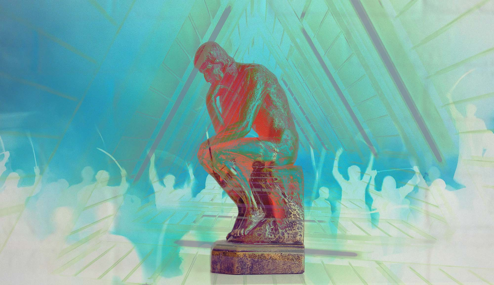

# «Айти — активная субкультура»: интервью Андрея Ситника про то, что в кругозоре разрабов должно быть место не только коду 

Фил и Андрей Ситник обсуждают политические дилеммы, новую айтишную этику, цензуру, и то, как использовать конфликты и споры на пользу сообществу.

Раньше я был убеждён — дело программиста это писать код, а культура, общественная жизнь и политика — это для тех, кто в них разбирается. Я начал что-то подозревать, когда столкнулся с блогом Андрея Ситника — видного разработчика, создателя PostCSS и известного опенсорсера. Ситник много писал и про политику, и про культуру и про жизнь. Андрей — гораздо больше, чем просто известный разработчик — он был активным участником русскоязычного сообщества википедии, внёс большой вклад в развитие русскоязычного комьюнити, и постоянно продвигает вещи, которые кода не касаются, но кажутся ему важными. Причём делает это на айтишную аудиторию. Сейчас, когда неизбежность политики кажется мне очевидной, я решил поговорить с ним о том, как он к этому пришел, что думает о сообществе сейчас, какие выходы для нас всех видит.

**— Насколько я понимаю, твоя известность и имя в айти появились изначально благодаря техническим достижениям. В какой момент ты решил, что хочешь быть намного больше, чем просто хорошим программистом?**

— Я с самого начала пришёл в айти как раз потому что там были не просто технологии.

В районе 2000-х я был школьником и случайно купил журнал Хакер (скорее всего [этот выпуск](https://xakep.ru/issues/xa/030/)). Там было много про особую философию, про образ мысли и жизни.

Это было прямо окрыляющее ощущение, когда ты нашёл своё сообщество. Моральные ценности, подход к жизни сразу совпал с тем, чего я хотел, но не находил в других молодёжных сообществах конца 90-х.

Я потом, в благодарность за мою карьеру, даже написал статью в журнал Хакер — [Цифровой шаббат. Можно ли прожить целый месяц, не прикасаясь к цифровым гаджетам](https://habr.com/ru/post/232789/).

Если подумать, из молодёжных культур 2000-х именно хакеры больше всех изменили мир сейчас, к 2020-м.

**— Как бы ты описал развитие сообщества за время, когда ты в индустрии**

— Слишком много процессов на разных уровнях, чтобы нормально ответить вне формата огромной статьи.

Но могу сказать, чем я особо рад — то, что сообщество создало отдельную систему обучения новых кадров, параллельную старой системе университетов. И наша система действительно работает хорошо. Классический пример, когда децентрализация, конкуренция и использование последних идей может совершать качественный скачок.

**— Много ли программистов поддерживали твои увлечения вне технологий?**

— Да, в русскоязычной культуре традиционно ценится общая эрудиция. Ещё с века 19-го и их интеллигентов-революционеров.

**— Программисты говорят: зачем мне читать художку и убивать время на сериалы, мне это ничего не даёт. Реально — зачем?**

— Любой проект, где больше двух человек — это уже политический процесс. Политические науки как раз много отвечают на те вопросы, которые сразу же появляются в коллективах. Особенно это заметно в опенсорс-проектах.

Убедить заказчика на рефакторинг, правильно собрать команду, разрешить конфликт табы-или-пробелы — всё это как раз гуманитарные знания.

Не могу сказать, что все сериалы помогают понять политологию. Но некоторые художественные книги и фильмы являются отличным дополнительным материалом к специальной литературе по гуманитарным знаниям. Это как учить язык по учебникам и смотреть фильмы из этой страны.

Когда я был школьником в 2000-х, то просмотр фильмов (тогда ещё из VHS-салона) был частью образовательного бюджета, наравне с чтением спецификации IP или книг по психологии.

**— Многие разрабы считают, что влиять на социальные вещи, прогресс и политику — не их дело. Вроде каждый должен делать свою работу. Что думаешь?**

— Известное всем слово «идиот» — это греческое обозначение тех жителей полиса, которые не занимаются политикой.

Справедливость существует только там, где её добиваются. Если какая-то группа не хочет лезть в политику (по понятным причинам, это всегда было и будет грязное дело), эта группа просто будет жить в менее справедливом для себя мире.

Никто не будет обеспечивать справедливость для тебя или твоей группы, если ты или группа не делает это сама.

Греки не просто так использовали оскорбление для тех, кто не занимается политикой. Если таких людей в полисе будет меньше определённого числа, то к власти придёт тиран.

Собственно, ровно это мы и наблюдали в России — теперь все собираем долгосрочные последствия нашей лени.

**— Я не знаю достоверно, как в зарубежном IT, но в русскоязычном мне кажется — доклады и активность не на технические темы на айтишных площадках у нас в какой-то мере табуированны. Сообщество, особенно раньше, реагировало на такие штуки достаточно негативно, и когда я был зелёным джуном, у меня в голове был устойчивый образ, что это «нетрушно», что крутые программисты — только те, кто говорит про код. Это так?**

— Я бы сказал, наоборот. У нас на афтепати гораздо чаще обсуждают вне-технические вопросы.

А вот со стереотипом о «нетрушно» точно нужно бороться. В современной науке все самые сложные вопросы находятся на стыке областей, потому что мы слишком долго изучали природу по линиям «областей знаний», которые сами и придумали. Так же и в индустрии — программист, который знает только программирование, думает в сторону, куда думают миллионы других людей. А вот на стыках можно найти много интересного.

**— Как по твоему, специфика индустрии (культура, деньги, нет субординации, международность) могла бы слепить из айти комьюнити социально активную субкультуру?**

— Мы и так активная субкультура.

Другой вопрос, что после бума стартапов мы многое потеряли. Больше стали думать о краткосрочном (зарплата сейчас), меньше о долгосрочных рисках (в Китае не очень приятно работать в айти по сравнению с Россией 2010-х).

Сейчас в России больше всего не хватает горизонтальных связей. Способности людей доверять друг другу исходя из опыта совместной работы. Все друг другу — волк. А это путь к диктатуре, так как при разобщении большинства даже меньшинство может его контролировать.

Тот, кто будет создавать эти горизонтальные связи — станет силой. Только главное не впадать в ошибку стартапов и не пытаться решить проблемы только приложением. Для сообщества нужна и социальная работа.

**— Увлечение кучей разных вещей не мешает тебе расти как технарю?**

— Только помогает.

Чтобы расти, нужно находится вне зоны привычного, где мозг всё знает. Если вариться только в какой-то одной области, то мозг быстро привыкнет и начнёт решать задачи на уровне автоматизма, не развиваясь.

Настоящее удовольствие и возможность прокачаться я получаю, когда попадаю в какую-то новую область. А они обычно находятся на стыках с чем-то другим.

**— Этично ли по твоему работать в русских айти корпорациях типа Яндекса?**

— Тут важно пойти с основ, так как многие вопросы этики люди применяют совершая базовые ошибки.

Не существует единой этики. Нельзя убедить человека сменить одну систему этики на другую. Подход «Ты должен поступать этично [по моей этике]» имеет мало смысла.

Мы можем лишь заметить противоречие в этической системе другого человека. Например, если кто-то выступает против «новояза американских левых», так как он за абсолютную свободу слова — но замолкает, когда в его стране вводят государственную цензуру.

Можно лишь рассказать про свою систему этики, предлагая другим людям её добровольно принять. Или же рассказать свои рассуждения для тех, у кого такая же этика как и у вас.

Другая проблема — идея о «всё или ничего», которая берёт начало вроде из той же культуры русской интеллигенции 19 века. Если ты нарушил хоть малейшее правило этики — тебя надо не слушать. Это ведёт просто к нигилизму и отсутствию какого-то движения, так как просто невозможно жить без нарушения этики. В духе «каждая страна аморальна, буду лежать и ничего не делать». Но то, что нельзя жить на 100% по этике, не означает что к этому не надо стремиться.

Моя этика в этой контексте такая:
1. Не существует коллективной ответственности — только личная.
2. Полное зло — Роскомнадзор и т. п.
3. Абсолютно недопустимо участвовать напрямую в агитации за войну. Во ВКонтакте был (а может и есть) виджет, который рассказывал только путинский взгляд на войну. В чём отличие человека, который его добавил, от других путинских пропагандистов?
4. Наличие подконтрольных ВК и Яндекса явно развязывает руки властям. Команда Рутуба хуже и без аналога Ютуб не банят. Но развивать сервисы из-за которых возможна внутренняя цензура — не прямое действие, скорее пассивная помощь.
5. Мне кажется, сейчас происходит крупнейший кризис в нашей стране. Просто стоять в стороне и ничем не помогать — не очень хорошо. Это как если ваш корабль тонет, а кто-то не помогает вычерпывать воду и развлекается. Но решать как помогать, сколько сил тратить и сколько развлекаться, чтобы силы восстановить — дело каждого.

Самое важное не что этично, а что нет — а как наша этика влияет на наше поведение:
1. Роскомнадзор и подобные — явно мои враги, которые делают мою жизнь ежедневно хуже.
2. Я лично предпочту не выступать на конференциях Яндекса и ВКонтакте — помогая им выстраивать свой HR-бренд, я помогаю режиму, что делает мою личную жизнь хуже.
3. Лично я не считаю людей, которые напрямую ответственны за военную пропаганду — хорошими людьми. Что им думать о себе — уже зависит от их этики.
4. Тех кто просто работает в таких гос. компаниях и думает только о себе — я резонно не считаю хорошими людьми. Травить отдельно не буду, но и помогать или вместе участвовать в проектах — не хочу. Если они уйдут из компании или начнут что-то делать из категории 5 — начну относиться хорошо.
5. К тем, кто работает, но думает, как компенсировать негативный вклад — я отношусь хорошо. Например, те кто внеурочно банит путинских ботов. Или делает что-то вне работы, что помогает остановить кризис.

Тут важно помнить, что это моя этика и моё отношение к людям.

**— Вообще в айти есть аморальные проекты?**

Степень аморальности можно оценить только относительно этической системы отдельного человека.

Для меня абсолютно аморальна деятельность всех ИТ-сотрудников в Роскомнадзоре. Работа NtechLab по созданию системы распознавания лиц в моей системе ценностей принесла на порядок больше зла, чем добра.

**— Ты лично смог бы работать с человеком, который полностью абстрагируется от этических вопросов, и просто пишет код?**

— Вопрос строится на неправильном восприятии этики, поэтому ведёт к неправильному ответу. Для любого человека важна этика — если у него напрямую украдут деньги, он же обидится. Под «абстрагируется от этических вопросов» мы обычно понимает 3 других случая:

1. Его этика отличается от нашей. Например, для него важнее домашние животные и все силы он тратит на них.
2. Его этика сильно противоречива. Например, он говорит, что против войны, но по факту ничего не делает.
3. Этика человека такая, что приводит к тому, что он ничего не делает.

Во всех трёх случаях я бы продолжил работать — не хочу скатываться к чёрно-белому миру. Но человека из категории 2 и 3 я бы лично уважал чуть меньше.

**— Много ли сил отнимает твой активизм? Споры с ботами и ватниками?**

Я бы хотел делать больше и больше полезного.

Споры с ботами я веду, чтобы выпустить пар — с ними легко спорить. Это не самое выгодное действие по ресурсам/времени — но хотя бы показывает сторонникам войны, что за ними нет абсолютного большинства и на любой площадке, включая чисто их паблики, есть противники их идеологии.

Больше осмысленно — это публикации в Однажды в Википедии и Лингвопанк, у которых неплохое количество читателей во ВК.

Но это не особо много — скорее я просто делаю то, что у меня получается хорошо.

**— Где ты научился так выдержанно спорить?**

Википедия. Я бы администратором Википедии и часто мирил авторов, которые не могли договориться, как писать статью.

Интересный момент, что такие конфликты делали статьи только лучше — конечно, если удавалось помирить людей так, что они начинали сотрудничать.

В политике, мне кажется, та же история. Нам не нравятся конфликты и ссоры, которые идут из политики. Но в долгосрочной перспективе получается лучше, чем когда «все согласны».

**— Что для тебя цензура? Отменить ватника — плохо?**

— Сложный вопрос на огромную книгу. И то — у человечества до сих пор нет на него ответа.

Есть простое понимание термина «цензура» — ограничение свободы слова от властей. Но мы давно уже используем термин в более широком смысле, говоря о любом ограничении свободы слова.

Проблема в том, что пока нельзя построить работающее общество на 100% отказе от цензуры. Например, анти-спам фильтр — это же такая цензура.

Моё правило — цензура должна быть последним средством и применяться, только если другого решения не придумали, а проблема острая. И постоянно нужно продолжать искать средства, как отменить эту цензуру.

Поэтому просто отменять всех людей с другой точкой зрения я бы не стал. Но иногда я могу человека заблокировать. Но только в каждом отдельном случае, объяснив сначала почему.

Например, я попросил не общаться со мной одного моего про-путинского знакомого, когда узнал что он читает только про-путинские источники. Мы начали с ним общаться, чтобы рассказывать друг другу разные идеи и их обсуждать. Но если он просто ретранслирует про-путинские источники, то я их и так читаю — его пересказ не несёт ценности. Вот если бы он сравнивал разные источники и рассказывал мне своё видение картины в общем — это было бы полезно мне, чтобы понять, как переубеждать таких же как он.

**— Как помирить поссоренное войной сообщество?**

— Его не нужно мирить. В здоровом сообществе всегда должен быть конфликт и какие-то точки дискуссии.

Идея спрятать конфликт «под ковёр» — опаснее конфликта.

Главное, чтобы конфликт развивался по правилам, чтобы люди продолжали коммуникацию и могли делать какие-то выводы.

Если, например, у вас проектная команда, то можете ввести правила в духе:
1. Про политику говорим только по пятницам
2. Кто перешёл на личность — проиграл и больше сегодня про политику не говорит
3. За любую угрозу — увольняем

**— Когда я спорю с родственниками, меня убивает, что они слово в слово повторяют тезисы своей пропаганды из телевизора. Я знаю эти тезисы, потому что мы предупреждены о них в интернете. Моих родственников убивает то, что я слово в слово повторяю тезисы, о которых их предупредили в их телевизоре. Откуда нам знать, что это у нас истина и добро, а у них пропаганда и ложь, а не наоборот?**

— Самый главный судья в споре — практика в реальном мире.

Раньше можно было спорить в какие цели страны нужно вкладывать ресурсы. Но сейчас оказалось, что власть не справляется даже с собственными целями.

Все эти «якобы западные ценности» (хотя тот же феминизм или нормально отношение к геям — пришло скорее из России) — они просто эффективны. Конечно, все политики — эгоистичные психопаты. Но в системах, где есть конкуренция и ответственность каждого за отсутствие результата — из тех же эгоистичных политиков получается более эффективная в долгосрочной перспективе система.

Для меня тоже важно распространение русской культуры (хоть и в рамках общего разнообразия) — но как раз тоталитарный режим не может этого дать в долгосрочной перспективе. И как раз поэтому разнообразие важно — те культуры, которые помогают другим, и сами лучше распространяются.

**— Ты тратишь много времени и сил, убеждая людей, распространяя свои взгляды и ценности. При этом, дело-то трудное, и далеко не всегда получается — получаешь ли ты от этого эмоциональную отдачу? Чувствуешь ли, что оно того стоит? И не бывает ли выгорания от такой деятельности?**

— Я люблю споры. Для меня это какой-то азарт.

Хотя может это моя вредная привычка?

**— Что хуже, айтишник, которому полностью плевать на политику и этику, или айтишник, который этим очень глубоко интересуется, но этика и политические взгляды у него людоедские?**

— Пока это всё этика, личные взгляды человека — их нельзя оценить.

Осуждать людей можно по результату. Пока опора именно путинского режима как раз на первых, на молчащих 80%, которые не хотят лезть в политику.

Я бы скорее пытался переубедить их. Но не оскорблениями и травлей.

**— На нашу площадку пришёл человек, который публично транслирует, на наш взгляд, людоедские ценности, и принёс нам хороший технический пост. Как бы ты поступил на нашем месте?**

— Именно в контексте сайта Разрабов — я бы оставил его текст, если именно в нём не транслируются людоедские ценности.

Потому что на публичных площадках лучше иметь минимум цензуры, и тут без неё можно обойтись.

**— Если бы ты работал в компании своей мечты, с прекрасными условиями и считал бы свою работу в ней делом своей жизни, но в какой-то момент она стала бы разрабатывать что-то, что по-твоему — жутко неэтично, и повлиять на это решение возможностей не было бы, как бы ты поступил?**

— Я бы ушёл. Это больше не компания моей мечты.

Принципы и ценности — тоже важные причины, по которым мы выбираем компанию.

**— Если бы все люди, работающие в индустрии, серьезно задумывались бы об этике и политике, и не разделяли это со своей работой, мир был бы лучше?**

— Вообще, интересная история, что айти всегда было связано в политикой.

Вспомните опенсорс, который начался чисто как политический проект. Это не только про авторское право. Возможность проверить исходники — в том числе, чтобы обезопасить себя от слежки.

Так что я считаю, что это в ДНК индустрии — думать о политике. И мы уже многое сделали лучше. Чего стоит доступ всех людей к хорошей криптографии.

Другое дело, что война и стагнация страны на фоне тоталитаризма показывает нам, что мы допустили много ошибок. Сейчас пришло время исправлять ошибки и думать, как их не повторить в будущем. Мне кажется, это можно сделать, если больше людей бы что-то делало, а не просто думало об этике.

**— Что бы ты сделал, если бы узнал, что одна из библиотек, которые ты используешь во всех своих проектах, написана и поддерживается командой убеждённых праворадикальных националистов?**

— Просто люди с убеждениями — ничего.

Но если сайт, например, пропагандирует ненависть к другому народу — то буду заниматься контр-пропагандой и попробую остановить их доступными мне политическими или техническими методами.

Делать лицензию с чёрным списком компаний, кому запрещено — не буду. Проблем это приносит больше чем решает (да и старый код уже доступен им).

**— Нужно ли чекать политическую позицию и взгляды кандидата на собеседовании?**

— Нет. Взгляды человека — внутреннее дело. Иногда даже полезно вежливо и культурно общаться с человеком других взглядов.

Но можно проверить, как он будет реагировать на конфликт взглядов с другим человеком. Или что если его не будут уважать из-за его взглядов. Если он будет реагировать агрессивно или не сможет жить с тем, что его не уважают и вне работы не общаются — то это уже действия в реальном мире, а не внутренние мысли.

**— В выборной политике говорят, что кандидаты сражаются не за сторонников друг друга, а за неопределившихся. Как думаешь, наша истерика и радикализация на фоне войны не работает против нас? Нет ли такого, что мы отталкиваем всех сомневающихся своим очень бинарным и однозначным взглядом на вещи?**

— Этот вопрос кажется из мира «до войны». Сейчас мир сильно изменился — не хватает именно людей, которые говорят правду прямо и называют вещи своими именами.

Отпугивают чаще другие вещи:
1. Радость над смертями солдат.
2. Эмоциональные репосты, которые распространяют очевидные вбросы.
3. Нежелание признавать свои ошибки и молчание по поводу военных преступлений другой стороны. 
4. Неумение перейти на язык вашего оппонента и потеря времени в мелких спорах о терминах.

**— Я лично знаю многих людей, которые имеют антивоенные настроения, но при этом скованы ужасом — боятся даже в узком кругу говорить об этом. Что им делать?**

— Бояться — это нормально. Все, кто сейчас пытается спасти Россию (особенно внутри страны) — действительно рискует.

Я пока вижу два ошибки:

1. Неоправданное использование риска. Лично я считаю, что мало смысла в том, чтобы стоять одиночный пикет (но может я не прав, если вы уверены что это лучший способ и у вас есть аргументы — продолжайте).
2. Нежелание брать даже самый малый риск. Например, у меня есть друзья, которые переехали в другую страну, но всё равно не постят — «а вдруг придётся ехать в Россию за апостилем (!)». Мне кажется усложнённая бюрократия — довольная небольшая проблема на фоне того, что происходит сейчас и что может начать происходить (в том числе для вас лично), если Россия сделает неправильные выводы из этой катастрофы.

**— Я глубоко переживаю происходящее, потому что глубоко вникаю и погружаюсь во всё это. У меня есть друзья, которые плевать на всё хотели, и просто живут свою жизнь — иногда я им завидую. Оно того стоит? Как с этим справляться?**

— Мне кажется мы тут неправильно воспринимаем ситуацию. Как будто есть что-то плохое и абстрактное, а они просто волнуются о личном счастье. Но война уже сейчас напрямую влияет на личное счастье каждого в России.

Мне такие люди напоминают другое. Вот в компаниях есть разработчики, которые не пишут тесты, не продумывают архитектуру, сиюминутно решают проблемы наложением сотней грязных патчей. То есть думают только про краткосрочные вещи — «как быстро я закрыл этот баг», вместо «как быстро я буду закрывать баги в течении 3-х следующих лет». Очень быстро проект таких разработчиков превращается в ад — всё постоянно падает, работать невозможно, баги растут как снежный ком, времени ни на что не хватает, так как время уходит на исправление бесконечного потока багов грязными хаками.

Люди, которые не занимаются политикой и думают только про «кусок хлеба» завтра — точно такие же. Их «кусок хлеба» послезавтра станет меньше из-за того, что они думали только о куске позавчера.

Плохо, что мы с ними в одной лодке. Но тут общество давно придумало решение. Уважение, как награда тем, кто думает о будущем. Мы уважаем тех, кто пишет тесты, думает об архитектуре. Таким людям мы даём внимание, ресурсы. Нам нужно продолжить так делать и в вопросах архитектуры и качества среды не только кода, но и мира вокруг.