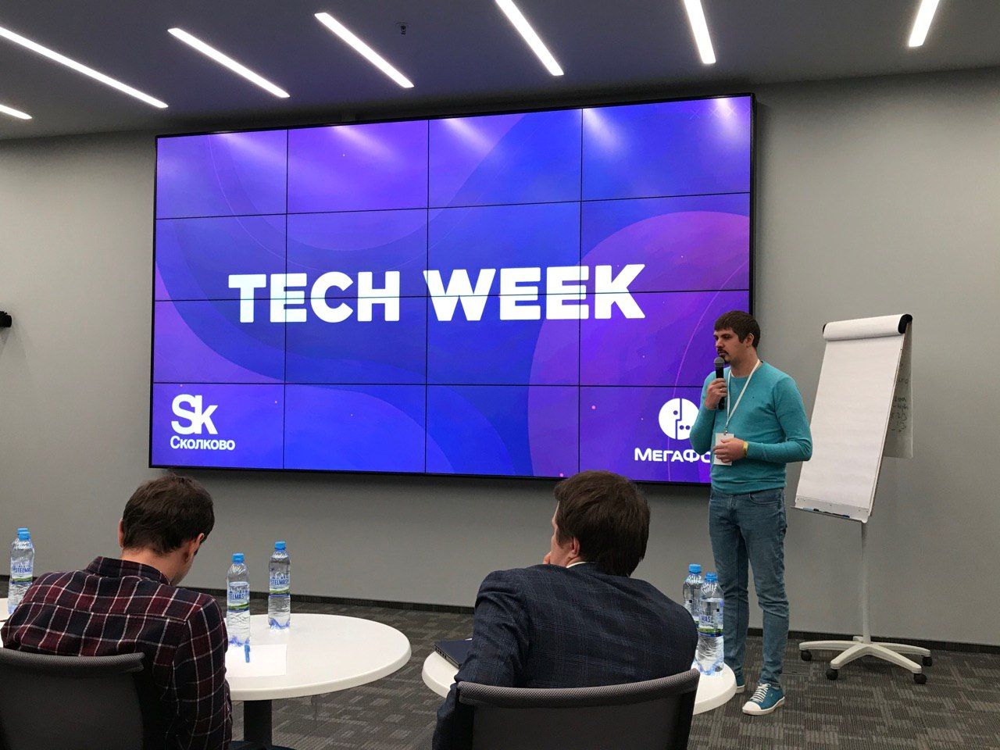
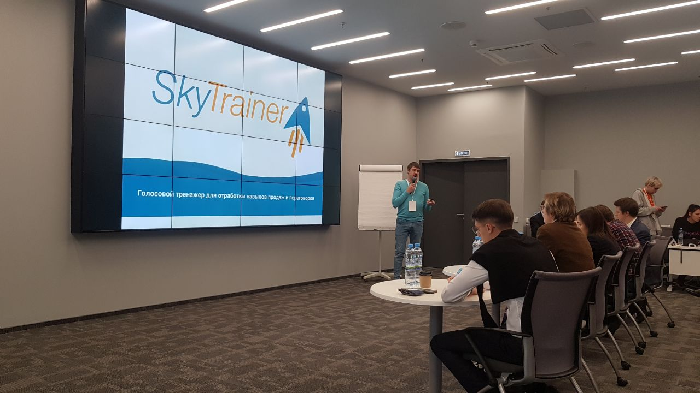
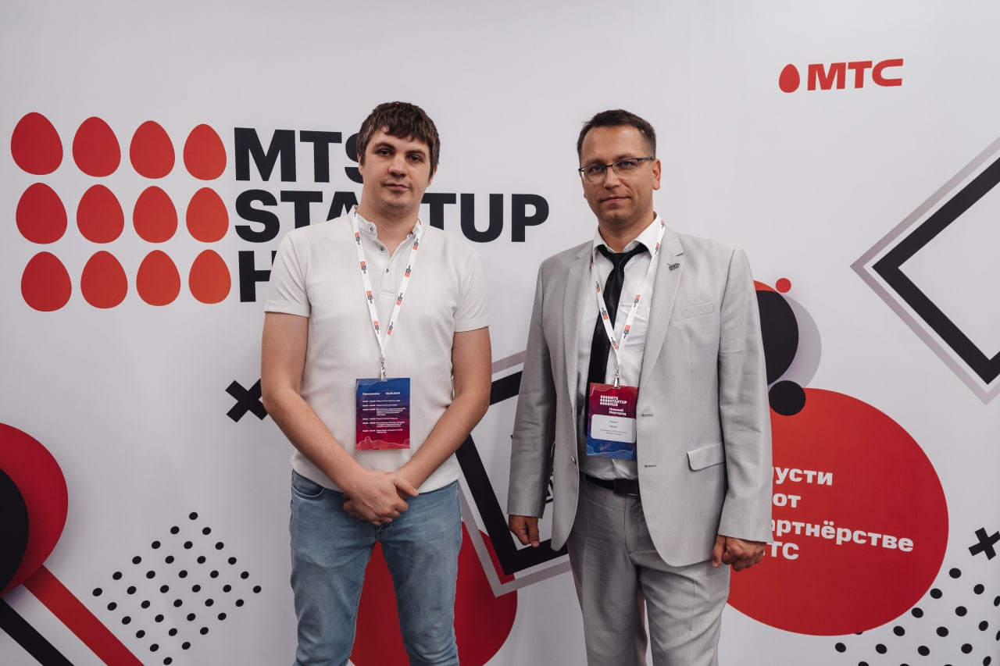

# Как я разработал симулятор продаж и деловых переговоров SkyTrainer, который теперь обучает сотрудников крупнейших компаний страны.

Меня зовут Алексей Балакирев, я предприниматель. И я создал тренировочный онлайн-центр SkyTrainer, работающий на основе искусственного интеллекта. Разработка активно используется для обучения специалистов из колл-центров и отделов продаж, помогает оптимизировать процесс адаптации стажеров, сократить текучку кадров и повысить объем выручки компании.

> Автор статьи [Алексей Балакирев](https://vk.com/skysellerpro)

**С какими вызовами обычно сталкиваются руководители контактных центров и отделов продаж?**
Перед руководителями в колл-центрах и отделах продаж обычно стоит ряд проблем, связанных с сотрудниками. Неумение специалистов эффективно общаться с клиентом и продавать, недостаточно качественное обслуживание, потеря лояльных клиентов, низкая конверсия звонков в продажи, отсутствие навыков работы в напряженных ситуациях/со сложными клиентами, хронический стресс/выгорание у специалистов и текучка кадров — страшный сон любого руководителя. У топ-менеджеров возникает закономерный вопрос — что с этим делать?

**Нестандартный подход к обучению специалистов по работе с клиентами**
Благодаря большому опыту в продажах и айти-разработках мне удалось найти профессиональное комплексное решение.

Чтобы автоматизировать процесс обучения специалистов в сфере продаж и упростить работу руководителям, я разработал тренировочный онлайн-центр SkyTrainer. Проще говоря, это симулятор продаж и деловых переговоров с выдачей индивидуальных рекомендаций сотруднику, как улучшить его общение с клиентом. Платформа SkyTrainer позволила сделать процесс обучения специалистов максимально интерактивным и увлекательным.

**Как создавался SkyTrainer?**
Я проделал длительный путь в сфере продаж, прежде чем создать SkyTrainer, на личном опыте изучил от и до психологию клиента и принципы экологичных продаж. Научился выстраивать эффективную коммуникацию с людьми и доносить до них ценность своего предложения, находя индивидуальный подход к каждому клиенту.

Все началось с того, что в 18 лет я на 3 года улетел в Турцию, где продавал экскурсии.

Впоследствии я пробовал себя в разных направлениях, но понял, что хочу связать свою жизнь именно с продажами. Какое-то время работал в сфере наружной рекламы. А когда понял, что реклама активно переходит в онлайн, устроился в digital-агентство, где руководил отделом продаж.

Когда работал директором по продажам в рекламном агентстве, с удовольствием проводил корпоративные тренинги, пробовал себя в роли наставника, набирался всё больше опыта в сфере обучения специалистов. И со временем разработал свою методику обучения сотрудников отделов продаж и колл-центров.

Так возникла идея создания проекта SkySeller. Это платформа для автоматизации контроля и повышения эффективности работы удалённых сотрудников в сфере продаж и маркетинга.

Я начал активно развиваться в сфере айти-технологий для бизнеса, обрастать новыми связями. Меня заметили и пригласили на встречу в "Сбербанк" в Нижнем Новгороде. Я представил свой проект SkySeller, где его по достоинству оценили, но дали понять, что нужна другая программа, которая бы закрыла потребности компании.

Нужен был проект, который бы снизил уровень стресса у специалистов, научил их работать с возражениями и даже агрессивными реакциями клиентов. Так появилась демо-версия платформы SkyTrainer.

Гипотеза была такая — если специалисты много раз переживут самые негативные сценарии взаимодействия с клиентами, то в будущем это поможет снизить у них уровень стресса и выгорания. Гипотеза сработала, уровень стресса у специалистов снизился.

Продукт активно улучшался и дорабатывался, добавлялся новый функционал: для B2C и B2B клиентов, для работы разных отделов компании и разных ниш. Разработчики внедрили функции имитации видеоразговора и переписки. Если сначала функционал был направлен на обучение специалистов контактного центра, то со временем его адаптировали и для обучения продажников.

**Как это работает?**

[SkyTrainer.pro](http://skytrainer.pro/) представляет собой платформу с тренировками, имитирующими общение с реальным клиентом через звонок, видеосвязь или переписку. Виртуального клиента невозможно отличить от настоящего человека. Один разговор с роботом эквивалентен опыту одного разговора с реальным клиентом!

Представьте, вместо скучных лекций, подкастов и заучивания скриптов стажеры словно попадают в игру и легко нарабатывают навыки в интересном им формате. Со стороны это выглядит так, будто вы просто разговариваете по видеосвязи с клиентом и пытаетесь корректно отвечать на его вопросы и претензии для перехода на следующий уровень. Можно не бояться ошибиться, ведь клиент не настоящий, и это не принесет ущерба компании.

Бывает, что сотрудник разговаривает слишком тихо, невыразительно или, наоборот, быстрее, чем нужно, что негативным образом сказывается на результатах его работы. В процессе обучения система при помощи искусственного интеллекта анализирует тренировки пользователя. И на основе этого генерирует ценные предложения по улучшению качества обслуживания клиента. [SkyTrainer](http://skytrainer.pro/) считывает ошибки сотрудника в общении с клиентами и подсказывает, как исправить их, вплоть до того, какой интонации и темпа речи стоит придерживаться, чтобы клиенту было комфортно воспринимать информацию. Можно сказать, что [SkyTrainer](http://skytrainer.pro/) — не просто тренажер переговоров, а виртуальный наставник для стажеров и специалистов любого уровня.

Скрипты общения с клиентом можно использовать как свои собственные, так и доверить эту работу компании [SkyTrainer](http://skytrainer.pro/). Мы с командой самостоятельно разработаем сценарии взаимодействия с вашими клиентами, озвучим их и встроим в систему.

**О сильных сторонах продукта SkyTrainer**
Мы с разработчиками тренажёра SkyTrainer приложили все усилия для создания качественного и эффективного продукта. У платформы много возможностей.

**Робот в точности имитирует реального клиента**
Робот реагирует на каждую реплику, интонацию, громкость и скорость речи. Его эмоции соответствуют эмоциям реального человека, а поведение меняется в зависимости от действий пользователя. Если вы будете недостаточно вежливы или убедительны в разговоре с роботом, он начнет проявлять свое недовольство посредством слов и мимики.

**Тренажёр поддерживает все форматы диалога**
SkyTrainer позволяет прокачать навыки видеопереговоров, телефонных разговоров и деловой переписки, что особенно актуально в эпоху мессенджеров. Программа выделяет орфографические ошибки и помогает запомнить правильное написание слов.

**Разные режимы тренировки**
Приложение можно настроить под себя. Предусмотрены следующие режимы: тренировка с подсказками, тренировка  по стадиям, экзамен без подсказок, и режим с ручным управлением. Все зависит от цели тренировки: изучить новый материал, повторить его или проверить, насколько хорошо усвоена полученная информация. Гибкость настроек позволяет выбрать режим, при котором исключается зубрежка и прокачивается навык импровизировать, не теряя суть.

**Платформа максимально автоматизирована и развита функционально**
Интерфейс интуитивно понятен и в системе предусмотрено всё для комфортного и эффективного обучения. Во время диалога пользователь не отвлекается на нажатие кнопок.

**Тренировка визуальной памяти**
SkyTrainer может имитировать внутренние CRM-системы компании и рабочий стол специалиста, что позволяет развить сотруднику навыки использования внутреннего ПО.

**Геймификация процесса обучения**
Процесс обучения чем-то напоминает прохождение игры с переходами на новый уровень. Пользователь может отслеживать на каком этапе сделки с клиентом он находится, наблюдать свои показатели и регулировать их, что повышает интерес и мотивацию к обучению.

**Гибкая рекомендательная система**
Используется инновационная система выдачи рекомендаций на основе ИИ.
[SkyTrainer.pro](http://skytrainer.pro/) анализирует внятность, скорость, эмоциональность и уверенность речи, а также навыки письма: пунктуацию, орфографию, скорость.
Рекомендательная система выдает отчет на основе анализа 26 критериев!

**Есть мобильное приложение**
Доступна не только браузерная версия, но и мобильное приложение. Это дает возможность заниматься в любом месте (в дороге, в парке, на отдыхе) и с любого устройства с выходом в интернет.

**SkyTrainer в цифрах**
Компания SkyTrainer активно сотрудничает с крупнейшими корпорациями страны. Обучение на платформе прошло более 100 тысяч сотрудников.

**Результаты сотрудничества SkyTrainer с партнерами в цифрах:**
**Мегафон**
На **5,6%** увеличили конверсию звонков в продажи, подключив к обучению на тренажере менеджеров по продажам. Повысили выполнение плана продаж на **20%**. Все благодаря улучшению навыков деловой коммуникации у специалистов.

**МТС**
**В 2 раза** сократили период адаптации и выхода в должность стажеров контакт-центра, автоматизировав процесс подготовки к работе с клиентами. Было разработано около 100 различных сценариев разговоров с клиентами.

Уровень подготовки стажеров после двух месяцев обучения на тренажере SkyTrainer соответствовал уровню сотрудников, работающих в колл-центре более месяца.

Кроме того, мы работали с такими компаниями, как “Ростелеком”, “Альфа-Банк”, “Росгосстрах”, “Тинькофф”, “Теле2”, “Росбанк”, “ГазпромБанк”, “Yota” и мн.др.

**У нас есть и другие проекты!**
Помимо SkyTrainer мы с командой запустили еще два социально значимых и перспективных проекта, которые активно развиваем — SkyKids и SkySocial.

**Проект SkyKids** создан с целью помочь детям и подросткам решить проблемы с социализацией, научиться выстраивать здоровые отношения с окружающими людьми, отстаивать личные границы и защищать себя.

SkyKids для детей и подростков была разработан с учётом более 300 социальных исследований и разбора тысяч конкретных случаев, с которыми родители и дети обращались к психологам.
Общаясь с роботом-тренажером, ребёнок проходит подготовку к непростым для детской психики жизненным ситуациям: травля в школе, низкая самооценка, проблемы с успеваемостью в школе, конфликты с окружающими.

**Проект SkySocial** позволяет повысить качество социальной жизни,  конкурентоспособность и профессиональную занятость людей с инвалидностью на рынке труда.
Голосовой тренажёр помогает улучшить навыки общения у людей с физической и ментальной инвалидностью. А также позволяет овладеть следующими навыками: деловые переговоры по телефону, деловая переписка, онлайн-презентации, навык успешного прохождения собеседований.

**Как больше узнать о проектах?**
Чтобы быть в курсе новостей о наших проектах и ближе с нами познакомиться, вы можете подписаться на нас в Инстаграме ([skytrainerpro](https://instagram.com/skytrainerpro?igshid=MzRlODBiNWFlZA==), [skysocial.pro](https://instagram.com/skysocial.pro?igshid=MzRlODBiNWFlZA==), [skykids.pro](https://instagram.com/skykids.pro?igshid=MzRlODBiNWFlZA==)). Также у нас есть Телеграм-канал, который мы активно развиваем и наполняем интересным и познавательным контентом ([skytrainerbusiness](https://t.me/skytrainerbusiness)).\*\*
