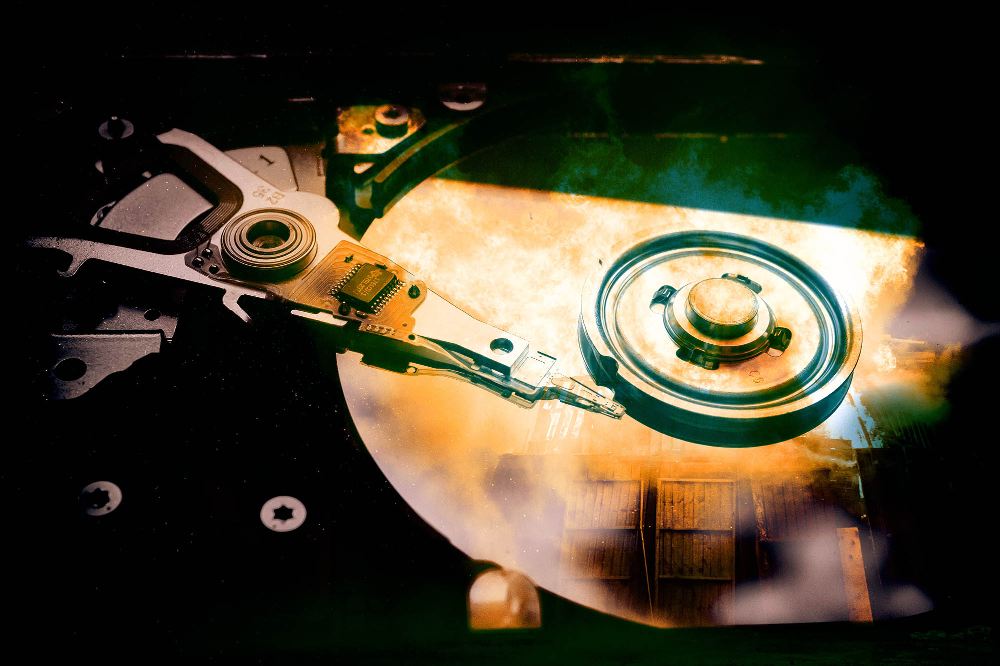

# Ультимативная взаимопомощь — единственный шанс снгшных айтишников жить как раньше

Три года назад я приходил к IT сообществу — тогда я делал это через Хабр — и писал: «Мы должны стоять друг за друга горой. Разработчики это сила, с которой бизнес и государство не могут не считаться, мы должны защищать себя и свои права вместе — потому что можем». Меня и тогда никто особо не слушал — ну зачем, у разрабов и так все хорошо, нам хорошо платят, нас любят, о нас заботятся. Не за что нам бороться, всё есть. Это и тогда было не так: айтишников несправедливо увольняли, кидали на деньги, унижали на собесах и на работе — просто не так сильно и часто, как всех остальных. 

В те славные деньки проблемы айтишников выеденного яйца не стоили — это были проблемы людей, у которых всё очень хорошо. Когда началась война, когда привычный мир сошёл с ума, перевернулся и превратился во что-то совсем другое, чужое и злое — вот тогда у нас начались проблемы. Я не первый день в индустрии, не первый день в сообществе — у меня очень много хороших друзей и знакомых. Почти все они столкнулись с проблемами, к которым были не готовы. Мой братан, Андрей Кузьмин — он же бывший батл репер Лёха Медь, а сейчас — фуллстек разраб — находился в день начала войны в Латинской Америке. За несколько дней он остался без работы, без сбережений, с нерабочими банковскими картами и невозможностью ни вернуться, ни остаться жить в той стране, где находился.

Наш хороший друг Лёха АйтиБорода с конца 2021 года жил в Киеве — он переехал туда из Беларуси, сбегая от лукашенсковских репрессий — и вот, перебрался, долго обустраивался, сделал крутейшую студию — но и из Киева его погнали. Только на этот раз ракетами и бомбами. История, как он, похватав всё необходимое, в полной неопределенности уезжал в Польшу уже совсем не похожа на старые добрые проблемы айтишников. Всё, ребята, началась настоящая жизнь — не в уютненьком пузырике, как раньше — в настоящем мире, в таком, какой он есть, и всегда был — для всех, кроме айтишников.

Мир, в котором твоя проблема — не лишние $2k к офферу, а что из огромной кучи любимых и важных вещей поместится в рюкзак. Мир, где твоя проблема, это как пережить расставание с самыми близкими людьми на совершенно неопределённый срок. 

Когда-то невероятно давно, в другой реальности, мы часто спорили и дискутировали с Ильёй Климовым — у нас разные взгляды на многие вещи в IT, и я воспринимал его, как такого, постоянного оппонента. Он даже был в какой-то момент моей проблемой. Сегодня моя проблема в том, что я просыпаюсь, и читаю новости о Харькове, в котором Илья Климов прямо сейчас живёт. И ведёт кстати свою деятельность — под обстрелами, в условиях кромешного хаоса и полной неопределенности — продолжает писать код, учить людей, делать стримы. Только теперь к этому ещё добавилась куча волонтёрской деятельности. И да, риск умереть — вообще в любой момент. Тут уже и вместимость рюкзака для любимых вещей покажется смешной проблемкой из старого мира, да?

В день начала войны на одной моей работе происходило вот что: два коллеги из Украины наводнили рабочий чат обсуждением этого кошмара, овнер проекта ливнул, потом они создали себе отдельный чат, а все рабочие переписки так и остались висеть в моём телеграме. Никто ни с кем не попрощался, никто ничего не написал, бизнес просто исчез за один день. За этой работой, как домино, полетели в пизду и все остальные мои дела. Кое-как, с грехом пополам, я восстановился — но то я, меня оно вообще по касательной задело. Среди моих друзей нет таких, кого этот кошмар никак не затронул. Всех с разной силой, у кого-то возникли мелкие неприятности, кто-то лишился дохода и почвы под ногами, а у кого-то умерли знакомые. 

Мне страшно, но я боюсь себе представить, как страшно тем, кому хуже, чем мне. Когда страшно, начинаешь вертеть башкой в поисках помощи, стабильности, опоры. Я и мои айтишные друзья уже совсем взрослые, родители наши скорее нуждаются в помощи, чем дадут её. Моё государство — штука которая и должна помогать в таких случаях — парадоксальным образом стало штукой, которая всё это и создала. Это источник всех бед, а не защита от них. И что остаётся? Комьюнити, вот что. Люди из одной индустрии. Мы сами и остаёмся, никто нам помогать не будет. Да и не надо — лучше пусть помогут тем, кому гораздо хуже, чем айтишникам.

Нас поотменяли все кому не лень, разделили, натравили друг на друга, оставили без карт, усложнили поиск работы — давят со всех сторон. Обезумевший бизнес в РФ и РБ упорно делает вид, что ничего не происходит, гигантское, сильное и крутое комьюнити разделяется, и в то самое время, когда мы должны больше всего помогать друг другу, мы стали каждый сам за себя — я вижу в этом страшную проблему.

Я думаю — когда весь мир сошел с ума, когда у всех на уме война, мы должны противопоставить этому мир, объединение и созидание. Мой голос тих, меня слышат только айтишники — вот я к вам и пришёл. Пришёл, и говорю — мы должны вывести нашу цеховую солидарность на новый уровень. Потому что мы можем, потому что нам это нужно и потому, что именно в IT я вижу готовность противостоять злу и разрушению. 

В том или ином смысле, у всех у нас отняли наш дом, нашу стабильность, нашу жизнь. Всё что у нас осталось, это скилл, который +- способен нас прокормить где угодно, и сообщество таких же как мы.

Это сообщество — наш спасательный круг. Наша единственная гарантия. Ситуация, когда сто тысяч твоих единомышленников и коллег, у которых много денег, возможностей, знакомств, и рычагов, готова вытащить тебя, если ты вдруг угодил в кучу говна — вот что сейчас нужно.

Разработчики, и айтишники вообще, умеют объединяться, координироваться и договариваться между собой для достижения общих целей. 

## Наша главная задача сейчас — объединиться, помогать друг другу, и сделать сообщество как никогда сплоченным и единодушным — вышвырнув за его пределы орков, которые радостно пляшут на костях собственной индустрии

Конкретно мы можем предлагать помощь другим и просить помощь в минорных штуках, вроде обмена долларов на битки, приёма снгшных айтишников в странах, в которых нам удалось осесть, советами и рекомендациями. Помогать искать работу, давать рефы в свои компании, спрашивать у работающих друзей, не нужны ли им такие специалисты, продавливать у себя расширение штата, советовать нанимать из снг. Писать гайды, как нам удалось устроиться на хорошую работу. Если в ваших силах влиять на найм и неувольнение своих — надо это использовать. Можно помогать ребятам с тестовыми, подготовкой к собесам, подбадривать.

Имеет смысл критиковать компании, которые позволяют себе дискриминацию к людям из СНГ. Не позволять никому безнаказанно защищать идею не работать с нами. 

Стоит побольше заниматься менторством, потому что никому сейчас в IT не приходится так тяжело, как новичкам. Ещё стоит привыкнуть к мысли, что просить помощи у коллег по цеху — это нормально, правильно и хорошо. Чем больше мы друг другу помогаем, тем лучше культура взаимопомощи, тем больше безопасности, стабильности и возможностей.

Очень важно это и подсвечивать, если вам кто-то помог, если вы кому-то сильно помогли — об этом нужно рассказывать, чтобы люди видели — это работает.

Всё это может прозвучать довольно возмутительно, типа, а чего это я тут должен ради других усираться? Ты и не должен. Но сделай это, и когда проблемы начнуться у тебя, мы придём, и вытащим тебя из любого дерьма. Тех, кто помогает людям из сообщества, мы будем чествовать, писать о них тексты на главной, помогать им во всех начинаниях, и страховать от любых ошибок. 

Ведь в этом вся и идея — страховка, гарантия. В целом, я вообще считаю, что всем стоит помогать всем, но доверие — штука тонкая. Кто-то меня действительно обманет, но я верю: процент таких будет низок.

Я чувствую идею, чувствую её мощь и перспективу, но на конкретных деталях и предложениях я могу плавать. Это нормально: мы же сообщество. Коллективный разум. Уверен, многие из вас могут предложить что-то ещё. Вам стоит это сделать.

Исторически, народы без страны, выживали за счёт ультимативной координации друг с другом. Мы не народ без страны. Мы — ставшие бездомными люди, объединенные одной профессией, общими проблемами, языком общения, и взглядами на мир. Если мы не будем помогать друг другу, нам никто не поможет. И нас просто сотрут.

Баг системы в какой-то момент сделал нас людьми среднего класса на земле, где и среднего класса отродясь не было, на нас посыпалось золото, шикарные условия, осмысленная работа — всё о чем можно пожелать. Мы оказались выше классом, чем должны были. Ошибкой системы. Теперь у нас есть шанс доказать себе, что это не так, мы — на своем месте. Мы сильные и умные, обстоятельства нас на колени не поставят, мы будем продолжать развиваться, помогать друг другу, и расти.

Айти специалисты должны перестать даже думать о том, чтобы быть аполитичными, инертными, и закрытыми. Мы должны быть вместе, вместе бороться со злом, вместе строить мир без вот этого говна, что льётся сейчас из каждой щели.
