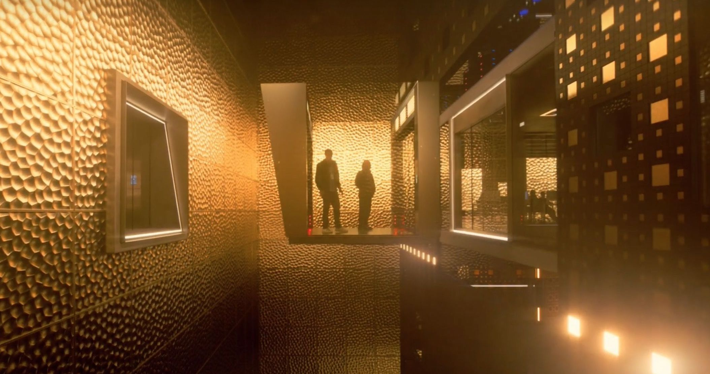

# Квантовая суперпозиция

Я отчётливо помню, как в марте абсолютно нормальным считался горизонт планирования на 2-3 дня, не больше.
Тогда казалось, что мы проживём так по меньшей мере весну, и всё начнёт более менее возвращаться в привычное, нормальное состояние.
Я больше не строю планов, пришёл к тому, что живу каждый день по дню.

### Нынешняя моя жизнь хорошо описывается термином “квантовая суперпозиция”.

Идея, заключается в том, что вот уже 5 месяцев я, как и многие из вас, нахожусь в состоянии суперпозиции.
Кто-то, как и я, был вынужден покинуть свой дом, однако, так и не переехал на новое место.
Кто-то продолжает переезжать, время от времени возвращаясь домой и снова уезжая.
А кто-то остаётся в состоянии “и тут невыносимо, да и уехать никуда не могу”.

Вот я, вроде как, и уехал из России, но на самом деле никуда не переехал.
Вроде как, и живу в Сербии, но на правах туриста: раз в месяц всё ещё надо выезжать на визаран и регистрироваться в полиции вместе с собственником квартиры.
Всё потому, что вид на жительство получить оснований никаких нет.
А что может турист в чужой стране без ВНЖ? Да в принципе ничего не может, даже такие мелочи как обслуживание банковского счёта и оплата мобильной связи и те по завышенным тарифам для приезжих.
Страны ЕС близко, легко добраться, но нужна виза.
А визу получить в Белграде без ВНЖ тоже нельзя, где паспорт получали, туда и езжайте.
А самое обидное, что вот уже скоро полгода как на чемоданах живём, а возможности обустраивать какое-то своё новое место нет.
Технически, то есть конечно, но вдруг придётся снова переезжать? Вдруг моя компания откроет обещанный ещё в марте офис в Нидерландах, и у меня появится возможность туда переехать?
Как скоро всё нажитое придётся тут бросить? Ведь мы с женой по-прежнему ограничены парой чемоданов, а часть вещей вообще сложно поддаются транспортировке в них.
Парадоксально, вроде вот она IKEA, ZARA, H&M и даже Lego, а покупать всё это нет никакого смысла.
Каждый поход в магазин не за продуктами сопряжён с мысленным тетрисом – как будто я всё время покупаю вещь на замену, ведь в чемодан-то это не влезет.
Так вот и живу полгода с мыслью, что покупать себе ничего не нужно, потому что придётся потом снова бросить, как уже бросали в начале марта.
Бросить технику, машину, друзей, цветы.

В марте–апреле я жил с ощущением, что сейчас я временно поживу в Армении, компания сделает мне счёт, карту, и я снова смогу получать зарплату.
Через месяц я с точно таким же ощущением улетал в Сербию, что вот я тут повизараню пару месяцев, пока моя компания не откроет обещанные офисы в Нидерландах и Португалии, а потом уже туда, надолго, на постоянку.

И ведь примерно с самого начала я понимал, что это какая-то очень инфантильная позиция: “вот сейчас кто-то что-то сделает, от меня тут мало чего зависит, нужно просто подождать”.
Довольно быстро я осознал, что офис в странах западной Европы довольно дорогое удовольствие и массовый исход из той же Армении, мягко говоря, маловероятен.
Мало того, что это в принципе, само по себе дорогое удовольствие, так ещё и уровень жизни совершенно другой, это же придётся всем зарплаты подтягивать до уровня рынка.
В итоге ничего из ожидаемого не происходит, а я так и застрял в состоянии смешения двух позиций “переехавшего” и “не переехавшего” одновременно.
Самое время перейти к Физике.

Согласно принципу суперпозиций, если для некоторой квантовой системы допустимы состояния 1 и 2, то допустима и любая их линейная комбинация.

Предположим, у нас есть человек, который находится в одной из двух стран.
Даже если мы не знаем, в какой стране находится человек, мы склонны полагать, что на самом деле он в одной из двух стран, в то время как в другой стране его нет.
В квантовой теории атом может вести себя так, что он, в некотором смысле, находится в обеих странах сразу – в суперпозиции, казалось бы, взаимоисключающих альтернатив.

Популярный пример парадоксального поведения квантовомеханических объектов с точки зрения макроскопического наблюдателя – всем знакомый кот Шрёдингера, который может представлять собой квантовую суперпозицию живого и мёртвого кота.

Согласно квантовой механике, если над объектом не производится наблюдение, то его состояние описывается суперпозицией (т.е.
смешением) двух состояний – живого кота и мёртвого кота.
Следовательно, кот, сидящий в ящике, и жив, и мёртв одновременно.
Если же ящик открыть, то экспериментатор может увидеть только какое-нибудь одно конкретное состояние – «кот мёртв» или «кот жив».
Вопрос стоит так: когда система перестаёт существовать как смешение двух состояний и выбирает одно конкретное?

Я же тут собираюсь разбирать свои экзистенциальные проблемы с помощью квантовой физики.

Так вот, наблюдение за любым физическим объектом осуществляется в результате его взаимодействия с окружающей средой.
Чтобы мы смогли увидеть кота, он должен быть освещён — фотоны, излучённые источником света, отражаются от объекта, попадают нам в глаза и создают изображение.
Чтобы до конца разобраться, нужно закрепить главное: совершенно очевидно, что кот обязательно должен быть либо живым, либо мёртвым (ибо не существует состояния, сочетающего жизнь и смерть на каком-либо поддающемся измерению отрезке времени).
А дальше всё зависит от интерпретации.

В копенгагенской интерпретации система перестаёт быть смешением состояний и выбирает одно из них в тот момент, когда происходит наблюдение.

В многомировой интерпретации квантовой механики оба состояния кота существуют.
Когда наблюдатель открывает ящик, он связывается с котом, и от этого образуются два соответствующие живому и мёртвому коту состояния наблюдателя, которые не взаимодействуют друг с другом.
В этой интерпретации могут быть только «мёртвый кот» или «живой кот».
Другими словами, когда ящик открывается, Вселенная расщепляется на две разные вселенные: в одной из которых наблюдатель смотрит на ящик с мёртвым котом, а в другой – на живого кота.

Получается, я всё это время жду какого-то стороннего наблюдателя, который определит моё состояние.
Сторонний наблюдатель в экспериментах квантовой физики — это, конечно, хорошо, но как насчёт того, чтобы уже прекратить ждать?
Ведь совершенно непонятно, сколько ещё потребуется времени, пока не изменятся какие-то очередные внешние обстоятельства.
Я ведь могу попробовать, как и в других аспектах своей жизни, взять ответственность в свои руки.
Кажется, стоит как минимум попробовать.

Я много думал, к чему я всё-таки хочу привести эту мысль, но так и не нашёл очевидного ответа.
С одной стороны, всегда можно взять свою жизнь в свои руки и начать что-то с ней делать.
Начать готовиться к собеседованиям в иностранные компании, получить сфер на релокейт в страну мечты и вот это вот всё.
С другой же стороны можно расслабиться и плыть по течению, заниматься тем, что нравится и не загонять себя в бесконечный цикл работы.

Для себя, по крайней мере на данный момент, я решил выбрать что-то среднее.
Ближайшие пару недель хочется провести в рассуждениях, не принимать решение в спешке, из точки паники, как это было в марте.
А скорее спокойно посмотреть по сторонам ещё раз и таки попробовать что-то спланировать на долгий горизонт.
Ведь на самом деле, если присмотреться, планировать многие вещи всё ещё возможно.
Да, это стало в разы сложнее, безусловно.
Но сложнее не значит невозможно.
Это как в кроссфите, каждый раз на соревнованиях может быть абсолютно всё что угодно: совершенно любая комбинация движений, интенсивности.
А атлет, в свою очередь, должен быть готов к любой ситуации.
В идеале, он должен уметь адаптироваться и работать в состоянии неопределённости.
Как однажды сказал аналитик Crossfit Games Пэт Шервуд: “чудесное сочетание веселья, унижения и неизвестности”.
Так вот, я подумываю спросить себя, где я сейчас и где хочу оказаться.
Спросить себя, на что я готов ради этого.
Кажется просто, как дважды два, но это не так.
Простые, казалось бы, вопросы приводят куда-то в пустоту, в которой совершенно неочевидно, куда идти.
Я как будто бы стою посреди пустыни, солнце строго надо мной, и мне нужно определить, в какую сторону мне идти.
Пугающая неизвестность.

### На самом деле, всё не так страшно.
Постепенно придётся куда-то идти, да и солнце начнёт двигаться.
Станет понятно, в каком направлении я иду, на север или на запад, а дальше можно корректировать путь, но продолжать двигаться.
Всё дело в постоянстве.
И да, у меня для вас плохие новости: путь будет небыстрый.
Хотите за короткий срок оказаться там, где всегда мечтали – так не бывает.
Невозможно найти работу мечты, переехать в чудесное место или увидеть в зеркале пресс из 6 кубиков за один день.
Нет никаких секретных трюков.

Просто приступайте к планированию и реализации своего плана,
и точка.