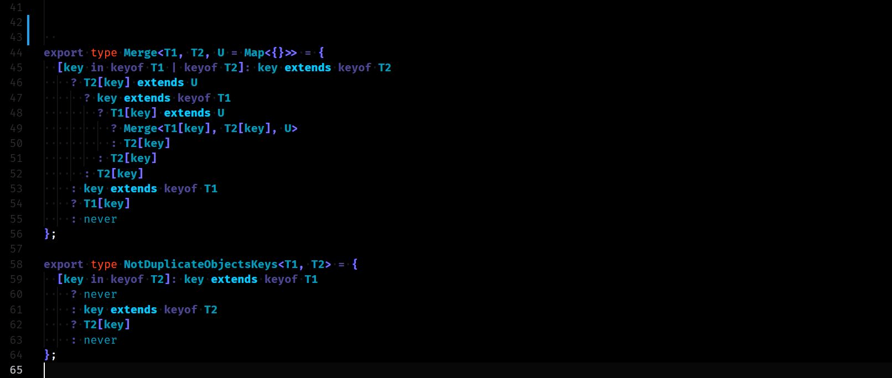

# Пишите здесь технические посты, но только — со своими идеями

Когда-то очень давно, когда у меня ещё горели глаза, а эстетическое удовольствие от кода было настолько большим, что я жил почти только этим, я был одержим идеей придумать свою архитектурную библиотеку. Мне было всё равно, для чего именно она будет нужна, мне хотелось сделать что-то очень изящное, что-то решающее проблемы, что-то имеющее в основе самое интересное для меня в программировании. 

Тогда слова с делами у меня расходились не так сильно, как сейчас, и я делал. Увидел проблему, посмотрел что есть для её решения на рынке, подумал что могу лучше — погнал фигачить. Сейчас точно не вспомню, но думаю, штук двадцать таких недописанных библиотек у меня наберётся. Но сделать мало, надо же убедиться, что кому-то нужно, что мыслю в верном направлении, что не зарылся в абстракциях. Что другим программистам будет понятно, что и зачем я сделал. 

Тут способ один, надо тащить свои наработки в комьюнити: писать статьи, пробиваться на конфы, шарить в профильных чатиках. Поэтому, без задней мысли, мы с хорошим другом написали большую, сложную и честную статью про инструмент, над которым работали на один довольно известный ресурс для разработчиков. Я как думал — вот ты придумал занимательную идею, какой-то интересный, альтернативный подход — ну покажи его инженерам, им будет очень интересно! 

Ух, как я ошибался! Нас закидали говном. Людей страшно возмутило, что мы возомнили себя способными сделать что-то полезное. Очень многие были в ярости. Другие были язвительны, третьи — снисходительны. Немногие потрудились вникнуть, что и зачем мы делаем, и среди таких была как критика и предложения, так и похвалы, это было здорово — но таких было человек десять. А людей, которые нас мочили не разбираясь — сотни.

Я сделал выводы. Не те, что должен был, я решил — это просто мы идиоты. Мы говно. Тупые ослы, сделали какую-то фигню, отняли время людей. Какие вам библиотеки, ребятки, вы тупейшие середнячки, сидите шлёпайте круды с формами, и не высовывайтесь.

С тех пор я больше не пытался писать библиотеки. Друг мой тоже. А ещё через пару лет, когда я существенно прокачался в умении писать статьи, в умении убеждать и предсказывать аудиторию, произошёл такой случай: мой хороший знакомый, большой, очень, очень крутой инженер, сделал свой бекенд фреймворк для C#. И тоже хотел об этом написать. В его компетенции я не сомневался ни секунды, человек не новичок в опенсорсе, он сделал с десяток гигантских инструментов, которые использует большой бизнес, у него очень большой опыт и потрясающий уровень знаний — недостижимый для меня. 

Я взялся помогать ему со статьей. Старался как мог вырезать любую претенциозность, любой намёк на самодовольство — к сожалению мои соотечественники этого не выносят — оставил достаточно сухую, чёткую, крутую техническую статью про новый инструмент.

Что вы думаете произошло дальше? Да. Смыло говном нахер, с головой, без права на помилованье, сотни, сотни комментариев с говном. С огромной кучей говна. Да как ты посмел? Да кем ты себя возомнил? Да с чего ты взял?!?

Комьюнити было возмущено. Дрожащая тварь вздумала, что она тут чего-то стоит? Сейчас она у нас получит. Те русскоязычные ресурсы, на которых можно презентовать свои изобретения, для этого не подходят. Если ты супер известный чел с кучей крутых, комьюнити-прувед известных решений — тут да, тебе можно. И то, давай так, в нашей культуре себя хвалить, пиарить или любить не принято, лучше будет если про твой инструмент напишет кто-то другой. Если ты ноунейм, иди, и засунь свои изобретения и идеи себе в жопу, ублюдок, ты что, думаешь ты лучше нас? 

Автор статьи, которому я помог, пережил ситуацию очень тяжело. Он добрый год работал над своим детищем, придумывал идеи, тестировал их, встраивал в реальные проекты и видел реальный импакт. Он постоянно созванивался и советовался с друзьями, обсуждал, брейнштурмил, думал. Процесс изобретательства — приятное занятие, но оно выжирает все силы, весь энтузиазм что у тебя есть. Он жил этим, и считал, что делает что-то важное и хорошее. Всё это наше сообщество растоптало, опошлило и уничтожило за один день. Мы с тех пор даже общаться стали очень мало, я чувствую себя причастным, виноватым в том, что с ним произошло — ведь это я ему сказал, что будет хорошей идеей пойти и рассказать русскоязычному сообществу о его творении. Это было охрененно плохой идеей. Русскоязычное сообщество твоими творениями подтираться хотело.

Меня это не устраивает. Сам менталитет — хрен с ним, с ним я ничего сделать не могу, людей веками учили ненавидеть себя, ненавидеть тех кто себя не ненавидит — если он конечно не принадлежит к касте ИМЕЮЩИХ ПРАВО. 

Но я могу сделать другое. Я могу сделать площадку, где это будет работать по другому. Где люди будут рады выслушать твои идеи, посмотреть твои наработки, поддержать твои библиотеки. Обсудить всё это с тобой. Подсказать что-то, вежливо и доброжелательно объяснить, почему это может не сработать. Площадку, где ты, рассказывая о своих идеях, не будешь бояться, что тебя высмеют, обосрут и унизят.

Я никудышный кодер, мои идеи ничего не стоят, но даже такой вот, смешной я, человек который за десять лет карьеры более менее сносно освоил только никому не нужный C#/дексктоп стек, смог написать код на ноде, чтобы эта площадка появилась — вы сейчас читаете на ней эту статью. Это моя площадка, и я здесь волен выстраивать такой дух, какой захочу — и я хочу вот так.

Приходите сюда, пишите технические посты. Настоящие технические посты. Не "как написать todo на последнем реакте", не переводное дерьмо англоязычных программистов, а себя — своё мнение, свои идеи, свои наработки. Свои изобретения. Не важно, что уже есть в индустрии, и не важно, что мы можем прочитать в документациях — важно, что ВЫ думаете. 

Я работал за свою жизнь с сотнями инженеров, и у них всех были свои уникальные идеи и мысли о технологиях — я хочу их слушать, я хочу их обсуждать, я думаю, что именно это — важно, и именно за этим должны существовать ресурсы, где мы можем писать о технологиях. 

Вот этот — такой. Тут вы сможете писать о том, что действительно имеет смысл обсуждать. А я сделаю всё, чтобы вас тут выслушали и уважили. 

