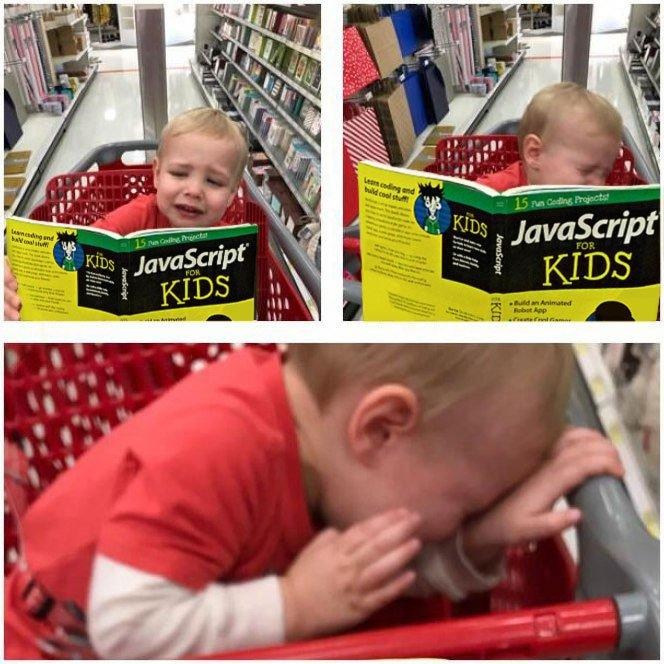

# Техсобесы — булщит

Ну серьёзно. Большинство технических собеседований, которые я видел и к которым обычно помогают готовиться в разных айти-сообществах, проверяют только один навык — готовиться к  техническим собеседованиям.

Я знаю, что нужно бизнесу. Я обожаю делать новое и думать наперёд. Получаю кайф от создания своим кодом добавленной ценности продукту.

При этом каждый раз, когда я смотрю публичное техническое интервью, от вопросов у меня шевелятся волосы на жопе. Ребята, я не знаю, что будет, если засунуть промис в таймаут в асинхронную функцию. И не знаю, сработает ли это раньше, чем асинхронная функция, засунутая в таймаут и обёрнутая в промис. Хэзэ ваще. Что вернёт какой-то языко-специфичный метод в вашем конкретном примере — абсолютно без понятия. «Каверзные вопросы» для подготовки к собеседованиям — чистейшее зло, они должны быть уничтожены. Знания, которые можно получить, отвечая на эти вопросы, в реальной разработке оказываются полезными крайне редко.

Мой идеальный путь разработчика в хард-скиллах заключается в том, чтобы минимизировать изучение вещей, специфичных для конкретной технологии. Паттерны проектирования — пожалуйста, а приколы от создателей спецификации языка я изучаю суперповерхностно, насколько это возможно, просто, чтобы уметь на этом писать и понимать, что происходит. К чёрту привязанность к языку. И к чёрту снобов, всерьёз обсуждающих, какие языки лучше, а какие хуже. Нет таких языков.

На мидловых собеседованиях обсуждают такие страшные вещи, что у меня просыпается синдром самозванца, которого отродясь не было. Ребята обсуждают очереди сообщений, индексацию полей в базах данных и оптимизацию под конкретный компилятор — а я как будто с луны свалился и умею только круды шлёпать.

Но как-то же мне удаётся работать в айти-компании и делать крутые штуки?

Есть ощущение, что моя ценность в другом — знать, что такое хорошо и делать хорошо. Просто брать и делать. И делегировать технодроч другим людям, которым это нравится. Вместе с относительной фулстечностью это позволяет мне запилить хороший — объективно хороший — проект с нуля. При этом я пишу чистый — объективно чистый — код, и понимаю, где находится компромисс между удобством масштабирования и затраченным временем. Если вы думаете, что я не люблю техсобеседования, потому что пишу костыли и говнокод — это большое заблуждение.

Тем не менее, я готовлюсь к собеседованиям. Причина простая — рынок так сказал. Успешно пройденное техинтервью повышает матожидание зарплаты по итогам найма.

А техсобесы — булщит.