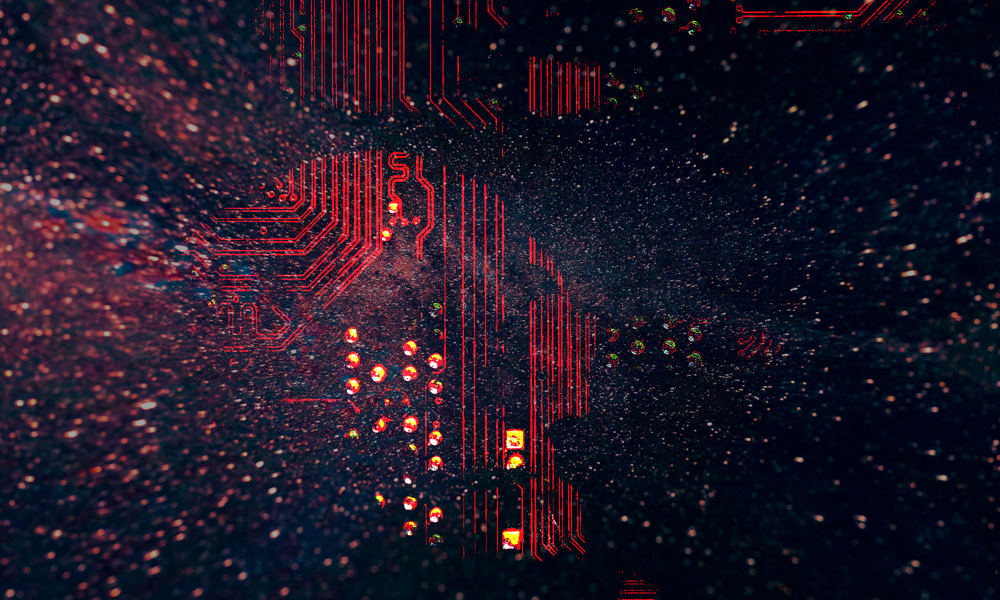

# Айти сообщество видит только технические проблемы и игнорирует человеческие. Это его убьет

Моя индустрия никогда не была просто работой. С самого первого дня, с самого первого рубля, полученного за код, я чувствовал себя частью огромного сообщества. Так уж обстояли дела — нельзя быть программистом, который сам по себе сидит и пишет себе код по указке заказчика — программист всегда часть команды, у него всегда есть свой стек, и куча людей, которые пишут на этом стеке, форумы, стековерфлоу, хабры, реддиты, конфы, чатики — ты никогда не один и один ты ничего и не можешь, всё что ты делаешь, ты делаешь как часть коллективного разума.

Это проявляется с первых дней обучения. У меня была книга про C++, но просто читать её, и выполнять задания не получалось. Ничего не работало! И нет шансов самому найти причину, почему тщательно перепечатанный из книги код просто не запускается в сраном Борланд Си Плюс Плюс. Не запускается, и всё тут — копируешь сообщение об ошибке, тащишь его в сеть, попадаешь на богами забытый кибер форум где умные чуваки три с половиной месяца обсуждали именно это, возникшую у тебя проблему, и нашли пару решений. Применяешь — работает, потом новая проблема — снова в сеть, и так до бесконечности. Проходит десять лет, ты уже суперсиньор, а всё ещё ничего не стоишь без своих коллег, всё ещё постоянно нуждаешься в их мозгах и их опыте.

Без сообщества ни один из нас не может написать буквально ничего. Инструменты, языки, практики, траблшутинг — всё это мы делаем вместе. У нас ты можешь взять инструмент, которым пользуются по всему миру, и пропатчить его — сразу для всех. Я пишу эту статью в VSCode, редакторе, которым пользовался практически с самого начала. Тогда это был просто крашенный блокнот с базовыми возможностями редактирования текста — он никуда не годился. Сейчас это настоящий технологический монстр, который решает вообще все мои задачи, хоть как-то связанные с печатанием символов. Я пишу в нём статьи, код на сишарпе, фронтенд, управляю базами данных, работаю с гитом, поднимаю контейнеры — он может всё.

Я помню, лет семь назад увидел на Хабре заметку, про то как американский пацан, чуть ли не срисованный с брата Кевина Маккалистера, возмущался, что он случайно нажал в VSCode "Discard changes" и похоронил год своей работы. Как же я орал! Ну не дурак ли? Взял отменил все ченджи и ещё не доволен, что ему не высветилось предупреждающего окошка. На следующий день я пришёл на работу, решил подискардить свои изменения, а окошко появилось. У меня, без преувеличения, мурашки побежали по коже! Вот это индустрия. Вот так, вчера кто-то столкнулся с проблемой, сегодня её больше нет — всё в реальном времени, быстро, на живую. Охуеть.

И я — часть этой индустрии. Один из них. Это, блин, было круто, осознать, к какой касте людей ты теперь принадлежишь. И у айтишников так во всём, у нас куча долгоиграющих и серьезных технологических проблем — вес сраного npm, ублюдочность браузеров, низкая производительность инструментов, медленный рендер, неоптимальность баз и ОРМок — и мы их решаем. Мы пишем статьи, собираем конфы, мажем инструменты поверх инструментов, переписываем, патчим — систематически, планомерно и уверенно. Повсюду. 

Русскоязычная, моя часть индустрии, была такой же. Всё хорошее, что можно, переняли у западных коллег, и ещё своего добавили. Вот в такой индустрии и таким я вырос. Человеком, который открыт к коллективному решению важных проблем, к альтруистической работе над вещами, которые важны всем, к рефлексии над всем, что сам сделал и чем пользуюсь. Я научился работать вместе, слушать и слышать тиммейтов, сообщество, обсуждать спорные вещи. Полагаться на людей из своей индустрии. Вместе делать очень крутые вещи. Мы — настоящий коллективный разум, действующий во имя добра, развития и процветания.

Но только до тех пор, пока дело касается технологий или процессов работы.

Когда перед русскоязычной индустрией появились вызовы, с технологиями не связанные, произошла парадоксальная вещь — многие наши столпы, все наши самые видные люди и компании, позасовывали язык в жопу, и сделали вид что никакой проблемы нет и всё это их не касается.

Именно про них я хочу поговорить — не про городских сумасшедших, вроде сталинистско-ватных нин-джина или Бугаенко — эти, пусть и заняли самую людоедскую сторону из возможных, хотя бы не делают вид, что то, что касается вообще всех, их не касается. Я говорю про людей и компании, которые упорно делают вид, что ничего не происходит.

Вот они, слева направо — Яндекс, который носился с либеральными ценностями, топил за дайверсити и взаимодействие со всем миром, стал чёртовым центром IT в России, говорил про себя, что он и есть рынок — а теперь, когда пришло время родное айти защищать — просто сделал ровно нихуя. Вообще ничего. Только подыграл злу там, где заставили. Джагру груп, Конференции Олега Бунина — источники всех обсуждений обо всём в сообществе — просто зарестриктили любые политические дискуссии на своих площадках. Хабр, самая главная, самая большая площадка взаимодействия русскоязычного сообщества — выпустил самое обтекаемое заявление, что я когда-либо видел, и запретил обсуждать политику.

Видные программисты — перечислять не хочу, вдруг ещё одумаются — продолжают писать и говорить о технологиях, а про гигантский топор, зависший над нашими головами — ни слова. И я сейчас не пытаюсь давить на совесть или порядочность — бог с ними, тут решать каждому за себя. Я говорю про вещи, которые угрожают нам всем. Вещи, которые нас уничтожат. Общую угрозу.

Война несет смерть, изоляцию и раздробленность. Но айтишный майндсет, приученный собираться и решать технологические проблемы, сыграл тут злую шутку. Мы вдруг убедили себя, что нам выпала всего лишь еще одна техническая проблема. Ок, отвалилось здесь — давайте думать, как заменить. Хорошо, здесь сломалось, а старые инструменты недоступны — давайте решать, как это обойти. Эти люди больше не могут работать с этими людьми — что ж, надо пересобирать команды. Давайте фиксить симптомы, а о корневых причинах даже думать себе запретим, «ведь это непродуктивно и вызывает токсичные споры, у всех свое мнение». Какая-то забавная техническая игра, иллюзия, что нет проблем, которые не решаются кодом, что мы можем все сами себе заменить, и делать все только для себя. Но изолируясь и закрывая на это глаза мы превращаемся в джуна, оставленного один на один с книжкой по C++, которому уже никто не скажет, что он делает что-то не так.

Россия это не Китай. Россия, это малюсенький, милипиздишный кусочек глобального рынка. Сам Китай, при всей своей мощи, в своём софтверном развитии — жалкая тень мирового IT — но нам не снились даже его успехи. Индустрия так тупо не работает. Все наши технологии сделаны всем миром, нет ничего такого, что было бы полностью российским, полностью китайским или полностью американским изобретением — каждую технологию в широком смысле делал весь мир. Американские фреймворки делались всем миром — там добрая половина контрибьютеров азиаты и европейцы, а не американцы.

В мире IT дурак, который выберет работать один, проигрывает — потому что весь остальной мир больше тебя. И вот делать так — противоречит самой сути разработки. Это буквально, шаг назад, и для нас, и для мира. Противопоставлять себя всему миру, когда делаешь технологии — равнозначно вступлению в секту луддитов. Самые оголтелые ватники-программисты каждый день используют тысячи вещей, изобретенных и сделанных их заклятыми врагами, и не использовать их не могут.

Мы не заметили и не осознали, как технологический прогресс сломал принципы, которые люди когда-то давно считали основой прогресса. Цифровая сеть стала одной, общий мировой интернет. Рунет и то, что за великой китайской стеной — это все одна сеть. Нельзя сделать несколько разных независимых интернетов, которые будут конкурировать и становиться от этого лучше. Разные интернеты — это та конкуренция, от которой все проиграют.

Война больше не двигатель прогресса. Когда-то давно противостояния стран может и подстегивали научные открытия, но мы дошли до стадии, где технологии будут развиваться быстрее в мирное время — потому что мы уже встали на путь глобального взаимодействия.

Мы блин живём в индустрии, где невозможно создать новый браузер — это слишком, немыслимо трудно — можем только все вместе развивать тот что есть. Потому что браузер — это накопленная человечеством за десятки лет система из миллионов естественно выведенных правил, которые нельзя изменить — только воссоздать и эволюционно наращивать.

И это только браузер. Есть ещё процессоры, операционные системы, языки программирования, бесконечные стандарты обмена данными, принципы работы сети. Всё это — достояние человечества. И результат работы мировой IT индустрии. Тот, кто хочет её, эту индустрию, разделить — враг развития.

Российскому айти пизда в изоляции, и я не хочу делать вид, что это не так, и что это только технологическая проблема.

Хабру, яндексу, джугу, Бунину, скиллбоксу — им всем тоже пиздец. Самый лучший сценарий для них — стать собственностью какого-нибудь VK, который гораздо удобнее, потому что его лояльность у хозяев сомнений не вызывает. Но и VK процветать не будет. Потому что в таких условиях мы будем только латать дыры и удерживаться на плаву, а не идти вперед.

Айтишники из России, айти компании из России, которые игнорируют происходящее — луддиты и предатели. Они предали не нас, они предали дело, которое все мы делаем. Дело нашей жизни. И сделали это даже не ради себя — просто ради того, чтобы подольше протянуть то, что и так ждёт печальный конец.
