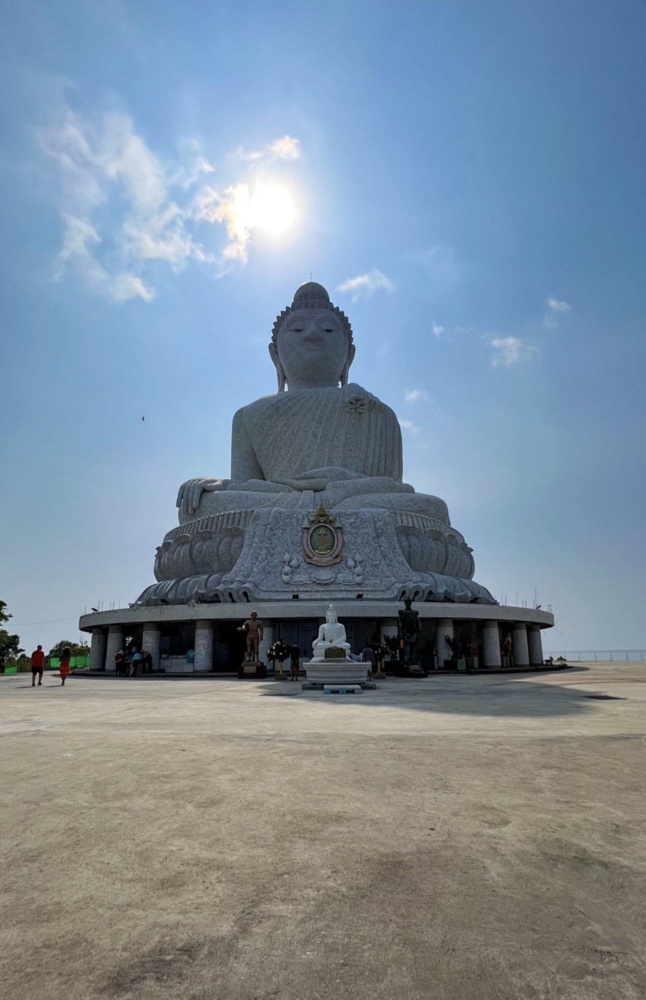

# Труднодоступный Таиланд: как фронтенд-разработчику живётся на другой стороне земного шараТруднодоступный Таиланд: как фронтенд-разработчику живётся на другой стороне земного шара

Мы поговорили с фронтенд-разработчиком, который в это неспокойное время решился улететь в Таиланд. Алексей уехал на зимовку и передумал возвращаться в Россию. У «райской» страны есть и недостатки: невозможность стать своим, краткосрочность пребывания, специфическая кухня. Но зато здесь невероятной красоты природа, океан, солнце, относительно низкие цены и дружелюбные люди.

Меня зовут Алексей Павлов, я — фронтенд-разработчик с трёхлетним опытом. Сейчас работаю на React, Typescript в российской компании, которая занимается разработкой MVP для стартапов.

Изначально у меня не было цели релоцироваться. Мы с моей девушкой планировали туристическую поездку в Таиланд. Искали страну, где было бы недорого жить и удобно работать: в народе это называется «перезимовать». Хотели поехать примерно на два месяца. Купили билеты, забронировали жильё, прикинули расходы. Мы вылетали 25 февраля и надеялись, что наш рейс не отменится. В итоге с перелётом всё прошло нормально. Но, прилетев, мы поняли: в те события, что происходят сейчас в России, нам возвращаться не хочется.

_Алексей с женой в Таиланде_

## Мы летели в пандемию — это дополнительная сложность

Когда мы уезжали, организовать переезд было сложно из-за ковидных ограничений. Надо было обязательно забронировать отель SHA+ — это специальная категория отелей, где все сотрудники привиты и действуют повышенные меры санитарной обработки. Нужно было купить обратные билеты, заранее оплатить два ПЦР-теста по прилёту и получить так называемый Thailand Pass.

Но сейчас это уже не актуально. Отменили и Thailand Pass, и необходимость бронирования SHA+ гостиницы. Сейчас можно прилететь в Таиланд и 45 дней находиться там без визы. Многие люди жили здесь годами, потому что остались на время пандемии. У них была возможность продлевать свое время пребывания в Таиланде. Для этого нужно было просто приезжать в миграционный центр каждые два месяца, платить 1900 бат (это 4000 в рублях), и тебе ставили новый штамп, позволяющий остаться в стране, потому что вокруг была эпидемия.

_Так выглядели «ковидные штампы»_

## Остаться в Таиланде надолго — затруднительно

Недавно эта лавочка прикрылась, больше по ковидным основаниям продлеваться нельзя. Если ты хочешь здесь остаться, нужно оформлять визу — например, студенческую, её можно сделать сроком на год. У long term пребывания очень сложные условия для разработчиков и удалёнщиков. Нужен высокий доход и потребуется платить налоги по ставке 17%. А обычная туристическая виза даётся только на три месяца.

Первое время работать на российскую компанию было неплохо. До блокировки карт мы просто снимали наличку из банкомата. Потом какое-то время ездили к местному обменщику — ему можно перевести деньги с карты на карту Тинькофф, а он тебе выдаст наличные. Конечно, у них не самый выгодный курс, но по крайней мере всегда можно воспользоваться этой услугой. У обменщиков нормальные офисы, всё выглядит очень безопасно.

Для дальнейших расчётов нужен был Resident Certificate — это такой документ, который подтверждает, по какому адресу ты живёшь. Он делается в миграционном центре за полчаса. С этой бумагой можно приехать в банк и открыть счёт. После того, как мы открыли банковский счёт, у нас появилась возможность получать деньги на нашу тайскую банковскую карту. Тогда я стал обменивать деньги через Binance. Какое-то время мы просто отправляли через Тинькофф SWIFT-переводы на тайскую карту, но потом это стало невозможно.

Прямо сейчас мы обдумываем, что делать дальше. У нас крайний срок пребывания — 23 ноября. Возможно, мы поедем куда-то ещё. Остаться здесь будет накладно. Во-первых, надо будет обязательно выехать из страны. Во-вторых, если хочется остаться хотя бы на полгода, нужно будет cделать студенческую визу. Думаю, что нужно подыскать место, где пребывание будет засчитываться в срок будущего ПМЖ. В Таиланде, сколько ни живи, ты не получишь паспорт и навсегда останешься «фарангом».

Мы рассматриваем релокацию в Аргентину, потому что там по прошествии трёх лет постоянного проживания можно получить паспорт. Также заинтересовались Португалией, в которой тоже несложно легализоваться, по крайней мере ВНЖ получить довольно просто.

## На Пхукете живёт много айтишников

В Таиланде довольно много разработчиков, есть даже чат «Пхукет IT». Однажды какой-то парень написал в него с предложением встретиться, мы собрались и провели вместе время. Таких встреч было несколько, потому что на фоне событий начала 2022 года все старались сплотиться и поддержать друг друга.

Думаю, IT-специалистам здесь нравится, потому что стоимость жизни не выше московской, а ещё здесь тепло и интересно. Не уверен, на одном ли уровне цены на жильё. Однушку с большой кухней-гостиной, около 55 квадратных метров, можно не в сезон снять примерно за 45 тысяч рублей. В сезон всё резко дорожает, буквально в два раза. В декабре, январе, феврале такая квартира будет стоить 90 тысяч. Если ты заранее изучишь вопрос, то остаться здесь не сложно. Не обязательно легализоваться, можно просто отдыхать. Вся Азия доступна: недалеко до Бали, Малайзии. Летать удобно и недорого.

Скоро сезон. Долгое время такого явления не было, всё было закрыто. Сейчас всё возрождается, много туристов. И из-за этого, возможно, удалёнщикам будет не так комфортно. Выше цены, больше людей, меньше воздуха, труднее с жильём.

_Таиланд в разгар сезона_

## Интегрироваться в Таиланде — невозможно

Главное отличие Таиланда от России — это климат. В любое время дня и ночи, в любой день, даже в самый грозный ливень ты выходишь на улицу и тебе всегда тепло. И море всегда рядом.

Люди здесь отличаются от россиян дружелюбием. Особенно в сезон и в сфере услуг — очень приветливые. Я сначала пытался анализировать отличия менталитета, у меня даже складывалось какое-то представление. Но сейчас, по прошествии времени я вообще не склонен верить в менталитет как таковой. Мне кажется, везде есть разные люди с абсолютно разными чертами характера.

Нам сначала казалось, что тайцы не очень обязательные, не очень ответственные. Но после этого я повстречал совершенно других тайцев. Наш текущий агент по недвижимости, например, очень организованная. Сообщаем о поломке в квартире — в течение 10 минут к нам уже приходят люди и всё ремонтируют. Но первое время было ощущение, что всем на всё наплевать. Например, в отеле, где мы жили на карантине, не должны были нас выпускать, пока не известны результаты ПЦР-теста. Но нам сразу сказали, что можно свободно ходить везде.

**В отличие от европейских стран, здесь невозможно интегрироваться в местное общество. Для тайцев ты всегда будешь чужим — не важно, сколько времени здесь проживёшь, выучишь ли язык. Они называют приезжих на жаргонном слове от слова foreigners — «фаранги». Для местных ты всегда будешь белым фарангом с деньгами.**

_Пример местной еды, Fried rice with egg_

Ещё одно отличие — бытовое. Тайская еда необычная: всё острое, кислое, сладкое. Очень яркие, насыщенные вкусы. Постоянно просишь: “Not spicy, please”. Всё равно иногда могут принести острое, будешь сидеть как огнедышащий дракон.

_Алексей сделал предложение своей любимой в самолёте_

В Таиланде мы с моей девушкой поженились. Вместе путешествовали по стране и посмотрели все интересные достопримечательности. Мне даже сложно сказать, что впечатлило нас больше всего. Пусть будет смотровая башня Кхао-Кхад на Пхукете, откуда видно почти весь остров, мне она очень нравится. Очень симпатичная смотровая площадка около Ветряной мельницы. А самое популярное у туристов место — статуя Большого Будды: он сидит на горе и смотрит на остров.

_Вид со смотровой башни Khao Kad_

_Вид со смотровой площадки «Ветряк» или Windmill Viewpoint_

_Big Buddha_
