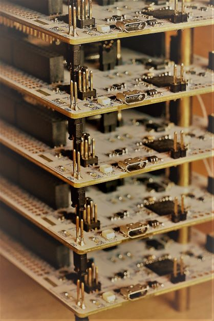
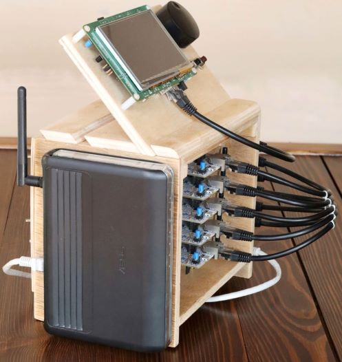
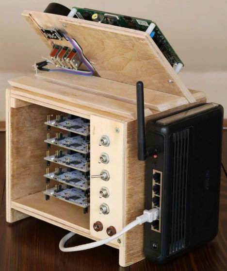
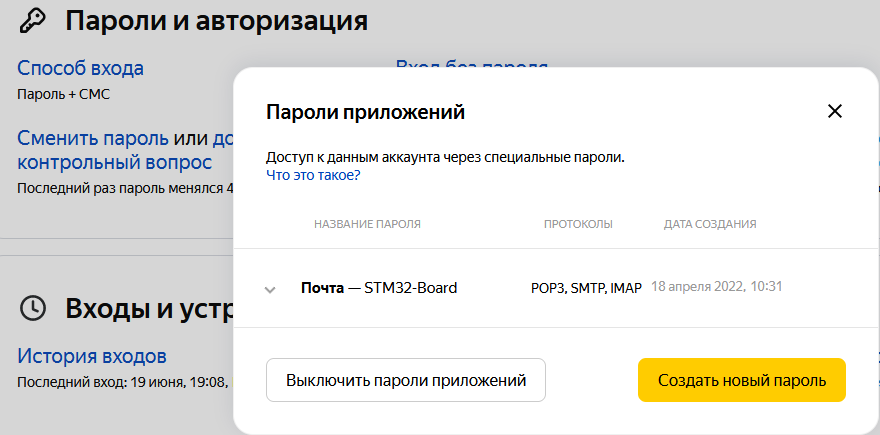

# Жизнь после "Hello, World"

Уважаемые читатели, Вашему вниманию представляется вводная статья из цикла, посвящённого популяризации разработки ПО для микроконтроллеров (МК). Ниже будет изложен краткий обзор *чего* и *зачем* будем программировать. Мигать ничем не будем. Выводить символы на экран по SPI/I2C также не будем. Такого материала довольно много и некоторые статьи очень даже хорошо и подробно написаны.
Однако, мы изучим дампы трафика в Wireshark, в котором, например, сопоставим практический и теоретический трафик от smtp-клиента. Посмотрим на ping'pong сообщения: не на те обычные пинги и понги, а на websoket'овые пинги и понги: между сервером (ПК) на go+gorilla и клиентом на МК.

## Embedded "Hello, World"

Обычным делом на старте (и мир встраиваемых систем не исключение) является написание самой простой программы - "Hello, World". Для МК это чаще всего управление светодиодом, подключённым к одному из выводов. Если вдруг на плате есть сетевой разъём, то "прикрутив" сетевой стэк, можно в качестве сетевого "Hello, World" попинговать плату со статическим IP-адресом. А может у вас уже есть несколько плат с сетевым разъёмом? Тогда, возможно, вам придётся задавать дефайном статический IP, для каждой платы подправлять его, пересобирать и перепрошивать файл программы - разумеется, так можно сделать раз или два, в учебных целях. Однако, постоянные исправления IP  и пересборка программы для каждой платы станут проблемой, которая решается просто: на МК запускается DHCP-клиент, а на маршрутизаторе - DHCP-сервер. Готово - прошивка везде одинаковая и каждая плата после старта получает уникальный IP-адрес в локальной сети. Просто и понятно, особенно, если хотя бы бегло прочитать любую статью по DHCP и посмотреть на трафик, который "ходит" по сети во время старта прошивки. Чаще всего все эти примеры уже есть в SDK на плату и нужно лишь осилить readme, собрать прошивку и запрограммировать МК. Начало положено.

Или это уже сразу и начало, и конец? Чем заняться дальше? Вот перед вами "голая" плата. Примеры из SDK изучены и все прошивки получилось запустить на МК. И даже понятно как всё работает. 
Лучший вариант - это если есть задания по работе, связанные с разработкой новой платы и вам, программисту и схемотехнику, прикупили по отладочной плате для ваших экспериментов. Тогда круг дальнейших задач будет обозначен сам собой. Но это подразумевает, что вы уже embedded-программист и, возможно, вы и ваша команда уже делаете вещи сложнее и архитектурно более продуманные чем те, которые будут далее изложены в статьях.
А если вы школьник/студент? Или вы из веба и, возможно, ещё без первой работы? Просто изучаете возможности в разных направлениях IT. Как можно увлечь самого себя в довольно сложном направлении - embedded разработке? Которое к тому же требует много чего ещё помимо ПК.

Давайте попробуем вместе разобраться, какие аппаратные возможности дают даже самые простые платы с современными МК и какое ПО можно под них писать!

## Что будем программировать

  
Экспериментальный домашний "программно-аппаратный комплекс"

  * вид справа
  
    

  * вид слева
  
    

  * вид сзади
  
    

Читатель "в теме" на фото сразу узнает, что это за "штуки" такие. Однако, для тех кто впервые видит нечто подобное опишем сверху-вниз, слева-направо:

  * сверху - головное устройство (ГУ), он же STM32F7-SERVER на базе
    - [32F746GDISCOVERY](https://www.st.com/en/evaluation-tools/32f746gdiscovery.html)
  * ниже, по центру - 5 шт. ведомых устройств, они же STM32H7-WORKER'ы на базе
    - [NUCLEO-H745ZI-Q](https://www.st.com/en/product/nucleo-h745zi-q.html)
  * на левой боковой стенке пригодившийся старенький маршрутизатор ASUS WL-520GC
  * на правой боковой стенке 8-ми портовый коммутатор Zyxel GS1200-8

Собирался "стенд" довольно долго, по мере потребности освоения той или иной тематики для рабочих задач. Все отладочные платы и сетевые устройства - готовые покупные изделия, в конструкцию и схемы которых никаких изменений не вносилось, имеется только то, что доступно "из коробки". Схемотехника отладочных плат доступна по ссылкам на сайте ST. Если что-то и подключалось (кнопки/энкодер), то делалось это в разъёмы расширения платы, предусмотренные производителем для этих целей.

Начнём с описания маршрутизатора и коммутатора. Главная из задача - это создание локальной сети из отладочных плат. Порты 1..6 соединены с платами. Для создания "сети" 8ой порт соединён с маршрутизатором. Порт 7 оставляем под нужды ПК. Вот и вся сеть. На WAN маршрутизатора подключается уже "большая" сеть от общеквартирного маршрутизатора с доступом в глобальную сеть интернет. Настройка маршрутизатора и коммутатора банально простая и, соответственно, никаких описаний не требует. Для локальной сети из отладочных плат была выбрана подсеть 10.10.10.х, вместо всем привычной 192.168.х.х. 

Сразу отмечу, что у коммутатора Zyxel есть ещё одна задача - обеспечить возможность отладки сетевых приложений. В одной из статей для этого придётся перенастроить порт 7 (ПК) - включить его в режим получения зеркалированного трафика между головным (порт 1) и ведомыми устройствами (порты 2-6). При таких настройках появляется возможность прослушивания трафика через Wireshark (*по умолчанию коммутатор не пересылает в порт 7 "чужой" трафик с портов 1..6*).

Дальше - чуть сложнее. Головное устройство - отладочная плата STM32F746-Discovery. По терминологии STMicroelectronics: nucleo/discovery/eval это, соответственно, начальный/средний/продвинутый уровень, с разумеется растущей стоимостью. Плата  появилась у меня уже довольно давно. Это был 2015 год, почти сразу после выхода семейства Cortex-M7 у ST. Рабочие задачи в то время решались на Cortex-M3/M4 МК STM32F2/F4 серий. Основные характеристики нового МК, который необходимо было изучить: 216 МГц / 320 Кб ОЗУ / 1 Мб ПЗУ. Довольно существенные улучшения в архитектуре МК. На плате, конечно, установлено много чего ещё (ETH, SDRAM, QSPI, USB, microSD, экран, аудио), можно посмотреть документы на плату по ссылке выше, на официальном сайте. Рекламные презентации и сравнительные графики не оставляли шансов своим предшественникам из F4 серии. Для одной отладочной платы не требовалось никаких дополнительных коммутаторов: и плата, и ПК подключались к свободным портам маршрутизатора. Полученная локальная сеть тривиальна: ПК <-> МК.

**По итогу**: подтвердилось довольно существенное увеличение производительности, сетевые возможности изучены, большинство примеров для периферии МК освоены. Но в рабочих задачах такой экран оказался не востребован, а аудио возможности тем более. Однако, весьма ценным оказалось знакомство с USB и microSD с файловой системой, которая открывает нескончаемое (по меркам МК) хранилище логов. Ранее, всем сбором данных и логированием занималась система верхнего уровня. В новом же устройстве, вполне можно было обеспечить длительную автономную работу - добавить карту памяти и реализовать возможность удалённой выгрузки содержимого карты. В общем, задача по изучению отладочной платы STM32F746-Discovery и знакомству с новым семейством Cortex-M7 была выполнена.

Далее, по мере отслеживания современных тенденций у ST и его конкурентов, чтения рекламных и обзорных статей, понравились новые (для меня) гетерогенные двухъядерные микроконтроллеры. Идея здесь простая: основному Cortex-M ядру производители добавляли "помощника" из младшего семейства, на который возлагались, например, real-time задачи. Связки ядер попадались обычно Cortex-M4/Cortex-M0(M0+) и Cortex-M7/Cortex-M4. Второй набор ядер заинтересовал своей производительностью как старшего, так и младшего ядра (480 МГц + 240 МГц), и в конце 2020 года для опытов были приобретены 5 плат STM32H745-Nucleo. Платы nucleo значительно "беднее" discovery. Из коробки на них есть только кнопка, три светодиода и главное - сетевой разъём с известной по discovery phy-микросхемой. Для подключение всего остального почти все ножки МК выведены на разъёмы расширения по бокам платы.
После покупки и распаковки сразу же на столе образовался "ворох" проводов и патч-кордов, так что встала острая необходимость собрать хотя бы концепт "стенда".

## Зачем будем программировать

Ответ прост: чтобы развиваться и изучать на практике тренды в embedded-строении, попутно придумывать и реализовывать собственные идеи. На базе даже таких относительно "простых" плат можно попробовать написать довольно "сложное" ПО: сетевые элементы/worker'ы, которые управляются по сети через ГУ. Обеспечить возможность OTA-обновления (over the air) любого отдельного (или всей группы) сетевых элементов. Подумать об ИБ: например, подписывать файлы обновления, а на ГУ, соответственно, проверять, что файл прошивки скомпилирован на доверенном сервере. Шифровать трафик и/или логи работы системы, если информация чувствительна к внешнему "наблюдателю".
На этапе разработки, желательно обеспечить возможность "тонкой" настройки через стандартный для embedded-устройств command line interface (cli), а для ГУ добавить ещё http сервер с веб-интерфейсом, который будет более "дружелюбен" для пользователя по сравнению с putty и консольными текстовыми командами. 

*Пример, купили вы новый Wi-Fi-маршрутизатор, повесили вблизи входного кабеля от провайдера, подключили к ПК... И, в идеальном мире, один раз настроили по инструкции через веб-интерфейс свою домашнюю сеть и больше о нём вы не вспоминаете. Это та самая "правильная" встраиваемая система. Она удобна и проста в настройке, работает неделями, месяцами, годами и главное - она решает свою задачу. Грозу она не замечает, а после сбоя электропитания сама восстанавливается.*

Для "гипотетической" системы промышленного уровня можно придумать, чтобы она успевала управлять hard-realtime процессом (со временем отклика пусть <10 мс, или даже <1 мс, не важно, и то, и то может быть hard-realtime). И пусть в этой гипотетической системе каждый МК ведёт логи с ежесекундными метриками процесса. Например, человекочитаемая таблица на 100+ параметров с timestamp'ами. Если запись 1 раз в секунду, то значит за сутки в таблице набежит 86400 строк. Хорошая такая таблица... Возможное решение: пусть МК на старте выставит себе по NTP точное время и будет создавать каждый час новый файл со "скромной" таблицей на 3600 строк. Так как содержимое файлов - текстовые символы, их удастся довольно хорошо сжать и упаковать в ежедневный архив *log_ГГГГ/ММ/ДД.tar*. И в качестве бонуса, чтобы не хранить всё в одном экземпляре на устройстве, по завершению упаковки архива сделать email-рассылку через smtp-клиента с кратким письмом о пиковых метриках и/или возможных отклонениях в процессе и прикрепить tar-архив логов. 

*Сразу здесь упомяну о довольно свежей проблеме, от мая 2022: gmail взял и заблокировал "небезопасные" приложения, которым по его мнению являлся smtp-клиент, реализованный на ГУ:*

*Естественно, пришлось переезжать на другую почту. И, как обычно, были вопросики: опять возиться с этим, казалось бы уже отлаженным, сервисом и в МК, и в почтовом ящике, от которого делается рассылка. Интересно... Конечно, всё заработало: ГУ рассылку по адресатам делает, вложения прикладывает, в копию письма мой основной почтовый ящик ставит.*

## Как будем программировать

Для себя сделал такой выбор: редактор (SublimeText4) + .c/.h-файлы проекта + библиотеки + Makefile + arm-gcc. Никому эту связку не навязываю. Любимый редактор (или IDE) у каждого свой. Наверняка, вам удобнее работать, как вам удобнее. Мне - как мне.
Сами STMicroelectronics поставляют свои платы с примерами проектов в трёх IDE: EWARM, MDK-ARM, STM32CubeIDE. Первые две хорошие и довольно известные в embedded-мире платные IDE, третья - собственная бесплатная IDE от ST. И тоже вполне хорошая. Меня STM32CubeIDE вполне устраивает и иногда, для отладки, будем ей пользоваться в режиме "подцепления" elf-файла прошивки, собранного с отладочной информацией и без оптимизации. А проект в ней вести - нет, не будем.

## Что уже реализовано и о чём будет дальнейший цикл

### STM32F7-SERVER:
  - классика: freertos + fatfs;
  - логирование в обычных txt-файлах + упаковка в tar + AES шифрование с pbkdf2 ключом;
  - https web-server с самоподписанным сертификатом;
  - доступ к web-server'у по клиентским сертификатам, подписанным только тем же CA;
  - портиторование web-интерфейса управления [adminkit](https://demo.adminkit.io/);
  - использование для визуализации графической js-библиотеки [canvasjs](https://canvasjs.com/javascript-charts/synchronized-charts/) (очень уж мне понравились эти "сцепленные графики" с подсказками при наведении);
  - "взлом" библиотеки (*т.к. она платная и "защищена" водяными знаками "CanvasJS Trial" под каждым графиком, то придётся найти и подчистить этот "uglify"-код*);
  - ssh + [freertos-cli](https://www.freertos.org/FreeRTOS-Plus/FreeRTOS_Plus_CLI/FreeRTOS_Plus_Command_Line_Interface.html) + remote procedure call (RPC);
  - websockets;
  - ...
  
### STM32H7-WORKER
  - загрузка прошивки в Cortex-M4 ядро;
  - межядерное взаимодействие;
  - digital signal processing (DSP) (ST рекламу ведь делали, что это high-performance МК - вот пусть теперь поработает числодробилкой);
  - ssh + [freertos-cli](https://www.freertos.org/FreeRTOS-Plus/FreeRTOS_Plus_CLI/FreeRTOS_Plus_Command_Line_Interface.html) + remote procedure call (RPC);
  - websockets;
  - ...

Всё, что реализовано в коде и подготовлено для статей - это сетевые приложения/сервисы оформленные как freertos task'и. Самого кода будет мало (скорее и вовсе не будет), т.к. код требует пояснений, занимает место в статье, утомляет читателя. Это просто код на Си, который решает обозначенные задачи. Ничего особенного.
Зато будут картинки, описание, блок-схемы архитектуры программно-аппаратного комплекса. Постановка какой-нибудь "*проблемы*" (пусть и выдуманной) и мои последующие рассуждения на тему "*какое я вижу решение в данном случае*".

На RPC остановлюсь чуть подробнее. Русско-язычный термин - удалённый вызов процедур - полностью отражает что это и зачем сделано в платах. 
Во-первых, для отладки и тестов отдельных функций. Например, удалённый вызов процедуры подсчёта sha256 от введённой строки. Посчитать хэш *hello/hello1/anytext* можно в любом онлайн-калькуляторе и сравнить, с тем, что выдал МК. 
Во-вторых, для запуска/остановки сервисов типа почтового клиента. 
В-третьих, чтобы заставить одну плату сделать что-то в отношении другой платы, а это "что-то" задавать аргументами через командную строку. В таком случае, есть возможность настроить анализатор сетевого трафика, отправить RPC команду, проследить "что происходит" при её выполнении и оценить "тайминги" запросов/ответов.

## Заключение

В МК можно играться долго и довольно успешно для себя (для своего понимания IT). Современный embedded позволяет на реальном железе реализовать как простые "однокнопочные" приложения, так и довольно большие и сложные сетевые web-app'ы, которыми можно управлять из внешнего интернета. Хорошо написанный софт после первоначальной настройки системы может работать без дополнительных вмешательств пользователя, осуществляя обратную связь через пуш-ап сообщения почты на смартфоне/ПК.