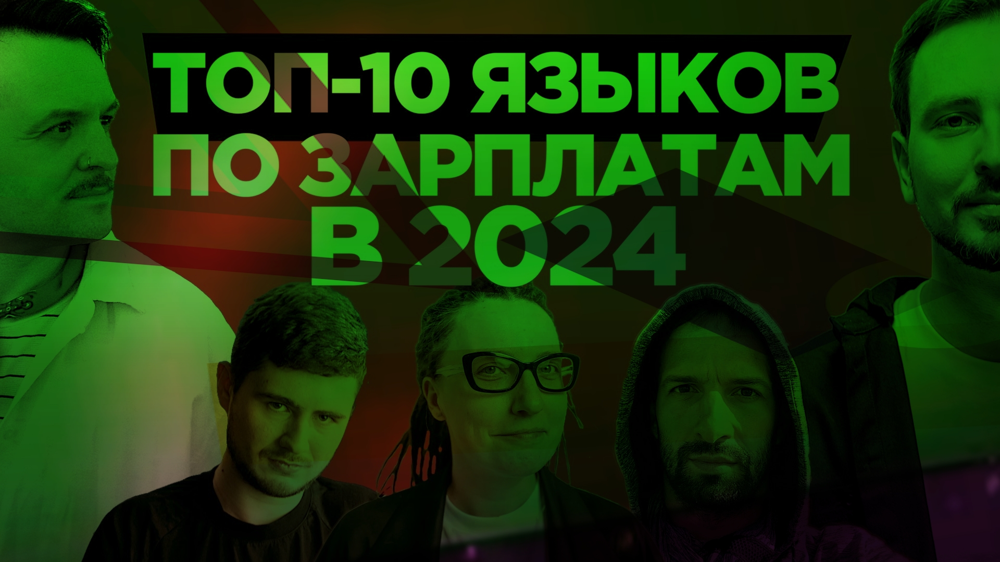

# Топ 10 языков программирования в 2024 году по деньгам и популярности — Кузьменко, Мокевнин, Нещадин

До нас уже дошли вести, что вы начинаете беднеть, теряете денежную хватку, еле еле сводите концы с концами в хаотичных инфо потоках, и ваша финансовая грамотность снова под угрозой.

Мы не могли просто остаться в стороне. Пора возвращать нашу финансово-аналитическую программу 600к в секунду. Складывайте ваши карточки, сейфы и крипто кошельки у экрана, чтобы заряжать их на богатство.

В первом после долгого перерыва выпуске наши авторитетные эксперты составили для вас список из 10 языков программирования, которые в 2024 году являются самыми высокооплачиваемыми и востребованными на рынке.

При всем уважении, вряд ли вам хватит аналитических ресурсов, чтобы предугадать список. Так что не гадайте, а включайте и смотрите. Сделаем вас богатыми снова

[oembed](https://www.youtube.com/watch?v=40QghvScTew)